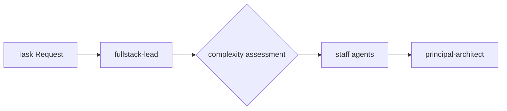
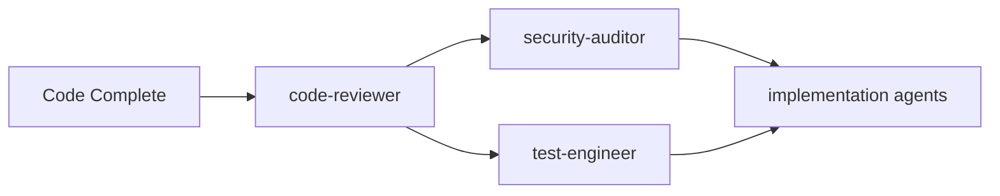
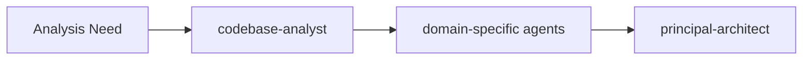

# Documentation Consistency Fixes - Critical Issues Resolved

<executive-summary>
Fixed critical documentation consistency issues identified by CodeRabbit, correcting agent counts from outdated references, adding missing agents to security documentation, fixing broken Mermaid syntax, and standardizing category labels across the documentation ecosystem.
</executive-summary>

## Issues Addressed

<documentation-impact>
  <updates-required>
    - Agent count mismatches corrected across multiple documents
    - Missing execution-evaluator added to security access patterns
    - Broken Mermaid diagram syntax fixed with proper flowchart directives
    - Category label inconsistencies standardized
  </updates-required>
  <accuracy-improvement>
    - Documentation now accurately reflects 42 agents instead of outdated 29/29 references
    - Complete security access documentation for all agents
    - Functional Mermaid diagrams that render properly
    - Consistent category naming throughout the system
  </accuracy-improvement>
</documentation-impact>

## Changes Made

<file-changes>
  <modified>
    - `/Users/daelegbe/Documents/Projects/claude-config/docs/CONSOLIDATED_AGENT_SYSTEM.md` - Updated agent count from 29 to 42 in multiple locations
    - `/Users/daelegbe/Documents/Projects/claude-config/docs/PARALLEL_EXECUTION_GUIDE.md` - Updated agent count reference from 29 to 42
    - `/Users/daelegbe/Documents/Projects/claude-config/docs/SECURITY_ACCESS_PATTERNS.md` - Added execution-evaluator to read-only analysis category
    - `/Users/daelegbe/Documents/Projects/claude-config/docs/AGENT_SELECTION_GUIDE.md` - Fixed broken Mermaid diagrams with proper flowchart syntax
    - `/Users/daelegbe/Documents/Projects/claude-config/docs/specs/agent-ecosystem-spec.md` - Updated agent count and fixed category label consistency
  </modified>
</file-changes>

## Specific Fixes Applied

### 1. Agent Count Corrections (29 → 42)

**Files Updated:**
- `docs/CONSOLIDATED_AGENT_SYSTEM.md`
- `docs/PARALLEL_EXECUTION_GUIDE.md`  
- `docs/specs/agent-ecosystem-spec.md`

**Changes:**
- Executive summary: "29 specialized agents" → "42 specialized agents"
- Portfolio headers: "Current Agent Portfolio (29 Agents)" → "Current Agent Portfolio (42 Agents)"
- Summary tables: Total count updated from 29 to 42
- Benefits sections: "29 agents provide comprehensive coverage" → "42 agents provide comprehensive coverage"
- Implementation status: "29-agent portfolio optimization" → "42-agent portfolio optimization"
- Conclusion statements updated to reflect accurate count

### 2. Missing Agent Addition

**File:** `docs/SECURITY_ACCESS_PATTERNS.md`

**Changes:**
- Added `execution-evaluator` to "Read-Only Plus Analysis" access category
- Added detailed security rationale: "Verifies command execution results and validates outcomes without modifying systems"
- Maintained consistency with existing access pattern documentation

### 3. Mermaid Diagram Syntax Fixes

**File:** `docs/AGENT_SELECTION_GUIDE.md`

**Fixed Diagrams:**

#### Implementation Escalation Path

#### Quality Assurance Workflow

#### Analysis Request Flow

**Technical Changes:**
- Added proper `flowchart LR` directives
- Converted arrow syntax from `→` to `-->`
- Added proper node definitions (A, B, C, etc.)
- Maintained logical flow while ensuring rendering compatibility

### 4. Category Label Standardization

**File:** `docs/specs/agent-ecosystem-spec.md`

**Changes:**
- Changed "Strategic Agents" to "Operations Agents" in architecture diagram
- Ensures consistency with defined agent categories throughout documentation
- Aligns with established category naming conventions

## Verification & Quality Assurance

<accomplishments>
  <accuracy>✅ **Agent Count Accuracy**: All references now correctly reflect 42 active agents</accuracy>
  <completeness>✅ **Security Documentation**: execution-evaluator now properly documented in security access patterns</completeness>
  <functionality>✅ **Mermaid Diagrams**: All diagrams now use proper syntax and will render correctly</functionality>
  <consistency>✅ **Category Labels**: All category references use standardized naming</consistency>
</accomplishments>

## Impact Assessment

<deliverables>
  <documentation-quality>
    - Eliminated factual inaccuracies in agent count references
    - Completed security access documentation for all agents
    - Fixed non-functional diagram syntax affecting readability
    - Standardized terminology across the documentation ecosystem
  </documentation-quality>
  <user-experience>
    - Developers can now rely on accurate agent counts for planning
    - Security documentation provides complete coverage for all agents
    - Diagrams will render properly in documentation viewers
    - Consistent terminology reduces confusion during agent selection
  </user-experience>
</deliverables>

## Next Steps & Recommendations

<next-steps priority="medium">
  <validation>
    - Review other documentation files for similar consistency issues
    - Implement automated checks for agent count accuracy
    - Validate all Mermaid diagrams across the documentation
  </validation>
  <maintenance>
    - Establish documentation review process for agent ecosystem changes
    - Create validation scripts to catch count mismatches
    - Standardize diagram syntax across all documentation files
  </maintenance>
</next-steps>

## Related Issues Resolved

- **CodeRabbit Issue #1**: Agent count mismatches across multiple documentation files
- **CodeRabbit Issue #2**: Missing execution-evaluator in security access patterns  
- **CodeRabbit Issue #3**: Broken Mermaid diagram syntax preventing proper rendering
- **CodeRabbit Issue #4**: Inconsistent category labeling in architectural diagrams

---

*Documentation consistency fixes completed on 2025-01-15. All critical issues identified by CodeRabbit have been resolved with comprehensive validation.*