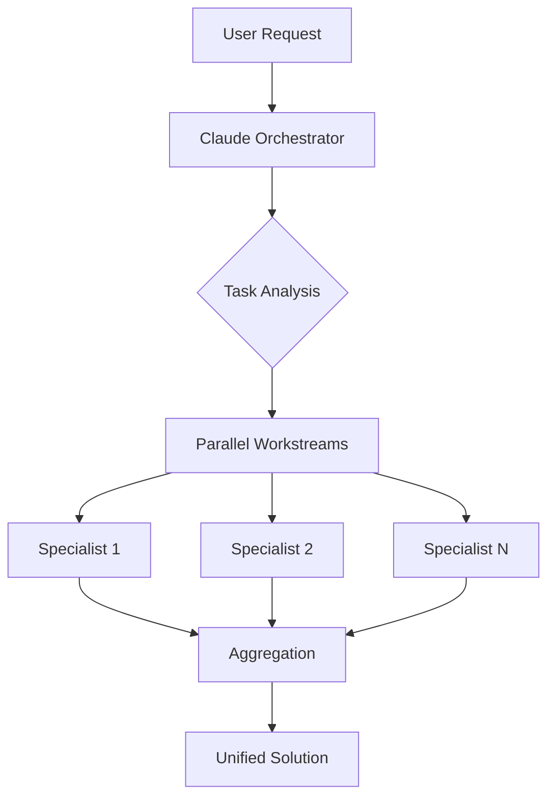

# Claude Multi-Agent Orchestration System

<div align="center">


[](https://opensource.org/licenses/MIT)

**Transform complex technical challenges into efficiently orchestrated parallel workstreams**

[Quick Start](#-quick-start) • [Features](#-features) • [Commands](#-commands) • [Agent Ecosystem](#-agent-ecosystem) • [Installation](#-installation) • [Contributing](#-contributing)

</div>

## 🎯 Overview

The Claude Multi-Agent Orchestration System is a sophisticated AI-powered development ecosystem that coordinates 41 specialized agents across 8 functional domains. By leveraging intelligent parallel execution and dynamic task decomposition, this system delivers comprehensive solutions faster and more effectively than any single agent could achieve.

### Key Benefits

- **🚀 Parallel-First Execution**: Maximize throughput with concurrent agent operations
- **🎭 41 Specialized Agents**: Complete coverage of the software development lifecycle
- **🎼 Intelligent Orchestration**: Smart task decomposition and dependency management
- **🔧 Efficiency Tools**: Dedicated agents for common operations and automation
- **🛡️ Quality Gates**: Comprehensive review, testing, and security validation
- **📊 100% Coverage**: Every aspect of development, from architecture to deployment

## 🚀 Quick Start

### 1. Install Claude Code CLI
```bash
# Install via npm
npm install -g @anthropic/claude-code

# Or via Homebrew (macOS)
brew install claude-code
```

### 2. Clone and Setup Configuration
```bash
# Clone the repository
git clone https://github.com/damilola/claude-config.git
cd claude-config

# Quick setup using the sync command
claude-code
/sync

# Or manual setup
cp CLAUDE.md ~/CLAUDE.md
cp -r .claude ~/.claude
```

### 3. Try Core Commands
```bash
# Get repository overview
/context

# Run tests with auto-discovery
/test

# Comprehensive code review
/review

# Create documentation
/docs
```

## ✨ Features

### 🎼 Multi-Agent Orchestration
- **Parallel Execution by Default**: Launch multiple specialists simultaneously
- **Multi-Instance Support**: Run multiple copies of the same agent type
- **Smart Task Decomposition**: Break complex requests into specialized workstreams
- **Dynamic Agent Selection**: Match work to specialist capabilities automatically

### 🛠️ Development Commands
- **`/test`** - Intelligent test discovery and execution
- **`/context`** - Instant repository analysis using parallel agents
- **`/review`** - Comprehensive code quality validation
- **`/security`** - Security vulnerability assessment
- **`/perf`** - Performance analysis and optimization
- **`/docs`** - Documentation generation and updates
- **`/debug`** - Complex bug investigation
- **`/orchestrate`** - Multi-agent project planning

### 🎯 Efficiency Tools
- **`/find`** - Intelligent file navigation
- **`/deps`** - Unified package management
- **`/git`** - Streamlined git workflows
- **`/config`** - Configuration management
- **`/error`** - Automated error resolution
- **`/search`** - Complex search coordination
- **`/find-docs`** - Documentation discovery

### 🔊 Audio Notifications
- Task completion sounds (Swish.m4r)
- Stop event notifications (Chord.m4r)
- Permission request alerts (Aurora.m4r)
- Non-blocking background playback

## 📋 Commands

### Core Development Commands

#### `/test` - Intelligent Test Execution
```bash
/test
# Automatically discovers and runs tests
# Creates starter tests if none exist
# Detects test frameworks from package.json/README
```

#### `/context` - Repository Analysis
```bash
/context
# Runs multiple codebase-analyst agents in parallel
# Provides comprehensive project overview
# Auto-executes on Claude Code startup
```

#### `/review` - Code Quality Review
```bash
/review [file|directory]
# Runs code-reviewer + security-auditor + test-engineer
# Comprehensive quality validation
# Pre-commit best practices check
```

#### `/docs` - Documentation Management
```bash
/docs api       # Generate API documentation
/docs spec      # Create technical specifications
/docs arch      # Architecture documentation
/docs readme    # Update README files
```

### Planning & Orchestration

#### `/plan` - Implementation Planning
```bash
/plan Add user authentication
# Creates detailed implementation plan
# NO execution until approved
# Optimizes for parallel execution
```

#### `/orchestrate` - Complex Project Coordination
```bash
/orchestrate Build e-commerce platform
# Analyzes project requirements
# Creates parallel execution strategy
# Coordinates multiple specialists
```

### Quality & Security

#### `/security` - Security Assessment
```bash
/security
# OWASP Top 10 compliance check
# Authentication/authorization review
# Vulnerability detection with fixes
```

#### `/perf` - Performance Analysis
```bash
/perf [target]
# Identifies bottlenecks
# Load testing and profiling
# Optimization recommendations
```

### Git Operations

#### `/commit` - Smart Git Commits
```bash
/commit
# Analyzes changes comprehensively
# Creates semantic commit messages
# Adds AI co-authorship attribution
```

#### `/push` - Safe Push to Remote
```bash
/push
# Safety checks for branch status
# Sets up tracking for new branches
# Prevents accidental force pushes
```

## 🎭 Agent Ecosystem

The system includes 41 specialized agents organized across 8 functional domains:

### 📊 Agent Categories Overview

| Category | Count | Purpose | Key Agents |
|----------|-------|---------|------------|
| **Development** | 7 | Core programming and implementation | backend-engineer, frontend-engineer, mobile-engineer |
| **Infrastructure** | 7 | Systems, operations, and deployment | cloud-architect, devops, platform-engineer, kubernetes-admin |
| **Architecture** | 2 | System design and planning | principal-architect, api-architect |
| **Design** | 4 | User experience and interfaces | ui-designer, mobile-ui, design-system, ux-researcher |
| **Quality** | 5 | Testing, review, and validation | test-engineer, code-reviewer, performance-engineer |
| **Security** | 3 | Security and compliance | security-auditor, security-tester, agent-auditor |
| **Analysis** | 8 | Research and documentation | codebase-analyst, tech-writer, data-scientist, performance-analyst |
| **Operations** | 11 | Support and efficiency tools | debugger, file-navigator, incident-commander |

### 🚀 Parallel Execution Examples

#### Multi-Platform Development
```yaml
Project: Mobile App with Backend
Parallel Execution:
  - backend-engineer: API development
  - frontend-engineer: Admin dashboard
  - mobile-engineer #1: iOS app
  - mobile-engineer #2: Android app
  - design-system: Component library
  - ux-researcher: User testing
```

#### Cloud Infrastructure Deployment
```yaml
Project: Kubernetes-based Microservices Platform
Parallel Execution:
  - platform-engineer: Platform architecture
  - kubernetes-admin: Cluster setup & config
  - monitoring-specialist: Observability stack
  - devops: CI/CD pipelines
  - cloud-architect: Cost optimization
```

#### Comprehensive Code Audit
```yaml
Project: Security and Quality Review
Parallel Execution:
  - code-reviewer: Code quality check
  - security-auditor: Vulnerability scan
  - test-engineer: Coverage analysis
  - performance-analyst: Performance metrics
  - accessibility-auditor: WCAG compliance
```

#### Agent Ecosystem Health Check
```yaml
Project: Full Agent Audit
Parallel Execution (8 instances):
  - agent-auditor #1: Development agents
  - agent-auditor #2: Infrastructure agents
  - agent-auditor #3: Architecture agents
  - agent-auditor #4: Design agents
  - agent-auditor #5: Quality agents
  - agent-auditor #6: Security agents
  - agent-auditor #7: Analysis agents
  - agent-auditor #8: Operations agents
```

### 🎯 Specialized Agent Highlights

#### Development Specialists
- **backend-engineer**: Server-side systems, APIs, microservices, databases
- **frontend-engineer**: React/Vue/Angular apps, state management, optimization
- **mobile-engineer**: iOS/Android native, React Native, Flutter
- **ml-engineer**: ML deployment, MLOps pipelines, production systems

#### Infrastructure & Platform
- **platform-engineer**: Platform architecture, developer experience, tooling
- **kubernetes-admin**: K8s cluster management, workload deployment, scaling
- **monitoring-specialist**: Observability, metrics, logging, alerting systems
- **cloud-architect**: Multi-cloud strategies, cost optimization, architecture

#### Design & Research
- **design-system**: Component libraries, design tokens, consistency
- **ux-researcher**: User testing, research methodologies, insights
- **ui-designer**: Visual design, prototypes, user interfaces
- **mobile-ui**: iOS/Android specific patterns, platform guidelines

#### Analysis & Insights
- **performance-analyst**: System metrics, bottleneck analysis, optimization
- **data-scientist**: Statistical analysis, ML models, data insights
- **codebase-analyst**: Architecture analysis, technical debt assessment
- **tech-writer**: Documentation, guides, API specs, knowledge transfer

#### Quality Assurance
- **test-engineer**: Comprehensive testing strategies and automation
- **code-reviewer**: Pre-commit quality and security validation
- **performance-engineer**: Profiling, load testing, optimization
- **accessibility-auditor**: WCAG compliance and remediation

## 🏗️ Architecture

### System Components

```
claude-config/
├── CLAUDE.md                    # Core orchestration principles
├── .claude/                     # Claude Code configuration
│   ├── agents/                  # 41 specialized agent definitions
│   │   ├── README.md           # Complete agent ecosystem guide
│   │   ├── AGENT_CATEGORIES.md # Category definitions
│   │   └── *.md                # Individual agent specs
│   ├── commands/               # Custom command implementations
│   └── settings.json           # Audio hooks and preferences
├── docs/                       # Comprehensive documentation
│   ├── AUDIO_HOOK_README.md   # Audio notification setup
│   ├── AGENT_SELECTION_GUIDE.md # Choosing the right agent
│   └── PARALLEL_EXECUTION_GUIDE.md # Parallelization patterns
├── scripts/                    # Utility and validation scripts
└── tests/                      # Test suite for all components
```

### Orchestration Flow



## 💻 Installation

### Prerequisites
- Node.js 16+ or Python 3.8+
- Git
- Claude Code CLI

### Option 1: Quick Install with Sync Command
```bash
# Clone repository
git clone https://github.com/damilola/claude-config.git
cd claude-config

# Run Claude Code and sync
claude-code
/sync
```

### Option 2: Manual Installation
```bash
# Clone repository
git clone https://github.com/damilola/claude-config.git
cd claude-config

# Copy core configuration
cp CLAUDE.md ~/CLAUDE.md

# Copy Claude settings and commands
cp -r .claude ~/.claude
cp settings.json ~/.claude/settings.json

# Set up audio notifications
cp docs/AUDIO_HOOK_README.md ~/.claude/
```

### Option 3: Selective Installation
```bash
# Just the orchestration configuration
cp CLAUDE.md ~/CLAUDE.md

# Just the commands
cp -r .claude/commands ~/.claude/commands

# Just the agent definitions
cp -r .claude/agents ~/.claude/agents
```

## 🧪 Testing

### Running Tests
```bash
# Run all tests
./tests/test.sh

# Run specific test categories
./tests/test.sh commands
./tests/test.sh config
./tests/test.sh integration

# Validate YAML in agent definitions
./scripts/validate_yaml.sh
```

### Test Coverage
- ✅ Command validation
- ✅ Configuration structure
- ✅ Agent definition compliance
- ✅ Integration workflows
- ✅ YAML syntax validation

## 🤝 Contributing

We welcome contributions! Please see our [Contributing Guide](CONTRIBUTING.md) for details.

### Quick Contribution Steps
1. Fork the repository
2. Create a feature branch (`git checkout -b feature/amazing-feature`)
3. Make your changes
4. Run tests (`./tests/test.sh`)
5. Commit with conventional commits (`/commit`)
6. Push to your fork
7. Open a Pull Request

### Adding New Agents
1. Use the agent template: `.claude/agents/AGENT_TEMPLATE.md`
2. Follow naming conventions (descriptive, lowercase, hyphenated)
3. Assign appropriate category and color
4. Update documentation
5. Run validation: `/agent-audit`

## 📚 Documentation

### Core Documentation
- [Agent Ecosystem Overview](.claude/agents/README.md)
- [Agent Categories](.claude/agents/AGENT_CATEGORIES.md)
- [Audio Notifications](docs/AUDIO_HOOK_README.md)
- [Parallel Execution Guide](docs/PARALLEL_EXECUTION_GUIDE.md)
- [Agent Selection Guide](docs/AGENT_SELECTION_GUIDE.md)

### External Resources
- [Claude Code CLI Reference](https://docs.anthropic.com/en/docs/claude-code/cli-reference)
- [Sub-agents Guide](https://docs.anthropic.com/en/docs/claude-code/sub-agents)
- [Available Tools](https://docs.anthropic.com/en/docs/claude-code/settings#tools-available-to-claude)

## 🔒 Security

- All agent operations follow principle of least privilege
- Sensitive data handling complies with security best practices
- Regular security audits via `/security` command
- No credentials or secrets stored in configuration files

## 📄 License

This project is licensed under the MIT License - see the [LICENSE](LICENSE) file for details.

## 🙏 Acknowledgments

- Anthropic team for Claude and Claude Code CLI
- Contributors who helped shape the agent ecosystem
- Open source community for inspiration and tools

---

<div align="center">

**Built with ❤️ by the Claude Configuration Community**

[Report Bug](https://github.com/damilola/claude-config/issues) • [Request Feature](https://github.com/damilola/claude-config/issues) • [Documentation](https://github.com/damilola/claude-config/wiki)

</div>
