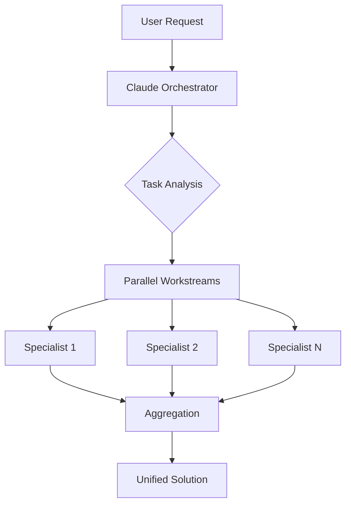

# Claude Multi-Agent Orchestration System

<div align="center">


[](https://opensource.org/licenses/MIT)

<!-- markdownlint-disable-next-line MD036 -->
*Transform complex technical challenges into efficiently orchestrated parallel workstreams*

[Quick Start](#-quick-start) • [Features](#-features) • [Commands](#-commands) • [Agent Ecosystem](#-agent-ecosystem) • [Installation](#-installation) • [Contributing](#-contributing)

</div>

## 🎯 Overview

The Claude Multi-Agent Orchestration System is a sophisticated AI-powered development ecosystem that coordinates **41 specialized agents** across 8 functional domains. By leveraging intelligent parallel execution and dynamic task decomposition, this system delivers comprehensive solutions faster and more effectively than any single agent could achieve.

### 🌟 What Makes This System Unique

This isn't just another AI tool—it's a complete paradigm shift in how complex technical work gets done:

- **Sole Executor Model**: Claude acts as the intelligent orchestrator, coordinating specialized agents who provide expertise while Claude maintains full execution control
- **Parallel-First Architecture**: Every task is analyzed for parallelization opportunities, dramatically reducing time-to-completion
- **SYSTEM BOUNDARY Protection**: Enhanced security model prevents unauthorized agent self-invocation or cross-agent communication
- **Multi-Instance Orchestration**: Run multiple instances of the same agent type for massive parallel operations

### Key Benefits

- **🚀 Parallel-First Execution**: Maximize throughput with concurrent agent operations
- **🎭 41 Specialized Agents**: Complete coverage of the software development lifecycle
- **🎼 Intelligent Orchestration**: Smart task decomposition and dependency management
- **🔧 Efficiency Tools**: Dedicated agents for common operations and automation
- **🛡️ Quality Gates**: Comprehensive review, testing, and security validation
- **📊 100% Coverage**: Every aspect of development, from architecture to deployment

## 🚀 Quick Start

### 1. Install Claude Code CLI
```bash
# Install via npm
npm install -g @anthropic/claude-code

# Or via Homebrew (macOS)
brew install claude-code
```

### 2. Clone and Setup Configuration
```bash
# Clone the repository
git clone https://github.com/damilola/claude-config.git
cd claude-config

# Quick setup using the sync command
claude-code
/sync

# Or manual setup
cp CLAUDE.md ~/CLAUDE.md
cp -r .claude ~/.claude
```

### 3. Try Core Commands
```bash
# Get repository overview
/context

# Run tests with auto-discovery
/test

# Comprehensive code review
/review

# Create documentation
/docs
```

## ✨ Features

### 🎼 Multi-Agent Orchestration
- **Parallel Execution by Default**: Launch multiple specialists simultaneously
- **Multi-Instance Support**: Run multiple copies of the same agent type
- **Smart Task Decomposition**: Break complex requests into specialized workstreams
- **Dynamic Agent Selection**: Match work to specialist capabilities automatically

### 🛠️ Core Commands (14 Essential Tools)
- **`/test`** ⭐⭐⭐⭐⭐ - Auto-discovers and runs tests, creates starter tests if none exist
- **`/context`** ⭐⭐⭐⭐⭐ - Repository analysis with parallel agents, auto-runs on startup
- **`/review`** ⭐⭐⭐⭐ - Comprehensive code review with quality gates
- **`/plan`** ⭐⭐⭐⭐ - Strategic + tactical planning with TDD, prevents massive PRs
- **`/debug`** ⭐⭐⭐ - Systematic debugging for complex issues
- **`/deps`** ⭐⭐⭐ - Security-focused dependency management
- **`/fix-ci`** ⭐⭐⭐ - Auto-fixes CI failures, gets PRs green
- **`/agent-audit`** ⭐⭐⭐ - Validates agent configurations

- **`/resolve-cr`** ⭐⭐⭐ - Addresses code review comments
- **`/pr`** ⭐⭐⭐ - Creates pull requests with proper formatting
- **`/commit`** ⭐⭐⭐ - Git commit with conventional format
- **`/push`** ⭐⭐⭐ - Safe git push with checks
- **`/branch`** ⭐⭐⭐ - Creates semantic branches
- **`/sync`** ⭐⭐⭐ - Syncs Claude config files

### 🔊 Audio Notifications
- Task completion sounds (Swish.m4r)
- Stop event notifications (Chord.m4r)
- Permission request alerts (Aurora.m4r)
- Non-blocking background playback

## 📋 Commands

### Core Development Commands

#### `/test` - Intelligent Test Execution
```bash
/test
# Automatically discovers and runs tests
# Creates starter tests if none exist
# Detects test frameworks from package.json/README
```

#### `/context` - Repository Analysis
```bash
/context
# Runs multiple codebase-analyst agents in parallel
# Provides comprehensive project overview
# Auto-executes on Claude Code startup
```

#### `/review` - Code Quality Review
```bash
/review [file|directory]
# Runs code-reviewer + security-auditor + test-engineer
# Comprehensive quality validation
# Pre-commit best practices check
```

#### `/debug` - Systematic Debugging
```bash
/debug "app crashes when user logs out"
# Gathers evidence from logs and traces
# Forms and tests hypotheses
# Identifies root cause with fix
```

### Planning & Orchestration

#### `/plan` - Strategic & Tactical Planning
```bash
/plan "Add user authentication"
# Creates strategic requirements document
# Generates tactical TDD phases (8-15 files each)
# Principal-architect as primary consultant
# Outputs to ./.tmp/<feature-name>/
```

#### `/fix-ci` - Auto-Fix CI Failures
```bash
/fix-ci [pr_number]
# Analyzes CI failure logs
# Applies targeted fixes (lint, test, security)
# Verifies locally before pushing
# Gets your PR back to green
```

### Quality & Security

#### `/deps` - Security-Focused Dependency Management
```bash
/deps audit    # Find and fix vulnerabilities
/deps update   # Safe updates with testing
/deps clean    # Remove unused packages
# Multi-language support (npm, pip, cargo, etc.)
```

#### `/agent-audit` - Agent Ecosystem Validation
```bash
/agent-audit
# Validates all 41 agent configurations
# Checks for capability gaps
# Runs parallel audits by category
```

#### `/resolve-cr` - CodeRabbit Review Resolution
```bash
/resolve-cr [pr-number]
# Automatically fetches and resolves CodeRabbit PR comments
# Parses "Prompts for AI Agents" section
# Deploys specialized agents for fixes
# Integrates with /test and /commit workflow
```

Note: Previously named `/resolve-rabbit`.

### Git Operations

#### `/commit` - Smart Git Commits
```bash
/commit
# Analyzes changes comprehensively
# Creates semantic commit messages
# Adds AI co-authorship attribution
```

#### `/push` - Safe Push to Remote
```bash
/push
# Safety checks for branch status
# Sets up tracking for new branches
# Prevents accidental force pushes
```

## 🎭 Agent Ecosystem

The system includes **41 specialized agents** organized across 8 functional domains:

### 📊 Agent Categories Overview

| Category | Count | Purpose | Key Agents |
|----------|-------|---------|------------|
| **Development** | 6 | Core programming and implementation | backend-engineer, frontend-engineer, mobile-engineer, ml-engineer |
| **Infrastructure** | 8 | Systems, operations, and deployment | cloud-architect, devops, platform-engineer, kubernetes-admin |
| **Architecture** | 2 | System design and planning | principal-architect, api-architect |
| **Design** | 4 | User experience and interfaces | ui-designer, mobile-ui, design-system, ux-researcher |
| **Quality** | 6 | Testing, review, and validation | test-engineer, code-reviewer, performance-engineer, accessibility-auditor |
| **Security** | 2 | Security and compliance | security-auditor, security-tester |
| **Analysis** | 8 | Research and documentation | codebase-analyst, tech-writer, data-scientist, performance-analyst |
| **Operations** | 11 | Support and efficiency tools | debugger, file-navigator, incident-commander, error-resolver |

### 🚀 Parallel Execution Examples

#### Multi-Platform Development
```yaml
Project: Mobile App with Backend
Parallel Execution:
  - backend-engineer: API development
  - frontend-engineer: Admin dashboard
  - mobile-engineer #1: iOS app
  - mobile-engineer #2: Android app
  - design-system: Component library
  - ux-researcher: User testing
```

#### Cloud Infrastructure Deployment
```yaml
Project: Kubernetes-based Microservices Platform
Parallel Execution:
  - platform-engineer: Platform architecture
  - kubernetes-admin: Cluster setup & config
  - monitoring-specialist: Observability stack
  - devops: CI/CD pipelines
  - cloud-architect: Cost optimization
```

#### Comprehensive Code Audit
```yaml
Project: Security and Quality Review
Parallel Execution:
  - code-reviewer: Code quality check
  - security-auditor: Vulnerability scan
  - test-engineer: Coverage analysis
  - performance-analyst: Performance metrics
  - accessibility-auditor: WCAG compliance
```

#### Agent Ecosystem Health Check
```yaml
Project: Full Agent Audit
Parallel Execution (8 instances):
  - agent-auditor #1: Development agents
  - agent-auditor #2: Infrastructure agents
  - agent-auditor #3: Architecture agents
  - agent-auditor #4: Design agents
  - agent-auditor #5: Quality agents
  - agent-auditor #6: Security agents
  - agent-auditor #7: Analysis agents
  - agent-auditor #8: Operations agents
```

### 🎯 Complete Agent Roster

#### Development Specialists (6 agents)
- **backend-engineer**: Server-side systems, APIs, microservices, databases, distributed architectures
- **frontend-engineer**: React/Vue/Angular apps, state management, frontend optimization
- **mobile-engineer**: iOS/Android native, React Native, Flutter development
- **ml-engineer**: ML deployment, MLOps pipelines, production ML systems
- **database-migration-specialist**: Schema migrations, data migrations, zero-downtime deployments
- **integration-specialist**: Third-party APIs, webhooks, OAuth, external service connections

#### Infrastructure & Platform (8 agents)
- **platform-engineer**: Platform architecture, developer experience, internal tooling
- **kubernetes-admin**: K8s cluster management, workload orchestration, container operations
- **monitoring-specialist**: Observability infrastructure, metrics, logging, alerting strategies
- **cloud-architect**: Multi-cloud strategies, cost optimization, cloud-native patterns
- **devops**: CI/CD pipelines, containerization, IaC, deployment automation
- **network-engineer**: Cloud networking, load balancing, CDN setup, DNS management
- **data-engineer**: Data pipelines, ETL/ELT systems, stream processing, ML infrastructure
- **database-admin**: Database optimization, security hardening, performance tuning

#### Architecture & Planning (2 agents)
- **principal-architect**: System-wide architecture, technical roadmaps, cross-team coordination
- **api-architect**: API design, OpenAPI specs, governance policies, GraphQL federation

#### Design & User Experience (4 agents)
- **design-system**: Component libraries, design tokens, visual consistency
- **ux-researcher**: User research, usability testing, data-driven design decisions
- **ui-designer**: UI/UX design, visual hierarchy, accessibility compliance
- **mobile-ui**: iOS/Android specific patterns, gestures, platform adaptations

#### Quality & Testing (6 agents)
- **test-engineer**: Test strategy, implementation, execution, CI/CD automation
- **code-reviewer**: Quality review, security checks, best practices validation
- **performance-engineer**: Performance profiling, load testing, bottleneck analysis
- **accessibility-auditor**: WCAG compliance audits, screen reader testing, remediation
- **api-contract-tester**: API validation, contract tests, mock server generation
- **agent-auditor**: Agent file auditing, compliance validation, quality standards

#### Security & Compliance (2 agents)
- **security-auditor**: Security audits, vulnerability assessment, OWASP compliance
- **security-tester**: Penetration testing, SAST/DAST implementation, API security

#### Analysis & Documentation (8 agents)
- **performance-analyst**: System metrics analysis, bottleneck identification, optimization
- **data-scientist**: Statistical analysis, A/B testing, ML model evaluation
- **codebase-analyst**: Architecture analysis, technical debt assessment, risk identification
- **tech-writer**: Technical documentation, API docs, architecture records
- **business-analyst**: Requirements gathering, process mapping, stakeholder analysis
- **researcher**: Technology evaluation, market analysis, competitive research
- **log-analyst**: Log analysis, pattern detection, production issue debugging
- **api-documenter**: API documentation generation, OpenAPI specs, developer guides

#### Operations & Support (11 agents)
- **debugger**: Complex bug investigation, race conditions, systematic root cause analysis
- **file-navigator**: Intelligent file system exploration with context-aware patterns
- **incident-commander**: Production incidents, outages, crisis management
- **error-resolver**: Automated error context gathering and targeted fixes
- **dependency-manager**: Unified package management across all ecosystems
- **git-workflow**: Streamlined git operations with intelligent automation
- **search-coordinator**: Complex multi-pattern searches with maximum efficiency
- **documentation-finder**: Intelligent documentation discovery across all sources
- **config-specialist**: Configuration file management across projects
- **file-writer**: Efficient batch file writing and template generation
- **product-strategist**: Product vision, feature prioritization, go-to-market strategy

## 🆕 Recent Updates

### Enhanced Command System (Latest)
- **Streamlined Commands**: Reduced from 40 to 14 essential commands
- **TDD Planning**: `/plan` now generates test-driven development phases
- **CI/CD Integration**: `/fix-ci` automatically resolves build failures
- **41 Specialized Agents**: Complete coverage across 8 domains
- **Prevents Unauthorized Invocation**: Agents cannot invoke themselves or other agents
- **Sole Executor Paradigm**: Claude maintains exclusive execution authority
- **Automatic Termination**: Any attempt at agent self-invocation triggers immediate termination

### Recent Enhancements
- **Audit System**: Comprehensive agent ecosystem health checks with parallel execution
- **Multi-Instance Support**: Run multiple instances of same agent type for massive parallelization
- **Improved Error Handling**: Enhanced boundary violation detection and reporting
- **Performance Optimizations**: Faster agent startup and response times

## 🏗️ Architecture

### System Components

```
claude-config/
├── CLAUDE.md                    # Core orchestration principles
├── .claude/                     # Claude Code configuration
│   ├── agents/                  # 29 specialized agent definitions
│   │   ├── README.md           # Complete agent ecosystem guide
│   │   ├── AGENT_CATEGORIES.md # Category definitions
│   │   └── *.md                # Individual agent specs
│   ├── commands/               # Custom command implementations
│   └── settings.json           # Audio hooks and preferences
├── docs/                       # Comprehensive documentation
│   ├── AUDIO_HOOK_README.md   # Audio notification setup
│   ├── AGENT_SELECTION_GUIDE.md # Choosing the right agent
│   └── PARALLEL_EXECUTION_GUIDE.md # Parallelization patterns
├── scripts/                    # Utility and validation scripts
└── tests/                      # Test suite for all components
```

### Orchestration Flow



## 💡 Real-World Use Cases

### Full-Stack Application Development
```bash
/orchestrate Build a real-time chat application with React frontend and Node.js backend

# Claude orchestrates:
# - backend-engineer: WebSocket server, REST API, database schema
# - frontend-engineer: React UI, state management, real-time updates
# - mobile-engineer: React Native mobile app
# - test-engineer: E2E tests, unit tests, integration tests
# - security-auditor: Authentication, data encryption, vulnerability scan
```

### Production Incident Response
```bash
/orchestrate Production API is returning 500 errors intermittently

# Claude orchestrates:
# - incident-commander: Coordinate response, severity assessment
# - log-analyst: Analyze error patterns in logs
# - debugger: Root cause analysis
# - performance-analyst: Resource utilization check
# - devops: Deploy hotfix, rollback if needed
```

### Enterprise Migration Project
```bash
/orchestrate Migrate monolithic Java app to microservices on Kubernetes

# Claude orchestrates:
# - principal-architect: Microservices design, boundary definition
# - backend-engineer (x3): Service implementation (parallel)
# - database-migration-specialist: Data migration strategy
# - kubernetes-admin: Cluster setup, deployment configs
# - monitoring-specialist: Observability setup
# - api-architect: Service mesh, API gateway design
```

### Comprehensive Security Audit
```bash
/security

# Claude orchestrates in parallel:
# - security-auditor: OWASP Top 10 compliance
# - security-tester: Penetration testing
# - code-reviewer: Security-focused code review
# - api-contract-tester: API security validation
# - accessibility-auditor: Security of accessible features
```

## 💻 Installation

### Prerequisites
- Node.js 16+ or Python 3.8+
- Git
- Claude Code CLI

### Option 1: Quick Install with Sync Command
```bash
# Clone repository
git clone https://github.com/damilola/claude-config.git
cd claude-config

# Run Claude Code and sync
claude-code
/sync
```

### Option 2: Manual Installation
```bash
# Clone repository
git clone https://github.com/damilola/claude-config.git
cd claude-config

# Copy core configuration
cp CLAUDE.md ~/CLAUDE.md

# Copy Claude settings and commands
cp -r .claude ~/.claude
cp settings.json ~/.claude/settings.json

# Set up audio notifications
cp docs/AUDIO_HOOK_README.md ~/.claude/
```

### Option 3: Selective Installation
```bash
# Just the orchestration configuration
cp CLAUDE.md ~/CLAUDE.md

# Just the commands
cp -r .claude/commands ~/.claude/commands

# Just the agent definitions
cp -r .claude/agents ~/.claude/agents
```

## 🧪 Testing

### Running Tests
```bash
# Run all tests
./tests/test.sh

# Run specific test categories
./tests/test.sh commands
./tests/test.sh config
./tests/test.sh integration

# Validate YAML in agent definitions
./scripts/validate_yaml.sh
```

### Test Coverage
- ✅ Command validation
- ✅ Configuration structure
- ✅ Agent definition compliance
- ✅ Integration workflows
- ✅ YAML syntax validation

## 🔧 Troubleshooting

### Common Issues

#### Agent Not Found
```bash
# List all available agents
/agents list

# Search for specific capability
/agents suggest "database optimization"
```

#### SYSTEM BOUNDARY Violation
If you see "SYSTEM BOUNDARY: operation not permitted", this means:
- An agent attempted to invoke itself or another agent
- Solution: Let Claude handle all agent coordination

#### Audio Notifications Not Working
```bash
# Check audio hook configuration
cat ~/.claude/settings.json | grep -A 10 "hooks"

# Test audio playback
afplay /System/Library/PrivateFrameworks/ToneLibrary.framework/Versions/A/Resources/AlertTones/Classic/Swish.m4r
```

#### Parallel Execution Not Happening
- Ensure you're using `/orchestrate` for complex tasks
- Check that tasks are truly independent
- Verify no sequential dependencies blocking parallelization

## 🤝 Contributing

We welcome contributions! Please see our [Contributing Guide](CONTRIBUTING.md) for details.

### Quick Contribution Steps
1. Fork the repository
2. Create a feature branch (`git checkout -b feature/amazing-feature`)
3. Make your changes
4. Run tests (`./tests/test.sh`)
5. Commit with conventional commits (`/commit`)
6. Push to your fork
7. Open a Pull Request

### Adding New Agents
1. Use the agent template: `.claude/agents/AGENT_TEMPLATE.md`
2. Follow naming conventions (descriptive, lowercase, hyphenated)
3. Assign appropriate category and color
4. Include SYSTEM BOUNDARY protection in your agent
5. Update documentation
6. Run validation: `./tests/test.sh` and agent audit

### Contribution Areas
- **New Agents**: Identify gaps in current capabilities
- **Command Enhancements**: Improve existing commands
- **Documentation**: Enhance guides and examples
- **Test Coverage**: Add test cases for edge scenarios
- **Performance**: Optimize agent response times

## 📚 Documentation

### Core Documentation
- [Agent Ecosystem Overview](.claude/agents/README.md)
- [Agent Categories](.claude/agents/AGENT_CATEGORIES.md)
- [Audio Notifications](docs/AUDIO_HOOK_README.md)
- [Parallel Execution Guide](docs/PARALLEL_EXECUTION_GUIDE.md)
- [Agent Selection Guide](docs/AGENT_SELECTION_GUIDE.md)

### External Resources
- [Claude Code CLI Reference](https://docs.anthropic.com/en/docs/claude-code/cli-reference)
- [Sub-agents Guide](https://docs.anthropic.com/en/docs/claude-code/sub-agents)
- [Available Tools](https://docs.anthropic.com/en/docs/claude-code/settings#tools-available-to-claude)

## ❓ Frequently Asked Questions

### Q: How do agents communicate with each other?
**A:** They don't! Claude is the sole orchestrator. Agents provide expertise and content, but Claude handles all execution and coordination.

### Q: Can I run multiple instances of the same agent?
**A:** Yes! This is a key feature. You can run multiple backend-engineers working on different services, multiple analysts examining different codebases, etc.

### Q: What's the difference between `/plan` and `/orchestrate`?
**A:** `/plan` creates a strategy without executing anything. `/orchestrate` actively coordinates agents to complete the task.

### Q: How do I know which agent to use?
**A:** Use `/agents suggest <task description>` or check our [Agent Selection Guide](docs/AGENT_SELECTION_GUIDE.md).

### Q: Why did my agent task fail with "SYSTEM BOUNDARY" error?
**A:** This security feature prevents agents from invoking themselves or other agents. Always let Claude handle agent coordination.

### Q: Can agents write files directly?
**A:** No. Agents generate content, Claude writes files. This maintains security and consistency.

### Q: How can I contribute a new agent?
**A:** Follow our agent template, ensure it includes SYSTEM BOUNDARY protection, and submit a PR. See [Contributing](#-contributing).

## 🔒 Security

- **SYSTEM BOUNDARY Protection**: Prevents unauthorized agent self-invocation
- **Principle of Least Privilege**: Each agent has minimal required permissions
- **No Stored Credentials**: Configuration files contain no secrets
- **Regular Audits**: Use `/security` for comprehensive security assessments
- **Secure Orchestration**: Claude validates all agent operations

## 📄 License

This project is licensed under the MIT License - see the [LICENSE](LICENSE) file for details.

## 🙏 Acknowledgments

- Anthropic team for Claude and Claude Code CLI
- Contributors who helped shape the agent ecosystem
- Open source community for inspiration and tools

---

<div align="center">

<!-- markdownlint-disable-next-line MD036 -->
*Built with ❤️ by the Claude Configuration Community*

[Report Bug](https://github.com/damilola/claude-config/issues) • [Request Feature](https://github.com/damilola/claude-config/issues) • [Documentation](https://github.com/damilola/claude-config/wiki)
