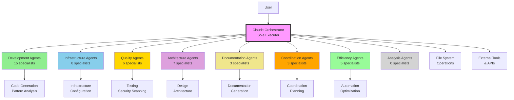
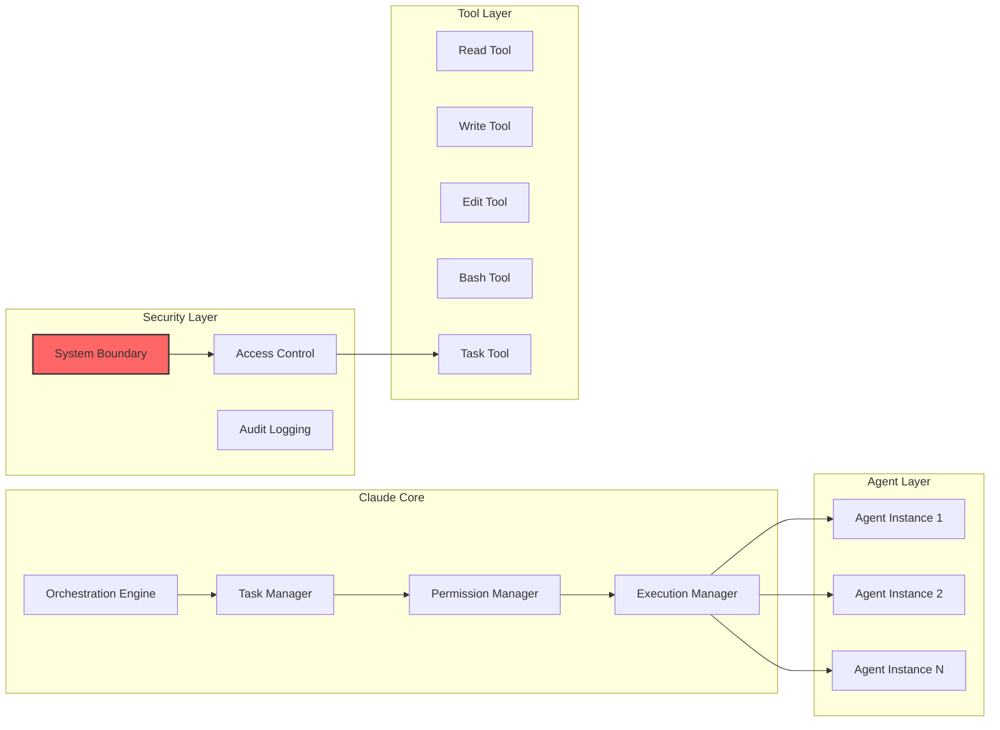
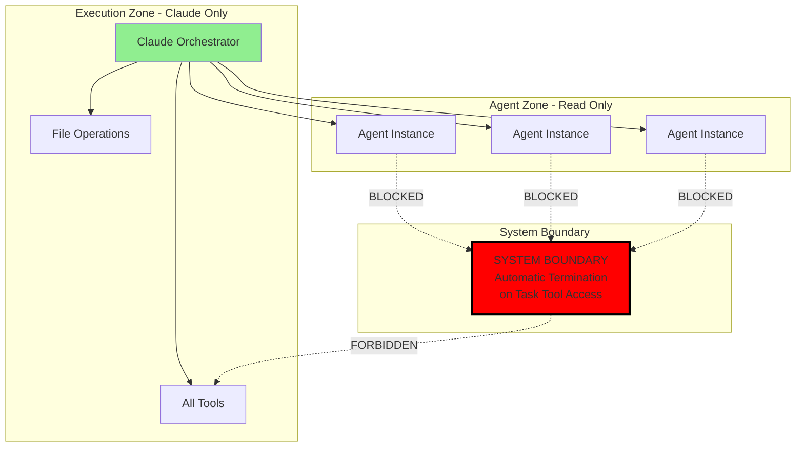
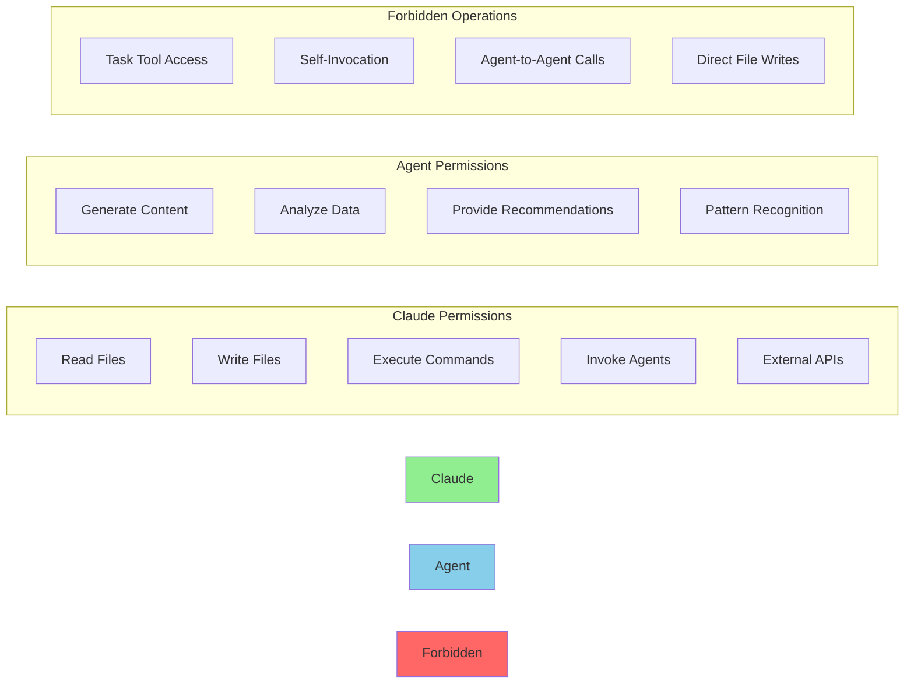
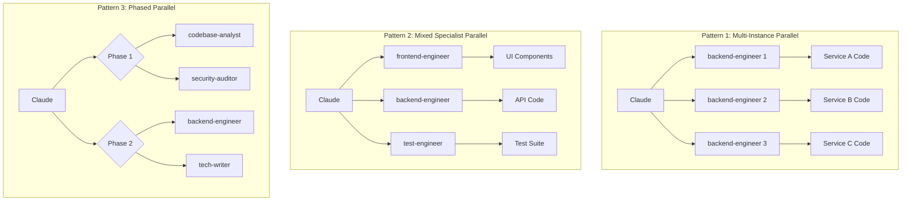
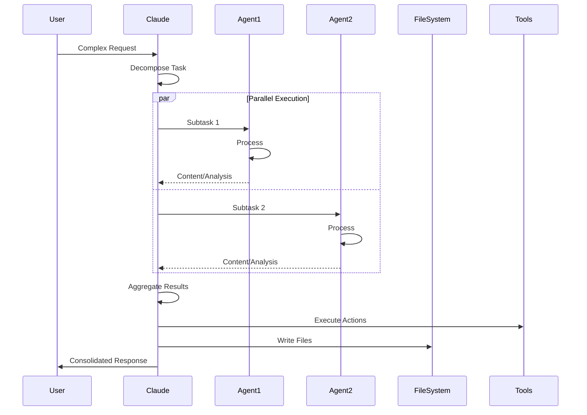
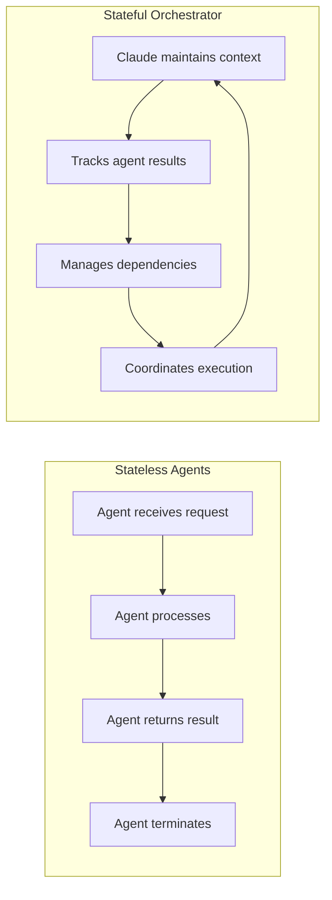
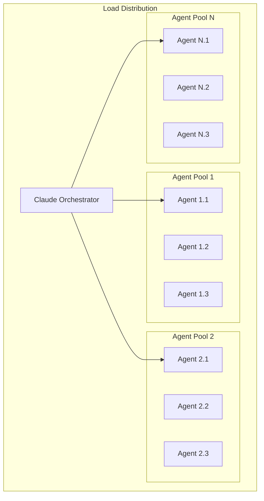
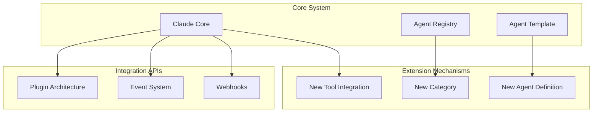

# Claude Agent Ecosystem Architecture

## Table of Contents

1. [Executive Summary](#executive-summary)
2. [System Architecture Overview](#system-architecture-overview)
3. [Agent Categorization Model](#agent-categorization-model)
4. [Security Architecture](#security-architecture)
5. [Tool Permission Model](#tool-permission-model)
6. [Parallel Execution Patterns](#parallel-execution-patterns)
7. [Data Flow Architecture](#data-flow-architecture)
8. [Scalability and Performance](#scalability-and-performance)
9. [Integration and Extension](#integration-and-extension)
10. [Architecture Decision Records](#architecture-decision-records)

## Executive Summary

The Claude Agent Ecosystem is a sophisticated multi-agent orchestration system designed to decompose complex tasks into parallel workstreams. At its core, Claude serves as the sole orchestration engine coordinating 47 specialized AI agents across 8 distinct categories. This architecture enables massive parallelization, clear separation of concerns, and robust security boundaries while maintaining a single point of execution control.

### Key Architectural Principles

- **Sole Executor Pattern**: Only Claude can execute tools and write files
- **Parallel-First Design**: Default to concurrent execution wherever possible
- **Strict Security Boundaries**: System-level protection against unauthorized tool access
- **Capability-Based Specialization**: Each agent optimized for specific domains
- **Stateless Agent Design**: Agents process requests without maintaining state

## System Architecture Overview

### High-Level Architecture

### Component Architecture

## Agent Categorization Model

### Category Structure

The ecosystem organizes 47 specialized agents into 8 functional categories, each with distinct responsibilities and color coding for visual identification:

### Category Capabilities Matrix

| Category | Count | Primary Focus | Tool Access | Execution Rights |
|----------|-------|---------------|-------------|------------------|
| Development & Implementation | 15 | Code generation, UI/UX design | Read, Analyze | None |
| Infrastructure & Operations | 8 | Cloud, DevOps, monitoring | Read, Config generation | None |
| Quality & Security | 6 | Testing, security, compliance | Read, Scan, Analyze | None |
| Architecture & Design | 7 | System design, API specs | Read, Design | None |
| Documentation & Communication | 3 | Docs, guides, communication | Read, Generate content | None |
| Coordination & Support | 3 | Incident response, debugging | Read, Analyze, Plan | None |
| Efficiency & Automation | 5 | Workflow optimization | Read, Pattern matching | None |
| Analysis & Research | 0 | Reserved for future | TBD | None |

## Security Architecture

### System Boundary Protection

The architecture implements a hard security boundary preventing agents from accessing the Task tool, ensuring only Claude maintains execution authority:

### Security Layers

1. **Tool Access Control**
   - Agents have no direct tool access
   - All execution flows through Claude
   - System-level enforcement, not policy-based

2. **File System Protection**
   - Agents cannot write files
   - Read operations are sandboxed
   - Path validation enforced

3. **Execution Boundary**
   - Hard-coded termination on boundary violation
   - Cannot be overridden by instructions
   - Protects against prompt injection

4. **Audit Trail**
   - All agent invocations logged
   - Tool usage tracked to Claude
   - Security violations recorded

## Tool Permission Model

### Permission Matrix

### Access Control Implementation

| Component | Read | Write | Execute | Invoke Agents | Invoke Tools |
|-----------|------|-------|---------|---------------|--------------|
| Claude | ✅ | ✅ | ✅ | ✅ | ✅ |
| All Agents | ✅* | ❌ | ❌ | ❌ | ❌ |
| System Boundary | N/A | N/A | N/A | ❌ (Terminates) | ❌ (Terminates) |

*Limited to specific file patterns and directories

## Parallel Execution Patterns

### Orchestration Patterns

### Execution Strategies

1. **Wide Parallelization**
   - Default approach for independent tasks
   - Launch all non-dependent agents simultaneously
   - Maximize throughput

2. **Phased Execution**
   - Group dependent operations
   - Execute phases in parallel
   - Synchronize between phases

3. **Dynamic Scaling**
   - Spawn instances based on workload
   - Balance across available resources
   - Adapt to task complexity

## Data Flow Architecture

### Request/Response Flow

### State Management

## Scalability and Performance

### Horizontal Scaling

### Performance Optimization Strategies

1. **Parallel Execution Metrics**
   - Track parallel vs sequential ratio
   - Measure agent utilization
   - Optimize bottlenecks

2. **Resource Management**
   - Dynamic agent allocation
   - Load balancing across instances
   - Memory-efficient processing

3. **Caching Strategy**
   - Cache common agent responses
   - Reuse analysis results
   - Minimize redundant processing

### Scalability Patterns

| Pattern | Use Case | Benefits | Considerations |
|---------|----------|----------|----------------|
| Wide Fan-out | Many independent tasks | Maximum parallelization | Resource intensive |
| Batched Processing | Similar operations | Efficient resource use | Increased latency |
| Pipeline Processing | Sequential dependencies | Clear data flow | Limited parallelization |
| Hybrid Approach | Mixed workloads | Balanced performance | Complex orchestration |

## Integration and Extension

### Extension Points

### Agent Creation Workflow

1. **Template-Based Creation**
   - Use AGENT_TEMPLATE.md
   - Define capabilities and constraints
   - Specify category assignment

2. **Registration Process**
   - Add to agent registry
   - Update category mappings
   - Validate with agent-auditor

3. **Integration Testing**
   - Test parallel execution
   - Verify security boundaries
   - Validate output quality

### API Integration Points

| Integration Type | Purpose | Protocol | Authentication |
|-----------------|---------|----------|----------------|
| External Tools | Tool execution | REST/CLI | Token-based |
| Monitoring | Performance tracking | Metrics API | API Key |
| Logging | Audit trail | Syslog/JSON | Certificate |
| Webhooks | Event notification | HTTP POST | HMAC |

## Architecture Decision Records

### ADR-001: Sole Executor Pattern

**Decision**: Only Claude can execute tools and write files

**Rationale**: 
- Maintains single point of control
- Prevents cascade failures
- Simplifies security model
- Enables comprehensive auditing

**Consequences**:
- All execution flows through Claude
- Agents become pure computation units
- Clear responsibility boundaries

### ADR-002: Stateless Agent Design

**Decision**: Agents maintain no state between invocations

**Rationale**:
- Enables massive parallelization
- Simplifies agent implementation
- Reduces memory footprint
- Improves fault tolerance

**Consequences**:
- Claude manages all state
- Each invocation is independent
- No agent-to-agent communication

### ADR-003: System Boundary Protection

**Decision**: Hard-coded termination on Task tool access by agents

**Rationale**:
- Prevents security breaches
- Cannot be overridden
- Protects execution integrity
- Maintains architecture constraints

**Consequences**:
- Automatic agent termination
- No exceptions possible
- Strong security guarantee

### ADR-004: Parallel-First Execution

**Decision**: Default to parallel execution wherever possible

**Rationale**:
- Maximizes throughput
- Reduces total execution time
- Leverages multi-agent architecture
- Improves user experience

**Consequences**:
- Complex orchestration logic
- Higher resource usage
- Need for synchronization points

## Summary

The Claude Agent Ecosystem represents a sophisticated approach to multi-agent orchestration, combining parallel execution capabilities with strict security boundaries. The architecture enables:

1. **Massive Parallelization**: Through multi-instance and mixed-specialist patterns
2. **Clear Separation of Concerns**: Via category-based agent organization
3. **Robust Security**: Through system boundary protection and access control
4. **Scalable Performance**: Via horizontal scaling and optimization strategies
5. **Extensible Design**: Through templates and integration points

This architecture provides a foundation for complex task decomposition while maintaining security, performance, and maintainability at scale.