# Data Flows Architecture

## Table of Contents

1. [Overview](#overview)
2. [Core Data Flow Patterns](#core-data-flow-patterns)
3. [Agent Execution Data Flows](#agent-execution-data-flows)
4. [Configuration Data Flows](#configuration-data-flows)
5. [Monitoring and Metrics Data Flows](#monitoring-and-metrics-data-flows)
6. [Security and Audit Data Flows](#security-and-audit-data-flows)
7. [Real-time Data Streaming](#real-time-data-streaming)
8. [Data Persistence Patterns](#data-persistence-patterns)
9. [Data Transformation Pipelines](#data-transformation-pipelines)
10. [Event-Driven Data Flows](#event-driven-data-flows)

## Overview

This document details the comprehensive data flow architecture within the Claude ecosystem, covering how data moves through the system, is transformed, stored, and accessed across all components and services.

### Data Flow Categories

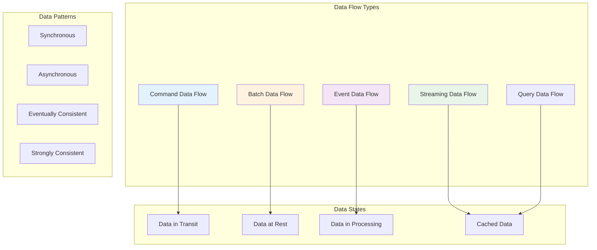

## Core Data Flow Patterns

### Request-Response Data Flow

```mermaid
graph LR
    subgraph "Ingress Flow"
        User[User Input]
        Validation[Input Validation]
        Enrichment[Context Enrichment]
        Routing[Request Routing]
    end

    subgraph "Processing Flow"
        Orchestrator[Claude Orchestrator]
        Decomposition[Task Decomposition]
        AgentPool[Agent Pool]
        ToolExecution[Tool Execution]
    end

    subgraph "Response Flow"
        Aggregation[Result Aggregation]
        Transformation[Response Transform]
        Formatting[Output Formatting]
        Delivery[Response Delivery]
    end

    User --> Validation
    Validation --> Enrichment
    Enrichment --> Routing
    Routing --> Orchestrator

    Orchestrator --> Decomposition
    Decomposition --> AgentPool
    AgentPool --> ToolExecution
    ToolExecution --> Aggregation

    Aggregation --> Transformation
    Transformation --> Formatting
    Formatting --> Delivery
    Delivery --> User

    style User fill:#e8f5e8
    style Orchestrator fill:#e3f2fd
    style Delivery fill:#f3e5f5
```

### Data Flow Architecture Overview

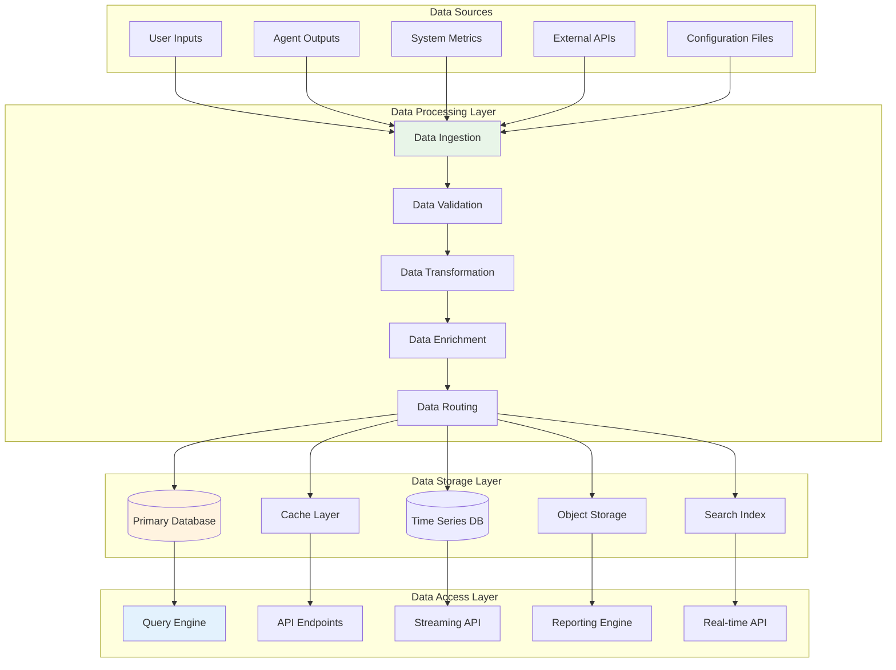

## Agent Execution Data Flows

### Single Agent Execution Flow

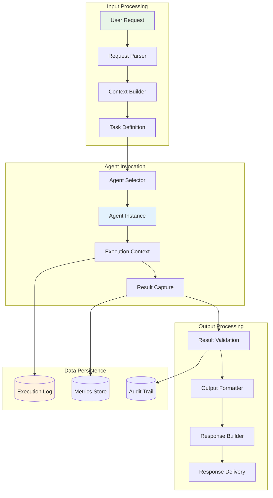

### Parallel Multi-Agent Data Flow

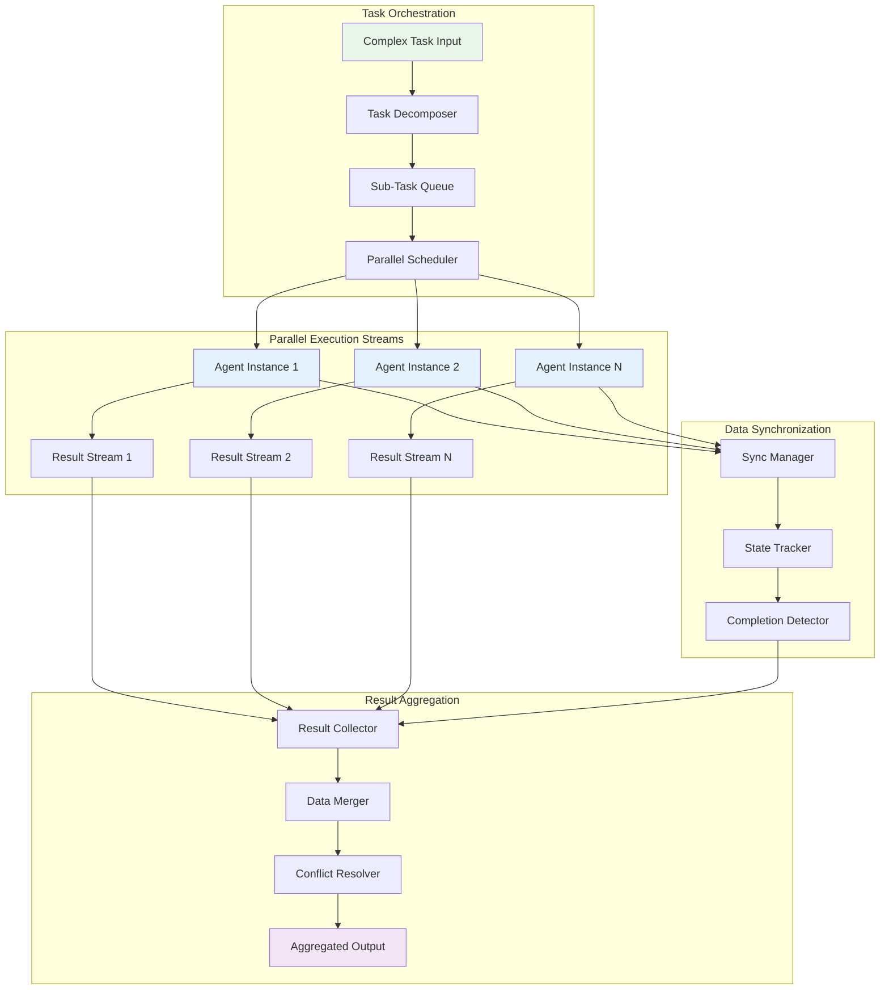

### Agent State Management Data Flow

```typescript
// Agent execution state data structure
interface AgentExecutionState {
  executionId: string;
  agentId: string;
  taskId: string;
  status: ExecutionStatus;
  startTime: Date;
  currentPhase: ExecutionPhase;
  context: ExecutionContext;
  intermediateResults: IntermediateResult[];
  metrics: ExecutionMetrics;
  dependencies: TaskDependency[];
}

// Data flow for state management
interface StateTransition {
  from: ExecutionStatus;
  to: ExecutionStatus;
  timestamp: Date;
  trigger: StateTransitionTrigger;
  metadata: StateTransitionMetadata;
}

// State persistence and synchronization
class AgentStateManager {
  async persistState(state: AgentExecutionState): Promise<void> {
    // Write to primary database
    await this.primaryDB.upsert('agent_states', state);

    // Update cache for fast access
    await this.cache.set(`state:${state.executionId}`, state, 3600);

    // Emit state change event
    await this.eventBus.publish('agent.state.changed', {
      executionId: state.executionId,
      status: state.status,
      timestamp: new Date()
    });
  }

  async synchronizeStates(executionIds: string[]): Promise<AgentExecutionState[]> {
    // Batch fetch from cache first
    const cachedStates = await this.cache.mget(
      executionIds.map(id => `state:${id}`)
    );

    // Identify missing states
    const missingIds = executionIds.filter((id, index) => !cachedStates[index]);

    // Fetch missing states from database
    const missingStates = await this.primaryDB.findByIds('agent_states', missingIds);

    // Merge and return complete state set
    return this.mergeStateResults(cachedStates, missingStates);
  }
}
```

## Configuration Data Flows

### Configuration Deployment Data Flow

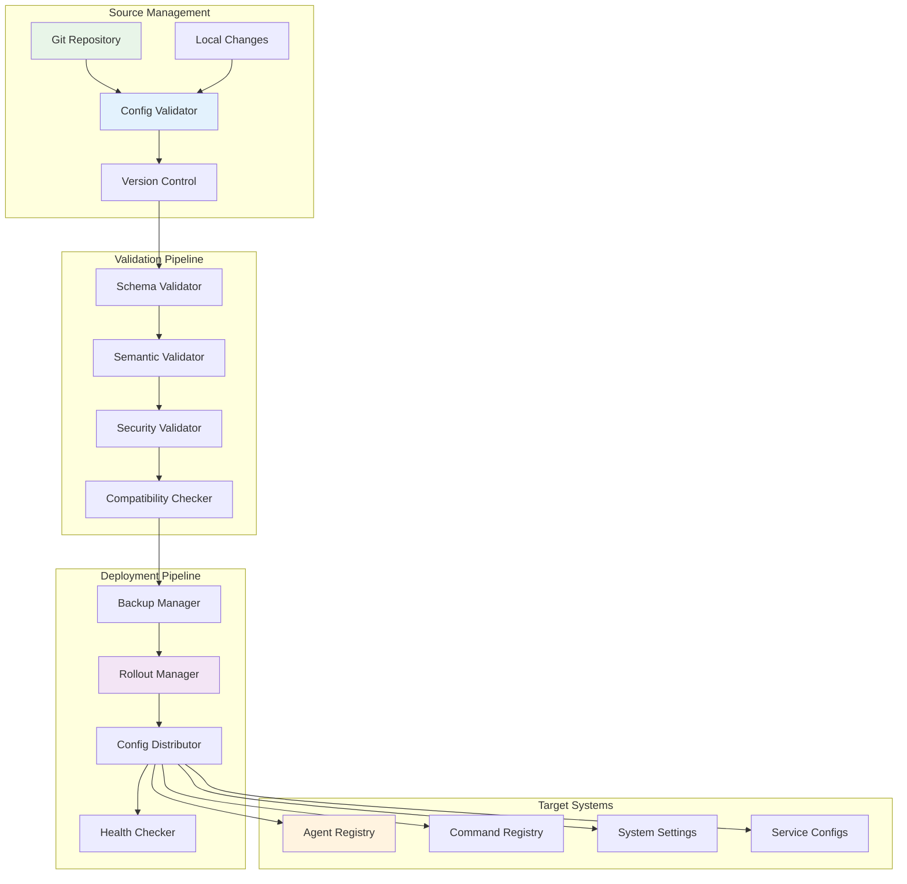

### Dynamic Configuration Update Flow

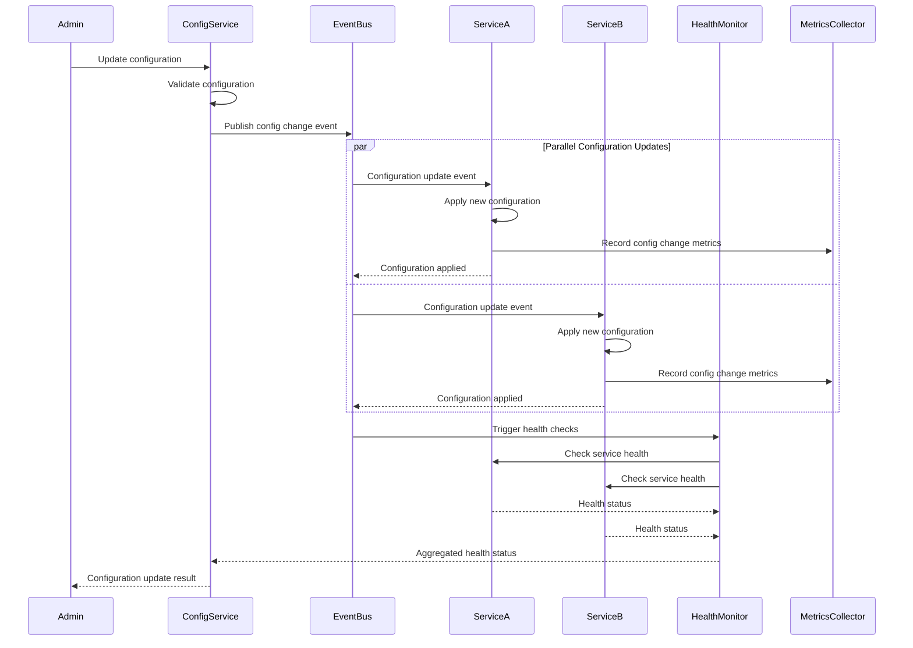

### Configuration Data Model

```typescript
// Configuration data structures
interface ConfigurationPackage {
  packageId: string;
  version: string;
  timestamp: Date;
  components: ConfigurationComponent[];
  dependencies: ConfigurationDependency[];
  metadata: ConfigurationMetadata;
}

interface ConfigurationComponent {
  type: ComponentType;
  name: string;
  content: object;
  schema: JSONSchema;
  validation: ValidationResult;
  targets: DeploymentTarget[];
}

// Configuration change tracking
interface ConfigurationChange {
  changeId: string;
  packageId: string;
  changeType: ChangeType;
  component: string;
  oldValue: any;
  newValue: any;
  appliedAt: Date;
  appliedBy: string;
  rollbackData: RollbackData;
}

// Configuration synchronization
class ConfigurationSynchronizer {
  async synchronizeConfiguration(
    source: ConfigurationSource,
    targets: ConfigurationTarget[]
  ): Promise<SynchronizationResult> {
    const sourceConfig = await this.loadConfiguration(source);
    const validationResult = await this.validateConfiguration(sourceConfig);

    if (!validationResult.isValid) {
      throw new ConfigurationValidationError(validationResult.errors);
    }

    const deploymentPlan = await this.createDeploymentPlan(sourceConfig, targets);
    const backupData = await this.createBackup(targets);

    try {
      const deploymentResult = await this.executeDeployment(deploymentPlan);
      await this.verifyDeployment(deploymentResult);
      return this.createSuccessResult(deploymentResult);
    } catch (error) {
      await this.rollbackConfiguration(backupData);
      throw new ConfigurationDeploymentError(error.message);
    }
  }
}
```

## Monitoring and Metrics Data Flows

### Real-time Metrics Pipeline

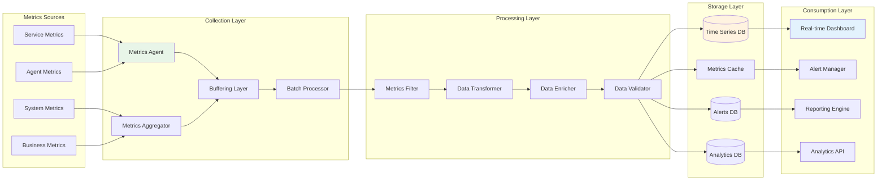

### Metrics Data Aggregation Flow

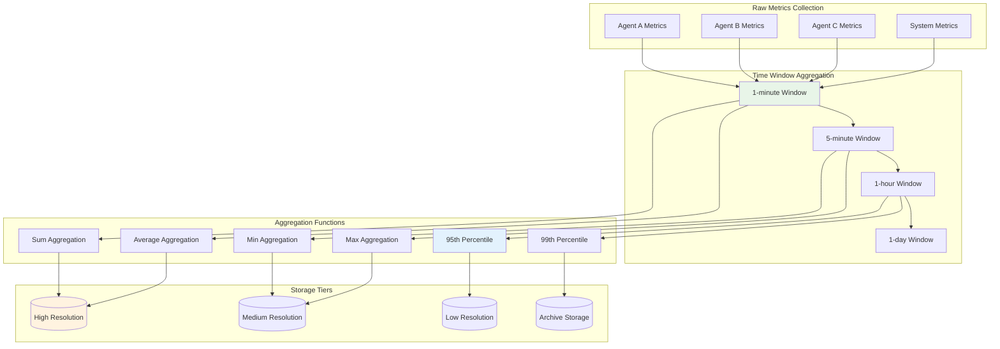

### Performance Monitoring Data Pipeline

```typescript
// Metrics data structures
interface MetricDataPoint {
  metricName: string;
  value: number;
  timestamp: Date;
  tags: MetricTags;
  source: MetricSource;
}

interface MetricTags {
  service: string;
  instance: string;
  environment: string;
  region?: string;
  [key: string]: string | undefined;
}

// Metrics processing pipeline
class MetricsProcessor {
  private aggregators: Map<string, MetricsAggregator>;
  private storage: MetricsStorage;
  private alertManager: AlertManager;

  async processMetrics(dataPoints: MetricDataPoint[]): Promise<void> {
    // Step 1: Validate incoming metrics
    const validMetrics = await this.validateMetrics(dataPoints);

    // Step 2: Enrich with additional context
    const enrichedMetrics = await this.enrichMetrics(validMetrics);

    // Step 3: Apply aggregation windows
    const aggregatedMetrics = await this.aggregateMetrics(enrichedMetrics);

    // Step 4: Store processed metrics
    await this.storage.storeMetrics(aggregatedMetrics);

    // Step 5: Check alert thresholds
    await this.checkAlerts(aggregatedMetrics);

    // Step 6: Update real-time streams
    await this.updateRealTimeStreams(aggregatedMetrics);
  }

  private async aggregateMetrics(
    metrics: MetricDataPoint[]
  ): Promise<AggregatedMetric[]> {
    const aggregationResults: AggregatedMetric[] = [];

    // Group metrics by time windows
    const timeWindows = this.groupByTimeWindows(metrics);

    for (const [window, windowMetrics] of timeWindows) {
      for (const [metricName, metricPoints] of this.groupByMetricName(windowMetrics)) {
        const aggregator = this.aggregators.get(metricName);
        if (aggregator) {
          const aggregated = await aggregator.aggregate(metricPoints, window);
          aggregationResults.push(aggregated);
        }
      }
    }

    return aggregationResults;
  }
}
```

## Security and Audit Data Flows

### Security Event Processing Flow

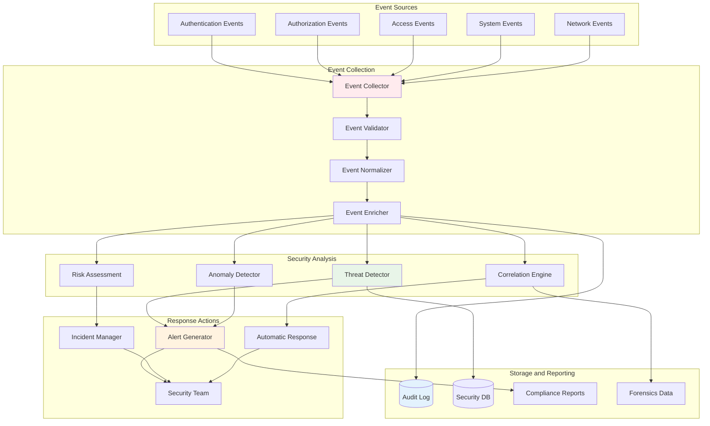

### Audit Trail Data Flow

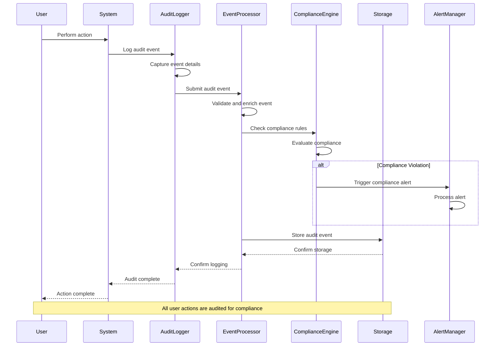

### Security Data Processing

```typescript
// Security event data structures
interface SecurityEvent {
  eventId: string;
  eventType: SecurityEventType;
  timestamp: Date;
  source: EventSource;
  actor: SecurityActor;
  target: SecurityTarget;
  action: SecurityAction;
  outcome: ActionOutcome;
  context: SecurityContext;
  riskScore: number;
}

interface SecurityContext {
  sessionId?: string;
  ipAddress: string;
  userAgent?: string;
  geolocation?: GeoLocation;
  previousActivity: Activity[];
  anomalyIndicators: AnomalyIndicator[];
}

// Security event processing pipeline
class SecurityEventProcessor {
  private threatDetectors: ThreatDetector[];
  private riskCalculator: RiskCalculator;
  private complianceEngine: ComplianceEngine;
  private auditStorage: AuditStorage;

  async processSecurityEvent(event: SecurityEvent): Promise<SecurityProcessingResult> {
    try {
      // Step 1: Validate and normalize event
      const normalizedEvent = await this.normalizeEvent(event);

      // Step 2: Enrich with contextual information
      const enrichedEvent = await this.enrichEvent(normalizedEvent);

      // Step 3: Calculate risk score
      const riskScore = await this.riskCalculator.calculateRisk(enrichedEvent);
      enrichedEvent.riskScore = riskScore;

      // Step 4: Run threat detection
      const threats = await this.detectThreats(enrichedEvent);

      // Step 5: Check compliance requirements
      const complianceResult = await this.complianceEngine.checkCompliance(enrichedEvent);

      // Step 6: Store for audit
      await this.auditStorage.storeEvent(enrichedEvent);

      // Step 7: Generate alerts if necessary
      if (riskScore > this.riskThreshold || threats.length > 0) {
        await this.generateSecurityAlert({
          event: enrichedEvent,
          threats,
          riskScore,
          complianceResult
        });
      }

      return {
        success: true,
        riskScore,
        threatsDetected: threats.length,
        complianceStatus: complianceResult.status
      };

    } catch (error) {
      await this.handleProcessingError(event, error);
      throw error;
    }
  }

  private async enrichEvent(event: SecurityEvent): Promise<SecurityEvent> {
    // Add geolocation data
    if (event.context.ipAddress) {
      event.context.geolocation = await this.geoLocationService.lookup(
        event.context.ipAddress
      );
    }

    // Add historical context
    event.context.previousActivity = await this.activityService.getRecentActivity(
      event.actor.id,
      '24h'
    );

    // Add anomaly indicators
    event.context.anomalyIndicators = await this.anomalyDetector.detectAnomalies(
      event
    );

    return event;
  }
}
```

## Real-time Data Streaming

### WebSocket Data Streaming Architecture

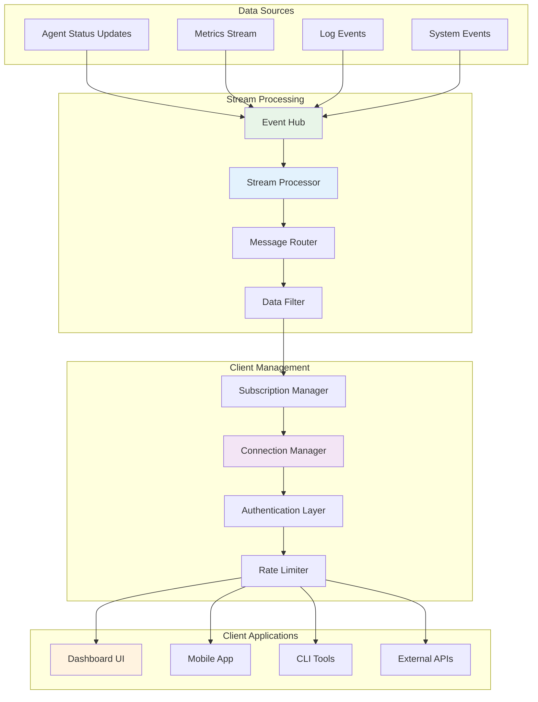

### Event-Driven Streaming Pipeline

```typescript
// Streaming data structures
interface StreamEvent {
  eventId: string;
  eventType: StreamEventType;
  timestamp: Date;
  source: EventSource;
  payload: any;
  metadata: StreamMetadata;
}

interface StreamSubscription {
  subscriptionId: string;
  clientId: string;
  filters: StreamFilter[];
  rateLimit: RateLimitConfig;
  authentication: AuthenticationInfo;
}

// Real-time streaming service
class RealTimeStreamingService {
  private connectionManager: WebSocketConnectionManager;
  private subscriptionManager: SubscriptionManager;
  private eventProcessor: StreamEventProcessor;
  private ratelimiter: RateLimiter;

  async handleClientConnection(socket: WebSocket, request: IncomingMessage): Promise<void> {
    try {
      // Authenticate connection
      const authResult = await this.authenticateConnection(request);
      if (!authResult.success) {
        socket.close(1008, 'Authentication failed');
        return;
      }

      // Register connection
      const clientId = await this.connectionManager.registerConnection(
        socket,
        authResult.principal
      );

      // Setup message handlers
      socket.on('message', async (data) => {
        await this.handleClientMessage(clientId, data);
      });

      socket.on('close', async () => {
        await this.handleClientDisconnection(clientId);
      });

      socket.send(JSON.stringify({
        type: 'connection_established',
        clientId,
        timestamp: new Date()
      }));

    } catch (error) {
      console.error('WebSocket connection error:', error);
      socket.close(1011, 'Internal server error');
    }
  }

  async publishEvent(event: StreamEvent): Promise<void> {
    // Process the event
    const processedEvent = await this.eventProcessor.process(event);

    // Find matching subscriptions
    const matchingSubscriptions = await this.subscriptionManager.findSubscriptions(
      processedEvent
    );

    // Send to subscribed clients
    for (const subscription of matchingSubscriptions) {
      if (await this.rateLimit.checkLimit(subscription.clientId)) {
        await this.sendToClient(subscription.clientId, processedEvent);
      }
    }

    // Update metrics
    await this.updateStreamingMetrics(processedEvent, matchingSubscriptions.length);
  }

  private async sendToClient(clientId: string, event: StreamEvent): Promise<void> {
    const connection = await this.connectionManager.getConnection(clientId);
    if (connection && connection.readyState === WebSocket.OPEN) {
      connection.send(JSON.stringify({
        type: 'stream_event',
        event,
        timestamp: new Date()
      }));
    }
  }
}
```

## Data Persistence Patterns

### Multi-Tier Storage Architecture

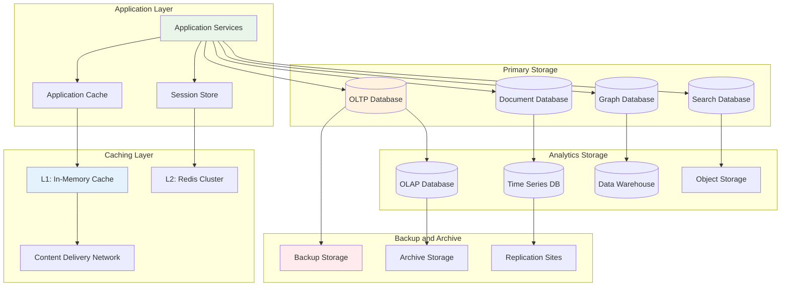

### Data Lifecycle Management

```mermaid
graph LR
    subgraph "Data Creation"
        Ingestion[Data Ingestion]
        Validation[Data Validation]
        Classification[Data Classification]
        InitialStorage[Initial Storage]
    end

    subgraph "Active Data"
        ProcessingLayer[Processing Layer]
        CacheLayer[Cache Layer]
        IndexLayer[Index Layer]
        BackupCreation[Backup Creation]
    end

    subgraph "Data Aging"
        AccessMonitor[Access Monitoring]
        PolicyEngine[Retention Policy Engine]
        DataMigration[Data Migration]
        Compression[Data Compression]
    end

    subgraph "Data Archive"
        ArchiveStorage[Archive Storage]
        ComplianceCheck[Compliance Check]
        DataDestruction[Data Destruction]
        AuditTrail[Audit Trail]
    end

    Ingestion --> Validation
    Validation --> Classification
    Classification --> InitialStorage
    InitialStorage --> ProcessingLayer

    ProcessingLayer --> CacheLayer
    CacheLayer --> IndexLayer
    IndexLayer --> BackupCreation
    BackupCreation --> AccessMonitor

    AccessMonitor --> PolicyEngine
    PolicyEngine --> DataMigration
    DataMigration --> Compression
    Compression --> ArchiveStorage

    ArchiveStorage --> ComplianceCheck
    ComplianceCheck --> DataDestruction
    DataDestruction --> AuditTrail

    style Ingestion fill:#e8f5e8
    style ProcessingLayer fill:#e3f2fd
    style PolicyEngine fill:#f3e5f5
    style ArchiveStorage fill:#fff3e0
```

## Data Transformation Pipelines

### ETL/ELT Processing Flow

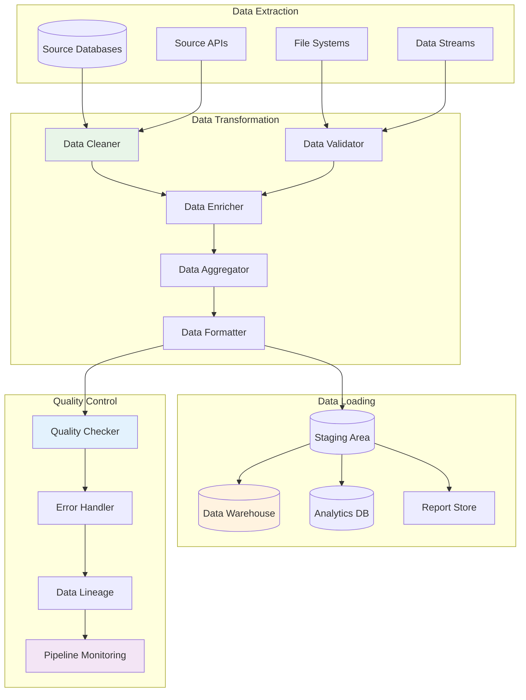

### Data Pipeline Implementation

```typescript
// Data pipeline interfaces
interface DataPipeline {
  name: string;
  stages: PipelineStage[];
  configuration: PipelineConfiguration;
  errorHandling: ErrorHandlingStrategy;
  monitoring: MonitoringConfiguration;
}

interface PipelineStage {
  name: string;
  type: StageType;
  processor: DataProcessor;
  inputSchema: JSONSchema;
  outputSchema: JSONSchema;
  configuration: StageConfiguration;
}

// Data transformation pipeline
class DataTransformationPipeline {
  private stages: Map<string, DataProcessor>;
  private errorHandler: PipelineErrorHandler;
  private monitor: PipelineMonitor;

  async executePipeline(
    pipeline: DataPipeline,
    inputData: DataBatch
  ): Promise<PipelineExecutionResult> {
    const executionId = this.generateExecutionId();
    let currentData = inputData;

    try {
      await this.monitor.startExecution(executionId, pipeline.name);

      for (const stage of pipeline.stages) {
        const stageStartTime = Date.now();

        // Validate input data
        const validationResult = await this.validateStageInput(stage, currentData);
        if (!validationResult.isValid) {
          throw new StageValidationError(stage.name, validationResult.errors);
        }

        // Execute stage
        const processor = this.stages.get(stage.type);
        if (!processor) {
          throw new ProcessorNotFoundError(stage.type);
        }

        currentData = await processor.process(currentData, stage.configuration);

        // Record stage metrics
        await this.monitor.recordStageMetrics(executionId, stage.name, {
          executionTime: Date.now() - stageStartTime,
          inputCount: inputData.records.length,
          outputCount: currentData.records.length,
          errorCount: 0
        });
      }

      await this.monitor.completeExecution(executionId, true);
      return this.createSuccessResult(executionId, currentData);

    } catch (error) {
      await this.errorHandler.handlePipelineError(executionId, error);
      await this.monitor.completeExecution(executionId, false);
      throw error;
    }
  }
}
```

## Event-Driven Data Flows

### Event Sourcing Architecture

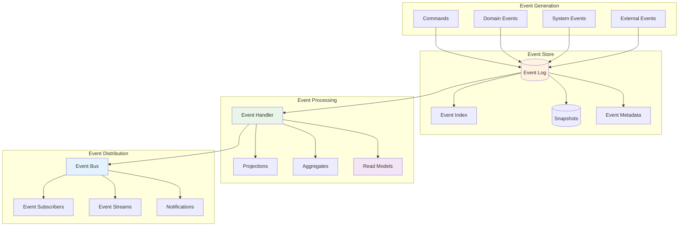

### CQRS Data Flow Pattern

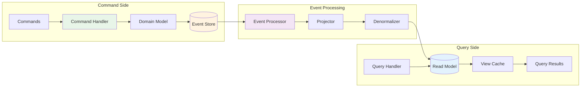

## Summary

The data flows architecture provides comprehensive patterns for data movement, transformation, and processing across the Claude ecosystem. Key architectural principles include:

### Data Flow Patterns

1. **Request-Response Flows**: Synchronous data processing for immediate results
2. **Event-Driven Flows**: Asynchronous processing for loose coupling and scalability
3. **Streaming Flows**: Real-time data processing for live updates and monitoring
4. **Batch Processing Flows**: Efficient processing of large data volumes

### Data Management Strategies

1. **Multi-Tier Storage**: Optimized storage layers for different access patterns
2. **Data Lifecycle Management**: Automated data aging and archival processes
3. **Quality Assurance**: Comprehensive validation and monitoring throughout data flows
4. **Security and Compliance**: End-to-end audit trails and security controls

### Performance Optimizations

1. **Caching Strategies**: Multi-level caching for improved response times
2. **Parallel Processing**: Concurrent data processing for better throughput
3. **Data Locality**: Strategic data placement for reduced latency
4. **Resource Optimization**: Efficient resource utilization across all data flows

This architecture ensures reliable, scalable, and secure data processing while supporting the complex requirements of the multi-agent Claude ecosystem.
