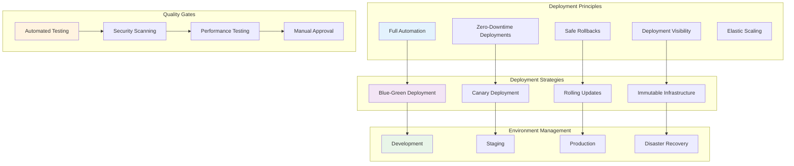
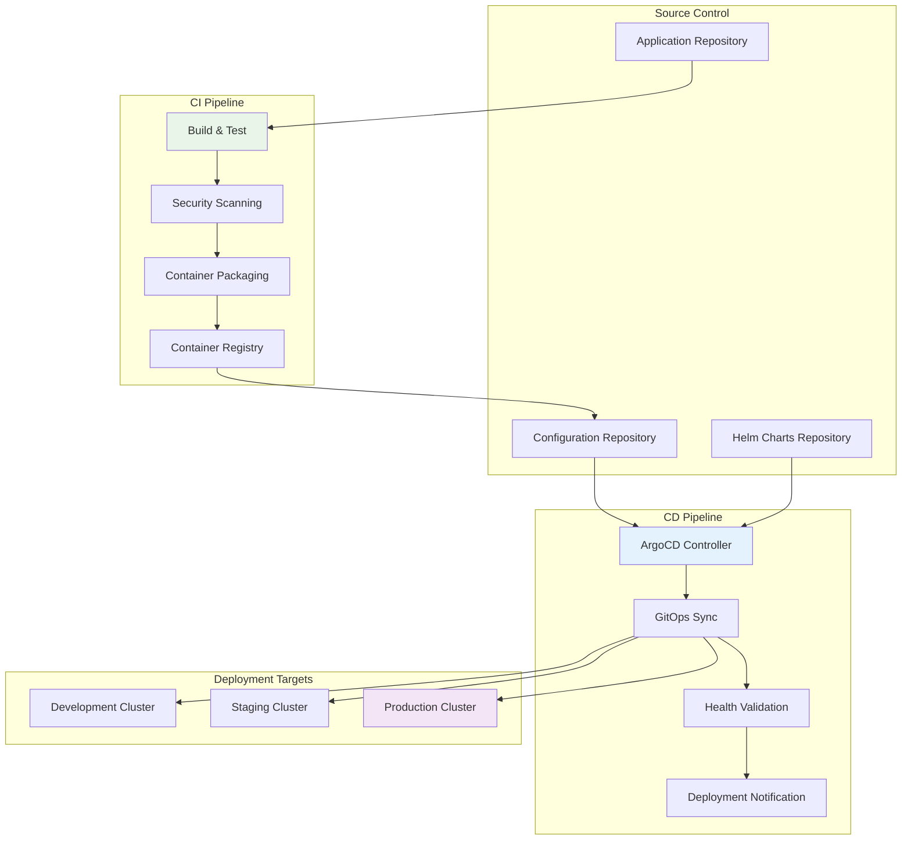
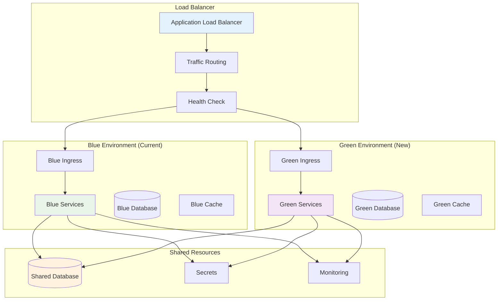

# Deployment Architecture

## Table of Contents

1. [Overview](#overview)
2. [Deployment Strategy](#deployment-strategy)
3. [Environment Architecture](#environment-architecture)
4. [Container Deployment Patterns](#container-deployment-patterns)
5. [CI/CD Pipeline Architecture](#cicd-pipeline-architecture)
6. [Blue-Green Deployment](#blue-green-deployment)
7. [Canary Deployment Strategy](#canary-deployment-strategy)
8. [Infrastructure Deployment](#infrastructure-deployment)
9. [Configuration Management](#configuration-management)
10. [Monitoring and Rollback Strategies](#monitoring-and-rollback-strategies)

## Overview

This document outlines the comprehensive deployment architecture for the Claude ecosystem, covering deployment strategies, environment management, CI/CD pipelines, and operational procedures for reliable software delivery.

### Deployment Architecture Principles



## Deployment Strategy

### Multi-Stage Deployment Pipeline

```mermaid
graph LR
    subgraph "Source Control"
        Git[Git Repository]
        PR[Pull Request]
        Merge[Merge to Main]
    end

    subgraph "Build Stage"
        Build[Build Artifacts]
        UnitTest[Unit Tests]
        StaticAnalysis[Static Analysis]
        SecurityScan[Security Scan]
    end

    subgraph "Test Environment"
        TestDeploy[Deploy to Test]
        IntegrationTest[Integration Tests]
        E2ETest[E2E Tests]
        PerformanceTest[Performance Tests]
    end

    subgraph "Staging Environment"
        StagingDeploy[Deploy to Staging]
        StagingTest[Staging Tests]
        UAT[User Acceptance Testing]
        SecurityTest[Security Testing]
    end

    subgraph "Production Environment"
        CanaryDeploy[Canary Deployment]
        HealthCheck[Health Checks]
        FullDeploy[Full Deployment]
        Monitor[Monitoring]
    end

    Git --> PR
    PR --> Merge
    Merge --> Build

    Build --> UnitTest
    UnitTest --> StaticAnalysis
    StaticAnalysis --> SecurityScan
    SecurityScan --> TestDeploy

    TestDeploy --> IntegrationTest
    IntegrationTest --> E2ETest
    E2ETest --> PerformanceTest
    PerformanceTest --> StagingDeploy

    StagingDeploy --> StagingTest
    StagingTest --> UAT
    UAT --> SecurityTest
    SecurityTest --> CanaryDeploy

    CanaryDeploy --> HealthCheck
    HealthCheck --> FullDeploy
    FullDeploy --> Monitor

    style Build fill:#e8f5e8
    style StagingDeploy fill:#e3f2fd
    style CanaryDeploy fill:#f3e5f5
    style Monitor fill:#fff3e0
```



### Deployment Decision Matrix

| Strategy | Use Case | Benefits | Considerations |
|----------|----------|----------|----------------|
| **Rolling Update** | Regular feature releases | Gradual rollout, resource efficient | Slower deployment, mixed versions |
| **Blue-Green** | Critical system updates | Zero downtime, instant rollback | Requires 2x resources, expensive |
| **Canary** | High-risk changes | Risk mitigation, performance validation | Complex setup, monitoring overhead |
| **A/B Testing** | Feature experimentation | User feedback, data-driven decisions | Long-running deployments, analytics required |
| **Immutable** | Infrastructure changes | Consistency, simplified rollback | Full replacement, resource intensive |

## Environment Architecture

### Multi-Environment Setup

```mermaid
graph TB
    subgraph "Development Environment"
        DevKube[Dev Kubernetes]
        DevDB[(Dev Database)]
        DevCache[Dev Cache]
        DevMonitoring[Dev Monitoring]
    end

    subgraph "Staging Environment"
        StagingKube[Staging Kubernetes]
        StagingDB[(Staging Database)]
        StagingCache[Staging Cache]
        StagingMonitoring[Staging Monitoring]
    end

    subgraph "Production Environment"
        ProdKube[Production Kubernetes]
        ProdDB[(Production Database)]
        ProdCache[Production Cache]
        ProdMonitoring[Production Monitoring]
    end

    subgraph "DR Environment"
        DRKube[DR Kubernetes]
        DRDB[(DR Database)]
        DRCache[DR Cache]
        DRMonitoring[DR Monitoring]
    end

    subgraph "Shared Services"
        Registry[Container Registry]
        Secrets[Secret Management]
        DNS[DNS Management]
        LoadBalancer[Load Balancer]
    end

    DevKube --> Registry
    StagingKube --> Registry
    ProdKube --> Registry
    DRKube --> Registry

    DevKube --> Secrets
    StagingKube --> Secrets
    ProdKube --> Secrets
    DRKube --> Secrets

    ProdKube --> DNS
    DRKube --> DNS
    DNS --> LoadBalancer

    style DevKube fill:#e8f5e8
    style StagingKube fill:#e3f2fd
    style ProdKube fill:#f3e5f5
    style Registry fill:#fff3e0
```



### Environment Configuration

```yaml
# Environment-specific configuration structure
environments:
  development:
    cluster:
      name: claude-dev-cluster
      region: us-west-2
      nodeGroups:
        - name: general
          instanceTypes: [t3.medium]
          minSize: 2
          maxSize: 5
          desiredSize: 3
    database:
      instance: db.t3.small
      storage: 20GB
      backup: disabled
    monitoring:
      retention: 7d
      alerting: disabled

  staging:
    cluster:
      name: claude-staging-cluster
      region: us-west-2
      nodeGroups:
        - name: general
          instanceTypes: [m5.large]
          minSize: 3
          maxSize: 10
          desiredSize: 5
    database:
      instance: db.t3.medium
      storage: 100GB
      backup: enabled
      retentionDays: 7
    monitoring:
      retention: 30d
      alerting: enabled

  production:
    cluster:
      name: claude-prod-cluster
      region: us-west-2
      nodeGroups:
        - name: general
          instanceTypes: [m5.xlarge, m5.2xlarge]
          minSize: 5
          maxSize: 50
          desiredSize: 10
        - name: memory-intensive
          instanceTypes: [r5.2xlarge, r5.4xlarge]
          minSize: 2
          maxSize: 20
          desiredSize: 5
    database:
      instance: db.r5.2xlarge
      storage: 1TB
      backup: enabled
      retentionDays: 30
      multiAZ: true
    monitoring:
      retention: 90d
      alerting: enabled
      paging: enabled
```

## Container Deployment Patterns

### Multi-Service Deployment Configuration

```yaml
# Production deployment configuration
apiVersion: v1
kind: Namespace
metadata:
  name: claude-ecosystem
  labels:
    environment: production
    managed-by: argocd

---
# Claude Orchestrator Deployment
apiVersion: apps/v1
kind: Deployment
metadata:
  name: claude-orchestrator
  namespace: claude-ecosystem
  labels:
    app: claude-orchestrator
    version: v2.1.0
    component: core
spec:
  replicas: 5
  strategy:
    type: RollingUpdate
    rollingUpdate:
      maxUnavailable: 1
      maxSurge: 2
  selector:
    matchLabels:
      app: claude-orchestrator
  template:
    metadata:
      labels:
        app: claude-orchestrator
        version: v2.1.0
        component: core
      annotations:
        prometheus.io/scrape: "true"
        prometheus.io/port: "9090"
        prometheus.io/path: "/metrics"
    spec:
      serviceAccountName: claude-orchestrator
      securityContext:
        runAsNonRoot: true
        runAsUser: 1001
        fsGroup: 2000
        seccompProfile:
          type: RuntimeDefault
      containers:
      - name: orchestrator
        image: claude-ecosystem/orchestrator:v2.1.0-sha256@sha256:a1b2c3d4e5f6...
        imagePullPolicy: Always
        ports:
        - name: http
          containerPort: 8080
          protocol: TCP
        - name: grpc
          containerPort: 9000
          protocol: TCP
        - name: metrics
          containerPort: 9090
          protocol: TCP
        env:
        - name: ENVIRONMENT
          value: "production"
        - name: LOG_LEVEL
          value: "info"
        - name: DATABASE_URL
          valueFrom:
            secretKeyRef:
              name: database-credentials
              key: url
        - name: REDIS_URL
          valueFrom:
            configMapKeyRef:
              name: redis-config
              key: cluster-url
        - name: JAEGER_AGENT_HOST
          valueFrom:
            fieldRef:
              fieldPath: status.hostIP
        resources:
          requests:
            memory: "1Gi"
            cpu: "500m"
            ephemeral-storage: "1Gi"
          limits:
            memory: "2Gi"
            cpu: "1500m"
            ephemeral-storage: "2Gi"
        livenessProbe:
          httpGet:
            path: /health/live
            port: http
          initialDelaySeconds: 30
          periodSeconds: 10
          timeoutSeconds: 5
          failureThreshold: 3
        readinessProbe:
          httpGet:
            path: /health/ready
            port: http
          initialDelaySeconds: 5
          periodSeconds: 5
          timeoutSeconds: 3
          failureThreshold: 2
        securityContext:
          allowPrivilegeEscalation: false
          readOnlyRootFilesystem: true
          capabilities:
            drop:
            - ALL
        volumeMounts:
        - name: tmp
          mountPath: /tmp
        - name: config
          mountPath: /app/config
          readOnly: true
        - name: secrets
          mountPath: /app/secrets
          readOnly: true
      volumes:
      - name: tmp
        emptyDir:
          sizeLimit: 1Gi
      - name: config
        configMap:
          name: claude-orchestrator-config
      - name: secrets
        secret:
          secretName: claude-orchestrator-secrets
      nodeSelector:
        node-type: general-compute
      tolerations:
      - key: "node-type"
        operator: "Equal"
        value: "general-compute"
        effect: "NoSchedule"
      affinity:
        podAntiAffinity:
          preferredDuringSchedulingIgnoredDuringExecution:
          - weight: 100
            podAffinityTerm:
              labelSelector:
                matchLabels:
                  app: claude-orchestrator
              topologyKey: kubernetes.io/hostname
        nodeAffinity:
          requiredDuringSchedulingIgnoredDuringExecution:
            nodeSelectorTerms:
            - matchExpressions:
              - key: kubernetes.io/arch
                operator: In
                values:
                - amd64
          preferredDuringSchedulingIgnoredDuringExecution:
          - weight: 100
            preference:
              matchExpressions:
              - key: node-type
                operator: In
                values:
                - general-compute

---
# Service Configuration
apiVersion: v1
kind: Service
metadata:
  name: claude-orchestrator
  namespace: claude-ecosystem
  labels:
    app: claude-orchestrator
    component: core
  annotations:
    service.beta.kubernetes.io/aws-load-balancer-type: nlb
    service.beta.kubernetes.io/aws-load-balancer-backend-protocol: tcp
spec:
  type: LoadBalancer
  selector:
    app: claude-orchestrator
  ports:
  - name: http
    port: 80
    targetPort: http
    protocol: TCP
  - name: grpc
    port: 9000
    targetPort: grpc
    protocol: TCP

---
# Horizontal Pod Autoscaler
apiVersion: autoscaling/v2
kind: HorizontalPodAutoscaler
metadata:
  name: claude-orchestrator-hpa
  namespace: claude-ecosystem
spec:
  scaleTargetRef:
    apiVersion: apps/v1
    kind: Deployment
    name: claude-orchestrator
  minReplicas: 5
  maxReplicas: 30
  metrics:
  - type: Resource
    resource:
      name: cpu
      target:
        type: Utilization
        averageUtilization: 70
  - type: Resource
    resource:
      name: memory
      target:
        type: Utilization
        averageUtilization: 80
  - type: Pods
    pods:
      metric:
        name: agent_queue_length
      target:
        type: AverageValue
        averageValue: "10"
  behavior:
    scaleUp:
      stabilizationWindowSeconds: 60
      policies:
      - type: Percent
        value: 100
        periodSeconds: 15
    scaleDown:
      stabilizationWindowSeconds: 300
      policies:
      - type: Percent
        value: 10
        periodSeconds: 60

---
# Pod Disruption Budget
apiVersion: policy/v1
kind: PodDisruptionBudget
metadata:
  name: claude-orchestrator-pdb
  namespace: claude-ecosystem
spec:
  minAvailable: 3
  selector:
    matchLabels:
      app: claude-orchestrator
```

## CI/CD Pipeline Architecture

### GitOps-Based Deployment Pipeline



### GitHub Actions CI Pipeline

```yaml
name: Claude Ecosystem CI/CD

on:
  push:
    branches: [main, develop]
  pull_request:
    branches: [main]

env:
  REGISTRY: ghcr.io
  IMAGE_NAME: claude-ecosystem/orchestrator

jobs:
  test:
    runs-on: ubuntu-latest
    strategy:
      matrix:
        node-version: [18, 20]
    steps:
    - name: Checkout code
      uses: actions/checkout@v4

    - name: Setup Node.js
      uses: actions/setup-node@v4
      with:
        node-version: ${{ matrix.node-version }}
        cache: 'npm'

    - name: Install dependencies
      run: npm ci

    - name: Run linting
      run: npm run lint

    - name: Run unit tests
      run: npm test -- --coverage --watchAll=false

    - name: Upload coverage to Codecov
      uses: codecov/codecov-action@v3
      with:
        file: ./coverage/lcov.info

  security-scan:
    runs-on: ubuntu-latest
    needs: test
    steps:
    - name: Checkout code
      uses: actions/checkout@v4

    - name: Run Trivy vulnerability scanner
      uses: aquasecurity/trivy-action@master
      with:
        scan-type: 'fs'
        scan-ref: '.'
        format: 'sarif'
        output: 'trivy-results.sarif'

    - name: Upload Trivy scan results to GitHub Security tab
      uses: github/codeql-action/upload-sarif@v2
      with:
        sarif_file: 'trivy-results.sarif'

  build-and-push:
    runs-on: ubuntu-latest
    needs: [test, security-scan]
    if: github.ref == 'refs/heads/main'
    outputs:
      image-digest: ${{ steps.build.outputs.digest }}
      image-tag: ${{ steps.meta.outputs.tags }}
    steps:
    - name: Checkout code
      uses: actions/checkout@v4

    - name: Set up Docker Buildx
      uses: docker/setup-buildx-action@v3

    - name: Log in to Container Registry
      uses: docker/login-action@v3
      with:
        registry: ${{ env.REGISTRY }}
        username: ${{ github.actor }}
        password: ${{ secrets.GITHUB_TOKEN }}

    - name: Extract metadata
      id: meta
      uses: docker/metadata-action@v5
      with:
        images: ${{ env.REGISTRY }}/${{ env.IMAGE_NAME }}
        tags: |
          type=ref,event=branch
          type=ref,event=pr
          type=sha,prefix=sha-{{branch}}-
          type=raw,value=latest,enable={{is_default_branch}}

    - name: Build and push Docker image
      id: build
      uses: docker/build-push-action@v5
      with:
        context: .
        platforms: linux/amd64,linux/arm64
        push: true
        tags: ${{ steps.meta.outputs.tags }}
        labels: ${{ steps.meta.outputs.labels }}
        cache-from: type=gha
        cache-to: type=gha,mode=max

    - name: Sign container image
      uses: sigstore/cosign-installer@v3
    - run: |
        cosign sign --yes ${{ env.REGISTRY }}/${{ env.IMAGE_NAME }}@${{ steps.build.outputs.digest }}

  deploy-dev:
    runs-on: ubuntu-latest
    needs: build-and-push
    environment: development
    steps:
    - name: Checkout config repository
      uses: actions/checkout@v4
      with:
        repository: claude-ecosystem/k8s-config
        token: ${{ secrets.GITOPS_TOKEN }}
        path: k8s-config

    - name: Update image tag
      run: |
        cd k8s-config/environments/dev
        yq eval '.spec.template.spec.containers[0].image = "${{ needs.build-and-push.outputs.image-tag }}"' -i deployment.yaml

    - name: Commit and push changes
      run: |
        cd k8s-config
        git config --local user.email "action@github.com"
        git config --local user.name "GitHub Action"
        git add .
        git commit -m "Update dev image to ${{ needs.build-and-push.outputs.image-tag }}"
        git push

  deploy-staging:
    runs-on: ubuntu-latest
    needs: [build-and-push, deploy-dev]
    environment: staging
    steps:
    - name: Checkout config repository
      uses: actions/checkout@v4
      with:
        repository: claude-ecosystem/k8s-config
        token: ${{ secrets.GITOPS_TOKEN }}
        path: k8s-config

    - name: Update staging deployment
      run: |
        cd k8s-config/environments/staging
        yq eval '.spec.template.spec.containers[0].image = "${{ needs.build-and-push.outputs.image-tag }}"' -i deployment.yaml

    - name: Commit and push changes
      run: |
        cd k8s-config
        git config --local user.email "action@github.com"
        git config --local user.name "GitHub Action"
        git add .
        git commit -m "Update staging image to ${{ needs.build-and-push.outputs.image-tag }}"
        git push

  deploy-production:
    runs-on: ubuntu-latest
    needs: [build-and-push, deploy-staging]
    environment: production
    if: github.ref == 'refs/heads/main'
    steps:
    - name: Manual approval required
      uses: trstringer/manual-approval@v1
      with:
        secret: ${{ github.TOKEN }}
        approvers: platform-team,security-team
        minimum-approvals: 2

    - name: Checkout config repository
      uses: actions/checkout@v4
      with:
        repository: claude-ecosystem/k8s-config
        token: ${{ secrets.GITOPS_TOKEN }}
        path: k8s-config

    - name: Create production deployment PR
      run: |
        cd k8s-config
        git checkout -b deploy-prod-${{ github.sha }}
        cd environments/production
        yq eval '.spec.template.spec.containers[0].image = "${{ needs.build-and-push.outputs.image-tag }}"' -i deployment.yaml
        cd ../..
        git add .
        git commit -m "Deploy to production: ${{ needs.build-and-push.outputs.image-tag }}"
        git push origin deploy-prod-${{ github.sha }}

        gh pr create \
          --title "Production Deployment: ${{ needs.build-and-push.outputs.image-tag }}" \
          --body "Automated deployment to production environment" \
          --base main \
          --head deploy-prod-${{ github.sha }}
      env:
        GITHUB_TOKEN: ${{ secrets.GITOPS_TOKEN }}
```

## Blue-Green Deployment

### Blue-Green Infrastructure Pattern



### Blue-Green Deployment Script

```bash
#!/bin/bash
# Blue-Green deployment automation script

set -euo pipefail

# Configuration
NAMESPACE="claude-ecosystem"
APP_NAME="claude-orchestrator"
NEW_IMAGE="$1"
HEALTH_CHECK_TIMEOUT=300
ROLLBACK_TIMEOUT=60

# Functions
log() {
    echo "[$(date +'%Y-%m-%d %H:%M:%S')] $*"
}

wait_for_rollout() {
    local deployment=$1
    local timeout=${2:-300}

    log "Waiting for rollout of $deployment..."
    if kubectl rollout status deployment/$deployment -n $NAMESPACE --timeout=${timeout}s; then
        log "✅ Rollout of $deployment completed successfully"
        return 0
    else
        log "❌ Rollout of $deployment failed or timed out"
        return 1
    fi
}

check_health() {
    local service=$1
    local endpoint=${2:-/health}
    local timeout=${3:-30}

    log "Checking health of $service..."

    # Get service endpoint
    local service_url
    service_url=$(kubectl get service $service -n $NAMESPACE -o jsonpath='{.status.loadBalancer.ingress[0].hostname}')

    if [[ -z "$service_url" ]]; then
        service_url=$(kubectl get service $service -n $NAMESPACE -o jsonpath='{.spec.clusterIP}')
        kubectl port-forward -n $NAMESPACE service/$service 8080:80 &
        local port_forward_pid=$!
        service_url="localhost:8080"

        # Cleanup function
        trap "kill $port_forward_pid 2>/dev/null || true" EXIT
    fi

    # Health check loop
    for ((i=1; i<=timeout; i++)); do
        if curl -f -s "http://$service_url$endpoint" > /dev/null; then
            log "✅ Health check passed for $service"
            return 0
        fi

        if ((i % 10 == 0)); then
            log "⏳ Health check attempt $i/$timeout for $service..."
        fi

        sleep 1
    done

    log "❌ Health check failed for $service after $timeout attempts"
    return 1
}

# Main deployment logic
main() {
    log "Starting Blue-Green deployment for $APP_NAME"
    log "New image: $NEW_IMAGE"

    # Step 1: Determine current environment
    local current_env
    current_env=$(kubectl get service $APP_NAME -n $NAMESPACE -o jsonpath='{.spec.selector.environment}' 2>/dev/null || echo "blue")

    local new_env
    if [[ "$current_env" == "blue" ]]; then
        new_env="green"
    else
        new_env="blue"
    fi

    log "Current environment: $current_env"
    log "Deploying to environment: $new_env"

    # Step 2: Deploy to new environment
    log "Deploying $NEW_IMAGE to $new_env environment..."

    kubectl set image deployment/$APP_NAME-$new_env \
        orchestrator=$NEW_IMAGE \
        -n $NAMESPACE

    # Step 3: Wait for rollout
    if ! wait_for_rollout "$APP_NAME-$new_env" $HEALTH_CHECK_TIMEOUT; then
        log "❌ Deployment failed, aborting"
        exit 1
    fi

    # Step 4: Health check new environment
    if ! check_health "$APP_NAME-$new_env"; then
        log "❌ Health check failed, rolling back..."
        kubectl rollout undo deployment/$APP_NAME-$new_env -n $NAMESPACE
        exit 1
    fi

    # Step 5: Run smoke tests
    log "Running smoke tests on $new_env environment..."
    if ! ./scripts/smoke-tests.sh "$APP_NAME-$new_env" "$NAMESPACE"; then
        log "❌ Smoke tests failed, rolling back..."
        kubectl rollout undo deployment/$APP_NAME-$new_env -n $NAMESPACE
        exit 1
    fi

    # Step 6: Switch traffic
    log "Switching traffic to $new_env environment..."

    # Update service selector
    kubectl patch service $APP_NAME -n $NAMESPACE -p \
        "{\"spec\":{\"selector\":{\"environment\":\"$new_env\"}}}"

    # Verify traffic switch
    sleep 10
    if ! check_health "$APP_NAME"; then
        log "❌ Traffic switch failed, reverting..."
        kubectl patch service $APP_NAME -n $NAMESPACE -p \
            "{\"spec\":{\"selector\":{\"environment\":\"$current_env\"}}}"
        exit 1
    fi

    # Step 7: Monitor for issues
    log "Monitoring new deployment for $ROLLBACK_TIMEOUT seconds..."
    sleep $ROLLBACK_TIMEOUT

    if ! check_health "$APP_NAME"; then
        log "❌ Post-deployment health check failed, rolling back..."
        kubectl patch service $APP_NAME -n $NAMESPACE -p \
            "{\"spec\":{\"selector\":{\"environment\":\"$current_env\"}}}"
        exit 1
    fi

    log "✅ Blue-Green deployment completed successfully!"
    log "Active environment: $new_env"
    log "Previous environment: $current_env (available for rollback)"

    # Optional: Scale down old environment after successful deployment
    log "Scaling down previous environment..."
    kubectl scale deployment $APP_NAME-$current_env --replicas=0 -n $NAMESPACE

    log "🎉 Deployment completed successfully!"
}

# Validation
if [[ $# -ne 1 ]]; then
    echo "Usage: $0 <new-image>"
    echo "Example: $0 claude-ecosystem/orchestrator:v2.1.0"
    exit 1
fi

# Execute main function
main "$@"
```

## Canary Deployment Strategy

### Canary Deployment with Istio

```yaml
# Istio DestinationRule for Canary
apiVersion: networking.istio.io/v1alpha3
kind: DestinationRule
metadata:
  name: claude-orchestrator-destination
  namespace: claude-ecosystem
spec:
  host: claude-orchestrator
  trafficPolicy:
    loadBalancer:
      simple: LEAST_CONN
  subsets:
  - name: stable
    labels:
      version: stable
    trafficPolicy:
      circuitBreaker:
        consecutiveErrors: 3
        interval: 30s
        baseEjectionTime: 30s
  - name: canary
    labels:
      version: canary
    trafficPolicy:
      circuitBreaker:
        consecutiveErrors: 2
        interval: 15s
        baseEjectionTime: 15s

---
# Virtual Service for Traffic Splitting
apiVersion: networking.istio.io/v1alpha3
kind: VirtualService
metadata:
  name: claude-orchestrator-virtual-service
  namespace: claude-ecosystem
spec:
  hosts:
  - claude-orchestrator
  http:
  - match:
    - headers:
        canary:
          exact: "true"
    route:
    - destination:
        host: claude-orchestrator
        subset: canary
  - route:
    - destination:
        host: claude-orchestrator
        subset: stable
      weight: 90
    - destination:
        host: claude-orchestrator
        subset: canary
      weight: 10
    timeout: 30s
    retries:
      attempts: 3
      perTryTimeout: 10s

---
# Argo Rollouts Canary Configuration
apiVersion: argoproj.io/v1alpha1
kind: Rollout
metadata:
  name: claude-orchestrator-rollout
  namespace: claude-ecosystem
spec:
  replicas: 10
  strategy:
    canary:
      maxSurge: "25%"
      maxUnavailable: 0
      canaryService: claude-orchestrator-canary
      stableService: claude-orchestrator-stable
      trafficRouting:
        istio:
          virtualService:
            name: claude-orchestrator-virtual-service
            routes:
            - primary
          destinationRule:
            name: claude-orchestrator-destination
            canarySubsetName: canary
            stableSubsetName: stable
      steps:
      - setWeight: 5
      - pause:
          duration: 2m
      - analysis:
          templates:
          - templateName: success-rate-analysis
          - templateName: latency-analysis
          args:
          - name: service-name
            value: claude-orchestrator
          - name: canary-hash
            valueFrom:
              podTemplateHashValue: Latest
      - setWeight: 10
      - pause:
          duration: 5m
      - analysis:
          templates:
          - templateName: comprehensive-analysis
          args:
          - name: service-name
            value: claude-orchestrator
      - setWeight: 25
      - pause:
          duration: 10m
      - setWeight: 50
      - pause:
          duration: 5m
      - setWeight: 75
      - pause:
          duration: 2m
  selector:
    matchLabels:
      app: claude-orchestrator
  template:
    metadata:
      labels:
        app: claude-orchestrator
    spec:
      containers:
      - name: orchestrator
        image: claude-ecosystem/orchestrator:latest
        ports:
        - containerPort: 8080

---
# Analysis Template for Success Rate
apiVersion: argoproj.io/v1alpha1
kind: AnalysisTemplate
metadata:
  name: success-rate-analysis
  namespace: claude-ecosystem
spec:
  args:
  - name: service-name
  - name: canary-hash
    valueFrom:
      podTemplateHashValue: Latest
  metrics:
  - name: success-rate
    interval: 1m
    count: 5
    successCondition: result[0] >= 0.95
    failureLimit: 2
    provider:
      prometheus:
        address: http://prometheus:9090
        query: |
          sum(irate(
            istio_requests_total{
              reporter="destination",
              destination_service_name="{{args.service-name}}",
              destination_version="{{args.canary-hash}}",
              response_code!~"5.*"
            }[2m]
          )) /
          sum(irate(
            istio_requests_total{
              reporter="destination",
              destination_service_name="{{args.service-name}}",
              destination_version="{{args.canary-hash}}"
            }[2m]
          ))
  - name: error-rate
    interval: 1m
    count: 5
    successCondition: result[0] <= 0.05
    failureLimit: 2
    provider:
      prometheus:
        address: http://prometheus:9090
        query: |
          sum(irate(
            istio_requests_total{
              reporter="destination",
              destination_service_name="{{args.service-name}}",
              destination_version="{{args.canary-hash}}",
              response_code=~"5.*"
            }[2m]
          )) /
          sum(irate(
            istio_requests_total{
              reporter="destination",
              destination_service_name="{{args.service-name}}",
              destination_version="{{args.canary-hash}}"
            }[2m]
          ))

---
# Comprehensive Analysis Template
apiVersion: argoproj.io/v1alpha1
kind: AnalysisTemplate
metadata:
  name: comprehensive-analysis
  namespace: claude-ecosystem
spec:
  args:
  - name: service-name
  metrics:
  - name: cpu-usage
    interval: 1m
    count: 3
    successCondition: result[0] <= 80
    provider:
      prometheus:
        address: http://prometheus:9090
        query: |
          avg(rate(container_cpu_usage_seconds_total{
            pod=~"{{args.service-name}}-.*",
            container="orchestrator"
          }[2m])) * 100
  - name: memory-usage
    interval: 1m
    count: 3
    successCondition: result[0] <= 85
    provider:
      prometheus:
        address: http://prometheus:9090
        query: |
          avg(container_memory_working_set_bytes{
            pod=~"{{args.service-name}}-.*",
            container="orchestrator"
          }) / avg(container_spec_memory_limit_bytes{
            pod=~"{{args.service-name}}-.*",
            container="orchestrator"
          }) * 100
  - name: response-time-95th
    interval: 1m
    count: 5
    successCondition: result[0] <= 500
    failureLimit: 2
    provider:
      prometheus:
        address: http://prometheus:9090
        query: |
          histogram_quantile(0.95,
            sum(rate(istio_request_duration_milliseconds_bucket{
              reporter="destination",
              destination_service_name="{{args.service-name}}"
            }[2m])) by (le)
          )
```

## Infrastructure Deployment

### Terraform Infrastructure Pipeline

```hcl
# main.tf - Core infrastructure
terraform {
  required_version = ">= 1.5"
  required_providers {
    aws = {
      source  = "hashicorp/aws"
      version = "~> 5.0"
    }
    kubernetes = {
      source  = "hashicorp/kubernetes"
      version = "~> 2.0"
    }
    helm = {
      source  = "hashicorp/helm"
      version = "~> 2.0"
    }
  }

  backend "s3" {
    bucket         = "claude-terraform-state"
    key            = "infrastructure/terraform.tfstate"
    region         = "us-west-2"
    encrypt        = true
    dynamodb_table = "claude-terraform-locks"
  }
}

# Local values
locals {
  cluster_name = "claude-${var.environment}-cluster"
  common_tags = {
    Environment   = var.environment
    Project      = "claude-ecosystem"
    ManagedBy    = "terraform"
    Owner        = "platform-team"
    CostCenter   = "engineering"
  }
}

# VPC Module
module "vpc" {
  source = "terraform-aws-modules/vpc/aws"

  name = "${local.cluster_name}-vpc"
  cidr = var.vpc_cidr

  azs             = data.aws_availability_zones.available.names
  private_subnets = var.private_subnets
  public_subnets  = var.public_subnets

  enable_nat_gateway   = true
  enable_vpn_gateway   = false
  enable_dns_hostnames = true
  enable_dns_support   = true

  # Enable VPC Flow Logs
  enable_flow_log                      = true
  create_flow_log_cloudwatch_log_group = true
  create_flow_log_cloudwatch_iam_role  = true

  # Tagging
  public_subnet_tags = {
    "kubernetes.io/cluster/${local.cluster_name}" = "shared"
    "kubernetes.io/role/elb"                      = "1"
  }

  private_subnet_tags = {
    "kubernetes.io/cluster/${local.cluster_name}" = "shared"
    "kubernetes.io/role/internal-elb"             = "1"
  }

  tags = local.common_tags
}

# EKS Cluster
module "eks" {
  source = "terraform-aws-modules/eks/aws"

  cluster_name    = local.cluster_name
  cluster_version = var.kubernetes_version

  vpc_id     = module.vpc.vpc_id
  subnet_ids = module.vpc.private_subnets

  # Cluster endpoint configuration
  cluster_endpoint_private_access = true
  cluster_endpoint_public_access  = true
  cluster_endpoint_public_access_cidrs = var.allowed_cidr_blocks

  # Encryption
  cluster_encryption_config = [{
    provider_key_arn = aws_kms_key.eks.arn
    resources        = ["secrets"]
  }]

  # Logging
  cluster_enabled_log_types = ["api", "audit", "authenticator", "controllerManager", "scheduler"]

  # Node groups
  node_groups = {
    general = {
      name = "general-nodes"

      instance_types = var.node_instance_types

      min_capacity     = var.node_group_min_size
      max_capacity     = var.node_group_max_size
      desired_capacity = var.node_group_desired_size

      k8s_labels = {
        Environment = var.environment
        NodeGroup   = "general"
      }

      additional_tags = local.common_tags
    }

    memory_optimized = {
      name = "memory-optimized-nodes"

      instance_types = ["r5.2xlarge", "r5.4xlarge"]

      min_capacity     = 1
      max_capacity     = 10
      desired_capacity = 2

      k8s_labels = {
        Environment = var.environment
        NodeGroup   = "memory-optimized"
      }

      taints = [{
        key    = "workload-type"
        value  = "memory-intensive"
        effect = "NO_SCHEDULE"
      }]

      additional_tags = local.common_tags
    }
  }

  tags = local.common_tags
}

# RDS Database
module "rds" {
  source = "terraform-aws-modules/rds-aurora/aws"

  name           = "${local.cluster_name}-database"
  engine         = "aurora-postgresql"
  engine_version = "13.7"

  vpc_id  = module.vpc.vpc_id
  subnets = module.vpc.private_subnets

  replica_count = var.environment == "production" ? 2 : 1
  instance_class = var.db_instance_class

  master_username = var.db_username
  master_password = var.db_password

  backup_retention_period = var.environment == "production" ? 30 : 7
  backup_window          = "03:00-04:00"
  maintenance_window     = "sun:04:00-sun:05:00"

  monitoring_interval = 60
  performance_insights_enabled = true

  # Security
  storage_encrypted   = true
  kms_key_id         = aws_kms_key.rds.arn
  deletion_protection = var.environment == "production"

  # Logging
  enabled_cloudwatch_logs_exports = ["postgresql"]

  tags = local.common_tags
}

# ElastiCache Redis
module "redis" {
  source = "terraform-aws-modules/elasticache/aws"

  cluster_id               = "${local.cluster_name}-redis"
  description              = "Redis cluster for Claude ecosystem"

  node_type               = var.redis_node_type
  port                    = 6379
  parameter_group_name    = "default.redis7"

  num_cache_nodes         = var.environment == "production" ? 3 : 1

  subnet_group_name       = "${local.cluster_name}-redis-subnet-group"
  subnet_ids              = module.vpc.private_subnets

  security_group_ids      = [aws_security_group.redis.id]

  # Encryption
  at_rest_encryption_enabled = true
  transit_encryption_enabled = true
  auth_token                = var.redis_auth_token

  # Backup
  snapshot_retention_limit = var.environment == "production" ? 7 : 1
  snapshot_window         = "03:00-05:00"

  tags = local.common_tags
}
```

## Configuration Management

### GitOps Configuration Structure

```yaml
# ArgoCD Application
apiVersion: argoproj.io/v1alpha1
kind: Application
metadata:
  name: claude-ecosystem-production
  namespace: argocd
  finalizers:
  - resources-finalizer.argocd.argoproj.io
spec:
  project: claude-project
  source:
    repoURL: https://github.com/claude-ecosystem/k8s-config.git
    targetRevision: HEAD
    path: environments/production
    helm:
      valueFiles:
      - values.yaml
      - values-production.yaml
  destination:
    server: https://kubernetes.default.svc
    namespace: claude-ecosystem
  syncPolicy:
    automated:
      prune: true
      selfHeal: true
      allowEmpty: false
    syncOptions:
    - CreateNamespace=true
    - PrunePropagationPolicy=foreground
    - PruneLast=true
    retry:
      limit: 5
      backoff:
        duration: 5s
        factor: 2
        maxDuration: 3m
  revisionHistoryLimit: 10

---
# ArgoCD Project
apiVersion: argoproj.io/v1alpha1
kind: AppProject
metadata:
  name: claude-project
  namespace: argocd
spec:
  description: Claude Ecosystem Project
  sourceRepos:
  - 'https://github.com/claude-ecosystem/*'
  - 'https://charts.bitnami.com/bitnami'
  - 'https://prometheus-community.github.io/helm-charts'
  destinations:
  - namespace: 'claude-ecosystem*'
    server: https://kubernetes.default.svc
  - namespace: monitoring
    server: https://kubernetes.default.svc
  clusterResourceWhitelist:
  - group: ''
    kind: Namespace
  - group: rbac.authorization.k8s.io
    kind: ClusterRole
  - group: rbac.authorization.k8s.io
    kind: ClusterRoleBinding
  namespaceResourceWhitelist:
  - group: 'apps'
    kind: Deployment
  - group: ''
    kind: Service
  - group: ''
    kind: ConfigMap
  - group: ''
    kind: Secret
  - group: 'networking.k8s.io'
    kind: Ingress
  roles:
  - name: admin
    description: Admin access to Claude project
    policies:
    - p, proj:claude-project:admin, applications, *, claude-project/*, allow
    - p, proj:claude-project:admin, repositories, *, *, allow
    groups:
    - claude-ecosystem:platform-team
  - name: readonly
    description: Read-only access to Claude project
    policies:
    - p, proj:claude-project:readonly, applications, get, claude-project/*, allow
    - p, proj:claude-project:readonly, applications, sync, claude-project/*, deny
    groups:
    - claude-ecosystem:developers
```

## Monitoring and Rollback Strategies

### Deployment Monitoring Dashboard

```yaml
# Grafana Dashboard for Deployments
apiVersion: v1
kind: ConfigMap
metadata:
  name: deployment-monitoring-dashboard
  namespace: monitoring
  labels:
    grafana_dashboard: "1"
data:
  deployment-monitoring.json: |
    {
      "dashboard": {
        "id": null,
        "title": "Claude Deployment Monitoring",
        "description": "Monitor Claude ecosystem deployments and rollouts",
        "tags": ["claude", "deployment", "monitoring"],
        "timezone": "UTC",
        "refresh": "30s",
        "time": {
          "from": "now-1h",
          "to": "now"
        },
        "panels": [
          {
            "id": 1,
            "title": "Deployment Status",
            "type": "stat",
            "targets": [
              {
                "expr": "kube_deployment_status_replicas_available{namespace=\"claude-ecosystem\"}",
                "legendFormat": "Available Replicas - {{deployment}}"
              }
            ],
            "fieldConfig": {
              "defaults": {
                "thresholds": {
                  "steps": [
                    {"color": "red", "value": null},
                    {"color": "yellow", "value": 1},
                    {"color": "green", "value": 3}
                  ]
                }
              }
            }
          },
          {
            "id": 2,
            "title": "Rollout Progress",
            "type": "graph",
            "targets": [
              {
                "expr": "rollout_phase{namespace=\"claude-ecosystem\"}",
                "legendFormat": "{{rollout}} - {{phase}}"
              }
            ]
          },
          {
            "id": 3,
            "title": "Error Rate During Deployment",
            "type": "graph",
            "targets": [
              {
                "expr": "sum(rate(istio_requests_total{destination_service_namespace=\"claude-ecosystem\",response_code=~\"5.*\"}[1m])) by (destination_service_name)",
                "legendFormat": "5xx Errors - {{destination_service_name}}"
              }
            ],
            "alert": {
              "conditions": [
                {
                  "query": {"params": ["A", "1m", "now"]},
                  "reducer": {"type": "avg"},
                  "evaluator": {"params": [0.05], "type": "gt"}
                }
              ],
              "executionErrorState": "alerting",
              "frequency": "10s",
              "handler": 1,
              "name": "High Error Rate During Deployment",
              "noDataState": "no_data"
            }
          }
        ]
      }
    }

---
# Rollback automation script
apiVersion: v1
kind: ConfigMap
metadata:
  name: rollback-automation
  namespace: claude-ecosystem
data:
  rollback.sh: |
    #!/bin/bash
    set -euo pipefail

    NAMESPACE="${NAMESPACE:-claude-ecosystem}"
    APP_NAME="${APP_NAME:-claude-orchestrator}"
    ERROR_THRESHOLD="${ERROR_THRESHOLD:-0.05}"
    RESPONSE_TIME_THRESHOLD="${RESPONSE_TIME_THRESHOLD:-1000}"

    log() {
        echo "[$(date +'%Y-%m-%d %H:%M:%S')] $*"
    }

    check_error_rate() {
        local error_rate
        error_rate=$(kubectl exec -n monitoring deployment/prometheus -- \
            promtool query instant \
            'sum(rate(istio_requests_total{destination_service_name="'$APP_NAME'",response_code=~"5.*"}[5m])) / sum(rate(istio_requests_total{destination_service_name="'$APP_NAME'"}[5m]))' \
            | awk '/=> / {print $2}')

        if (( $(echo "$error_rate > $ERROR_THRESHOLD" | bc -l) )); then
            log "❌ Error rate $error_rate exceeds threshold $ERROR_THRESHOLD"
            return 1
        fi

        log "✅ Error rate $error_rate is within acceptable range"
        return 0
    }

    check_response_time() {
        local p95_response_time
        p95_response_time=$(kubectl exec -n monitoring deployment/prometheus -- \
            promtool query instant \
            'histogram_quantile(0.95, sum(rate(istio_request_duration_milliseconds_bucket{destination_service_name="'$APP_NAME'"}[5m])) by (le))' \
            | awk '/=> / {print $2}')

        if (( $(echo "$p95_response_time > $RESPONSE_TIME_THRESHOLD" | bc -l) )); then
            log "❌ 95th percentile response time $p95_response_time ms exceeds threshold $RESPONSE_TIME_THRESHOLD ms"
            return 1
        fi

        log "✅ 95th percentile response time $p95_response_time ms is within acceptable range"
        return 0
    }

    perform_rollback() {
        log "🔄 Initiating rollback for $APP_NAME..."

        # Check if using Argo Rollouts
        if kubectl get rollout $APP_NAME-rollout -n $NAMESPACE >/dev/null 2>&1; then
            kubectl argo rollouts abort $APP_NAME-rollout -n $NAMESPACE
            kubectl argo rollouts undo $APP_NAME-rollout -n $NAMESPACE
            log "✅ Argo Rollout rollback initiated"
        else
            kubectl rollout undo deployment/$APP_NAME -n $NAMESPACE
            log "✅ Deployment rollback initiated"
        fi

        # Wait for rollback to complete
        kubectl rollout status deployment/$APP_NAME -n $NAMESPACE --timeout=300s
        log "✅ Rollback completed successfully"

        # Send notification
        curl -X POST "$SLACK_WEBHOOK_URL" \
            -H 'Content-type: application/json' \
            --data "{\"text\":\"🚨 Automated rollback completed for $APP_NAME in $NAMESPACE due to performance degradation\"}" \
            2>/dev/null || true
    }

    main() {
        log "🔍 Starting deployment health check for $APP_NAME..."

        local health_issues=0

        if ! check_error_rate; then
            ((health_issues++))
        fi

        if ! check_response_time; then
            ((health_issues++))
        fi

        if ((health_issues > 0)); then
            log "⚠️  Detected $health_issues health issues"
            perform_rollback
        else
            log "✅ All health checks passed, deployment is healthy"
        fi
    }

    main "$@"

---
# CronJob for automated health checks
apiVersion: batch/v1
kind: CronJob
metadata:
  name: deployment-health-check
  namespace: claude-ecosystem
spec:
  schedule: "*/5 * * * *"  # Every 5 minutes
  jobTemplate:
    spec:
      template:
        spec:
          containers:
          - name: health-checker
            image: bitnami/kubectl:latest
            command:
            - /bin/bash
            - /scripts/rollback.sh
            env:
            - name: NAMESPACE
              value: claude-ecosystem
            - name: APP_NAME
              value: claude-orchestrator
            - name: SLACK_WEBHOOK_URL
              valueFrom:
                secretKeyRef:
                  name: slack-notifications
                  key: webhook-url
            volumeMounts:
            - name: scripts
              mountPath: /scripts
          volumes:
          - name: scripts
            configMap:
              name: rollback-automation
              defaultMode: 0755
          restartPolicy: OnFailure
      backoffLimit: 3
```

## Summary

This comprehensive deployment architecture provides:

### Key Deployment Capabilities

1. **Multi-Strategy Deployments**: Rolling updates, blue-green, canary, and A/B testing support
2. **GitOps Integration**: Automated deployment pipelines with version control
3. **Environment Management**: Consistent deployment across dev, staging, and production
4. **Quality Gates**: Automated testing, security scanning, and approval workflows
5. **Monitoring Integration**: Real-time deployment monitoring and health checks
6. **Automated Rollbacks**: Intelligent rollback based on performance metrics

### Infrastructure Features

1. **Container Orchestration**: Kubernetes-based deployment with auto-scaling
2. **Service Mesh Integration**: Istio for traffic management and observability
3. **Infrastructure as Code**: Terraform for infrastructure provisioning
4. **Configuration Management**: GitOps-based configuration deployment
5. **Security Integration**: Security scanning and policy enforcement
6. **Disaster Recovery**: Multi-region deployment and backup strategies

### Operational Excellence

- **Zero-Downtime Deployments**: Blue-green and canary strategies ensure availability
- **Automated Quality Assurance**: Comprehensive testing and validation pipelines
- **Observability**: End-to-end monitoring and alerting for deployments
- **Recovery Procedures**: Automated and manual rollback capabilities
- **Compliance**: Audit trails and approval workflows for production changes

This deployment architecture ensures reliable, scalable, and secure software delivery for the Claude ecosystem while maintaining operational excellence and developer productivity.
