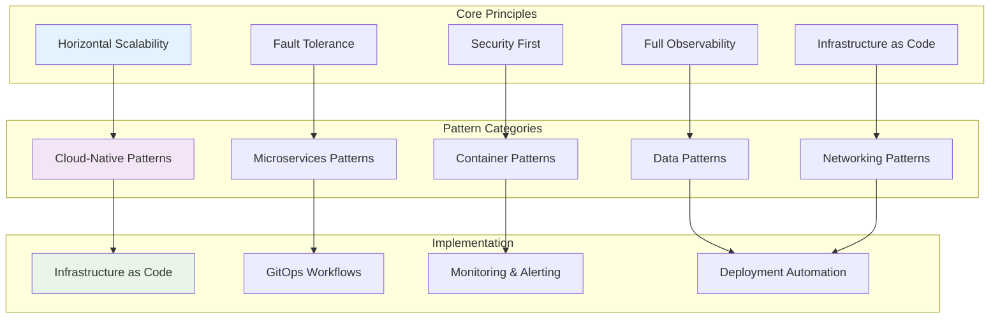
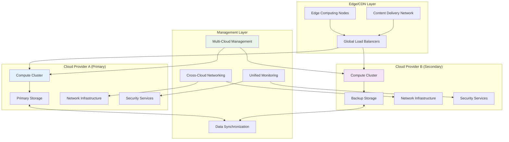
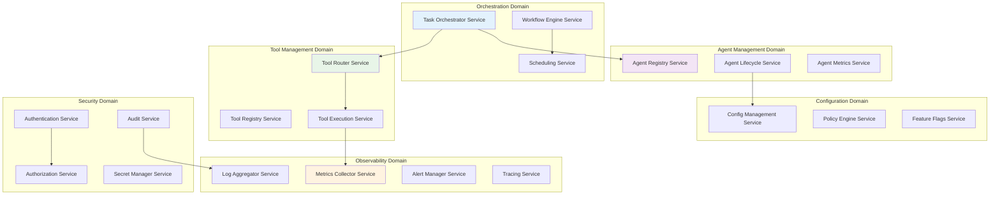
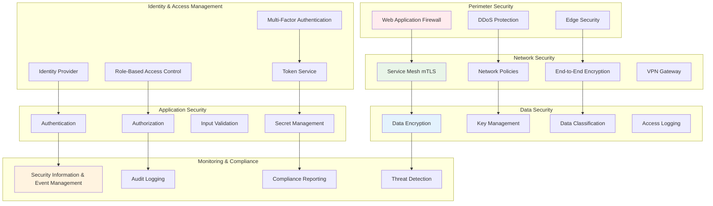

# Infrastructure Patterns

## Table of Contents

1. [Overview](#overview)
2. [Cloud-Native Infrastructure Patterns](#cloud-native-infrastructure-patterns)
3. [Microservices Architecture Patterns](#microservices-architecture-patterns)
4. [Container Orchestration Patterns](#container-orchestration-patterns)
5. [Service Mesh Patterns](#service-mesh-patterns)
6. [Data Infrastructure Patterns](#data-infrastructure-patterns)
7. [Security Infrastructure Patterns](#security-infrastructure-patterns)
8. [Observability Infrastructure Patterns](#observability-infrastructure-patterns)
9. [Resilience and Reliability Patterns](#resilience-and-reliability-patterns)
10. [Cost Optimization Patterns](#cost-optimization-patterns)

## Overview

This document outlines proven infrastructure patterns for deploying and managing the Claude ecosystem at scale. These patterns provide guidelines for building resilient, scalable, and cost-effective infrastructure that supports the complex requirements of multi-agent orchestration.

### Infrastructure Design Principles



## Cloud-Native Infrastructure Patterns

### Multi-Cloud Architecture Pattern



### Auto-Scaling Infrastructure Pattern

```yaml
# Kubernetes Horizontal Pod Autoscaler Configuration
apiVersion: autoscaling/v2
kind: HorizontalPodAutoscaler
metadata:
  name: claude-service-hpa
  namespace: claude-ecosystem
spec:
  scaleTargetRef:
    apiVersion: apps/v1
    kind: Deployment
    name: claude-service
  minReplicas: 3
  maxReplicas: 50
  metrics:
  - type: Resource
    resource:
      name: cpu
      target:
        type: Utilization
        averageUtilization: 70
  - type: Resource
    resource:
      name: memory
      target:
        type: Utilization
        averageUtilization: 80
  - type: Pods
    pods:
      metric:
        name: agent_queue_length
      target:
        type: AverageValue
        averageValue: "10"
  behavior:
    scaleUp:
      stabilizationWindowSeconds: 60
      policies:
      - type: Percent
        value: 100
        periodSeconds: 15
    scaleDown:
      stabilizationWindowSeconds: 300
      policies:
      - type: Percent
        value: 10
        periodSeconds: 60

---
# Vertical Pod Autoscaler Configuration
apiVersion: autoscaling.k8s.io/v1
kind: VerticalPodAutoscaler
metadata:
  name: claude-service-vpa
  namespace: claude-ecosystem
spec:
  targetRef:
    apiVersion: apps/v1
    kind: Deployment
    name: claude-service
  updatePolicy:
    updateMode: "Auto"
  resourcePolicy:
    containerPolicies:
    - containerName: claude-service
      minAllowed:
        cpu: 100m
        memory: 128Mi
      maxAllowed:
        cpu: 2
        memory: 4Gi
```

### Infrastructure as Code Pattern

```hcl
# Terraform configuration for Claude ecosystem infrastructure
terraform {
  required_providers {
    aws = {
      source  = "hashicorp/aws"
      version = "~> 5.0"
    }
    kubernetes = {
      source  = "hashicorp/kubernetes"
      version = "~> 2.0"
    }
  }

  backend "s3" {
    bucket = "claude-terraform-state"
    key    = "infrastructure/terraform.tfstate"
    region = "us-west-2"
  }
}

# EKS Cluster Configuration
module "eks_cluster" {
  source = "./modules/eks"

  cluster_name    = var.cluster_name
  cluster_version = var.kubernetes_version

  vpc_id     = module.networking.vpc_id
  subnet_ids = module.networking.private_subnet_ids

  node_groups = {
    general = {
      instance_types = ["m5.large", "m5.xlarge"]
      min_size       = 3
      max_size       = 20
      desired_size   = 6

      labels = {
        role = "general-compute"
      }

      taints = []
    }

    agent_workers = {
      instance_types = ["c5.2xlarge", "c5.4xlarge"]
      min_size       = 2
      max_size       = 50
      desired_size   = 5

      labels = {
        role = "agent-execution"
      }

      taints = [{
        key    = "workload-type"
        value  = "agent-execution"
        effect = "NO_SCHEDULE"
      }]
    }

    memory_intensive = {
      instance_types = ["r5.2xlarge", "r5.4xlarge"]
      min_size       = 1
      max_size       = 10
      desired_size   = 2

      labels = {
        role = "memory-intensive"
      }

      taints = [{
        key    = "workload-type"
        value  = "memory-intensive"
        effect = "NO_SCHEDULE"
      }]
    }
  }
}

# RDS Database Cluster
module "database_cluster" {
  source = "./modules/rds"

  cluster_identifier = "${var.cluster_name}-database"
  engine            = "aurora-postgresql"
  engine_version    = "13.7"

  master_username = var.db_username
  master_password = var.db_password

  vpc_id               = module.networking.vpc_id
  db_subnet_group_name = module.networking.db_subnet_group_name

  instance_class = "db.r5.large"
  instances      = 3

  backup_retention_period = 30
  backup_window          = "03:00-04:00"
  maintenance_window     = "sun:04:00-sun:05:00"

  performance_insights_enabled = true
  monitoring_interval         = 60

  tags = var.common_tags
}

# Redis Cluster for Caching
module "redis_cluster" {
  source = "./modules/elasticache"

  cluster_id         = "${var.cluster_name}-redis"
  node_type         = "cache.r6g.large"
  num_cache_nodes   = 3
  parameter_group   = "default.redis7"
  port              = 6379

  vpc_id     = module.networking.vpc_id
  subnet_ids = module.networking.cache_subnet_ids

  at_rest_encryption_enabled = true
  transit_encryption_enabled = true
  auth_token                = var.redis_auth_token

  tags = var.common_tags
}
```

## Microservices Architecture Patterns

### Domain-Driven Service Decomposition



### Service Communication Patterns

```yaml
# gRPC Service Definition for Inter-Service Communication
syntax = "proto3";

package claude.services.agent;

import "google/protobuf/timestamp.proto";
import "google/protobuf/duration.proto";

service AgentService {
  rpc CreateAgent(CreateAgentRequest) returns (CreateAgentResponse);
  rpc GetAgent(GetAgentRequest) returns (GetAgentResponse);
  rpc ListAgents(ListAgentsRequest) returns (stream ListAgentsResponse);
  rpc UpdateAgent(UpdateAgentRequest) returns (UpdateAgentResponse);
  rpc DeleteAgent(DeleteAgentRequest) returns (DeleteAgentResponse);
  rpc ExecuteAgent(stream ExecuteAgentRequest) returns (stream ExecuteAgentResponse);
}

message Agent {
  string id = 1;
  string name = 2;
  string category = 3;
  AgentStatus status = 4;
  repeated string capabilities = 5;
  map<string, string> configuration = 6;
  google.protobuf.Timestamp created_at = 7;
  google.protobuf.Timestamp updated_at = 8;
}

message ExecuteAgentRequest {
  string agent_id = 1;
  string task_id = 2;
  map<string, string> parameters = 3;
  ExecutionContext context = 4;
}

message ExecuteAgentResponse {
  string execution_id = 1;
  ExecutionStatus status = 2;
  string result = 3;
  ExecutionMetrics metrics = 4;
  repeated ExecutionEvent events = 5;
}

enum AgentStatus {
  AGENT_STATUS_UNSPECIFIED = 0;
  AGENT_STATUS_ACTIVE = 1;
  AGENT_STATUS_INACTIVE = 2;
  AGENT_STATUS_ERROR = 3;
  AGENT_STATUS_UPDATING = 4;
}
```

### Circuit Breaker Pattern Implementation

```typescript
// Circuit breaker for service-to-service communication
interface CircuitBreakerConfig {
  failureThreshold: number;
  recoveryTimeoutMs: number;
  monitoringWindowMs: number;
  volumeThreshold: number;
  errorThresholdPercentage: number;
}

class ServiceCircuitBreaker {
  private state: CircuitState = CircuitState.CLOSED;
  private failureCount: number = 0;
  private successCount: number = 0;
  private lastFailureTime: number = 0;
  private nextAttemptTime: number = 0;

  constructor(
    private serviceName: string,
    private config: CircuitBreakerConfig,
    private metricsCollector: MetricsCollector
  ) {}

  async execute<T>(operation: () => Promise<T>): Promise<T> {
    if (this.state === CircuitState.OPEN) {
      if (Date.now() < this.nextAttemptTime) {
        throw new CircuitOpenError(`Circuit breaker is open for ${this.serviceName}`);
      }
      this.state = CircuitState.HALF_OPEN;
    }

    try {
      const result = await operation();
      this.onSuccess();
      return result;
    } catch (error) {
      this.onFailure(error);
      throw error;
    }
  }

  private onSuccess(): void {
    this.failureCount = 0;
    this.successCount++;

    if (this.state === CircuitState.HALF_OPEN) {
      this.state = CircuitState.CLOSED;
      this.metricsCollector.recordCircuitBreakerStateChange(
        this.serviceName,
        CircuitState.CLOSED
      );
    }
  }

  private onFailure(error: Error): void {
    this.failureCount++;
    this.lastFailureTime = Date.now();

    if (this.shouldOpenCircuit()) {
      this.state = CircuitState.OPEN;
      this.nextAttemptTime = Date.now() + this.config.recoveryTimeoutMs;

      this.metricsCollector.recordCircuitBreakerStateChange(
        this.serviceName,
        CircuitState.OPEN
      );
    }
  }

  private shouldOpenCircuit(): boolean {
    return this.failureCount >= this.config.failureThreshold;
  }
}

// Service mesh integration with circuit breaker
class ServiceMeshClient {
  private circuitBreakers: Map<string, ServiceCircuitBreaker> = new Map();
  private httpClient: HttpClient;

  async callService<T>(
    serviceName: string,
    endpoint: string,
    request: any
  ): Promise<T> {
    const circuitBreaker = this.getOrCreateCircuitBreaker(serviceName);

    return circuitBreaker.execute(async () => {
      const response = await this.httpClient.post(
        `http://${serviceName}${endpoint}`,
        request,
        {
          timeout: 30000,
          retries: 3,
          headers: {
            'Content-Type': 'application/json',
            'X-Service-Name': 'claude-orchestrator',
            'X-Request-ID': this.generateRequestId()
          }
        }
      );

      return response.data;
    });
  }

  private getOrCreateCircuitBreaker(serviceName: string): ServiceCircuitBreaker {
    if (!this.circuitBreakers.has(serviceName)) {
      const config = this.getCircuitBreakerConfig(serviceName);
      const circuitBreaker = new ServiceCircuitBreaker(
        serviceName,
        config,
        this.metricsCollector
      );
      this.circuitBreakers.set(serviceName, circuitBreaker);
    }

    return this.circuitBreakers.get(serviceName)!;
  }
}
```

## Container Orchestration Patterns

### Multi-Environment Deployment Pattern

```yaml
# Production Deployment Configuration
apiVersion: v1
kind: Namespace
metadata:
  name: claude-ecosystem-prod
  labels:
    environment: production
    team: claude-platform

---
apiVersion: apps/v1
kind: Deployment
metadata:
  name: claude-orchestrator
  namespace: claude-ecosystem-prod
  labels:
    app: claude-orchestrator
    version: v1.2.0
    environment: production
spec:
  replicas: 5
  strategy:
    type: RollingUpdate
    rollingUpdate:
      maxUnavailable: 1
      maxSurge: 2
  selector:
    matchLabels:
      app: claude-orchestrator
  template:
    metadata:
      labels:
        app: claude-orchestrator
        version: v1.2.0
      annotations:
        prometheus.io/scrape: "true"
        prometheus.io/port: "9090"
        prometheus.io/path: "/metrics"
    spec:
      serviceAccountName: claude-orchestrator
      securityContext:
        runAsNonRoot: true
        runAsUser: 1000
        fsGroup: 2000
      containers:
      - name: claude-orchestrator
        image: claude-ecosystem/orchestrator:v1.2.0
        imagePullPolicy: Always
        ports:
        - containerPort: 8080
          name: http
        - containerPort: 9090
          name: metrics
        - containerPort: 8000
          name: grpc
        env:
        - name: ENVIRONMENT
          value: "production"
        - name: LOG_LEVEL
          value: "info"
        - name: DATABASE_URL
          valueFrom:
            secretKeyRef:
              name: database-credentials
              key: url
        - name: REDIS_URL
          valueFrom:
            configMapKeyRef:
              name: redis-config
              key: url
        resources:
          requests:
            memory: "1Gi"
            cpu: "500m"
            ephemeral-storage: "1Gi"
          limits:
            memory: "2Gi"
            cpu: "1"
            ephemeral-storage: "2Gi"
        livenessProbe:
          httpGet:
            path: /health/live
            port: 8080
          initialDelaySeconds: 30
          periodSeconds: 10
          timeoutSeconds: 5
          failureThreshold: 3
        readinessProbe:
          httpGet:
            path: /health/ready
            port: 8080
          initialDelaySeconds: 5
          periodSeconds: 5
          timeoutSeconds: 3
          failureThreshold: 2
        securityContext:
          allowPrivilegeEscalation: false
          readOnlyRootFilesystem: true
          capabilities:
            drop:
            - ALL
        volumeMounts:
        - name: tmp
          mountPath: /tmp
        - name: config
          mountPath: /app/config
          readOnly: true
      volumes:
      - name: tmp
        emptyDir: {}
      - name: config
        configMap:
          name: claude-orchestrator-config
      nodeSelector:
        node-type: general-compute
      tolerations:
      - key: "node-type"
        operator: "Equal"
        value: "general-compute"
        effect: "NoSchedule"
      affinity:
        podAntiAffinity:
          preferredDuringSchedulingIgnoredDuringExecution:
          - weight: 100
            podAffinityTerm:
              labelSelector:
                matchLabels:
                  app: claude-orchestrator
              topologyKey: kubernetes.io/hostname

---
# Horizontal Pod Autoscaler
apiVersion: autoscaling/v2
kind: HorizontalPodAutoscaler
metadata:
  name: claude-orchestrator-hpa
  namespace: claude-ecosystem-prod
spec:
  scaleTargetRef:
    apiVersion: apps/v1
    kind: Deployment
    name: claude-orchestrator
  minReplicas: 5
  maxReplicas: 20
  metrics:
  - type: Resource
    resource:
      name: cpu
      target:
        type: Utilization
        averageUtilization: 70
  - type: Resource
    resource:
      name: memory
      target:
        type: Utilization
        averageUtilization: 80

---
# Service Configuration
apiVersion: v1
kind: Service
metadata:
  name: claude-orchestrator
  namespace: claude-ecosystem-prod
  annotations:
    service.beta.kubernetes.io/aws-load-balancer-type: nlb
    service.beta.kubernetes.io/aws-load-balancer-backend-protocol: tcp
spec:
  type: LoadBalancer
  selector:
    app: claude-orchestrator
  ports:
  - name: http
    port: 80
    targetPort: 8080
    protocol: TCP
  - name: grpc
    port: 8000
    targetPort: 8000
    protocol: TCP
```

### Container Resource Management Pattern

```yaml
# Resource Quotas and Limits
apiVersion: v1
kind: ResourceQuota
metadata:
  name: claude-ecosystem-quota
  namespace: claude-ecosystem-prod
spec:
  hard:
    requests.cpu: "50"
    requests.memory: 100Gi
    requests.storage: 1Ti
    limits.cpu: "100"
    limits.memory: 200Gi
    persistentvolumeclaims: "10"
    pods: "50"
    services: "10"
    secrets: "20"
    configmaps: "20"

---
apiVersion: v1
kind: LimitRange
metadata:
  name: claude-ecosystem-limits
  namespace: claude-ecosystem-prod
spec:
  limits:
  - default:
      cpu: "1"
      memory: "2Gi"
      ephemeral-storage: "2Gi"
    defaultRequest:
      cpu: "100m"
      memory: "128Mi"
      ephemeral-storage: "1Gi"
    type: Container
  - max:
      cpu: "4"
      memory: "8Gi"
      ephemeral-storage: "10Gi"
    min:
      cpu: "50m"
      memory: "64Mi"
      ephemeral-storage: "100Mi"
    type: Container

---
# Pod Disruption Budget
apiVersion: policy/v1
kind: PodDisruptionBudget
metadata:
  name: claude-orchestrator-pdb
  namespace: claude-ecosystem-prod
spec:
  minAvailable: 3
  selector:
    matchLabels:
      app: claude-orchestrator

---
# Network Policy for Security
apiVersion: networking.k8s.io/v1
kind: NetworkPolicy
metadata:
  name: claude-orchestrator-netpol
  namespace: claude-ecosystem-prod
spec:
  podSelector:
    matchLabels:
      app: claude-orchestrator
  policyTypes:
  - Ingress
  - Egress
  ingress:
  - from:
    - namespaceSelector:
        matchLabels:
          name: istio-system
    - podSelector:
        matchLabels:
          app: claude-dashboard
    ports:
    - protocol: TCP
      port: 8080
    - protocol: TCP
      port: 8000
  egress:
  - to:
    - podSelector:
        matchLabels:
          app: claude-agent-registry
    ports:
    - protocol: TCP
      port: 8080
  - to:
    - podSelector:
        matchLabels:
          app: claude-tool-router
    ports:
    - protocol: TCP
      port: 8080
```

## Service Mesh Patterns

### Istio Service Mesh Configuration

```yaml
# Istio Gateway Configuration
apiVersion: networking.istio.io/v1alpha3
kind: Gateway
metadata:
  name: claude-ecosystem-gateway
  namespace: claude-ecosystem-prod
spec:
  selector:
    istio: ingressgateway
  servers:
  - port:
      number: 443
      name: https
      protocol: HTTPS
    tls:
      mode: SIMPLE
      credentialName: claude-ecosystem-tls
    hosts:
    - api.claude-ecosystem.com
    - dashboard.claude-ecosystem.com
  - port:
      number: 80
      name: http
      protocol: HTTP
    hosts:
    - api.claude-ecosystem.com
    - dashboard.claude-ecosystem.com
    redirect:
      httpsRedirect: true

---
# Virtual Service for Traffic Routing
apiVersion: networking.istio.io/v1alpha3
kind: VirtualService
metadata:
  name: claude-orchestrator-vs
  namespace: claude-ecosystem-prod
spec:
  hosts:
  - api.claude-ecosystem.com
  gateways:
  - claude-ecosystem-gateway
  http:
  - match:
    - uri:
        prefix: /api/v1/agents
    route:
    - destination:
        host: claude-orchestrator
        port:
          number: 8080
      weight: 90
    - destination:
        host: claude-orchestrator
        port:
          number: 8080
        subset: canary
      weight: 10
    timeout: 30s
    retries:
      attempts: 3
      perTryTimeout: 10s
      retryOn: 5xx,reset,connect-failure,refused-stream

---
# Destination Rule for Load Balancing
apiVersion: networking.istio.io/v1alpha3
kind: DestinationRule
metadata:
  name: claude-orchestrator-dr
  namespace: claude-ecosystem-prod
spec:
  host: claude-orchestrator
  trafficPolicy:
    loadBalancer:
      consistentHash:
        httpHeaderName: "X-User-ID"
    connectionPool:
      tcp:
        maxConnections: 100
      http:
        http1MaxPendingRequests: 100
        http2MaxRequests: 100
        maxRequestsPerConnection: 2
        maxRetries: 3
        h2UpgradePolicy: UPGRADE
    circuitBreaker:
      consecutiveErrors: 5
      interval: 30s
      baseEjectionTime: 30s
      maxEjectionPercent: 50
      minHealthPercent: 50
  subsets:
  - name: stable
    labels:
      version: v1.2.0
  - name: canary
    labels:
      version: v1.3.0-rc1

---
# Security Policy
apiVersion: security.istio.io/v1beta1
kind: PeerAuthentication
metadata:
  name: claude-ecosystem-peerauth
  namespace: claude-ecosystem-prod
spec:
  mtls:
    mode: STRICT

---
apiVersion: security.istio.io/v1beta1
kind: AuthorizationPolicy
metadata:
  name: claude-orchestrator-authz
  namespace: claude-ecosystem-prod
spec:
  selector:
    matchLabels:
      app: claude-orchestrator
  rules:
  - from:
    - source:
        principals: ["cluster.local/ns/claude-ecosystem-prod/sa/claude-dashboard"]
    - source:
        principals: ["cluster.local/ns/istio-system/sa/istio-ingressgateway-service-account"]
    to:
    - operation:
        methods: ["GET", "POST", "PUT", "DELETE"]
        paths: ["/api/v1/*"]
```

### Traffic Management Patterns

```yaml
# Canary Deployment with Istio
apiVersion: argoproj.io/v1alpha1
kind: Rollout
metadata:
  name: claude-orchestrator-rollout
  namespace: claude-ecosystem-prod
spec:
  replicas: 10
  strategy:
    canary:
      canaryService: claude-orchestrator-canary
      stableService: claude-orchestrator-stable
      trafficRouting:
        istio:
          virtualService:
            name: claude-orchestrator-vs
            routes:
            - primary
          destinationRule:
            name: claude-orchestrator-dr
            canarySubsetName: canary
            stableSubsetName: stable
      steps:
      - setWeight: 10
      - pause:
          duration: 2m
      - analysis:
          templates:
          - templateName: success-rate
          args:
          - name: service-name
            value: claude-orchestrator-canary
      - setWeight: 20
      - pause:
          duration: 5m
      - analysis:
          templates:
          - templateName: success-rate
          - templateName: latency
          args:
          - name: service-name
            value: claude-orchestrator-canary
      - setWeight: 50
      - pause:
          duration: 10m
      - setWeight: 100
      - pause:
          duration: 2m
  selector:
    matchLabels:
      app: claude-orchestrator
  template:
    metadata:
      labels:
        app: claude-orchestrator
    spec:
      containers:
      - name: claude-orchestrator
        image: claude-ecosystem/orchestrator:v1.3.0
        ports:
        - containerPort: 8080

---
# Analysis Template for Canary Validation
apiVersion: argoproj.io/v1alpha1
kind: AnalysisTemplate
metadata:
  name: success-rate
  namespace: claude-ecosystem-prod
spec:
  args:
  - name: service-name
  metrics:
  - name: success-rate
    interval: 1m
    count: 5
    successCondition: result[0] >= 0.95
    failureLimit: 2
    provider:
      prometheus:
        address: http://prometheus:9090
        query: |
          sum(irate(
            istio_requests_total{reporter="destination",destination_service_name="{{args.service-name}}",response_code!~"5.*"}[1m]
          )) /
          sum(irate(
            istio_requests_total{reporter="destination",destination_service_name="{{args.service-name}}"}[1m]
          ))
```

## Data Infrastructure Patterns

### Multi-Tier Data Storage Pattern

```yaml
# PostgreSQL Primary-Replica Configuration
apiVersion: postgresql.cnpg.io/v1
kind: Cluster
metadata:
  name: claude-postgres-cluster
  namespace: claude-ecosystem-prod
spec:
  instances: 3
  primaryUpdateStrategy: unsupervised

  postgresql:
    parameters:
      max_connections: "200"
      shared_buffers: "256MB"
      effective_cache_size: "1GB"
      maintenance_work_mem: "64MB"
      checkpoint_completion_target: "0.9"
      wal_buffers: "16MB"
      default_statistics_target: "100"
      random_page_cost: "1.1"
      effective_io_concurrency: "200"
      work_mem: "4MB"
      min_wal_size: "1GB"
      max_wal_size: "4GB"

  bootstrap:
    initdb:
      database: claude_ecosystem
      owner: claude_user
      secret:
        name: postgres-credentials

  storage:
    size: 100Gi
    storageClass: fast-ssd

  resources:
    requests:
      memory: "2Gi"
      cpu: "1"
    limits:
      memory: "4Gi"
      cpu: "2"

  monitoring:
    enabled: true

  backup:
    retentionPolicy: "30d"
    barmanObjectStore:
      destinationPath: "s3://claude-backups/postgres"
      s3Credentials:
        accessKeyId:
          name: s3-credentials
          key: ACCESS_KEY_ID
        secretAccessKey:
          name: s3-credentials
          key: SECRET_ACCESS_KEY
      wal:
        retention: "7d"

---
# Redis Cluster Configuration
apiVersion: v1
kind: ConfigMap
metadata:
  name: redis-cluster-config
  namespace: claude-ecosystem-prod
data:
  redis.conf: |
    cluster-enabled yes
    cluster-config-file nodes.conf
    cluster-node-timeout 5000
    appendonly yes
    appendfsync everysec
    maxmemory 1gb
    maxmemory-policy allkeys-lru

---
apiVersion: apps/v1
kind: StatefulSet
metadata:
  name: redis-cluster
  namespace: claude-ecosystem-prod
spec:
  serviceName: redis-cluster
  replicas: 6
  selector:
    matchLabels:
      app: redis-cluster
  template:
    metadata:
      labels:
        app: redis-cluster
    spec:
      containers:
      - name: redis
        image: redis:7-alpine
        ports:
        - containerPort: 6379
          name: client
        - containerPort: 16379
          name: gossip
        command:
        - redis-server
        - /etc/redis/redis.conf
        volumeMounts:
        - name: config
          mountPath: /etc/redis
        - name: data
          mountPath: /data
        resources:
          requests:
            memory: "512Mi"
            cpu: "250m"
          limits:
            memory: "1Gi"
            cpu: "500m"
      volumes:
      - name: config
        configMap:
          name: redis-cluster-config
  volumeClaimTemplates:
  - metadata:
      name: data
    spec:
      accessModes: ["ReadWriteOnce"]
      storageClassName: fast-ssd
      resources:
        requests:
          storage: 10Gi
```

### Data Pipeline Infrastructure

```yaml
# Apache Kafka for Event Streaming
apiVersion: kafka.strimzi.io/v1beta2
kind: Kafka
metadata:
  name: claude-kafka-cluster
  namespace: claude-ecosystem-prod
spec:
  kafka:
    version: 3.4.0
    replicas: 3
    listeners:
    - name: plain
      port: 9092
      type: internal
      tls: false
    - name: tls
      port: 9093
      type: internal
      tls: true
    - name: external
      port: 9094
      type: nodeport
      tls: true
    config:
      offsets.topic.replication.factor: 3
      transaction.state.log.replication.factor: 3
      transaction.state.log.min.isr: 2
      default.replication.factor: 3
      min.insync.replicas: 2
      inter.broker.protocol.version: "3.4"
      log.retention.hours: 168
      log.segment.bytes: 1073741824
      log.retention.check.interval.ms: 300000
      num.network.threads: 3
      num.io.threads: 8
      socket.send.buffer.bytes: 102400
      socket.receive.buffer.bytes: 102400
      socket.request.max.bytes: 104857600
    storage:
      type: persistent-claim
      size: 100Gi
      class: fast-ssd
    resources:
      requests:
        memory: 2Gi
        cpu: 1
      limits:
        memory: 4Gi
        cpu: 2
  zookeeper:
    replicas: 3
    storage:
      type: persistent-claim
      size: 10Gi
      class: fast-ssd
    resources:
      requests:
        memory: 1Gi
        cpu: 500m
      limits:
        memory: 2Gi
        cpu: 1
  entityOperator:
    topicOperator: {}
    userOperator: {}

---
# InfluxDB for Time Series Data
apiVersion: apps/v1
kind: StatefulSet
metadata:
  name: influxdb
  namespace: claude-ecosystem-prod
spec:
  serviceName: influxdb
  replicas: 1
  selector:
    matchLabels:
      app: influxdb
  template:
    metadata:
      labels:
        app: influxdb
    spec:
      containers:
      - name: influxdb
        image: influxdb:2.6-alpine
        ports:
        - containerPort: 8086
        env:
        - name: DOCKER_INFLUXDB_INIT_MODE
          value: setup
        - name: DOCKER_INFLUXDB_INIT_USERNAME
          valueFrom:
            secretKeyRef:
              name: influxdb-credentials
              key: username
        - name: DOCKER_INFLUXDB_INIT_PASSWORD
          valueFrom:
            secretKeyRef:
              name: influxdb-credentials
              key: password
        - name: DOCKER_INFLUXDB_INIT_ORG
          value: claude-ecosystem
        - name: DOCKER_INFLUXDB_INIT_BUCKET
          value: metrics
        volumeMounts:
        - name: data
          mountPath: /var/lib/influxdb2
        resources:
          requests:
            memory: "1Gi"
            cpu: "500m"
          limits:
            memory: "2Gi"
            cpu: "1"
  volumeClaimTemplates:
  - metadata:
      name: data
    spec:
      accessModes: ["ReadWriteOnce"]
      storageClassName: fast-ssd
      resources:
        requests:
          storage: 50Gi
```

## Security Infrastructure Patterns

### Zero Trust Network Architecture



### Security Policy as Code

```yaml
# Open Policy Agent Gatekeeper Policies
apiVersion: templates.gatekeeper.sh/v1beta1
kind: ConstraintTemplate
metadata:
  name: claudesecuritystandards
spec:
  crd:
    spec:
      names:
        kind: ClaudeSecurityStandards
      validation:
        type: object
        properties:
          requiredLabels:
            type: array
            items:
              type: string
          allowedRepositories:
            type: array
            items:
              type: string
  targets:
    - target: admission.k8s.gatekeeper.sh
      rego: |
        package claudesecuritystandards

        violation[{"msg": msg}] {
          # Security context must be defined
          not input.review.object.spec.template.spec.securityContext
          msg := "Security context must be defined"
        }

        violation[{"msg": msg}] {
          # Containers must not run as root
          container := input.review.object.spec.template.spec.containers[_]
          container.securityContext.runAsUser == 0
          msg := sprintf("Container %v must not run as root", [container.name])
        }

        violation[{"msg": msg}] {
          # Images must come from approved repositories
          container := input.review.object.spec.template.spec.containers[_]
          not startswith(container.image, input.parameters.allowedRepositories[_])
          msg := sprintf("Container %v uses unapproved image repository", [container.name])
        }

        violation[{"msg": msg}] {
          # Resource limits must be defined
          container := input.review.object.spec.template.spec.containers[_]
          not container.resources.limits
          msg := sprintf("Container %v must have resource limits defined", [container.name])
        }

---
apiVersion: constraints.gatekeeper.sh/v1beta1
kind: ClaudeSecurityStandards
metadata:
  name: claude-security-policy
spec:
  match:
    kinds:
    - apiGroups: ["apps"]
      kinds: ["Deployment", "StatefulSet", "DaemonSet"]
    namespaces: ["claude-ecosystem-prod", "claude-ecosystem-staging"]
  parameters:
    allowedRepositories:
    - "claude-ecosystem/"
    - "gcr.io/distroless/"
    - "docker.io/library/"
    requiredLabels:
    - "app"
    - "version"
    - "environment"

---
# Falco Security Rules
apiVersion: v1
kind: ConfigMap
metadata:
  name: falco-rules
  namespace: falco-system
data:
  claude_rules.yaml: |
    - rule: Claude Unauthorized Process Execution
      desc: Detect unauthorized processes in Claude containers
      condition: >
        spawned_process and
        container and
        k8s.ns.name in (claude-ecosystem-prod, claude-ecosystem-staging) and
        not proc.name in (node, python, sh, bash, curl, wget)
      output: >
        Unauthorized process execution in Claude container
        (user=%user.name command=%proc.cmdline container=%container.name image=%container.image)
      priority: WARNING
      tags: [claude, process, security]

    - rule: Claude Sensitive File Access
      desc: Detect access to sensitive files in Claude containers
      condition: >
        open_read and
        container and
        k8s.ns.name in (claude-ecosystem-prod, claude-ecosystem-staging) and
        (fd.name startswith /etc/passwd or
         fd.name startswith /etc/shadow or
         fd.name startswith /root/.ssh)
      output: >
        Sensitive file access in Claude container
        (file=%fd.name container=%container.name image=%container.image)
      priority: CRITICAL
      tags: [claude, file, security]
```

## Observability Infrastructure Patterns

### Comprehensive Monitoring Stack

```yaml
# Prometheus Configuration
apiVersion: monitoring.coreos.com/v1
kind: Prometheus
metadata:
  name: claude-prometheus
  namespace: monitoring
spec:
  replicas: 2
  retention: 30d
  storage:
    volumeClaimTemplate:
      spec:
        storageClassName: fast-ssd
        resources:
          requests:
            storage: 100Gi
  resources:
    requests:
      memory: 2Gi
      cpu: 1
    limits:
      memory: 4Gi
      cpu: 2
  ruleSelector:
    matchLabels:
      prometheus: claude
  serviceMonitorSelector:
    matchLabels:
      prometheus: claude
  alerting:
    alertmanagers:
    - name: alertmanager
      namespace: monitoring
      port: web

---
# ServiceMonitor for Claude Services
apiVersion: monitoring.coreos.com/v1
kind: ServiceMonitor
metadata:
  name: claude-orchestrator
  namespace: claude-ecosystem-prod
  labels:
    prometheus: claude
spec:
  selector:
    matchLabels:
      app: claude-orchestrator
  endpoints:
  - port: metrics
    interval: 15s
    path: /metrics

---
# Grafana Dashboard Configuration
apiVersion: v1
kind: ConfigMap
metadata:
  name: claude-dashboard-config
  namespace: monitoring
data:
  claude-overview.json: |
    {
      "dashboard": {
        "id": null,
        "title": "Claude Ecosystem Overview",
        "tags": ["claude", "ecosystem"],
        "timezone": "UTC",
        "panels": [
          {
            "id": 1,
            "title": "Agent Execution Rate",
            "type": "stat",
            "targets": [
              {
                "expr": "sum(rate(claude_agent_executions_total[5m]))",
                "legendFormat": "Executions/sec"
              }
            ]
          },
          {
            "id": 2,
            "title": "System Resource Usage",
            "type": "graph",
            "targets": [
              {
                "expr": "sum(rate(container_cpu_usage_seconds_total{namespace=\"claude-ecosystem-prod\"}[5m]))",
                "legendFormat": "CPU Usage"
              },
              {
                "expr": "sum(container_memory_usage_bytes{namespace=\"claude-ecosystem-prod\"}) / 1024^3",
                "legendFormat": "Memory Usage (GB)"
              }
            ]
          }
        ]
      }
    }

---
# Jaeger for Distributed Tracing
apiVersion: jaegertracing.io/v1
kind: Jaeger
metadata:
  name: claude-jaeger
  namespace: monitoring
spec:
  strategy: production
  storage:
    type: elasticsearch
    elasticsearch:
      nodeCount: 3
      storage:
        size: 100Gi
        storageClassName: fast-ssd
      resources:
        requests:
          memory: 2Gi
          cpu: 1
        limits:
          memory: 4Gi
          cpu: 2
  collector:
    resources:
      requests:
        memory: 512Mi
        cpu: 250m
      limits:
        memory: 1Gi
        cpu: 500m
  query:
    resources:
      requests:
        memory: 256Mi
        cpu: 250m
      limits:
        memory: 512Mi
        cpu: 500m
```

## Resilience and Reliability Patterns

### Chaos Engineering Infrastructure

```yaml
# Chaos Monkey Deployment
apiVersion: apps/v1
kind: Deployment
metadata:
  name: chaos-monkey
  namespace: chaos-engineering
spec:
  replicas: 1
  selector:
    matchLabels:
      app: chaos-monkey
  template:
    metadata:
      labels:
        app: chaos-monkey
    spec:
      serviceAccountName: chaos-monkey
      containers:
      - name: chaos-monkey
        image: quay.io/linki/chaoskube:v0.21.0
        args:
        - --interval=10m
        - --dry-run=false
        - --timezone=UTC
        - --exclude-days-of-year=Jan1,Dec25
        - --exclude-weekdays=Sat,Sun
        - --exclude-times-of-day=22:00-08:00
        - --annotation-selector=chaos.alpha.kubernetes.io/enabled=true
        - --log-level=info
        resources:
          requests:
            memory: 32Mi
            cpu: 10m
          limits:
            memory: 64Mi
            cpu: 20m

---
# Litmus Chaos Experiment
apiVersion: litmuschaos.io/v1alpha1
kind: ChaosExperiment
metadata:
  name: pod-delete
  namespace: claude-ecosystem-prod
spec:
  definition:
    scope: Namespaced
    permissions:
    - apiGroups: [""]
      resources: ["pods"]
      verbs: ["create", "delete", "get", "list", "patch", "update", "deletecollection"]
    image: litmuschaos/go-runner:latest
    args:
    - -c
    - ./experiments -name pod-delete
    command:
    - /bin/bash
    env:
    - name: TOTAL_CHAOS_DURATION
      value: '15'
    - name: CHAOS_INTERVAL
      value: '5'
    - name: FORCE
      value: 'false'
    labels:
      name: pod-delete
      app.kubernetes.io/part-of: litmus
      app.kubernetes.io/component: chaosexperiment
      app.kubernetes.io/version: latest

---
# Backup and Disaster Recovery
apiVersion: velero.io/v1
kind: Schedule
metadata:
  name: claude-ecosystem-backup
  namespace: velero
spec:
  schedule: "0 2 * * *"  # Daily at 2 AM
  template:
    includedNamespaces:
    - claude-ecosystem-prod
    - monitoring
    excludedResources:
    - events
    - events.events.k8s.io
    storageLocation: default
    volumeSnapshotLocations:
    - default
    ttl: 720h0m0s  # 30 days
    hooks:
      resources:
      - name: postgres-backup-hook
        includedNamespaces:
        - claude-ecosystem-prod
        includedResources:
        - pods
        labelSelector:
          matchLabels:
            app: postgres
        pre:
        - exec:
            container: postgres
            command:
            - /bin/bash
            - -c
            - 'pg_dump -U $POSTGRES_USER $POSTGRES_DB > /tmp/backup.sql'
        post:
        - exec:
            container: postgres
            command:
            - /bin/bash
            - -c
            - 'rm -f /tmp/backup.sql'
```

## Cost Optimization Patterns

### Resource Optimization Strategy

```yaml
# Vertical Pod Autoscaler for Cost Optimization
apiVersion: autoscaling.k8s.io/v1
kind: VerticalPodAutoscaler
metadata:
  name: claude-orchestrator-vpa
  namespace: claude-ecosystem-prod
spec:
  targetRef:
    apiVersion: apps/v1
    kind: Deployment
    name: claude-orchestrator
  updatePolicy:
    updateMode: "Auto"
  resourcePolicy:
    containerPolicies:
    - containerName: claude-orchestrator
      minAllowed:
        cpu: 100m
        memory: 128Mi
      maxAllowed:
        cpu: 2
        memory: 4Gi
      controlledResources: ["cpu", "memory"]
      controlledValues: RequestsAndLimits

---
# Cluster Autoscaler Configuration
apiVersion: apps/v1
kind: Deployment
metadata:
  name: cluster-autoscaler
  namespace: kube-system
spec:
  replicas: 1
  selector:
    matchLabels:
      app: cluster-autoscaler
  template:
    metadata:
      labels:
        app: cluster-autoscaler
    spec:
      containers:
      - image: k8s.gcr.io/autoscaling/cluster-autoscaler:v1.25.0
        name: cluster-autoscaler
        command:
        - ./cluster-autoscaler
        - --v=4
        - --stderrthreshold=info
        - --cloud-provider=aws
        - --skip-nodes-with-local-storage=false
        - --expander=least-waste
        - --node-group-auto-discovery=asg:tag=k8s.io/cluster-autoscaler/enabled,k8s.io/cluster-autoscaler/claude-cluster
        - --balance-similar-node-groups
        - --skip-nodes-with-system-pods=false
        - --scale-down-delay-after-add=10m
        - --scale-down-unneeded-time=10m
        - --scale-down-delay-after-delete=10s
        - --scale-down-delay-after-failure=3m
        resources:
          limits:
            cpu: 100m
            memory: 300Mi
          requests:
            cpu: 100m
            memory: 300Mi

---
# Spot Instance Node Pool Configuration
apiVersion: kops.k8s.io/v1alpha2
kind: InstanceGroup
metadata:
  name: spot-nodes
  labels:
    kops.k8s.io/cluster: claude-cluster.k8s.local
spec:
  image: 099720109477/ubuntu/images/hvm-ssd/ubuntu-focal-20.04-amd64-server-20220420
  machineType: m5.large
  maxSize: 20
  minSize: 1
  nodeLabels:
    kops.k8s.io/instancegroup: spot-nodes
    node-type: spot
  role: Node
  spotDurationInMinutes: 60
  spotPrice: "0.05"
  subnets:
  - us-west-2a
  - us-west-2b
  - us-west-2c
  taints:
  - key: spot-instance
    value: "true"
    effect: NoSchedule

---
# Pod Priority and Preemption
apiVersion: scheduling.k8s.io/v1
kind: PriorityClass
metadata:
  name: high-priority
value: 1000
globalDefault: false
description: "High priority class for critical Claude services"

---
apiVersion: scheduling.k8s.io/v1
kind: PriorityClass
metadata:
  name: low-priority
value: 100
globalDefault: false
description: "Low priority class for batch jobs and development workloads"
```

## Summary

These infrastructure patterns provide a comprehensive foundation for deploying and managing the Claude ecosystem at scale. The patterns address:

### Key Infrastructure Areas

1. **Cloud-Native Architecture**: Multi-cloud, auto-scaling, and Infrastructure as Code approaches
2. **Microservices Patterns**: Service decomposition, communication, and resilience patterns
3. **Container Orchestration**: Kubernetes deployment, resource management, and security
4. **Service Mesh**: Traffic management, security, and observability with Istio
5. **Data Infrastructure**: Multi-tier storage, streaming, and analytics platforms
6. **Security Patterns**: Zero trust, policy as code, and comprehensive monitoring
7. **Observability**: Monitoring, logging, tracing, and alerting infrastructure
8. **Resilience**: Chaos engineering, backup, and disaster recovery strategies
9. **Cost Optimization**: Resource optimization, spot instances, and priority scheduling

### Implementation Principles

- **Infrastructure as Code**: All infrastructure defined and managed through code
- **GitOps Workflows**: Version-controlled deployment and configuration management
- **Security First**: Zero trust architecture with comprehensive security controls
- **Observability Built-in**: Comprehensive monitoring, logging, and tracing
- **Cost Optimization**: Resource efficiency and spot instance utilization
- **Resilience by Design**: Fault tolerance and disaster recovery capabilities

These patterns ensure the Claude ecosystem can scale efficiently, maintain high availability, and operate securely across diverse infrastructure environments.