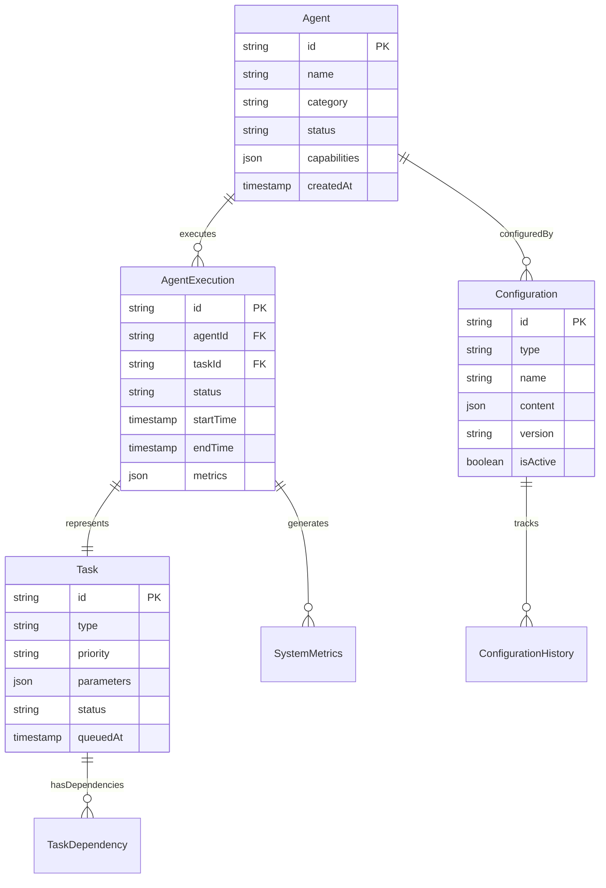

# MCP Dashboard Service Architecture

## Table of Contents

1. [Executive Summary](#executive-summary)
2. [Service Overview](#service-overview)
3. [Architecture Components](#architecture-components)
4. [Data Models](#data-models)
5. [API Specifications](#api-specifications)
6. [Security Architecture](#security-architecture)
7. [Performance Considerations](#performance-considerations)
8. [Deployment Configuration](#deployment-configuration)
9. [Integration Patterns](#integration-patterns)
10. [Monitoring and Observability](#monitoring-and-observability)

## Executive Summary

The MCP Dashboard Service provides real-time visualization and management capabilities for the Claude Code CLI ecosystem. Built as a microservice architecture, it enables monitoring of agent execution, system performance, and configuration management through a modern web interface.

### Key Features

- **Real-time Agent Monitoring**: Live tracking of agent execution and status
- **Performance Analytics**: Comprehensive metrics and performance insights
- **Configuration Management**: Visual configuration editing and validation
- **System Health Dashboard**: Overview of ecosystem health and resource usage
- **Audit Trail**: Complete activity logging and historical analysis

## Service Overview

### High-Level Architecture


### Service Boundaries

| Component | Responsibility | Dependencies | Interfaces |
|-----------|----------------|--------------|------------|
| **Dashboard UI** | User interface and visualization | REST API, WebSocket | HTTP, WebSocket |
| **API Server** | HTTP endpoints and authentication | Business Logic | REST/JSON |
| **WebSocket Server** | Real-time updates | Business Logic | WebSocket |
| **Business Logic** | Core processing and orchestration | Data Layer | Internal APIs |
| **Cache Layer** | Performance optimization | Redis | Key-Value |
| **Data Layer** | Persistent storage | PostgreSQL, InfluxDB | SQL, InfluxQL |

## Architecture Components

### Frontend Architecture


#### Component Structure

- **Layout Components**: Navigation, headers, sidebars
- **Dashboard Components**: Metrics visualization, status displays
- **Agent Components**: Agent status, execution logs, configuration
- **Configuration Components**: Settings management, validation
- **Monitoring Components**: Performance charts, system health

### Backend Service Architecture


#### Service Layer Responsibilities

1. **Agent Service**
   - Agent lifecycle management
   - Execution monitoring
   - Status tracking
   - Performance metrics

2. **Config Service**
   - Configuration validation
   - Template management
   - Deployment coordination
   - Version control

3. **Metrics Service**
   - Performance data collection
   - Analytics processing
   - Report generation
   - Alerting logic

4. **Notification Service**
   - Real-time updates
   - WebSocket management
   - Event distribution
   - Alert delivery

## Data Models

### Core Entities

```typescript
interface Agent {
  id: string;
  name: string;
  category: AgentCategory;
  status: AgentStatus;
  version: string;
  capabilities: string[];
  configuration: AgentConfig;
  createdAt: Date;
  updatedAt: Date;
}

interface AgentExecution {
  id: string;
  agentId: string;
  taskId: string;
  status: ExecutionStatus;
  startTime: Date;
  endTime?: Date;
  duration?: number;
  input: ExecutionInput;
  output?: ExecutionOutput;
  error?: ExecutionError;
  metrics: ExecutionMetrics;
}

interface SystemMetrics {
  timestamp: Date;
  cpuUsage: number;
  memoryUsage: number;
  diskUsage: number;
  activeAgents: number;
  queuedTasks: number;
  executionRate: number;
}

interface Configuration {
  id: string;
  type: ConfigurationType;
  name: string;
  content: object;
  version: string;
  environment: string;
  isActive: boolean;
  validatedAt?: Date;
  deployedAt?: Date;
}
```

### Relationship Mappings



## API Specifications

### REST API Endpoints

#### Agent Management

```http
GET    /api/v1/agents              # List all agents
GET    /api/v1/agents/{id}         # Get agent details
POST   /api/v1/agents              # Create new agent
PUT    /api/v1/agents/{id}         # Update agent
DELETE /api/v1/agents/{id}         # Delete agent

GET    /api/v1/agents/{id}/executions  # Agent execution history
POST   /api/v1/agents/{id}/execute     # Execute agent task
GET    /api/v1/agents/{id}/metrics     # Agent performance metrics
```

#### Configuration Management

```http
GET    /api/v1/configurations       # List configurations
GET    /api/v1/configurations/{id}  # Get configuration
POST   /api/v1/configurations       # Create configuration
PUT    /api/v1/configurations/{id}  # Update configuration
DELETE /api/v1/configurations/{id}  # Delete configuration

POST   /api/v1/configurations/{id}/validate  # Validate configuration
POST   /api/v1/configurations/{id}/deploy    # Deploy configuration
GET    /api/v1/configurations/{id}/history   # Configuration history
```

#### System Monitoring

```http
GET    /api/v1/system/status        # System health status
GET    /api/v1/system/metrics       # Current system metrics
GET    /api/v1/system/metrics/history # Historical metrics
GET    /api/v1/system/alerts        # Active alerts

GET    /api/v1/dashboard/overview   # Dashboard data summary
GET    /api/v1/dashboard/agents     # Agent dashboard data
GET    /api/v1/dashboard/performance # Performance dashboard data
```

### WebSocket Events

#### Real-time Updates

```typescript
// Client -> Server Events
interface ClientEvents {
  'subscribe': {
    channels: string[];
  };
  'unsubscribe': {
    channels: string[];
  };
  'agent:execute': {
    agentId: string;
    task: TaskDefinition;
  };
}

// Server -> Client Events
interface ServerEvents {
  'agent:status_change': {
    agentId: string;
    status: AgentStatus;
    timestamp: Date;
  };
  'execution:started': {
    executionId: string;
    agentId: string;
    timestamp: Date;
  };
  'execution:completed': {
    executionId: string;
    result: ExecutionResult;
    metrics: ExecutionMetrics;
  };
  'system:metrics_update': {
    metrics: SystemMetrics;
  };
  'configuration:deployed': {
    configId: string;
    environment: string;
    timestamp: Date;
  };
}
```

### API Response Formats

#### Standard Response Structure

```typescript
interface APIResponse<T> {
  success: boolean;
  data?: T;
  error?: {
    code: string;
    message: string;
    details?: object;
  };
  metadata?: {
    timestamp: Date;
    requestId: string;
    version: string;
  };
  pagination?: {
    page: number;
    pageSize: number;
    total: number;
    hasMore: boolean;
  };
}
```

## Security Architecture

### Authentication and Authorization


#### Security Features

1. **Authentication Methods**
   - JWT-based token authentication
   - OAuth 2.0 integration support
   - API key authentication for service-to-service
   - Session management with secure cookies

2. **Authorization Levels**
   - **Admin**: Full system access, configuration management
   - **Operator**: Agent management, monitoring access
   - **Viewer**: Read-only dashboard access
   - **Service**: Programmatic API access

3. **Security Controls**
   - Input validation and sanitization
   - Rate limiting and throttling
   - CORS configuration
   - HTTPS enforcement
   - Audit logging

### Data Protection


## Performance Considerations

### Scalability Design


### Performance Optimization Strategies

1. **Caching Strategy**
   - Redis for application-level caching
   - Browser caching for static assets
   - API response caching with TTL
   - Database query result caching

2. **Database Optimization**
   - Read replicas for query distribution
   - Connection pooling
   - Query optimization and indexing
   - Partition strategies for large datasets

3. **Frontend Optimization**
   - Code splitting and lazy loading
   - Bundle optimization
   - Image optimization and WebP support
   - Service worker for offline functionality

4. **Real-time Performance**
   - WebSocket connection pooling
   - Event batching and throttling
   - Selective data updates
   - Client-side data normalization

## Deployment Configuration

### Container Architecture

```dockerfile
# Multi-stage build for production optimization
FROM node:18-alpine AS builder

WORKDIR /app
COPY package*.json ./
RUN npm ci --only=production

COPY . .
RUN npm run build

FROM node:18-alpine AS runtime

RUN addgroup -g 1001 -S nodejs
RUN adduser -S dashboard -u 1001

WORKDIR /app

COPY --from=builder --chown=dashboard:nodejs /app/dist ./dist
COPY --from=builder --chown=dashboard:nodejs /app/node_modules ./node_modules
COPY --from=builder --chown=dashboard:nodejs /app/package.json ./package.json

USER dashboard

EXPOSE 3000

HEALTHCHECK --interval=30s --timeout=10s --start-period=5s --retries=3 \
  CMD curl -f http://localhost:3000/health || exit 1

CMD ["node", "dist/server.js"]
```

### Kubernetes Deployment

```yaml
apiVersion: apps/v1
kind: Deployment
metadata:
  name: mcp-dashboard-service
  namespace: claude-ecosystem
  labels:
    app: mcp-dashboard-service
    version: v1.0.0
spec:
  replicas: 3
  strategy:
    type: RollingUpdate
    rollingUpdate:
      maxUnavailable: 1
      maxSurge: 1
  selector:
    matchLabels:
      app: mcp-dashboard-service
  template:
    metadata:
      labels:
        app: mcp-dashboard-service
        version: v1.0.0
    spec:
      securityContext:
        runAsNonRoot: true
        runAsUser: 1001
        fsGroup: 2000
      containers:
      - name: dashboard
        image: claude-ecosystem/mcp-dashboard:v1.0.0
        imagePullPolicy: Always
        ports:
        - containerPort: 3000
          name: http
        - containerPort: 3001
          name: websocket
        env:
        - name: NODE_ENV
          value: "production"
        - name: DATABASE_URL
          valueFrom:
            secretKeyRef:
              name: database-credentials
              key: url
        - name: REDIS_URL
          valueFrom:
            configMapKeyRef:
              name: redis-config
              key: url
        resources:
          requests:
            memory: "256Mi"
            cpu: "250m"
          limits:
            memory: "512Mi"
            cpu: "500m"
        livenessProbe:
          httpGet:
            path: /health
            port: 3000
          initialDelaySeconds: 30
          periodSeconds: 10
        readinessProbe:
          httpGet:
            path: /ready
            port: 3000
          initialDelaySeconds: 5
          periodSeconds: 5
        securityContext:
          allowPrivilegeEscalation: false
          readOnlyRootFilesystem: true
          capabilities:
            drop:
            - ALL
```

### Environment Configuration

```yaml
# Production Configuration
production:
  server:
    port: 3000
    host: "0.0.0.0"
    cors:
      origin: ["https://dashboard.claude-ecosystem.com"]
      credentials: true

  database:
    host: "${DATABASE_HOST}"
    port: 5432
    database: "mcp_dashboard"
    username: "${DATABASE_USERNAME}"
    password: "${DATABASE_PASSWORD}"
    ssl: true
    pool:
      min: 5
      max: 20
      acquireTimeoutMillis: 60000

  redis:
    host: "${REDIS_HOST}"
    port: 6379
    password: "${REDIS_PASSWORD}"
    tls: true
    retryDelayOnFailover: 100
    maxRetriesPerRequest: 3

  security:
    jwt:
      secret: "${JWT_SECRET}"
      expiresIn: "24h"
    rateLimit:
      windowMs: 900000  # 15 minutes
      max: 100          # requests per window

  monitoring:
    metrics:
      enabled: true
      interval: 30000   # 30 seconds
    alerts:
      enabled: true
      thresholds:
        cpu: 80
        memory: 85
        errorRate: 5
```

## Integration Patterns

### MCP Server Integration


#### Integration Workflow

1. **Service Discovery**
   - Automatic MCP server registration
   - Health check monitoring
   - Service capability advertisement
   - Dynamic routing configuration

2. **Message Handling**
   - Asynchronous message processing
   - Request/response correlation
   - Error handling and retry logic
   - Message queuing for reliability

3. **Resource Management**
   - Resource lifecycle tracking
   - Permission-based access control
   - Resource state synchronization
   - Conflict resolution strategies

### External System Integration

```typescript
// Integration Interface
interface ExternalIntegration {
  name: string;
  type: IntegrationType;
  configuration: IntegrationConfig;
  healthCheck(): Promise<HealthStatus>;
  syncData(): Promise<SyncResult>;
  handleEvent(event: ExternalEvent): Promise<void>;
}

// Implementation Example
class ClaudeAPIIntegration implements ExternalIntegration {
  name = 'claude-api';
  type = IntegrationType.REST_API;

  async healthCheck(): Promise<HealthStatus> {
    // Implementation for health monitoring
  }

  async syncData(): Promise<SyncResult> {
    // Implementation for data synchronization
  }

  async handleEvent(event: ExternalEvent): Promise<void> {
    // Implementation for event handling
  }
}
```

## Monitoring and Observability

### Metrics Collection


### Key Performance Indicators

#### Service Level Indicators (SLIs)

```yaml
availability_sli:
  description: "Percentage of successful HTTP requests"
  query: "sum(rate(http_requests_total{status!~'5..'}[5m])) / sum(rate(http_requests_total[5m]))"
  target: 99.9

latency_sli:
  description: "95th percentile response time"
  query: "histogram_quantile(0.95, sum(rate(http_request_duration_seconds_bucket[5m])) by (le))"
  target: 200ms

error_rate_sli:
  description: "Percentage of failed requests"
  query: "sum(rate(http_requests_total{status=~'5..'}[5m])) / sum(rate(http_requests_total[5m]))"
  target: 0.1%

websocket_connections:
  description: "Active WebSocket connections"
  query: "websocket_connections_active"
  target: monitor_only
```

#### Business Metrics

```typescript
interface BusinessMetrics {
  // Agent Performance
  agentExecutionCount: Counter;
  agentExecutionDuration: Histogram;
  agentErrorRate: Counter;

  // User Engagement
  activeUsers: Gauge;
  sessionDuration: Histogram;
  featureUsage: Counter;

  // System Utilization
  configurationChanges: Counter;
  deploymentFrequency: Counter;
  systemResourceUsage: Gauge;
}
```

### Alerting Configuration

```yaml
groups:
- name: mcp-dashboard-alerts
  rules:
  - alert: HighErrorRate
    expr: rate(http_requests_total{status=~"5.."}[5m]) / rate(http_requests_total[5m]) > 0.05
    for: 5m
    labels:
      severity: critical
    annotations:
      summary: "High error rate detected"
      description: "Error rate is {{ $value | humanizePercentage }} for the last 5 minutes"

  - alert: HighLatency
    expr: histogram_quantile(0.95, sum(rate(http_request_duration_seconds_bucket[5m])) by (le)) > 0.5
    for: 5m
    labels:
      severity: warning
    annotations:
      summary: "High latency detected"
      description: "95th percentile latency is {{ $value }}s"

  - alert: ServiceDown
    expr: up{job="mcp-dashboard"} == 0
    for: 1m
    labels:
      severity: critical
    annotations:
      summary: "Service is down"
      description: "MCP Dashboard Service has been down for more than 1 minute"
```

## Summary

The MCP Dashboard Service provides a comprehensive monitoring and management interface for the Claude Code CLI ecosystem. Its microservice architecture ensures scalability, maintainability, and robust integration with the broader system while providing real-time insights and control capabilities for operators and administrators.

Key architectural decisions prioritize:

- **Security First**: Comprehensive authentication, authorization, and data protection
- **Real-time Capability**: WebSocket-based live updates and monitoring
- **Scalability**: Horizontal scaling support with load balancing and caching
- **Observability**: Comprehensive metrics, logging, and alerting
- **Integration**: Seamless integration with MCP protocol and Claude ecosystem
