# System Interaction Diagrams

## Table of Contents

1. [Overview](#overview)
2. [Component Interaction Patterns](#component-interaction-patterns)
3. [Agent Orchestration Flows](#agent-orchestration-flows)
4. [Tool Execution Sequences](#tool-execution-sequences)
5. [Configuration Management Flows](#configuration-management-flows)
6. [Error Handling and Recovery](#error-handling-and-recovery)
7. [Performance and Monitoring Flows](#performance-and-monitoring-flows)
8. [Security and Authorization Flows](#security-and-authorization-flows)

## Overview

This document provides comprehensive system interaction diagrams for the Claude ecosystem, illustrating how different components communicate, coordinate, and collaborate to deliver functionality.

### Diagram Legend

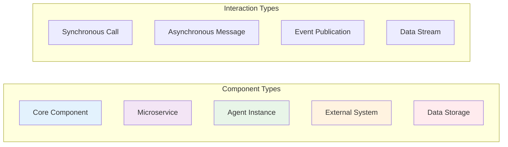
```mermaid
graph LR
    subgraph "Component Types"
        Core[Core Component]
        Service[Microservice]
        Agent[Agent Instance]
        External[External System]
        Storage[Data Storage]
    end

    subgraph "Interaction Types"
        SyncCall[Synchronous Call]
        AsyncCall[Asynchronous Message]
        Event[Event Publication]
        Stream[Data Stream]
    end

    style Core fill:#e3f2fd
    style Service fill:#f3e5f5
    style Agent fill:#e8f5e8
    style External fill:#fff3e0
    style Storage fill:#ffebee
```

## Component Interaction Patterns

### High-Level System Overview

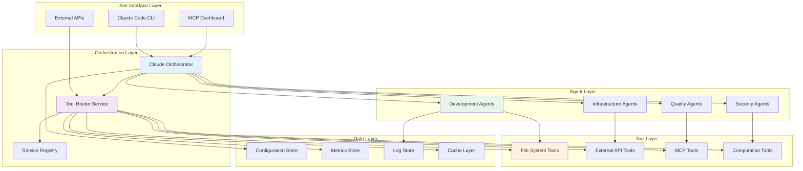
```mermaid
graph TB
    subgraph "User Interface Layer"
        CLI[Claude Code CLI]
        Dashboard[MCP Dashboard]
        API[External APIs]
    end

    subgraph "Orchestration Layer"
        Claude[Claude Orchestrator]
        Router[Tool Router Service]
        Registry[Service Registry]
    end

    subgraph "Agent Layer"
        DevAgents[Development Agents]
        InfraAgents[Infrastructure Agents]
        QualityAgents[Quality Agents]
        SecurityAgents[Security Agents]
    end

    subgraph "Tool Layer"
        FileSystem[File System Tools]
        ExternalTools[External API Tools]
        MCPTools[MCP Tools]
        ComputeTools[Computation Tools]
    end

    subgraph "Data Layer"
        Config[Configuration Store]
        Metrics[Metrics Store]
        Logs[Log Store]
        Cache[Cache Layer]
    end

    CLI --> Claude
    Dashboard --> Claude
    API --> Router

    Claude --> Router
    Router --> Registry
    Claude --> DevAgents
    Claude --> InfraAgents
    Claude --> QualityAgents
    Claude --> SecurityAgents

    DevAgents --> FileSystem
    InfraAgents --> ExternalTools
    QualityAgents --> MCPTools
    SecurityAgents --> ComputeTools

    Router --> FileSystem
    Router --> ExternalTools
    Router --> MCPTools
    Router --> ComputeTools

    Claude --> Config
    Router --> Metrics
    DevAgents --> Logs
    Router --> Cache

    style Claude fill:#e3f2fd
    style Router fill:#f3e5f5
    style DevAgents fill:#e8f5e8
    style FileSystem fill:#fff3e0
```

### Service Mesh Communication Pattern

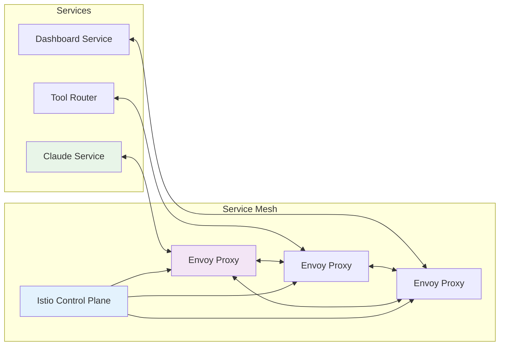
```mermaid
graph LR
    subgraph "Service Mesh"
        Proxy1[Envoy Proxy]
        Proxy2[Envoy Proxy]
        Proxy3[Envoy Proxy]
        Control[Istio Control Plane]
    end

    subgraph "Services"
        Claude[Claude Service]
        Router[Tool Router]
        Dashboard[Dashboard Service]
    end

    Claude <--> Proxy1
    Router <--> Proxy2
    Dashboard <--> Proxy3

    Proxy1 <--> Proxy2
    Proxy2 <--> Proxy3
    Proxy1 <--> Proxy3

    Control --> Proxy1
    Control --> Proxy2
    Control --> Proxy3

    style Control fill:#e3f2fd
    style Proxy1 fill:#f3e5f5
    style Claude fill:#e8f5e8
```

## Agent Orchestration Flows

### Single Agent Execution Flow

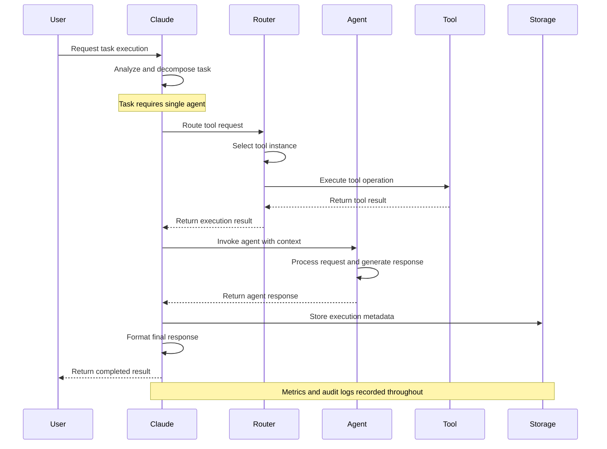
```mermaid
sequenceDiagram
    participant User
    participant Claude
    participant Router
    participant Agent
    participant Tool
    participant Storage

    User->>Claude: Request task execution
    Claude->>Claude: Analyze and decompose task

    Note over Claude: Task requires single agent

    Claude->>Router: Route tool request
    Router->>Router: Select tool instance
    Router->>Tool: Execute tool operation
    Tool-->>Router: Return tool result
    Router-->>Claude: Return execution result

    Claude->>Agent: Invoke agent with context
    Agent->>Agent: Process request and generate response
    Agent-->>Claude: Return agent response

    Claude->>Storage: Store execution metadata
    Claude->>Claude: Format final response
    Claude-->>User: Return completed result

    Note over Claude,Storage: Metrics and audit logs recorded throughout
```

### Parallel Multi-Agent Orchestration

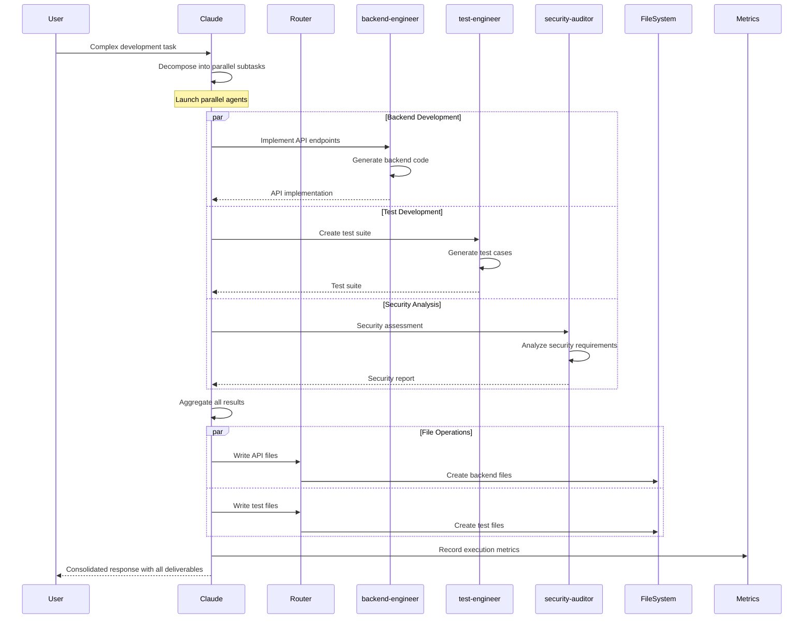
```mermaid
sequenceDiagram
    participant User
    participant Claude
    participant Router
    participant Agent1 as backend-engineer
    participant Agent2 as test-engineer
    participant Agent3 as security-auditor
    participant FileSystem
    participant Metrics

    User->>Claude: Complex development task
    Claude->>Claude: Decompose into parallel subtasks

    Note over Claude: Launch parallel agents

    par Backend Development
        Claude->>Agent1: Implement API endpoints
        Agent1->>Agent1: Generate backend code
        Agent1-->>Claude: API implementation
    and Test Development
        Claude->>Agent2: Create test suite
        Agent2->>Agent2: Generate test cases
        Agent2-->>Claude: Test suite
    and Security Analysis
        Claude->>Agent3: Security assessment
        Agent3->>Agent3: Analyze security requirements
        Agent3-->>Claude: Security report
    end

    Claude->>Claude: Aggregate all results

    par File Operations
        Claude->>Router: Write API files
        Router->>FileSystem: Create backend files
    and
        Claude->>Router: Write test files
        Router->>FileSystem: Create test files
    end

    Claude->>Metrics: Record execution metrics
    Claude-->>User: Consolidated response with all deliverables
```

### Multi-Instance Agent Execution

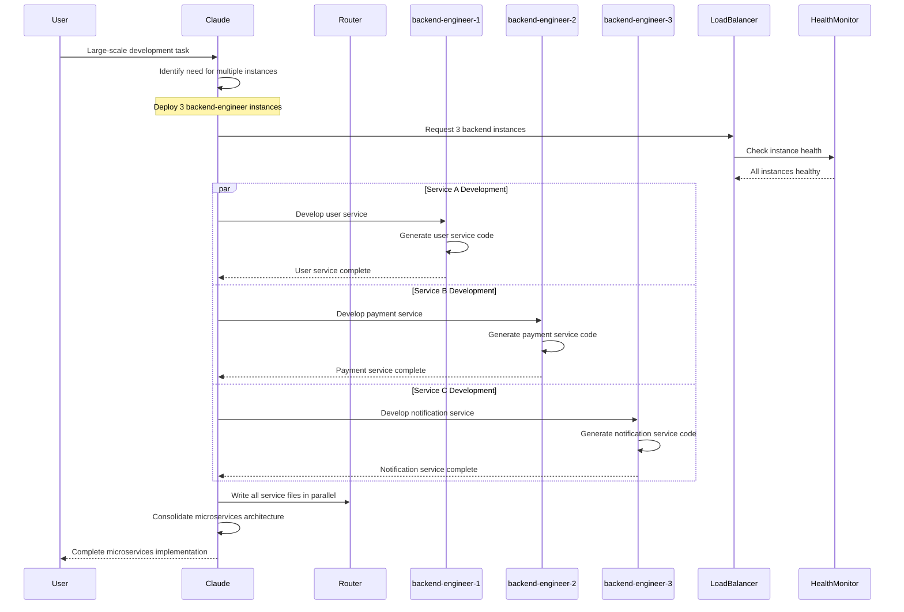
```mermaid
sequenceDiagram
    participant User
    participant Claude
    participant Router
    participant Agent1 as backend-engineer-1
    participant Agent2 as backend-engineer-2
    participant Agent3 as backend-engineer-3
    participant LoadBalancer
    participant HealthMonitor

    User->>Claude: Large-scale development task
    Claude->>Claude: Identify need for multiple instances

    Note over Claude: Deploy 3 backend-engineer instances

    Claude->>LoadBalancer: Request 3 backend instances
    LoadBalancer->>HealthMonitor: Check instance health
    HealthMonitor-->>LoadBalancer: All instances healthy

    par Service A Development
        Claude->>Agent1: Develop user service
        Agent1->>Agent1: Generate user service code
        Agent1-->>Claude: User service complete
    and Service B Development
        Claude->>Agent2: Develop payment service
        Agent2->>Agent2: Generate payment service code
        Agent2-->>Claude: Payment service complete
    and Service C Development
        Claude->>Agent3: Develop notification service
        Agent3->>Agent3: Generate notification service code
        Agent3-->>Claude: Notification service complete
    end

    Claude->>Router: Write all service files in parallel
    Claude->>Claude: Consolidate microservices architecture
    Claude-->>User: Complete microservices implementation
```

## Tool Execution Sequences

### File System Tool Execution

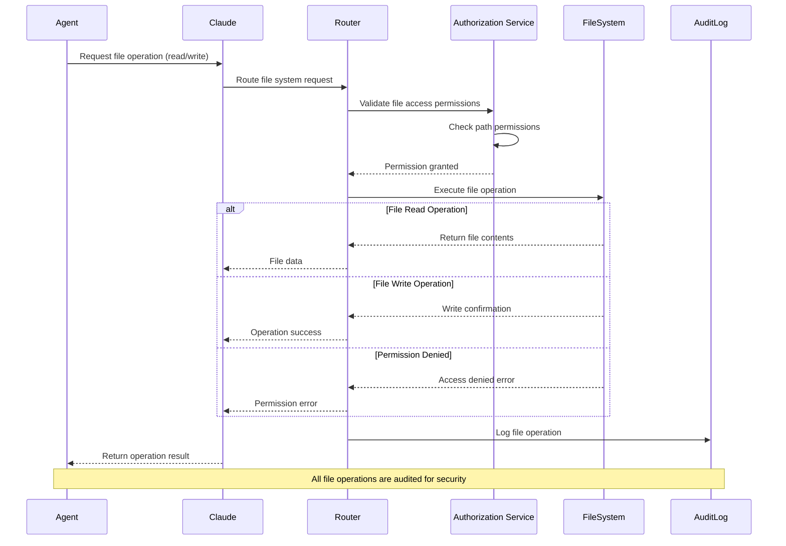
```mermaid
sequenceDiagram
    participant Agent
    participant Claude
    participant Router
    participant AuthZ as Authorization Service
    participant FileSystem
    participant AuditLog

    Agent->>Claude: Request file operation (read/write)
    Claude->>Router: Route file system request

    Router->>AuthZ: Validate file access permissions
    AuthZ->>AuthZ: Check path permissions
    AuthZ-->>Router: Permission granted

    Router->>FileSystem: Execute file operation

    alt File Read Operation
        FileSystem-->>Router: Return file contents
        Router-->>Claude: File data
    else File Write Operation
        FileSystem-->>Router: Write confirmation
        Router-->>Claude: Operation success
    else Permission Denied
        FileSystem-->>Router: Access denied error
        Router-->>Claude: Permission error
    end

    Router->>AuditLog: Log file operation
    Claude-->>Agent: Return operation result

    Note over Agent,AuditLog: All file operations are audited for security
```

### External API Tool Execution

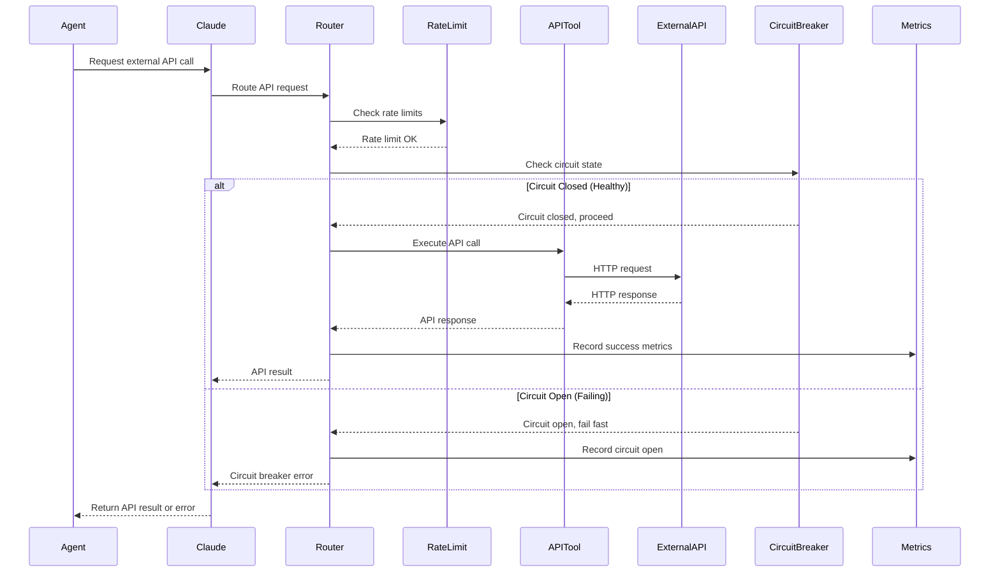
```mermaid
sequenceDiagram
    participant Agent
    participant Claude
    participant Router
    participant RateLimit
    participant APITool
    participant ExternalAPI
    participant CircuitBreaker
    participant Metrics

    Agent->>Claude: Request external API call
    Claude->>Router: Route API request

    Router->>RateLimit: Check rate limits
    RateLimit-->>Router: Rate limit OK

    Router->>CircuitBreaker: Check circuit state

    alt Circuit Closed (Healthy)
        CircuitBreaker-->>Router: Circuit closed, proceed
        Router->>APITool: Execute API call
        APITool->>ExternalAPI: HTTP request
        ExternalAPI-->>APITool: HTTP response
        APITool-->>Router: API response
        Router->>Metrics: Record success metrics
        Router-->>Claude: API result
    else Circuit Open (Failing)
        CircuitBreaker-->>Router: Circuit open, fail fast
        Router->>Metrics: Record circuit open
        Router-->>Claude: Circuit breaker error
    end

    Claude-->>Agent: Return API result or error
```

### MCP Tool Integration Flow

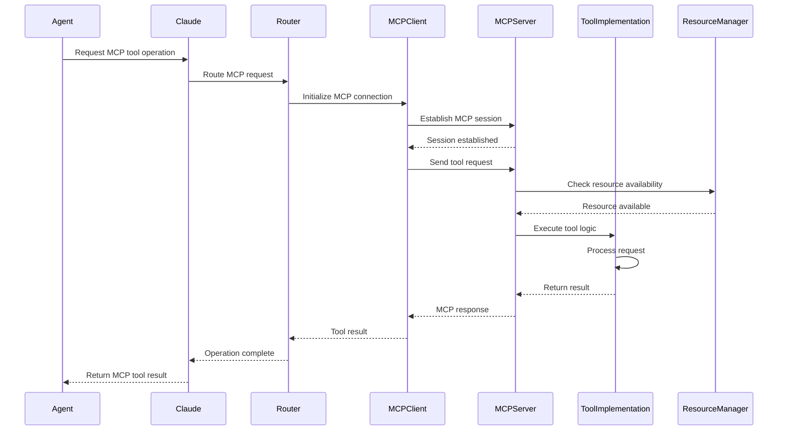
```mermaid
sequenceDiagram
    participant Agent
    participant Claude
    participant Router
    participant MCPClient
    participant MCPServer
    participant ToolImplementation
    participant ResourceManager

    Agent->>Claude: Request MCP tool operation
    Claude->>Router: Route MCP request

    Router->>MCPClient: Initialize MCP connection
    MCPClient->>MCPServer: Establish MCP session
    MCPServer-->>MCPClient: Session established

    MCPClient->>MCPServer: Send tool request
    MCPServer->>ResourceManager: Check resource availability
    ResourceManager-->>MCPServer: Resource available

    MCPServer->>ToolImplementation: Execute tool logic
    ToolImplementation->>ToolImplementation: Process request
    ToolImplementation-->>MCPServer: Return result

    MCPServer-->>MCPClient: MCP response
    MCPClient-->>Router: Tool result
    Router-->>Claude: Operation complete
    Claude-->>Agent: Return MCP tool result
```

## Configuration Management Flows

### Configuration Deployment Flow

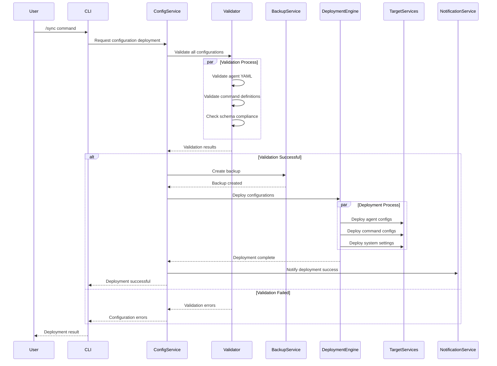
```mermaid
sequenceDiagram
    participant User
    participant CLI
    participant ConfigService
    participant Validator
    participant BackupService
    participant DeploymentEngine
    participant TargetServices
    participant NotificationService

    User->>CLI: /sync command
    CLI->>ConfigService: Request configuration deployment

    ConfigService->>Validator: Validate all configurations

    par Validation Process
        Validator->>Validator: Validate agent YAML
        Validator->>Validator: Validate command definitions
        Validator->>Validator: Check schema compliance
    end

    Validator-->>ConfigService: Validation results

    alt Validation Successful
        ConfigService->>BackupService: Create backup
        BackupService-->>ConfigService: Backup created

        ConfigService->>DeploymentEngine: Deploy configurations

        par Deployment Process
            DeploymentEngine->>TargetServices: Deploy agent configs
            DeploymentEngine->>TargetServices: Deploy command configs
            DeploymentEngine->>TargetServices: Deploy system settings
        end

        DeploymentEngine-->>ConfigService: Deployment complete
        ConfigService->>NotificationService: Notify deployment success
        ConfigService-->>CLI: Deployment successful
    else Validation Failed
        Validator-->>ConfigService: Validation errors
        ConfigService-->>CLI: Configuration errors
    end

    CLI-->>User: Deployment result
```

### Dynamic Configuration Updates

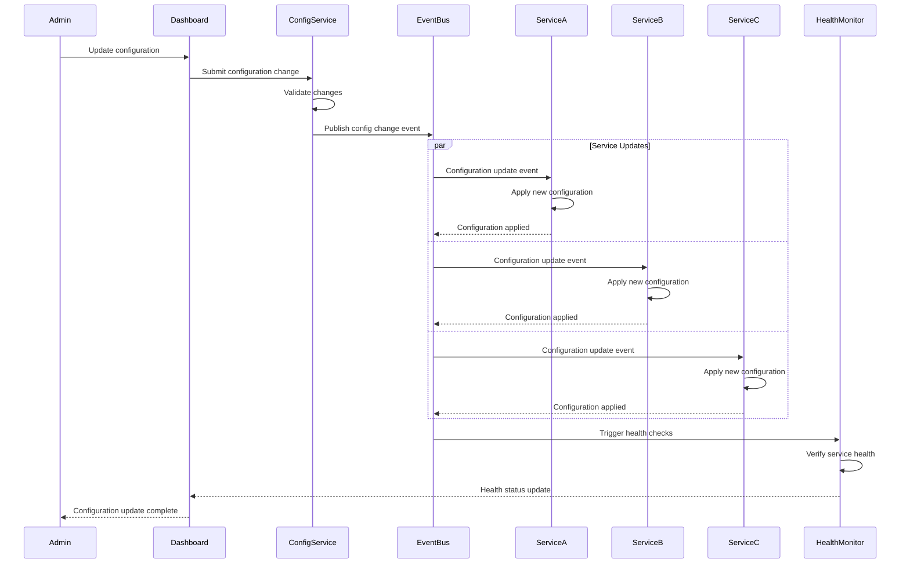
```mermaid
sequenceDiagram
    participant Admin
    participant Dashboard
    participant ConfigService
    participant EventBus
    participant ServiceA
    participant ServiceB
    participant ServiceC
    participant HealthMonitor

    Admin->>Dashboard: Update configuration
    Dashboard->>ConfigService: Submit configuration change

    ConfigService->>ConfigService: Validate changes
    ConfigService->>EventBus: Publish config change event

    par Service Updates
        EventBus->>ServiceA: Configuration update event
        ServiceA->>ServiceA: Apply new configuration
        ServiceA-->>EventBus: Configuration applied
    and
        EventBus->>ServiceB: Configuration update event
        ServiceB->>ServiceB: Apply new configuration
        ServiceB-->>EventBus: Configuration applied
    and
        EventBus->>ServiceC: Configuration update event
        ServiceC->>ServiceC: Apply new configuration
        ServiceC-->>EventBus: Configuration applied
    end

    EventBus->>HealthMonitor: Trigger health checks
    HealthMonitor->>HealthMonitor: Verify service health
    HealthMonitor-->>Dashboard: Health status update
    Dashboard-->>Admin: Configuration update complete
```

## Error Handling and Recovery

### Circuit Breaker Error Flow

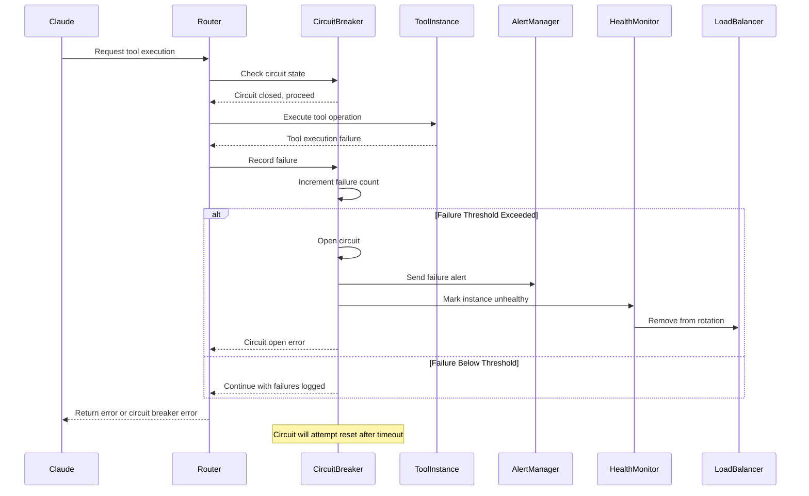
```mermaid
sequenceDiagram
    participant Claude
    participant Router
    participant CircuitBreaker
    participant ToolInstance
    participant AlertManager
    participant HealthMonitor
    participant LoadBalancer

    Claude->>Router: Request tool execution
    Router->>CircuitBreaker: Check circuit state
    CircuitBreaker-->>Router: Circuit closed, proceed

    Router->>ToolInstance: Execute tool operation
    ToolInstance-->>Router: Tool execution failure
    Router->>CircuitBreaker: Record failure

    CircuitBreaker->>CircuitBreaker: Increment failure count

    alt Failure Threshold Exceeded
        CircuitBreaker->>CircuitBreaker: Open circuit
        CircuitBreaker->>AlertManager: Send failure alert
        CircuitBreaker->>HealthMonitor: Mark instance unhealthy
        HealthMonitor->>LoadBalancer: Remove from rotation
        CircuitBreaker-->>Router: Circuit open error
    else Failure Below Threshold
        CircuitBreaker-->>Router: Continue with failures logged
    end

    Router-->>Claude: Return error or circuit breaker error

    Note over CircuitBreaker: Circuit will attempt reset after timeout
```

### Agent Recovery and Retry Flow

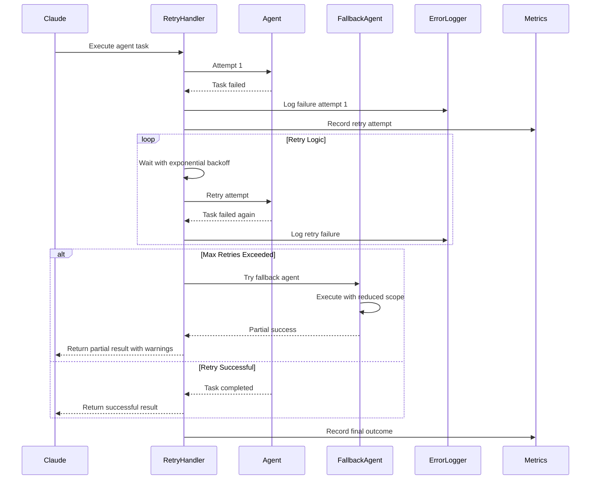
```mermaid
sequenceDiagram
    participant Claude
    participant RetryHandler
    participant Agent
    participant FallbackAgent
    participant ErrorLogger
    participant Metrics

    Claude->>RetryHandler: Execute agent task
    RetryHandler->>Agent: Attempt 1
    Agent-->>RetryHandler: Task failed

    RetryHandler->>ErrorLogger: Log failure attempt 1
    RetryHandler->>Metrics: Record retry attempt

    loop Retry Logic
        RetryHandler->>RetryHandler: Wait with exponential backoff
        RetryHandler->>Agent: Retry attempt
        Agent-->>RetryHandler: Task failed again
        RetryHandler->>ErrorLogger: Log retry failure
    end

    alt Max Retries Exceeded
        RetryHandler->>FallbackAgent: Try fallback agent
        FallbackAgent->>FallbackAgent: Execute with reduced scope
        FallbackAgent-->>RetryHandler: Partial success
        RetryHandler-->>Claude: Return partial result with warnings
    else Retry Successful
        Agent-->>RetryHandler: Task completed
        RetryHandler-->>Claude: Return successful result
    end

    RetryHandler->>Metrics: Record final outcome
```

### Graceful Degradation Flow

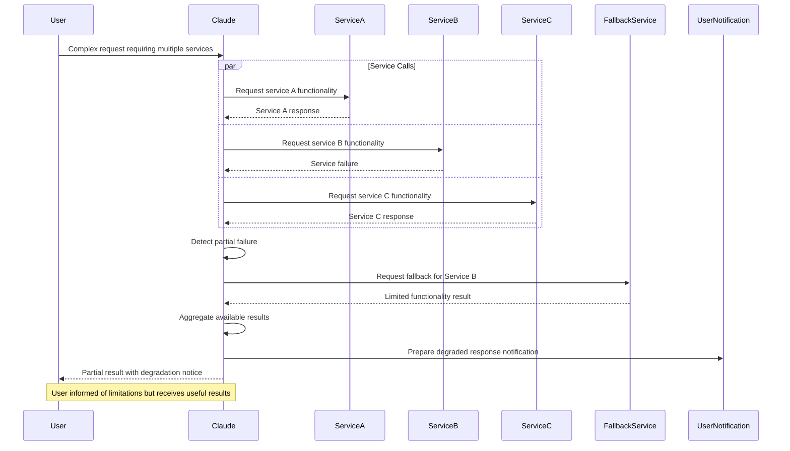
```mermaid
sequenceDiagram
    participant User
    participant Claude
    participant ServiceA
    participant ServiceB
    participant ServiceC
    participant FallbackService
    participant UserNotification

    User->>Claude: Complex request requiring multiple services

    par Service Calls
        Claude->>ServiceA: Request service A functionality
        ServiceA-->>Claude: Service A response
    and
        Claude->>ServiceB: Request service B functionality
        ServiceB-->>Claude: Service failure
    and
        Claude->>ServiceC: Request service C functionality
        ServiceC-->>Claude: Service C response
    end

    Claude->>Claude: Detect partial failure
    Claude->>FallbackService: Request fallback for Service B
    FallbackService-->>Claude: Limited functionality result

    Claude->>Claude: Aggregate available results
    Claude->>UserNotification: Prepare degraded response notification

    Claude-->>User: Partial result with degradation notice

    Note over Claude,User: User informed of limitations but receives useful results
```

## Performance and Monitoring Flows

### Real-time Metrics Collection

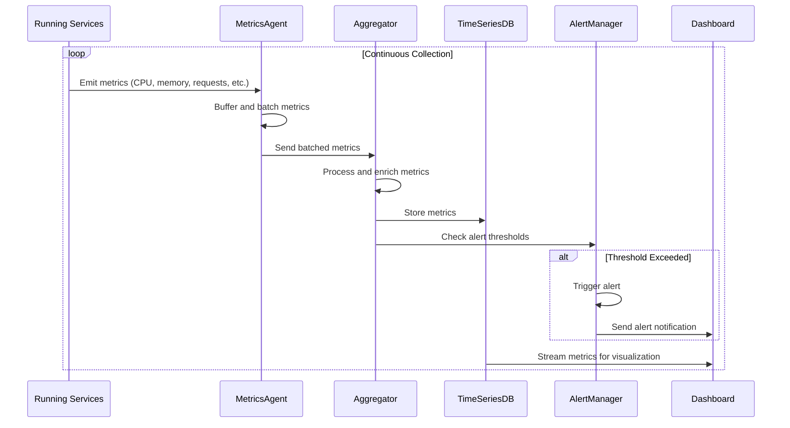
```mermaid
sequenceDiagram
    participant Services as Running Services
    participant MetricsAgent
    participant Aggregator
    participant TimeSeriesDB
    participant AlertManager
    participant Dashboard

    loop Continuous Collection
        Services->>MetricsAgent: Emit metrics (CPU, memory, requests, etc.)
        MetricsAgent->>MetricsAgent: Buffer and batch metrics

        MetricsAgent->>Aggregator: Send batched metrics
        Aggregator->>Aggregator: Process and enrich metrics
        Aggregator->>TimeSeriesDB: Store metrics

        Aggregator->>AlertManager: Check alert thresholds

        alt Threshold Exceeded
            AlertManager->>AlertManager: Trigger alert
            AlertManager->>Dashboard: Send alert notification
        end

        TimeSeriesDB->>Dashboard: Stream metrics for visualization
    end
```

### Performance Analysis Flow

```mermaid
sequenceDiagram
    participant PerformanceAnalyzer
    participant MetricsStore
    participant TrendAnalysis
    parameter BaselineComparator
    participant ReportGenerator
    participant AlertManager
    participant Operations

    PerformanceAnalyzer->>MetricsStore: Query performance data
    MetricsStore-->>PerformanceAnalyzer: Historical metrics

    PerformanceAnalyzer->>TrendAnalysis: Analyze trends
    TrendAnalysis->>TrendAnalysis: Detect performance patterns
    TrendAnalysis-->>PerformanceAnalyzer: Trend analysis results

    PerformanceAnalyzer->>BaselineComparator: Compare against baselines
    BaselineComparator-->>PerformanceAnalyzer: Baseline comparison

    PerformanceAnalyzer->>ReportGenerator: Generate performance report
    ReportGenerator-->>PerformanceAnalyzer: Performance report

    alt Performance Degradation Detected
        PerformanceAnalyzer->>AlertManager: Trigger performance alert
        AlertManager->>Operations: Notify operations team
    end

    PerformanceAnalyzer->>Operations: Deliver performance insights
```

## Security and Authorization Flows

### Authentication and Authorization Flow

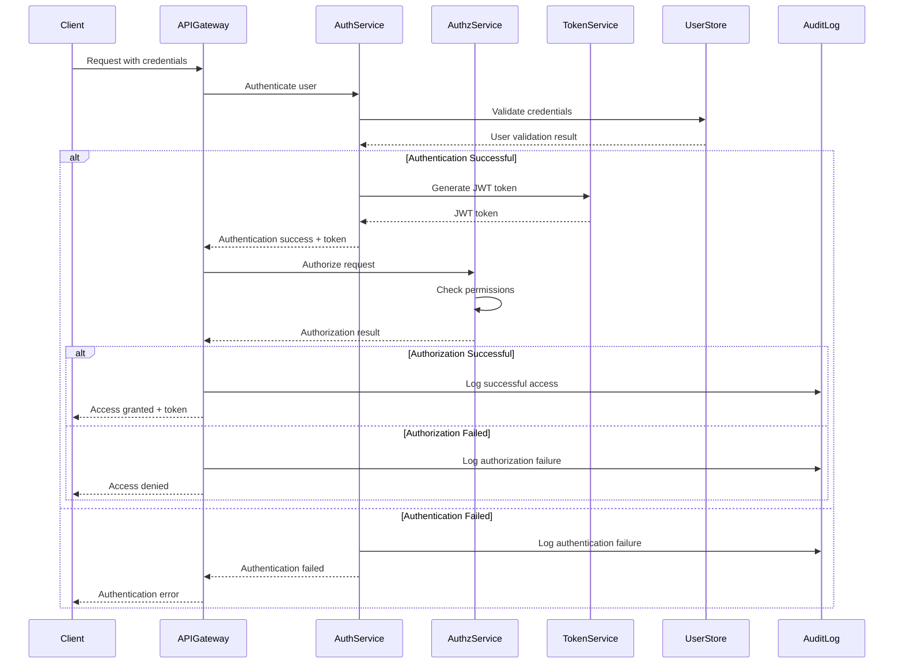
```mermaid
sequenceDiagram
    participant Client
    participant APIGateway
    participant AuthService
    participant AuthzService
    participant TokenService
    participant UserStore
    participant AuditLog

    Client->>APIGateway: Request with credentials
    APIGateway->>AuthService: Authenticate user

    AuthService->>UserStore: Validate credentials
    UserStore-->>AuthService: User validation result

    alt Authentication Successful
        AuthService->>TokenService: Generate JWT token
        TokenService-->>AuthService: JWT token
        AuthService-->>APIGateway: Authentication success + token

        APIGateway->>AuthzService: Authorize request
        AuthzService->>AuthzService: Check permissions
        AuthzService-->>APIGateway: Authorization result

        alt Authorization Successful
            APIGateway->>AuditLog: Log successful access
            APIGateway-->>Client: Access granted + token
        else Authorization Failed
            APIGateway->>AuditLog: Log authorization failure
            APIGateway-->>Client: Access denied
        end

    else Authentication Failed
        AuthService->>AuditLog: Log authentication failure
        AuthService-->>APIGateway: Authentication failed
        APIGateway-->>Client: Authentication error
    end
```

### Role-Based Access Control Flow

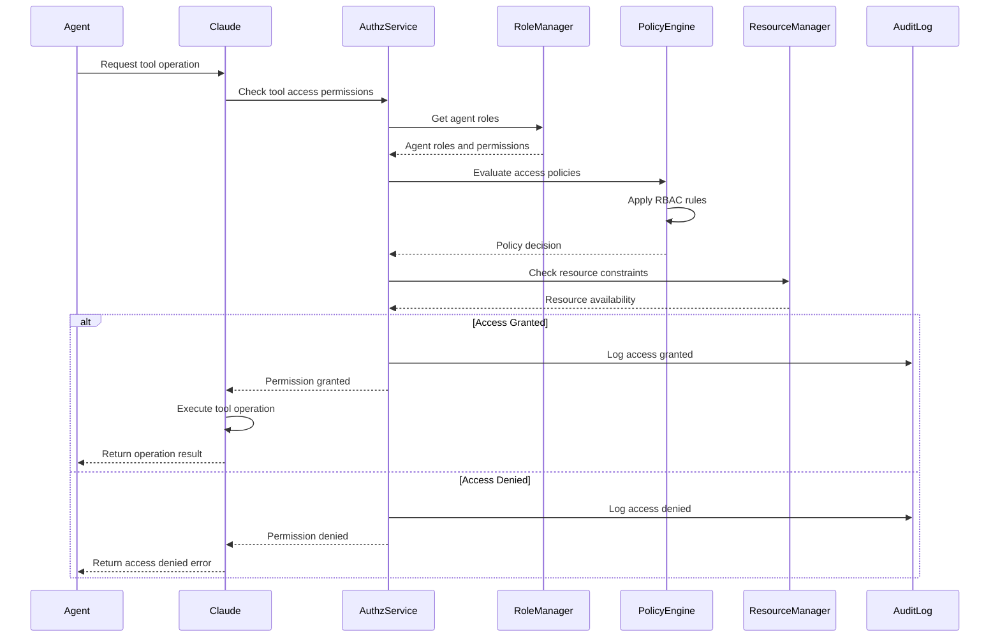
```mermaid
sequenceDiagram
    participant Agent
    participant Claude
    participant AuthzService
    participant RoleManager
    participant PolicyEngine
    participant ResourceManager
    participant AuditLog

    Agent->>Claude: Request tool operation
    Claude->>AuthzService: Check tool access permissions

    AuthzService->>RoleManager: Get agent roles
    RoleManager-->>AuthzService: Agent roles and permissions

    AuthzService->>PolicyEngine: Evaluate access policies
    PolicyEngine->>PolicyEngine: Apply RBAC rules
    PolicyEngine-->>AuthzService: Policy decision

    AuthzService->>ResourceManager: Check resource constraints
    ResourceManager-->>AuthzService: Resource availability

    alt Access Granted
        AuthzService->>AuditLog: Log access granted
        AuthzService-->>Claude: Permission granted
        Claude->>Claude: Execute tool operation
        Claude-->>Agent: Return operation result
    else Access Denied
        AuthzService->>AuditLog: Log access denied
        AuthzService-->>Claude: Permission denied
        Claude-->>Agent: Return access denied error
    end
```

### Security Incident Response Flow

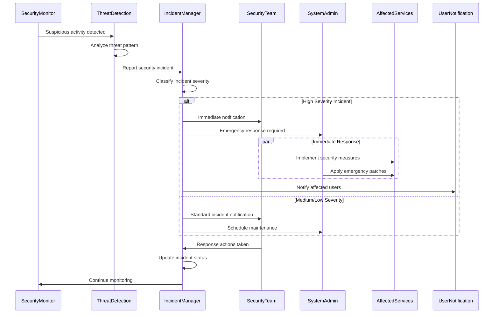
```mermaid
sequenceDiagram
    participant SecurityMonitor
    participant ThreatDetection
    participant IncidentManager
    participant SecurityTeam
    participant SystemAdmin
    participant AffectedServices
    participant UserNotification

    SecurityMonitor->>ThreatDetection: Suspicious activity detected
    ThreatDetection->>ThreatDetection: Analyze threat pattern
    ThreatDetection->>IncidentManager: Report security incident

    IncidentManager->>IncidentManager: Classify incident severity

    alt High Severity Incident
        IncidentManager->>SecurityTeam: Immediate notification
        IncidentManager->>SystemAdmin: Emergency response required

        par Immediate Response
            SecurityTeam->>AffectedServices: Implement security measures
            SystemAdmin->>AffectedServices: Apply emergency patches
        end

        IncidentManager->>UserNotification: Notify affected users

    else Medium/Low Severity
        IncidentManager->>SecurityTeam: Standard incident notification
        IncidentManager->>SystemAdmin: Schedule maintenance
    end

    SecurityTeam->>IncidentManager: Response actions taken
    IncidentManager->>IncidentManager: Update incident status
    IncidentManager->>SecurityMonitor: Continue monitoring
```

## Summary

These system interaction diagrams provide comprehensive visibility into how the Claude ecosystem components communicate and collaborate. The diagrams illustrate:

### Key Interaction Patterns

1. **Orchestration**: Claude's central role in coordinating multi-agent workflows
2. **Service Communication**: Reliable communication patterns between microservices
3. **Error Handling**: Robust error recovery and graceful degradation strategies
4. **Security**: Comprehensive authentication, authorization, and audit flows
5. **Performance**: Real-time monitoring and performance optimization patterns

### Design Principles Demonstrated

- **Asynchronous Communication**: Non-blocking operations for better performance
- **Circuit Breaking**: Fault tolerance to prevent cascade failures
- **Event-Driven Architecture**: Loose coupling through event publication
- **Security-First**: Authorization checks at every interaction point
- **Observability**: Comprehensive logging, metrics, and monitoring

These interaction patterns ensure the system is resilient, secure, performant, and maintainable while supporting complex multi-agent orchestration scenarios.