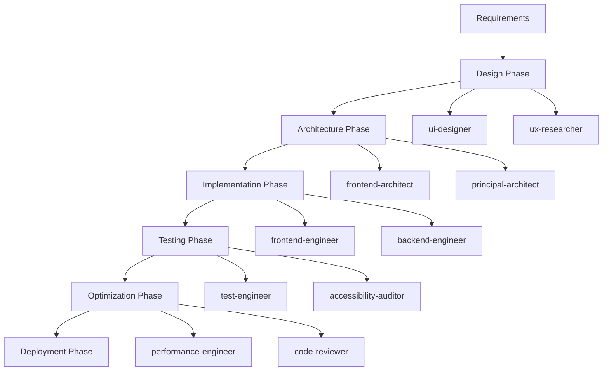

# UI Development Workflow Guide

## Overview

This comprehensive guide outlines efficient UI development workflows using the Claude Configuration Framework. Learn how to coordinate design and development agents for optimal user interface creation, from initial concepts to production deployment.

## Core Workflow Architecture

### UI Development Pipeline



## Phase 1: Design Foundation

### Requirements Gathering with UX Research

#### Initial User Research

```yaml
Agent Coordination:
  Primary: ux-researcher
  Supporting: principal-architect

Tasks:
  - User persona development and journey mapping
  - Competitive analysis and market research
  - Accessibility requirements and compliance standards
  - Performance requirements and device constraints

Deliverables:
  - User research report with personas and use cases
  - Technical requirements document
  - Accessibility checklist and compliance targets
  - Performance benchmarks and goals
```

#### Design System Planning

```yaml
Agent Coordination:
  Primary: ui-designer
  Supporting: frontend-architect, ux-researcher

Tasks:
  - Design token definition (colors, typography, spacing)
  - Component library architecture planning
  - Responsive breakpoint strategy
  - Accessibility color contrast validation

Deliverables:
  - Design system specification
  - Component hierarchy and relationships
  - Responsive design guidelines
  - Brand guidelines and visual standards
```

### Design Creation and Validation

#### Visual Design Development

```bash
# Comprehensive design creation workflow
Wave 1: Foundation
  - ui-designer: Create design tokens and foundational styles
  - ux-researcher: Validate design decisions against user research

Wave 2: Component Design
  - ui-designer: Design component library with all states
  - accessibility-auditor: Validate WCAG compliance

Wave 3: Layout and Composition
  - ui-designer: Create page layouts and user flows
  - ux-researcher: Conduct design validation with user testing
```

#### Design System Documentation

```yaml
Documentation Strategy:
  Component Documentation:
    - Visual specifications with dimensions and spacing
    - Interactive states (default, hover, active, disabled)
    - Responsive behavior across breakpoints
    - Accessibility requirements and ARIA labels

  Implementation Guidelines:
    - Code examples and usage patterns
    - Integration instructions with design tokens
    - Testing requirements for each component
    - Performance considerations and optimization
```

## Phase 2: Architecture and Planning

### Frontend Architecture Decisions

#### Technology Stack Selection

```yaml
Agent Coordination:
  Primary: frontend-architect
  Supporting: principal-architect, performance-engineer

Architecture Decisions:
  Framework Selection:
    - React 18+ with TypeScript for complex applications
    - Vue 3 with Composition API for rapid development
    - Angular 15+ for enterprise applications
    - Svelte for performance-critical applications

  State Management:
    - Redux Toolkit for complex global state
    - Zustand for simple global state
    - Context API for component-scoped state
    - React Query/SWR for server state

  Styling Approach:
    - Tailwind CSS for utility-first styling
    - Emotion/Styled Components for CSS-in-JS
    - CSS Modules for traditional CSS approach
    - PostCSS for advanced CSS processing
```

#### Component Architecture

```yaml
Component Architecture Strategy:
  Atomic Design Principles:
    Atoms:
      - Button, Input, Icon, Text components
      - Design token integration
      - Accessibility built-in

    Molecules:
      - SearchBox, FormField, Navigation items
      - Composition of atoms with specific purpose
      - Reusable across multiple contexts

    Organisms:
      - Header, ProductCard, DataTable
      - Complex components with business logic
      - Feature-specific implementations

    Templates:
      - Page layouts with placeholder content
      - Grid systems and responsive containers
      - Navigation and content area definitions

    Pages:
      - Specific page implementations
      - Data fetching and state management
      - Route-specific logic and components
```

### Performance Architecture

#### Bundle Strategy

```yaml
Performance Architecture:
  Code Splitting:
    - Route-based splitting for SPA navigation
    - Feature-based splitting for large applications
    - Component-based splitting for heavy components
    - Vendor code separation for better caching

  Asset Optimization:
    - Image optimization with next-gen formats
    - Icon system with SVG sprites or icon fonts
    - Font optimization with variable fonts
    - CSS optimization with critical path extraction

  Caching Strategy:
    - Service worker for offline functionality
    - Browser cache with proper headers
    - CDN integration for global distribution
    - API caching with proper invalidation
```

## Phase 3: Implementation

### Component Development Workflow

#### Parallel Development Strategy

```yaml
Multi-Agent Implementation:
  Wave 1: Foundation Components
    frontend-engineer-1:
      - Design system foundation (tokens, utilities)
      - Basic atoms (Button, Input, Text, Icon)

    frontend-engineer-2:
      - Form components and validation
      - Layout components (Grid, Stack, Container)

  Wave 2: Complex Components
    frontend-engineer-1:
      - Data display components (Table, Card, List)
      - Navigation components (Menu, Breadcrumb, Pagination)

    frontend-engineer-2:
      - Interactive components (Modal, Dropdown, Tooltip)
      - Feedback components (Toast, Alert, Loading)

  Wave 3: Feature Components
    frontend-engineer-1:
      - Authentication components and flows
      - Dashboard components and layouts

    frontend-engineer-2:
      - Data visualization components
      - Advanced form components and wizards
```

#### Development Standards

```yaml
Implementation Standards:
  TypeScript Integration:
    - Strict type checking for all components
    - Prop types with documentation
    - Event handler typing for better DX
    - Generic components for reusability

  Testing Requirements:
    - Unit tests for all business logic
    - Component testing with Testing Library
    - Accessibility testing with axe
    - Visual regression testing with Chromatic

  Documentation:
    - Storybook stories for all components
    - Usage examples and best practices
    - Accessibility documentation
    - Performance considerations
```

### State Management Implementation

#### Global State Architecture

```bash
# State management implementation workflow
Task: "Implement scalable state management for e-commerce application"

Agent Coordination:
  Primary: frontend-engineer
  Supporting: frontend-architect, backend-engineer

Implementation Strategy:
  Authentication State:
    - Redux slice for user authentication
    - RTK Query for auth API integration
    - Persistent storage with secure token handling

  Cart Management:
    - Optimistic updates for better UX
    - Local storage persistence
    - Server synchronization on auth

  Product Catalog:
    - Normalized state structure
    - Infinite scroll with caching
    - Search and filter state management
```

#### Form State Management

```yaml
Form Handling Strategy:
  Simple Forms:
    - React Hook Form for performance
    - Zod schema validation
    - Error handling and display

  Complex Forms:
    - Formik for complex validation logic
    - Field-level validation and errors
    - Multi-step form state management

  Dynamic Forms:
    - JSON schema-driven forms
    - Conditional field rendering
    - Custom validation rules
```

### API Integration

#### Frontend-Backend Coordination

```yaml
API Integration Pattern:
  Development Coordination:
    backend-engineer:
      - OpenAPI specification creation
      - Mock server setup for development
      - Real API implementation

    frontend-engineer:
      - TypeScript types from OpenAPI
      - API client generation
      - Error handling and retry logic

  Data Fetching Strategy:
    - React Query for server state management
    - Optimistic updates for better UX
    - Background refresh and cache invalidation
    - Loading and error state handling
```

## Phase 4: Testing and Quality Assurance

### Comprehensive Testing Strategy

#### Multi-Level Testing

```yaml
Testing Pyramid Implementation:
  Unit Tests (70%):
    Agent: frontend-engineer
    - Component logic testing
    - Utility function testing
    - Custom hook testing
    - State management testing

  Integration Tests (20%):
    Agent: test-engineer
    - API integration testing
    - Component integration testing
    - User flow testing
    - Cross-browser compatibility

  E2E Tests (10%):
    Agent: test-engineer
    - Critical user journey testing
    - Performance regression testing
    - Accessibility compliance testing
    - Visual regression testing
```

#### Accessibility Testing

```yaml
Accessibility Validation:
  Automated Testing:
    Agent: accessibility-auditor
    - axe-core integration in tests
    - Lighthouse accessibility audits
    - Color contrast validation
    - Keyboard navigation testing

  Manual Testing:
    Agent: ux-researcher
    - Screen reader testing
    - Keyboard-only navigation
    - Voice control testing
    - User testing with disabilities
```

### Quality Gates

#### Code Quality Standards

```yaml
Quality Gate Implementation:
  Pre-commit Hooks:
    - ESLint with accessibility rules
    - Prettier code formatting
    - TypeScript type checking
    - Unit test execution

  Pre-push Hooks:
    - Full test suite execution
    - Bundle size analysis
    - Lighthouse performance audit
    - Accessibility compliance check

  CI/CD Pipeline:
    - Cross-browser testing
    - Visual regression testing
    - Performance budgets validation
    - Security vulnerability scanning
```

## Phase 5: Performance Optimization

### Performance Analysis and Optimization

#### Performance Monitoring

```yaml
Performance Optimization Workflow:
  Analysis Phase:
    Agent: performance-engineer
    - Bundle analysis with webpack-bundle-analyzer
    - Runtime performance profiling
    - Core Web Vitals measurement
    - Network performance analysis

  Optimization Phase:
    Agent: frontend-engineer
    - Code splitting implementation
    - Lazy loading optimization
    - Image optimization and lazy loading
    - CSS optimization and critical path

  Validation Phase:
    Agent: test-engineer
    - Performance regression testing
    - Real user monitoring setup
    - Lighthouse CI integration
    - Performance budget enforcement
```

#### Optimization Strategies

```yaml
Performance Improvements:
  JavaScript Optimization:
    - Tree shaking for unused code elimination
    - Code splitting for better caching
    - Bundle size monitoring and alerts
    - Modern JavaScript for better performance

  CSS Optimization:
    - Critical CSS extraction and inlining
    - Unused CSS elimination with PurgeCSS
    - CSS containment for better rendering
    - CSS Grid over JavaScript layout solutions

  Asset Optimization:
    - WebP/AVIF images with fallbacks
    - SVG optimization and sprite generation
    - Font optimization with font-display
    - Preloading for critical resources
```

## Phase 6: Deployment and Monitoring

### Production Deployment

#### Deployment Pipeline

```yaml
Deployment Strategy:
  Build Optimization:
    Agent: devops
    - Production build configuration
    - Environment-specific configurations
    - Asset optimization and compression
    - Source map generation for debugging

  Deployment Process:
    Agent: platform-engineer
    - CDN setup and configuration
    - Cache headers and invalidation
    - SSL certificate and security headers
    - Monitoring and alerting setup
```

#### Post-Deployment Monitoring

```yaml
Monitoring and Analytics:
  Performance Monitoring:
    - Core Web Vitals tracking
    - Real User Monitoring (RUM)
    - Error tracking and alerting
    - Performance regression detection

  User Analytics:
    - User interaction tracking
    - Conversion funnel analysis
    - A/B testing framework
    - Accessibility usage patterns
```

## Advanced Workflow Patterns

### Design System Evolution

#### Iterative Improvement Workflow

```yaml
Design System Maintenance:
  Quarterly Reviews:
    ui-designer:
      - Component usage analysis
      - Design debt identification
      - User feedback incorporation
      - New component requirements

  Implementation Updates:
    frontend-engineer:
      - Component refactoring and improvements
      - Performance optimization
      - Accessibility enhancements
      - API consistency improvements

  Documentation Updates:
    tech-writer:
      - Usage pattern documentation
      - Migration guides for breaking changes
      - Best practice guidelines
      - Training materials creation
```

### Multi-Brand Support

#### Scalable Theming Architecture

```yaml
Multi-Brand Implementation:
  Architecture:
    Agent: frontend-architect
    - CSS custom property system
    - Theme configuration structure
    - Component variant system
    - Build-time theme optimization

  Implementation:
    Agent: frontend-engineer
    - Dynamic theme switching
    - Theme validation and testing
    - Performance optimization for themes
    - Documentation for theme creation
```

## Troubleshooting Common Issues

### Design-Development Misalignment

#### Problem Resolution Workflow

```yaml
Symptoms:
  - Components don't match designs
  - Inconsistent spacing and colors
  - Missing interactive states
  - Poor responsive behavior

Resolution Process:
  Investigation:
    Agent: code-reviewer
    - Design specification analysis
    - Implementation gap identification
    - Root cause analysis

  Coordination:
    Agent: project-orchestrator
    - Design-development alignment sessions
    - Specification clarification
    - Implementation plan creation

  Implementation:
    Agent: frontend-engineer
    - Design system token integration
    - Component specification compliance
    - Interactive state implementation
    - Responsive behavior testing
```

### Performance Regression

#### Performance Issue Resolution

```yaml
Performance Regression Workflow:
  Detection:
    - Automated performance monitoring alerts
    - CI/CD performance budget failures
    - User complaint analysis
    - Core Web Vitals degradation

  Analysis:
    Agent: performance-engineer
    - Performance profiling and analysis
    - Regression source identification
    - Impact assessment and prioritization
    - Optimization strategy development

  Resolution:
    Agent: frontend-engineer
    - Performance optimization implementation
    - Code splitting and lazy loading
    - Asset optimization and compression
    - Caching strategy improvements

  Validation:
    Agent: test-engineer
    - Performance test execution
    - Real user monitoring validation
    - Regression prevention measures
    - Monitoring and alerting improvements
```

## Best Practices and Guidelines

### Agent Coordination Best Practices

#### Effective Communication Patterns

```yaml
Communication Guidelines:
  Cross-Functional Coordination:
    - Regular design-development sync meetings
    - Shared documentation and specifications
    - Real-time collaboration tools usage
    - Feedback loop establishment

  Quality Assurance:
    - Early and continuous testing
    - Accessibility consideration at each phase
    - Performance monitoring throughout development
    - User feedback integration process
```

### Success Metrics

#### Key Performance Indicators

```yaml
Success Measurements:
  Development Velocity:
    - Feature delivery time reduction: 4-5x improvement
    - Bug reduction rate: 60-80% fewer production issues
    - Design-development iteration cycles: 3x faster
    - Code review cycle time: 50% reduction

  Quality Metrics:
    - Accessibility compliance: 100% WCAG 2.1 AA
    - Performance scores: Lighthouse 90+ across metrics
    - Code coverage: 80%+ with meaningful tests
    - Design system adoption: 95%+ component usage

  User Experience:
    - Core Web Vitals: All metrics in "Good" range
    - User satisfaction scores: 4.5+ out of 5
    - Accessibility feedback: Positive from disabled users
    - Conversion rate improvements: 15-25% increase
```

---

*This comprehensive workflow guide ensures efficient UI development using coordinated agent specialization. Follow these patterns for optimal design-development collaboration and superior user experience delivery.*