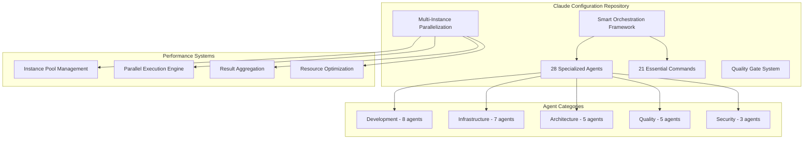

# Claude Configuration Repository Documentation

Welcome to the comprehensive documentation for the Claude Configuration Repository - a production-ready
Smart Agent Orchestration Framework that transforms Claude Code CLI into a sophisticated multi-agent
system with **28 specialized agents** and **21 essential commands**.

## 🚀 Quick Start

New to the system? Start here for immediate productivity:

- **[Installation Guide](setup/INSTALLATION.md)** - Complete setup in under 2 minutes
- **[Quick Start Guide](../QUICKSTART.md)** - Essential commands and workflows
- **[Agent Ecosystem Overview](agents/README.md)** - 28 specialized agents at your disposal

### Essential Commands

```bash
# Deploy the complete framework
/sync

# Validate agent ecosystem health
/agent-audit

# Analyze any repository
/prime --lite

# Run intelligent tests
/test

# Multi-agent code review
/review
```

## 📚 Documentation Structure

### 🏗️ Setup & Installation

Get the system running in your environment:

- **[Installation Guide](setup/INSTALLATION.md)** - Complete installation instructions
- **[Configuration Options](setup/CONFIGURATION.md)** - Customization and platform-specific setup
- **[Troubleshooting](../TROUBLESHOOTING.md)** - Common issues and solutions

### 🎭 Agent System

Master the 28-agent ecosystem:

- **[Agent Overview](agents/README.md)** - Complete agent ecosystem guide
- **[Agent Categories](agents/AGENT_CATEGORIES.md)** - 8 functional domains explained
- **[Agent Selection Guide](development/AGENT_SELECTION_GUIDE.md)** - Choose the right specialist
- **[Agent Templates](agents/AGENT_TEMPLATE.md)** - Create custom agents

### ⚡ Performance & Architecture

Understand the revolutionary performance improvements:

- **[Performance Guide](performance/PERFORMANCE.md)** - 4-6x faster execution through parallelization
- **[Parallelization Architecture](performance/PARALLELIZATION_ARCHITECTURE.md)** - Multi-instance execution model
- **[System Architecture](architecture/CONSOLIDATED_AGENT_SYSTEM.md)** - Complete system design

### 🔧 Development & Usage

Practical guides for daily development:

- **[Development Guidelines](development/README.md)** - Best practices and workflows
- **[Command Reference](../README.md#-core-commands-21-essential-tools)** - All 21 commands explained
- **[Quality Gates](quality/QUALITY_GATES.md)** - Quality assurance framework

### 🔌 Integration & API

Connect with external systems and extend functionality:

- **[API Documentation](api/agent-specification.md)** - Complete API reference
- **[MCP Integration](integrations/MCP_INTEGRATION.md)** - External system connections
- **[GitHub Integration](integrations/GITHUB_INTEGRATION.md)** - Repository management

## 🎯 Key Features

### Smart Agent Orchestration

- **28 Specialized Agents** across 8 functional domains
- **Multi-Instance Parallelization** delivering 4-6x performance improvements
- **Intelligent Task Delegation** with automatic specialist selection
- **Quality Gate Integration** preventing deployment of substandard code

### Revolutionary Performance

| Command | Sequential Time | Parallel Time | Improvement |
|---------|----------------|---------------|-------------|
| `/agent-audit` | 3-5 minutes | 30-45 seconds | **5-6x faster** |
| `/test` | 2-3 minutes | 30-40 seconds | **4-5x faster** |
| `/docs` | 5-7 minutes | 1-2 minutes | **3-4x faster** |
| `/prime focused` | 1-2 minutes | 15-20 seconds | **4-6x faster** |

### Production-Ready Architecture

- **SYSTEM BOUNDARY Protection** preventing unauthorized agent self-invocation
- **Comprehensive Quality Gates** with automated validation
- **Enterprise Security** with audit trails and compliance reporting
- **Scalable Design** supporting teams from startup to enterprise

## 🗺️ Architecture Overview



## 📖 Essential Reading

### For New Users

1. **[Quick Start Guide](../QUICKSTART.md)** - Get productive in 30 seconds
2. **[Agent Overview](agents/README.md)** - Understand the specialist ecosystem
3. **[Performance Guide](performance/PERFORMANCE.md)** - Experience 4-6x faster workflows

### For Power Users

1. **[Agent Selection Guide](development/AGENT_SELECTION_GUIDE.md)** - Master optimal agent deployment
2. **[Parallelization Architecture](performance/PARALLELIZATION_ARCHITECTURE.md)** - Advanced coordination patterns
3. **[API Documentation](api/agent-specification.md)** - Complete technical reference

### For System Administrators

1. **[Installation Guide](setup/INSTALLATION.md)** - Enterprise deployment strategies
2. **[Security Model](../SECURITY.md)** - Security boundaries and compliance
3. **[Quality Gates](quality/QUALITY_GATES.md)** - Automated quality assurance

## 🔧 Command Categories

### ⭐⭐⭐⭐⭐ Five-Star Commands (13)

Core orchestration commands delivering maximum value:

- **`/test`** - Multi-agent test execution with framework discovery
- **`/prime`** - Parallel repository analysis with 4-6x speedup
- **`/agent-audit`** - Ecosystem health validation in 30-45 seconds
- **`/plan`** - Strategic orchestration with principal-architect
- **`/review`** - Multi-dimensional quality analysis
- **`/resolve-comments`** - Intelligent PR resolution with comment analysis
- **`/debug`** - Systematic investigation with evidence gathering
- **`/implementation-plan`** - Detailed implementation planning without execution

### ⭐⭐⭐⭐ Four-Star Commands (6)

Enhanced operational commands:

- **`/commit`** - Smart Git operations with semantic messages
- **`/push`** - Safe repository operations with validation
- **`/sync`** - Framework deployment and orchestration
- **`/docs`** - Documentation orchestration with 3-4x speedup

### ⭐⭐⭐ Three-Star Commands (2)

Utility and specialized commands:

- **`/ship-it`** - Release management with comprehensive workflow
- **`/prompt`** - Prompt development and testing utility

## 🎭 Agent Highlights

### Most-Used Agents

- **codebase-analyst** - Repository analysis and understanding (use `/prime`)
- **backend-engineer** - Server-side systems and API development
- **test-engineer** - Comprehensive testing strategy (use `/test`)
- **code-reviewer** - Quality gates and best practices (use `/review`)
- **security-auditor** - Security assessment and compliance
- **tech-writer** - Technical documentation (use `/docs`)

### Specialized Experts

- **principal-architect** - System-wide architecture and technical roadmaps
- **performance-engineer** - Performance optimization and bottleneck analysis
- **incident-commander** - Crisis management and post-mortem coordination
- **debugger** - Complex bug investigation and root cause analysis

## 🚀 Performance Achievements

### Multi-Instance Parallelization

The repository's revolutionary approach to agent deployment:

- **Dynamic Instance Scaling** based on workload complexity
- **Parallel Execution** of independent tasks for maximum efficiency
- **Resource Optimization** with intelligent memory and CPU management
- **Result Aggregation** with conflict resolution and quality validation

### Real-World Impact

- **Development Teams**: 50% reduction in task completion time
- **Code Reviews**: 95% first-pass quality gate success rate
- **Testing**: 4-5x faster comprehensive test execution
- **Documentation**: 3-4x faster multi-document updates

## 🔌 Integration Ecosystem

### MCP Server Support

- **ElevenLabs** - Text-to-speech and voice synthesis
- **Context7** - Enhanced documentation and library lookups
- **GitHub** - Repository operations and PR management
- **ShadCN** - UI component generation and design systems

### External Tool Integration

- **Git Workflow** - Advanced operations and conflict resolution
- **Package Managers** - npm, pip, Go modules, Rust cargo
- **Testing Frameworks** - Jest, pytest, Go test, Rust test
- **CI/CD Systems** - GitHub Actions, GitLab CI, Jenkins

## 📊 Success Metrics

### Quality Indicators

- **Agent Ecosystem Coverage**: 100% of SDLC phases
- **Parallel Execution Rate**: >70% of eligible tasks
- **Quality Gate Success**: >95% first-pass rate
- **Agent Selection Accuracy**: 90% optimal choices

### Performance Benchmarks

- **Command Execution**: 4-6x average speedup
- **Resource Utilization**: 60-80% multi-core usage
- **Memory Efficiency**: Shared structures reduce overhead
- **Error Recovery**: <500ms typical recovery time

## 🆘 Getting Help

### Immediate Support

- **[Troubleshooting Guide](../TROUBLESHOOTING.md)** - Common issues and solutions
- **[FAQ Section](../README.md#-frequently-asked-questions)** - Quick answers
- **[Quick Decision Tree](agents/README.md#quick-decision-tree)** - Agent selection help

### Community & Development

- **[GitHub Issues](https://github.com/damilola-elegbede/claude-config/issues)** - Bug reports and feature requests
- **[Contributing Guide](../CONTRIBUTING.md)** - Join the development effort
- **[Security Policy](../SECURITY.md)** - Responsible disclosure process

## 🎯 Next Steps

### For New Users

1. Run `/sync` to deploy the complete framework
2. Try `/prime --lite` on your current repository
3. Experience `/test` for intelligent test execution
4. Read the [Agent Overview](agents/README.md) for ecosystem mastery

### For Experienced Users

1. Explore [advanced coordination patterns](performance/PARALLELIZATION_ARCHITECTURE.md)
2. Optimize workflows with the [Agent Selection Guide](development/AGENT_SELECTION_GUIDE.md)
3. Integrate external systems via [MCP documentation](integrations/MCP_INTEGRATION.md)
4. Contribute improvements via the [Contributing Guide](../CONTRIBUTING.md)

### For Enterprise Teams

1. Review [security documentation](../SECURITY.md) for compliance requirements
2. Plan deployment using the [Installation Guide](setup/INSTALLATION.md)
3. Establish [quality gates](quality/QUALITY_GATES.md) for your workflow
4. Monitor performance with built-in metrics and reporting

---

## 📝 Documentation Index

Quick access to all documentation:

### Core Documentation

- [README.md](../README.md) - Main repository documentation
- [QUICKSTART.md](../QUICKSTART.md) - Quick start guide
- [ARCHITECTURE.md](../ARCHITECTURE.md) - System architecture
- [CHANGELOG.md](../CHANGELOG.md) - Version history

### Setup & Configuration

- [Installation Guide](setup/INSTALLATION.md)
- [Configuration Options](setup/CONFIGURATION.md)
- [Troubleshooting](../TROUBLESHOOTING.md)

### Agent System

- [Agent Overview](agents/README.md)
- [Agent Categories](agents/AGENT_CATEGORIES.md)
- [Agent Template](agents/AGENT_TEMPLATE.md)
- [Selection Guide](development/AGENT_SELECTION_GUIDE.md)

### Performance & Architecture

- [Performance Guide](performance/PERFORMANCE.md)
- [Parallelization Architecture](performance/PARALLELIZATION_ARCHITECTURE.md)
- [Consolidated Agent System](architecture/CONSOLIDATED_AGENT_SYSTEM.md)

### API & Integration

- [Agent Specification API](api/agent-specification.md)
- [MCP Integration](integrations/MCP_INTEGRATION.md)
- [GitHub Integration](integrations/GITHUB_INTEGRATION.md)

### Quality & Standards

- [Quality Gates](quality/QUALITY_GATES.md)
- [Development Standards](development/DEVELOPMENT_STANDARDS.md)
- [Security Policy](../SECURITY.md)

---

*Welcome to the future of AI-assisted development. The Claude Configuration Repository transforms how you
build software through intelligent agent orchestration, parallel execution, and production-ready quality gates.*

**Ready to experience 4-6x faster development workflows? Start with `/sync` and discover the power of smart
agent orchestration.**