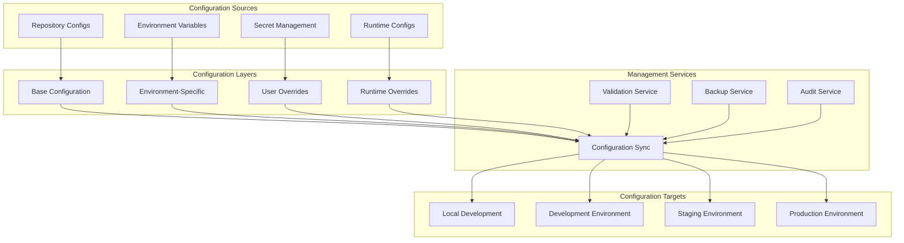

# Configuration Management Setup Guide

## Overview

This guide provides comprehensive instructions for setting up and managing configurations in the Claude Configuration Repository, including centralized configuration management, environment-specific settings, secrets management, and automated synchronization across multiple environments.

## Configuration Architecture

### Configuration Hierarchy



## Configuration Structure

### 1. Core Configuration Files

**Directory Structure:**

```text
system-configs/
├── CLAUDE.md                    # Core Claude configuration
├── .claude/
│   ├── agents/                  # Agent configurations (28 files)
│   │   ├── backend-engineer.md
│   │   ├── frontend-architect.md
│   │   ├── security-auditor.md
│   │   └── ...
│   ├── commands/               # Command configurations (20 files)
│   │   ├── agent-audit.md
│   │   ├── test.md
│   │   ├── prime.md
│   │   └── ...
│   └── settings.json          # Audio and preference settings
├── environments/              # Environment-specific configurations
│   ├── development/
│   │   ├── config.yaml
│   │   ├── agents-override.yaml
│   │   └── settings-dev.json
│   ├── staging/
│   │   ├── config.yaml
│   │   ├── agents-override.yaml
│   │   └── settings-staging.json
│   └── production/
│       ├── config.yaml
│       ├── agents-override.yaml
│       └── settings-prod.json
└── schemas/                   # Configuration validation schemas
    ├── agent-schema.json
    ├── command-schema.json
    └── settings-schema.json
```

### 2. Base Configuration

**system-configs/config.yaml (Base):**

```yaml
# Claude Configuration Management Base Settings
metadata:
  name: "claude-config-base"
  version: "2.1.0"
  description: "Base configuration for Claude Configuration Repository"

# Core Claude Settings
claude:
  model: "claude-3-sonnet-20240229"
  max_tokens: 4096
  temperature: 0.7
  stream: true

# Agent Orchestration Settings
orchestration:
  max_parallel_agents: 8
  agent_timeout: 300
  orchestration_mode: true
  wave_execution: true
  dependency_resolution: true

# Quality Gates
quality:
  markdown_validation: true
  yaml_validation: true
  security_scanning: true
  performance_monitoring: true

# Logging and Monitoring
logging:
  level: "info"
  format: "structured"
  output: ["console", "file"]
  retention_days: 30

monitoring:
  metrics_enabled: true
  health_checks: true
  performance_tracking: true
  alert_thresholds:
    response_time_ms: 5000
    error_rate_percent: 5
    memory_usage_percent: 80

# Storage Configuration
storage:
  config_path: "~/.claude"
  backup_path: "~/.claude/backups"
  temp_path: ".tmp"
  max_backups: 10

# Network Configuration
network:
  timeout: 30
  retries: 3
  rate_limit: 100

# Security Settings
security:
  system_boundary_enabled: true
  agent_isolation: true
  secret_encryption: true
  audit_logging: true
```

### 3. Environment-Specific Configurations

**environments/development/config.yaml:**

```yaml
# Development Environment Configuration
metadata:
  name: "claude-config-development"
  environment: "development"
  inherits_from: "base"

# Override core settings for development
claude:
  model: "claude-3-haiku-20240307"  # Faster model for development
  max_tokens: 2048
  temperature: 0.5

orchestration:
  max_parallel_agents: 4  # Reduced for development machines
  agent_timeout: 180
  debug_mode: true

quality:
  strict_validation: false  # Relaxed for faster development
  auto_fix_enabled: true

logging:
  level: "debug"
  verbose: true

monitoring:
  detailed_metrics: true
  debug_endpoints: true

# Development-specific features
development:
  hot_reload: true
  mock_external_services: true
  test_data_enabled: true
  performance_profiling: true

# Audio settings for development
audio:
  notifications_enabled: true
  volume: 0.5
  sounds:
    success: "/System/Library/PrivateFrameworks/ToneLibrary.framework/Versions/A/Resources/AlertTones/Classic/Bell.m4r"
    error: "/System/Library/Sounds/Sosumi.aiff"
    warning: "/System/Library/PrivateFrameworks/ToneLibrary.framework/Versions/A/Resources/AlertTones/Classic/Note.m4r"
```

**environments/production/config.yaml:**

```yaml
# Production Environment Configuration
metadata:
  name: "claude-config-production"
  environment: "production"
  inherits_from: "base"

# Production-optimized settings
claude:
  model: "claude-3-sonnet-20240229"
  max_tokens: 4096
  temperature: 0.7

orchestration:
  max_parallel_agents: 12  # Higher for production servers
  agent_timeout: 600      # Longer timeout for complex operations
  optimization_level: "maximum"

quality:
  strict_validation: true
  zero_tolerance_errors: true
  comprehensive_testing: true

logging:
  level: "warn"
  structured: true
  encrypted: true

monitoring:
  high_frequency_metrics: true
  real_time_alerts: true
  performance_baselines: true
  sla_monitoring: true

# Production security
security:
  enhanced_isolation: true
  audit_all_operations: true
  encryption_at_rest: true
  network_policies: "strict"

# Performance optimization
performance:
  caching_enabled: true
  connection_pooling: true
  resource_optimization: true
  load_balancing: true

# Disaster recovery
disaster_recovery:
  backup_frequency: "hourly"
  replication_enabled: true
  failover_automatic: true
  recovery_timeout: 300
```

## Configuration Management Service

### 1. Configuration Manager Implementation

**scripts/config-manager.py:**

```python
#!/usr/bin/env python3
"""
Claude Configuration Manager
===========================

Centralized configuration management for Claude ecosystem with:
- Environment-specific configuration loading
- Real-time configuration synchronization
- Validation and schema enforcement
- Backup and recovery capabilities
- Audit logging and compliance tracking
"""

import os
import sys
import yaml
import json
import shutil
import logging
from pathlib import Path
from datetime import datetime
from typing import Dict, Any, Optional, List
from dataclasses import dataclass
from watchdog.observers import Observer
from watchdog.events import FileSystemEventHandler

@dataclass
class ConfigurationMetadata:
    """Configuration metadata tracking."""
    name: str
    version: str
    environment: str
    last_updated: datetime
    checksum: str

class ConfigurationManager:
    """Centralized configuration management service."""

    def __init__(self, config_root: Path):
        self.config_root = Path(config_root)
        self.target_dir = Path.home() / '.claude'
        self.backup_dir = self.target_dir / 'backups'
        self.schemas_dir = self.config_root / 'schemas'

        # Ensure directories exist
        self.target_dir.mkdir(exist_ok=True)
        self.backup_dir.mkdir(exist_ok=True)

        # Setup logging
        self.setup_logging()

        # Configuration cache
        self.config_cache = {}
        self.metadata_cache = {}

    def setup_logging(self):
        """Setup logging configuration."""
        log_file = self.target_dir / 'logs' / 'config-manager.log'
        log_file.parent.mkdir(exist_ok=True)

        logging.basicConfig(
            level=logging.INFO,
            format='%(asctime)s - %(name)s - %(levelname)s - %(message)s',
            handlers=[
                logging.FileHandler(log_file),
                logging.StreamHandler()
            ]
        )
        self.logger = logging.getLogger('ConfigManager')

    def load_base_config(self) -> Dict[str, Any]:
        """Load base configuration."""
        base_config_file = self.config_root / 'config.yaml'

        if not base_config_file.exists():
            raise FileNotFoundError(f"Base configuration not found: {base_config_file}")

        with open(base_config_file, 'r') as f:
            config = yaml.safe_load(f)

        self.logger.info("Base configuration loaded successfully")
        return config

    def load_environment_config(self, environment: str) -> Dict[str, Any]:
        """Load environment-specific configuration."""
        env_config_file = self.config_root / 'environments' / environment / 'config.yaml'

        if not env_config_file.exists():
            self.logger.warning(f"Environment config not found for {environment}, using base only")
            return {}

        with open(env_config_file, 'r') as f:
            config = yaml.safe_load(f)

        self.logger.info(f"Environment configuration loaded for {environment}")
        return config

    def merge_configurations(self, base_config: Dict[str, Any],
                           env_config: Dict[str, Any]) -> Dict[str, Any]:
        """Merge base and environment configurations."""
        def deep_merge(dict1, dict2):
            result = dict1.copy()
            for key, value in dict2.items():
                if key in result and isinstance(result[key], dict) and isinstance(value, dict):
                    result[key] = deep_merge(result[key], value)
                else:
                    result[key] = value
            return result

        merged = deep_merge(base_config, env_config)
        self.logger.info("Configurations merged successfully")
        return merged

    def validate_configuration(self, config: Dict[str, Any],
                             config_type: str = 'main') -> bool:
        """Validate configuration against schema."""
        schema_file = self.schemas_dir / f'{config_type}-schema.json'

        if not schema_file.exists():
            self.logger.warning(f"Schema not found for {config_type}, skipping validation")
            return True

        try:
            import jsonschema
            with open(schema_file, 'r') as f:
                schema = json.load(f)

            jsonschema.validate(config, schema)
            self.logger.info(f"Configuration validation passed for {config_type}")
            return True

        except ImportError:
            self.logger.warning("jsonschema not available, skipping validation")
            return True
        except jsonschema.ValidationError as e:
            self.logger.error(f"Configuration validation failed: {e}")
            return False

    def create_backup(self) -> Path:
        """Create backup of current configuration."""
        timestamp = datetime.now().strftime('%Y%m%d_%H%M%S')
        backup_path = self.backup_dir / f'backup_{timestamp}'

        if self.target_dir.exists():
            shutil.copytree(self.target_dir, backup_path, ignore=shutil.ignore_patterns('backups', 'logs'))
            self.logger.info(f"Backup created: {backup_path}")

            # Cleanup old backups
            self.cleanup_old_backups()

        return backup_path

    def cleanup_old_backups(self, max_backups: int = 10):
        """Cleanup old configuration backups."""
        backups = sorted([d for d in self.backup_dir.iterdir() if d.is_dir() and d.name.startswith('backup_')])

        while len(backups) > max_backups:
            oldest = backups.pop(0)
            shutil.rmtree(oldest)
            self.logger.info(f"Removed old backup: {oldest}")

    def sync_agents(self) -> bool:
        """Synchronize agent configurations."""
        agents_source = self.config_root / '.claude' / 'agents'
        agents_target = self.target_dir / 'agents'

        if not agents_source.exists():
            self.logger.error("Agent configurations not found in source")
            return False

        # Create target directory
        agents_target.mkdir(exist_ok=True)

        # Sync agent files
        synced_count = 0
        for agent_file in agents_source.glob('*.md'):
            target_file = agents_target / agent_file.name

            # Check if update needed
            if not target_file.exists() or agent_file.stat().st_mtime > target_file.stat().st_mtime:
                shutil.copy2(agent_file, target_file)
                synced_count += 1
                self.logger.debug(f"Synced agent: {agent_file.name}")

        self.logger.info(f"Synced {synced_count} agent configurations")
        return True

    def sync_commands(self) -> bool:
        """Synchronize command configurations."""
        commands_source = self.config_root / '.claude' / 'commands'
        commands_target = self.target_dir / 'commands'

        if not commands_source.exists():
            self.logger.error("Command configurations not found in source")
            return False

        # Create target directory
        commands_target.mkdir(exist_ok=True)

        # Sync command files
        synced_count = 0
        for command_file in commands_source.glob('*.md'):
            target_file = commands_target / command_file.name

            # Check if update needed
            if not target_file.exists() or command_file.stat().st_mtime > target_file.stat().st_mtime:
                shutil.copy2(command_file, target_file)
                synced_count += 1
                self.logger.debug(f"Synced command: {command_file.name}")

        self.logger.info(f"Synced {synced_count} command configurations")
        return True

    def sync_core_configuration(self, environment: str = 'development') -> bool:
        """Synchronize core Claude configuration."""
        try:
            # Load and merge configurations
            base_config = self.load_base_config()
            env_config = self.load_environment_config(environment)
            merged_config = self.merge_configurations(base_config, env_config)

            # Validate merged configuration
            if not self.validate_configuration(merged_config):
                return False

            # Write main CLAUDE.md file
            claude_md_source = self.config_root / 'CLAUDE.md'
            claude_md_target = self.target_dir / 'CLAUDE.md'

            if claude_md_source.exists():
                shutil.copy2(claude_md_source, claude_md_target)
                self.logger.info("Core CLAUDE.md synchronized")

            # Write runtime configuration
            runtime_config_file = self.target_dir / 'runtime-config.yaml'
            with open(runtime_config_file, 'w') as f:
                yaml.dump(merged_config, f, default_flow_style=False, indent=2)

            self.logger.info(f"Core configuration synchronized for {environment}")
            return True

        except Exception as e:
            self.logger.error(f"Failed to sync core configuration: {e}")
            return False

    def sync_settings(self, environment: str = 'development') -> bool:
        """Synchronize settings and preferences."""
        # Base settings
        settings_source = self.config_root / '.claude' / 'settings.json'
        settings_target = self.target_dir / 'settings.json'

        if settings_source.exists():
            shutil.copy2(settings_source, settings_target)

        # Environment-specific settings override
        env_settings_source = self.config_root / 'environments' / environment / f'settings-{environment}.json'
        if env_settings_source.exists():
            with open(settings_target, 'r') as f:
                base_settings = json.load(f)

            with open(env_settings_source, 'r') as f:
                env_settings = json.load(f)

            # Merge settings
            merged_settings = {**base_settings, **env_settings}

            with open(settings_target, 'w') as f:
                json.dump(merged_settings, f, indent=2)

        self.logger.info(f"Settings synchronized for {environment}")
        return True

    def full_sync(self, environment: str = 'development', create_backup: bool = True) -> bool:
        """Perform full configuration synchronization."""
        self.logger.info(f"Starting full synchronization for {environment}")

        try:
            # Create backup if requested
            if create_backup:
                self.create_backup()

            # Sync all components
            success = all([
                self.sync_core_configuration(environment),
                self.sync_agents(),
                self.sync_commands(),
                self.sync_settings(environment)
            ])

            if success:
                self.logger.info("Full synchronization completed successfully")
                self.update_sync_metadata(environment)
            else:
                self.logger.error("Full synchronization failed")

            return success

        except Exception as e:
            self.logger.error(f"Full synchronization failed: {e}")
            return False

    def update_sync_metadata(self, environment: str):
        """Update synchronization metadata."""
        metadata = {
            'last_sync': datetime.now().isoformat(),
            'environment': environment,
            'version': self.get_config_version(),
            'sync_id': datetime.now().strftime('%Y%m%d_%H%M%S')
        }

        metadata_file = self.target_dir / 'sync-metadata.json'
        with open(metadata_file, 'w') as f:
            json.dump(metadata, f, indent=2)

    def get_config_version(self) -> str:
        """Get current configuration version."""
        try:
            base_config = self.load_base_config()
            return base_config.get('metadata', {}).get('version', '1.0.0')
        except:
            return '1.0.0'

    def validate_sync_integrity(self) -> bool:
        """Validate synchronization integrity."""
        required_files = [
            'CLAUDE.md',
            'runtime-config.yaml',
            'settings.json',
            'sync-metadata.json'
        ]

        required_dirs = [
            'agents',
            'commands'
        ]

        # Check required files
        for file in required_files:
            if not (self.target_dir / file).exists():
                self.logger.error(f"Missing required file: {file}")
                return False

        # Check required directories
        for dir_name in required_dirs:
            dir_path = self.target_dir / dir_name
            if not dir_path.exists() or not any(dir_path.iterdir()):
                self.logger.error(f"Missing or empty directory: {dir_name}")
                return False

        self.logger.info("Sync integrity validation passed")
        return True

class ConfigurationWatcher(FileSystemEventHandler):
    """File system watcher for automatic configuration sync."""

    def __init__(self, config_manager: ConfigurationManager, environment: str):
        self.config_manager = config_manager
        self.environment = environment
        self.logger = logging.getLogger('ConfigWatcher')

    def on_modified(self, event):
        """Handle file modification events."""
        if event.is_directory:
            return

        file_path = Path(event.src_path)

        # Only sync on relevant file changes
        if file_path.suffix in ['.md', '.yaml', '.json'] and not file_path.name.startswith('.'):
            self.logger.info(f"Configuration change detected: {file_path}")

            # Debounce rapid changes
            import time
            time.sleep(1)

            # Trigger sync
            self.config_manager.full_sync(self.environment, create_backup=False)

def main():
    """Main configuration manager entry point."""
    import argparse

    parser = argparse.ArgumentParser(description='Claude Configuration Manager')
    parser.add_argument('--config-root', default='system-configs',
                       help='Configuration root directory')
    parser.add_argument('--environment', default='development',
                       help='Target environment')
    parser.add_argument('--sync', action='store_true',
                       help='Perform full synchronization')
    parser.add_argument('--watch', action='store_true',
                       help='Watch for changes and auto-sync')
    parser.add_argument('--validate', action='store_true',
                       help='Validate current configuration')
    parser.add_argument('--backup', action='store_true',
                       help='Create backup only')

    args = parser.parse_args()

    # Initialize configuration manager
    config_manager = ConfigurationManager(Path(args.config_root))

    if args.backup:
        backup_path = config_manager.create_backup()
        print(f"Backup created: {backup_path}")
        return

    if args.validate:
        if config_manager.validate_sync_integrity():
            print("✅ Configuration validation passed")
            return 0
        else:
            print("❌ Configuration validation failed")
            return 1

    if args.sync:
        if config_manager.full_sync(args.environment):
            print("✅ Configuration synchronization completed")
            return 0
        else:
            print("❌ Configuration synchronization failed")
            return 1

    if args.watch:
        print(f"👁️ Watching for configuration changes in {args.config_root}")

        observer = Observer()
        event_handler = ConfigurationWatcher(config_manager, args.environment)
        observer.schedule(event_handler, str(Path(args.config_root)), recursive=True)

        observer.start()
        try:
            import time
            while True:
                time.sleep(1)
        except KeyboardInterrupt:
            observer.stop()
        observer.join()

    else:
        parser.print_help()

if __name__ == '__main__':
    sys.exit(main())
```

### 2. Configuration Sync Command

**scripts/sync-config.sh:**

```bash
#!/bin/bash
set -euo pipefail

# Claude Configuration Synchronization Script
SCRIPT_DIR="$(cd "$(dirname "${BASH_SOURCE[0]}")" && pwd)"
PROJECT_ROOT="$(dirname "$SCRIPT_DIR")"

# Configuration
ENVIRONMENT="${CLAUDE_ENV:-development}"
CONFIG_ROOT="${PROJECT_ROOT}/system-configs"
TARGET_DIR="${HOME}/.claude"
BACKUP_ENABLED="${CLAUDE_BACKUP_ENABLED:-true}"
VALIDATE_ENABLED="${CLAUDE_VALIDATE_ENABLED:-true}"

# Colors for output
RED='\033[0;31m'
GREEN='\033[0;32m'
YELLOW='\033[0;33m'
BLUE='\033[0;34m'
NC='\033[0m'

log_info() {
    echo -e "${BLUE}[INFO]${NC} $1"
}

log_success() {
    echo -e "${GREEN}[SUCCESS]${NC} $1"
}

log_warning() {
    echo -e "${YELLOW}[WARNING]${NC} $1"
}

log_error() {
    echo -e "${RED}[ERROR]${NC} $1"
}

print_banner() {
    echo -e "${BLUE}"
    echo "╭──────────────────────────────────────────────╮"
    echo "│    Claude Configuration Synchronization     │"
    echo "│              Environment: $ENVIRONMENT"
    echo "╰──────────────────────────────────────────────╯"
    echo -e "${NC}"
}

validate_prerequisites() {
    log_info "Validating prerequisites..."

    # Check if config root exists
    if [[ ! -d "$CONFIG_ROOT" ]]; then
        log_error "Configuration root not found: $CONFIG_ROOT"
        exit 1
    fi

    # Check Python availability for advanced features
    if ! command -v python3 &> /dev/null; then
        log_warning "Python3 not found - advanced configuration features disabled"
        PYTHON_AVAILABLE=false
    else
        PYTHON_AVAILABLE=true
    fi

    # Create target directory
    mkdir -p "$TARGET_DIR"
    mkdir -p "$TARGET_DIR/logs"

    log_success "Prerequisites validated"
}

create_backup() {
    if [[ "$BACKUP_ENABLED" != "true" ]]; then
        return 0
    fi

    log_info "Creating configuration backup..."

    local backup_dir="$TARGET_DIR/backups"
    local timestamp=$(date +%Y%m%d_%H%M%S)
    local backup_path="$backup_dir/backup_$timestamp"

    mkdir -p "$backup_dir"

    if [[ -d "$TARGET_DIR" ]]; then
        # Create backup excluding backups and logs directories
        rsync -av --exclude='backups' --exclude='logs' "$TARGET_DIR/" "$backup_path/" > /dev/null 2>&1
        log_success "Backup created: $backup_path"

        # Cleanup old backups (keep last 10)
        cd "$backup_dir"
        ls -t | grep "^backup_" | tail -n +11 | xargs rm -rf 2>/dev/null || true
        cd - > /dev/null
    fi
}

sync_core_configuration() {
    log_info "Synchronizing core configuration..."

    # Copy main CLAUDE.md
    local claude_md_source="$CONFIG_ROOT/CLAUDE.md"
    local claude_md_target="$TARGET_DIR/CLAUDE.md"

    if [[ -f "$claude_md_source" ]]; then
        cp "$claude_md_source" "$claude_md_target"
        log_success "Core CLAUDE.md synchronized"
    else
        log_error "Core CLAUDE.md not found: $claude_md_source"
        return 1
    fi

    # Handle environment-specific configurations if available
    local env_config_dir="$CONFIG_ROOT/environments/$ENVIRONMENT"
    if [[ -d "$env_config_dir" ]]; then
        log_info "Applying $ENVIRONMENT environment configuration..."

        # Copy environment-specific overrides
        if [[ -f "$env_config_dir/config.yaml" ]]; then
            cp "$env_config_dir/config.yaml" "$TARGET_DIR/environment-config.yaml"
            log_success "Environment configuration applied"
        fi
    fi
}

sync_agents() {
    log_info "Synchronizing agent configurations..."

    local agents_source="$CONFIG_ROOT/.claude/agents"
    local agents_target="$TARGET_DIR/agents"

    if [[ ! -d "$agents_source" ]]; then
        log_error "Agents source directory not found: $agents_source"
        return 1
    fi

    # Create target directory
    mkdir -p "$agents_target"

    # Sync agent files
    local synced_count=0
    for agent_file in "$agents_source"/*.md; do
        if [[ -f "$agent_file" ]]; then
            local basename_file=$(basename "$agent_file")

            # Skip documentation files
            if [[ "$basename_file" == "README.md" ]] || \
               [[ "$basename_file" == "AGENT_TEMPLATE.md" ]] || \
               [[ "$basename_file" == "AGENT_CATEGORIES.md" ]]; then
                continue
            fi

            cp "$agent_file" "$agents_target/"
            ((synced_count++))
        fi
    done

    log_success "Synchronized $synced_count agent configurations"
}

sync_commands() {
    log_info "Synchronizing command configurations..."

    local commands_source="$CONFIG_ROOT/.claude/commands"
    local commands_target="$TARGET_DIR/commands"

    if [[ ! -d "$commands_source" ]]; then
        log_error "Commands source directory not found: $commands_source"
        return 1
    fi

    # Create target directory
    mkdir -p "$commands_target"

    # Sync command files
    local synced_count=0
    for command_file in "$commands_source"/*.md; do
        if [[ -f "$command_file" ]]; then
            cp "$command_file" "$commands_target/"
            ((synced_count++))
        fi
    done

    log_success "Synchronized $synced_count command configurations"
}

sync_settings() {
    log_info "Synchronizing settings and preferences..."

    local settings_source="$CONFIG_ROOT/.claude/settings.json"
    local settings_target="$TARGET_DIR/settings.json"

    if [[ -f "$settings_source" ]]; then
        cp "$settings_source" "$settings_target"
    else
        # Create default settings if not found
        cat > "$settings_target" << 'EOF'
{
  "hooks": {
    "command_completion": {
      "enabled": true
    }
  },
  "preferences": {
    "audio_notifications": true,
    "auto_sync": true,
    "quality_gates": true
  }
}
EOF
    fi

    # Apply environment-specific settings
    local env_settings="$CONFIG_ROOT/environments/$ENVIRONMENT/settings-$ENVIRONMENT.json"
    if [[ -f "$env_settings" ]] && command -v jq &> /dev/null; then
        # Merge settings using jq
        local temp_file=$(mktemp)
        jq -s '.[0] * .[1]' "$settings_target" "$env_settings" > "$temp_file"
        mv "$temp_file" "$settings_target"
        log_success "Environment-specific settings applied"
    fi

    log_success "Settings synchronized"
}

validate_configuration() {
    if [[ "$VALIDATE_ENABLED" != "true" ]]; then
        return 0
    fi

    log_info "Validating synchronized configuration..."

    # Check required files exist
    local required_files=(
        "CLAUDE.md"
        "settings.json"
    )

    local required_dirs=(
        "agents"
        "commands"
    )

    # Validate required files
    for file in "${required_files[@]}"; do
        if [[ ! -f "$TARGET_DIR/$file" ]]; then
            log_error "Missing required file: $file"
            return 1
        fi
    done

    # Validate required directories
    for dir in "${required_dirs[@]}"; do
        if [[ ! -d "$TARGET_DIR/$dir" ]] || [[ -z "$(ls -A "$TARGET_DIR/$dir" 2>/dev/null)" ]]; then
            log_error "Missing or empty directory: $dir"
            return 1
        fi
    done

    # Advanced validation with Python if available
    if [[ "$PYTHON_AVAILABLE" == "true" ]]; then
        python3 "$SCRIPT_DIR/config-manager.py" --config-root "$CONFIG_ROOT" --validate
        if [[ $? -ne 0 ]]; then
            log_error "Advanced configuration validation failed"
            return 1
        fi
    fi

    log_success "Configuration validation passed"
}

update_sync_metadata() {
    log_info "Updating synchronization metadata..."

    local metadata_file="$TARGET_DIR/sync-metadata.json"
    local timestamp=$(date -u +%Y-%m-%dT%H:%M:%SZ)
    local sync_id=$(date +%Y%m%d_%H%M%S)

    cat > "$metadata_file" << EOF
{
  "last_sync": "$timestamp",
  "environment": "$ENVIRONMENT",
  "sync_id": "$sync_id",
  "source": "$CONFIG_ROOT",
  "version": "2.1.0",
  "components": {
    "core_config": true,
    "agents": true,
    "commands": true,
    "settings": true
  }
}
EOF

    log_success "Synchronization metadata updated"
}

perform_health_check() {
    log_info "Performing post-sync health check..."

    # Count synchronized components
    local agent_count=$(find "$TARGET_DIR/agents" -name "*.md" -type f | wc -l)
    local command_count=$(find "$TARGET_DIR/commands" -name "*.md" -type f | wc -l)

    log_info "Synchronization Summary:"
    echo "  • Agents: $agent_count files"
    echo "  • Commands: $command_count files"
    echo "  • Environment: $ENVIRONMENT"
    echo "  • Target: $TARGET_DIR"

    # Verify critical files
    if [[ -f "$TARGET_DIR/CLAUDE.md" ]] && [[ -f "$TARGET_DIR/settings.json" ]]; then
        log_success "Health check passed - configuration is ready"
        return 0
    else
        log_error "Health check failed - missing critical files"
        return 1
    fi
}

main() {
    print_banner

    # Parse command line arguments
    while [[ $# -gt 0 ]]; do
        case $1 in
            --environment|-e)
                ENVIRONMENT="$2"
                shift 2
                ;;
            --no-backup)
                BACKUP_ENABLED="false"
                shift
                ;;
            --no-validate)
                VALIDATE_ENABLED="false"
                shift
                ;;
            --help|-h)
                echo "Usage: $0 [OPTIONS]"
                echo ""
                echo "Options:"
                echo "  --environment, -e ENV    Set target environment (default: development)"
                echo "  --no-backup             Skip backup creation"
                echo "  --no-validate           Skip validation"
                echo "  --help, -h              Show this help message"
                exit 0
                ;;
            *)
                log_error "Unknown option: $1"
                exit 1
                ;;
        esac
    done

    # Perform synchronization steps
    validate_prerequisites
    create_backup

    if sync_core_configuration && \
       sync_agents && \
       sync_commands && \
       sync_settings && \
       validate_configuration; then

        update_sync_metadata
        perform_health_check

        log_success "🎉 Configuration synchronization completed successfully!"
        log_info "You can now use Claude with the synchronized configuration"

        # Suggest next steps
        echo ""
        echo "Next steps:"
        echo "  • Run 'claude-code' to start using the updated configuration"
        echo "  • Use '/agent-audit' to verify agent ecosystem health"
        echo "  • Use '/test' to run comprehensive validation tests"

        return 0
    else
        log_error "❌ Configuration synchronization failed"
        return 1
    fi
}

# Run main function
main "$@"
```

## Environment-Specific Management

### 1. Environment Configuration Templates

**environments/template/config.yaml:**

```yaml
# Environment Configuration Template
# Copy this file to environments/{environment}/config.yaml and customize

metadata:
  name: "claude-config-{environment}"
  environment: "{environment}"
  inherits_from: "base"
  description: "Configuration for {environment} environment"

# Core Claude overrides
claude:
  model: "claude-3-sonnet-20240229"  # Adjust per environment needs
  max_tokens: 4096
  temperature: 0.7
  stream: true

# Orchestration settings
orchestration:
  max_parallel_agents: 8  # Adjust based on environment resources
  agent_timeout: 300
  orchestration_mode: true
  debug_mode: false  # Enable for development/staging

# Quality gate overrides
quality:
  strict_validation: true  # Relax for development
  markdown_validation: true
  yaml_validation: true
  security_scanning: true
  auto_fix_enabled: false  # Enable for development

# Logging configuration
logging:
  level: "info"  # debug/info/warn/error
  format: "structured"
  output: ["console", "file"]
  verbose: false
  retention_days: 30

# Monitoring settings
monitoring:
  metrics_enabled: true
  health_checks: true
  performance_tracking: true
  detailed_metrics: false  # Enable for development
  alert_thresholds:
    response_time_ms: 5000
    error_rate_percent: 5
    memory_usage_percent: 80

# Security configuration
security:
  system_boundary_enabled: true
  agent_isolation: true
  audit_logging: true
  encryption_enabled: false  # Enable for production

# Environment-specific features
features:
  hot_reload: false  # Enable for development
  mock_services: false  # Enable for testing
  debug_endpoints: false  # Enable for development
  performance_profiling: false  # Enable for development

# Resource limits
resources:
  memory_limit: "2G"
  cpu_limit: "1.0"
  disk_limit: "10G"
  network_timeout: 30

# Integration settings
integrations:
  github_enabled: true
  elevenlabs_enabled: false
  context7_enabled: false
```

### 2. Environment Switcher

**scripts/switch-environment.sh:**

```bash
#!/bin/bash
set -euo pipefail

# Claude Environment Switcher
ENVIRONMENT="${1:-}"
SCRIPT_DIR="$(cd "$(dirname "${BASH_SOURCE[0]}")" && pwd)"
PROJECT_ROOT="$(dirname "$SCRIPT_DIR")"

# Colors
GREEN='\033[0;32m'
YELLOW='\033[0;33m'
RED='\033[0;31m'
BLUE='\033[0;34m'
NC='\033[0m'

show_usage() {
    echo "Usage: $0 <environment>"
    echo ""
    echo "Available environments:"
    for env_dir in "$PROJECT_ROOT/system-configs/environments"/*/; do
        if [[ -d "$env_dir" ]]; then
            local env_name=$(basename "$env_dir")
            echo "  • $env_name"
        fi
    done
    echo ""
    echo "Examples:"
    echo "  $0 development"
    echo "  $0 staging"
    echo "  $0 production"
}

validate_environment() {
    local env="$1"
    local env_dir="$PROJECT_ROOT/system-configs/environments/$env"

    if [[ ! -d "$env_dir" ]]; then
        echo -e "${RED}Error: Environment '$env' not found${NC}"
        echo -e "${YELLOW}Available environments:${NC}"
        for available_env in "$PROJECT_ROOT/system-configs/environments"/*/; do
            if [[ -d "$available_env" ]]; then
                echo "  • $(basename "$available_env")"
            fi
        done
        return 1
    fi

    if [[ ! -f "$env_dir/config.yaml" ]]; then
        echo -e "${RED}Error: Configuration file not found for environment '$env'${NC}"
        return 1
    fi

    return 0
}

switch_environment() {
    local target_env="$1"

    echo -e "${BLUE}Switching to environment: $target_env${NC}"

    # Set environment variable
    export CLAUDE_ENV="$target_env"

    # Update shell profile
    local shell_profile=""
    if [[ -n "${BASH_VERSION:-}" ]]; then
        shell_profile="$HOME/.bashrc"
    elif [[ -n "${ZSH_VERSION:-}" ]]; then
        shell_profile="$HOME/.zshrc"
    fi

    if [[ -n "$shell_profile" ]] && [[ -f "$shell_profile" ]]; then
        # Remove existing CLAUDE_ENV export
        sed -i '/^export CLAUDE_ENV=/d' "$shell_profile" 2>/dev/null || true

        # Add new CLAUDE_ENV export
        echo "export CLAUDE_ENV=\"$target_env\"" >> "$shell_profile"
        echo -e "${GREEN}Environment variable updated in $shell_profile${NC}"
    fi

    # Sync configuration for new environment
    echo -e "${YELLOW}Synchronizing configuration for $target_env environment...${NC}"
    "$SCRIPT_DIR/sync-config.sh" --environment "$target_env"

    if [[ $? -eq 0 ]]; then
        echo -e "${GREEN}✅ Successfully switched to $target_env environment${NC}"
        echo ""
        echo "Environment is now: $target_env"
        echo "To apply changes immediately, run: source $shell_profile"
        echo ""
        echo "Next steps:"
        echo "  • Restart your terminal or run: source $shell_profile"
        echo "  • Verify with: claude-code (then /agent-audit)"
        return 0
    else
        echo -e "${RED}❌ Failed to switch to $target_env environment${NC}"
        return 1
    fi
}

main() {
    if [[ -z "$ENVIRONMENT" ]]; then
        show_usage
        exit 1
    fi

    if validate_environment "$ENVIRONMENT"; then
        switch_environment "$ENVIRONMENT"
    else
        exit 1
    fi
}

main
```

## Secret Management

### 1. Secret Configuration

**secrets/secrets-template.yaml:**

```yaml
# Secrets Configuration Template
# DO NOT commit actual secrets to version control
# Use this template to create environment-specific secrets

metadata:
  name: "claude-secrets-{environment}"
  environment: "{environment}"
  encrypted: false  # Set to true in production

# API Keys and Tokens
api_keys:
  github_token: "${GITHUB_TOKEN}"
  elevenlabs_api_key: "${ELEVENLABS_API_KEY}"
  context7_api_key: "${CONTEXT7_API_KEY}"
  anthropic_api_key: "${ANTHROPIC_API_KEY}"

# Database credentials
database:
  host: "${DB_HOST}"
  port: "${DB_PORT}"
  username: "${DB_USERNAME}"
  password: "${DB_PASSWORD}"
  database: "${DB_NAME}"

# External service credentials
external_services:
  slack_webhook_url: "${SLACK_WEBHOOK_URL}"
  pagerduty_integration_key: "${PAGERDUTY_INTEGRATION_KEY}"
  datadog_api_key: "${DATADOG_API_KEY}"

# Encryption keys
encryption:
  secret_key: "${SECRET_KEY}"
  jwt_secret: "${JWT_SECRET}"
  encryption_salt: "${ENCRYPTION_SALT}"

# Certificate paths
certificates:
  ssl_cert_path: "${SSL_CERT_PATH}"
  ssl_key_path: "${SSL_KEY_PATH}"
  ca_cert_path: "${CA_CERT_PATH}"
```

### 2. Secret Management Script

**scripts/manage-secrets.sh:**

```bash
#!/bin/bash
set -euo pipefail

# Claude Secret Management Script
SCRIPT_DIR="$(cd "$(dirname "${BASH_SOURCE[0]}")" && pwd)"
PROJECT_ROOT="$(dirname "$SCRIPT_DIR")"
SECRETS_DIR="$PROJECT_ROOT/secrets"
ENVIRONMENT="${CLAUDE_ENV:-development}"

# Colors
GREEN='\033[0;32m'
YELLOW='\033[0;33m'
RED='\033[0;31m'
BLUE='\033[0;34m'
NC='\033[0m'

show_usage() {
    echo "Usage: $0 <command> [options]"
    echo ""
    echo "Commands:"
    echo "  init <env>     Initialize secrets for environment"
    echo "  encrypt <env>  Encrypt secrets for environment"
    echo "  decrypt <env>  Decrypt secrets for environment"
    echo "  rotate <env>   Rotate secrets for environment"
    echo "  validate <env> Validate secrets configuration"
    echo ""
    echo "Examples:"
    echo "  $0 init production"
    echo "  $0 encrypt production"
    echo "  $0 validate development"
}

init_secrets() {
    local env="$1"
    local secrets_file="$SECRETS_DIR/secrets-$env.yaml"

    echo -e "${BLUE}Initializing secrets for $env environment${NC}"

    # Create secrets directory
    mkdir -p "$SECRETS_DIR"

    # Copy template if secrets file doesn't exist
    if [[ ! -f "$secrets_file" ]]; then
        cp "$SECRETS_DIR/secrets-template.yaml" "$secrets_file"
        sed -i "s/{environment}/$env/g" "$secrets_file"
        echo -e "${GREEN}Secrets template created: $secrets_file${NC}"
        echo -e "${YELLOW}Please edit the file and replace placeholders with actual values${NC}"
    else
        echo -e "${YELLOW}Secrets file already exists: $secrets_file${NC}"
    fi

    # Create .env file for local development
    if [[ "$env" == "development" ]]; then
        local env_file="$PROJECT_ROOT/.env.development"
        if [[ ! -f "$env_file" ]]; then
            cat > "$env_file" << 'EOF'
# Development Environment Variables
# DO NOT commit this file to version control

# API Keys
GITHUB_TOKEN=your_github_token_here
ELEVENLABS_API_KEY=your_elevenlabs_key_here
CONTEXT7_API_KEY=your_context7_key_here
ANTHROPIC_API_KEY=your_anthropic_key_here

# Slack Integration
SLACK_WEBHOOK_URL=your_slack_webhook_here

# Other secrets...
EOF
            echo -e "${GREEN}Development .env file created: $env_file${NC}"
        fi
    fi
}

encrypt_secrets() {
    local env="$1"
    local secrets_file="$SECRETS_DIR/secrets-$env.yaml"
    local encrypted_file="$SECRETS_DIR/secrets-$env.yaml.enc"

    if [[ ! -f "$secrets_file" ]]; then
        echo -e "${RED}Secrets file not found: $secrets_file${NC}"
        return 1
    fi

    echo -e "${BLUE}Encrypting secrets for $env environment${NC}"

    # Use gpg for encryption (or openssl if gpg not available)
    if command -v gpg &> /dev/null; then
        gpg --cipher-algo AES256 --compress-algo 2 --symmetric --output "$encrypted_file" "$secrets_file"
        echo -e "${GREEN}Secrets encrypted: $encrypted_file${NC}"
    elif command -v openssl &> /dev/null; then
        openssl enc -aes-256-cbc -salt -in "$secrets_file" -out "$encrypted_file"
        echo -e "${GREEN}Secrets encrypted: $encrypted_file${NC}"
    else
        echo -e "${RED}Neither gpg nor openssl available for encryption${NC}"
        return 1
    fi

    # Optionally remove unencrypted file
    read -p "Remove unencrypted secrets file? (y/N): " -n 1 -r
    echo
    if [[ $REPLY =~ ^[Yy]$ ]]; then
        rm "$secrets_file"
        echo -e "${YELLOW}Unencrypted secrets file removed${NC}"
    fi
}

decrypt_secrets() {
    local env="$1"
    local encrypted_file="$SECRETS_DIR/secrets-$env.yaml.enc"
    local secrets_file="$SECRETS_DIR/secrets-$env.yaml"

    if [[ ! -f "$encrypted_file" ]]; then
        echo -e "${RED}Encrypted secrets file not found: $encrypted_file${NC}"
        return 1
    fi

    echo -e "${BLUE}Decrypting secrets for $env environment${NC}"

    # Use gpg for decryption (or openssl if gpg not available)
    if command -v gpg &> /dev/null; then
        gpg --decrypt --output "$secrets_file" "$encrypted_file"
        echo -e "${GREEN}Secrets decrypted: $secrets_file${NC}"
    elif command -v openssl &> /dev/null; then
        openssl enc -aes-256-cbc -d -in "$encrypted_file" -out "$secrets_file"
        echo -e "${GREEN}Secrets decrypted: $secrets_file${NC}"
    else
        echo -e "${RED}Neither gpg nor openssl available for decryption${NC}"
        return 1
    fi

    # Set restrictive permissions
    chmod 600 "$secrets_file"
}

validate_secrets() {
    local env="$1"
    local secrets_file="$SECRETS_DIR/secrets-$env.yaml"

    if [[ ! -f "$secrets_file" ]]; then
        echo -e "${RED}Secrets file not found: $secrets_file${NC}"
        return 1
    fi

    echo -e "${BLUE}Validating secrets for $env environment${NC}"

    # Check YAML syntax
    if command -v python3 &> /dev/null; then
        if ! python3 -c "import yaml; yaml.safe_load(open('$secrets_file'))" 2>/dev/null; then
            echo -e "${RED}Invalid YAML syntax in secrets file${NC}"
            return 1
        fi
    fi

    # Check for placeholder values
    local placeholders=$(grep -c "\${.*}" "$secrets_file" || true)
    if [[ $placeholders -gt 0 ]]; then
        echo -e "${YELLOW}Warning: $placeholders placeholder values found${NC}"
        grep "\${.*}" "$secrets_file" | head -5
    fi

    # Check file permissions
    local perms=$(stat -f "%OLp" "$secrets_file" 2>/dev/null || stat -c "%a" "$secrets_file" 2>/dev/null)
    if [[ "$perms" != "600" ]]; then
        echo -e "${YELLOW}Warning: Secrets file permissions are $perms (should be 600)${NC}"
        chmod 600 "$secrets_file"
        echo -e "${GREEN}Permissions fixed${NC}"
    fi

    echo -e "${GREEN}Secrets validation completed${NC}"
}

rotate_secrets() {
    local env="$1"

    echo -e "${BLUE}Rotating secrets for $env environment${NC}"
    echo -e "${YELLOW}This is a manual process. Consider rotating:${NC}"
    echo "  • API keys and tokens"
    echo "  • Database passwords"
    echo "  • Encryption keys"
    echo "  • SSL certificates"
    echo ""
    echo "After rotating secrets:"
    echo "  1. Update the secrets file"
    echo "  2. Re-encrypt if needed"
    echo "  3. Deploy to target environment"
    echo "  4. Verify applications still work"
}

main() {
    local command="${1:-}"
    local env="${2:-$ENVIRONMENT}"

    if [[ -z "$command" ]]; then
        show_usage
        exit 1
    fi

    case "$command" in
        init)
            if [[ -z "$env" ]]; then
                echo -e "${RED}Environment required for init command${NC}"
                exit 1
            fi
            init_secrets "$env"
            ;;
        encrypt)
            if [[ -z "$env" ]]; then
                echo -e "${RED}Environment required for encrypt command${NC}"
                exit 1
            fi
            encrypt_secrets "$env"
            ;;
        decrypt)
            if [[ -z "$env" ]]; then
                echo -e "${RED}Environment required for decrypt command${NC}"
                exit 1
            fi
            decrypt_secrets "$env"
            ;;
        validate)
            if [[ -z "$env" ]]; then
                echo -e "${RED}Environment required for validate command${NC}"
                exit 1
            fi
            validate_secrets "$env"
            ;;
        rotate)
            if [[ -z "$env" ]]; then
                echo -e "${RED}Environment required for rotate command${NC}"
                exit 1
            fi
            rotate_secrets "$env"
            ;;
        *)
            echo -e "${RED}Unknown command: $command${NC}"
            show_usage
            exit 1
            ;;
    esac
}

main "$@"
```

## Configuration Validation

### 1. Schema Definitions

**schemas/agent-schema.json:**

```json
{
  "$schema": "http://json-schema.org/draft-07/schema#",
  "title": "Claude Agent Configuration Schema",
  "type": "object",
  "required": ["name", "description", "tools", "model", "color", "category"],
  "properties": {
    "name": {
      "type": "string",
      "pattern": "^[a-z][a-z0-9-]*[a-z0-9]$",
      "description": "Agent name in kebab-case"
    },
    "description": {
      "type": "string",
      "minLength": 50,
      "maxLength": 300,
      "description": "Agent description with trigger phrases"
    },
    "tools": {
      "type": "array",
      "items": {
        "type": "string",
        "enum": ["Read", "Write", "Bash", "Python", "Web"]
      },
      "minItems": 1,
      "description": "Available tools for the agent"
    },
    "model": {
      "type": "string",
      "enum": ["opus", "sonnet", "haiku"],
      "description": "Claude model to use"
    },
    "color": {
      "type": "string",
      "enum": ["blue", "green", "red", "purple", "yellow", "orange", "white", "brown", "cyan", "pink"],
      "description": "Agent color for UI representation"
    },
    "category": {
      "type": "string",
      "enum": ["development", "infrastructure", "quality", "security", "analysis", "architecture", "design", "operations"],
      "description": "Agent functional category"
    }
  },
  "additionalProperties": false
}
```

### 2. Configuration Validator

**scripts/validate-config.py:**

```python
#!/usr/bin/env python3
"""
Configuration Validation Service
===============================

Comprehensive validation for Claude configuration management:
- Schema validation for all configuration files
- Cross-reference validation between components
- Environment consistency checking
- Security configuration validation
"""

import os
import sys
import yaml
import json
import logging
from pathlib import Path
from typing import Dict, List, Any, Optional, Tuple
from dataclasses import dataclass
import jsonschema
from jsonschema import validate, ValidationError

@dataclass
class ValidationResult:
    """Validation result container."""
    is_valid: bool
    errors: List[str]
    warnings: List[str]
    component: str

class ConfigurationValidator:
    """Comprehensive configuration validator."""

    def __init__(self, config_root: Path):
        self.config_root = Path(config_root)
        self.schemas_dir = self.config_root / 'schemas'
        self.logger = self._setup_logging()

    def _setup_logging(self) -> logging.Logger:
        """Setup logging for validator."""
        logging.basicConfig(
            level=logging.INFO,
            format='%(asctime)s - %(name)s - %(levelname)s - %(message)s'
        )
        return logging.getLogger('ConfigValidator')

    def load_schema(self, schema_name: str) -> Optional[Dict[str, Any]]:
        """Load JSON schema for validation."""
        schema_file = self.schemas_dir / f'{schema_name}.json'

        if not schema_file.exists():
            self.logger.warning(f"Schema not found: {schema_file}")
            return None

        try:
            with open(schema_file, 'r') as f:
                return json.load(f)
        except Exception as e:
            self.logger.error(f"Failed to load schema {schema_name}: {e}")
            return None

    def validate_yaml_config(self, config_file: Path, schema_name: str) -> ValidationResult:
        """Validate YAML configuration against schema."""
        errors = []
        warnings = []

        # Load configuration
        try:
            with open(config_file, 'r') as f:
                config = yaml.safe_load(f)
        except Exception as e:
            errors.append(f"Failed to load YAML: {e}")
            return ValidationResult(False, errors, warnings, str(config_file))

        # Load schema
        schema = self.load_schema(schema_name)
        if not schema:
            warnings.append(f"No schema available for validation")
            return ValidationResult(True, errors, warnings, str(config_file))

        # Validate against schema
        try:
            validate(instance=config, schema=schema)
        except ValidationError as e:
            errors.append(f"Schema validation failed: {e.message}")

        is_valid = len(errors) == 0
        return ValidationResult(is_valid, errors, warnings, str(config_file))

    def validate_agent_configurations(self) -> List[ValidationResult]:
        """Validate all agent configurations."""
        results = []
        agents_dir = self.config_root / '.claude' / 'agents'

        if not agents_dir.exists():
            return [ValidationResult(False, ["Agents directory not found"], [], str(agents_dir))]

        # Validate each agent file
        for agent_file in agents_dir.glob('*.md'):
            # Skip documentation files
            if agent_file.name in ['README.md', 'AGENT_TEMPLATE.md', 'AGENT_CATEGORIES.md']:
                continue

            result = self.validate_agent_file(agent_file)
            results.append(result)

        return results

    def validate_agent_file(self, agent_file: Path) -> ValidationResult:
        """Validate individual agent configuration file."""
        errors = []
        warnings = []

        try:
            with open(agent_file, 'r') as f:
                content = f.read()
        except Exception as e:
            errors.append(f"Failed to read file: {e}")
            return ValidationResult(False, errors, warnings, str(agent_file))

        # Extract YAML front-matter
        yaml_match = content.split('---')
        if len(yaml_match) < 3:
            errors.append("No YAML front-matter found")
            return ValidationResult(False, errors, warnings, str(agent_file))

        try:
            yaml_content = yaml.safe_load(yaml_match[1])
        except Exception as e:
            errors.append(f"Invalid YAML front-matter: {e}")
            return ValidationResult(False, errors, warnings, str(agent_file))

        # Validate required fields
        required_fields = ['name', 'description', 'tools', 'model', 'color', 'category']
        for field in required_fields:
            if field not in yaml_content:
                errors.append(f"Missing required field: {field}")

        # Validate name matches filename
        if 'name' in yaml_content:
            expected_name = agent_file.stem
            if yaml_content['name'] != expected_name:
                errors.append(f"Name mismatch: YAML has '{yaml_content['name']}', expected '{expected_name}'")

        # Validate against schema
        schema = self.load_schema('agent-schema')
        if schema:
            try:
                validate(instance=yaml_content, schema=schema)
            except ValidationError as e:
                errors.append(f"Schema validation failed: {e.message}")

        # Check for SYSTEM BOUNDARY protection
        if 'SYSTEM BOUNDARY' not in content:
            errors.append("Missing SYSTEM BOUNDARY protection")

        # Check description quality
        if 'description' in yaml_content:
            desc = yaml_content['description']
            if len(desc) < 50:
                warnings.append(f"Description too short ({len(desc)} chars)")
            elif len(desc) > 300:
                warnings.append(f"Description too long ({len(desc)} chars)")

        is_valid = len(errors) == 0
        return ValidationResult(is_valid, errors, warnings, str(agent_file))

    def validate_environment_consistency(self) -> ValidationResult:
        """Validate consistency across environments."""
        errors = []
        warnings = []

        environments_dir = self.config_root / 'environments'
        if not environments_dir.exists():
            warnings.append("No environment configurations found")
            return ValidationResult(True, errors, warnings, "environments")

        # Load base configuration
        base_config_file = self.config_root / 'config.yaml'
        if not base_config_file.exists():
            errors.append("Base configuration not found")
            return ValidationResult(False, errors, warnings, "base-config")

        try:
            with open(base_config_file, 'r') as f:
                base_config = yaml.safe_load(f)
        except Exception as e:
            errors.append(f"Failed to load base configuration: {e}")
            return ValidationResult(False, errors, warnings, "base-config")

        # Check each environment
        for env_dir in environments_dir.iterdir():
            if not env_dir.is_dir():
                continue

            env_config_file = env_dir / 'config.yaml'
            if not env_config_file.exists():
                warnings.append(f"No configuration found for environment: {env_dir.name}")
                continue

            try:
                with open(env_config_file, 'r') as f:
                    env_config = yaml.safe_load(f)

                # Validate environment-specific configuration
                self._validate_environment_config(env_config, env_dir.name, errors, warnings)

            except Exception as e:
                errors.append(f"Failed to load environment config for {env_dir.name}: {e}")

        is_valid = len(errors) == 0
        return ValidationResult(is_valid, errors, warnings, "environments")

    def _validate_environment_config(self, config: Dict[str, Any],
                                   env_name: str, errors: List[str], warnings: List[str]):
        """Validate individual environment configuration."""
        # Check required metadata
        if 'metadata' not in config:
            errors.append(f"Missing metadata in {env_name} configuration")
        else:
            metadata = config['metadata']
            if 'environment' not in metadata or metadata['environment'] != env_name:
                errors.append(f"Environment metadata mismatch in {env_name}")

        # Validate resource settings
        if 'orchestration' in config:
            orch = config['orchestration']
            if 'max_parallel_agents' in orch:
                max_agents = orch['max_parallel_agents']
                if not isinstance(max_agents, int) or max_agents < 1 or max_agents > 50:
                    warnings.append(f"Unusual max_parallel_agents value in {env_name}: {max_agents}")

        # Check security settings for production
        if env_name == 'production':
            if config.get('logging', {}).get('level') == 'debug':
                warnings.append("Production environment using debug logging level")
            if not config.get('security', {}).get('audit_logging', False):
                warnings.append("Production environment missing audit logging")

    def validate_command_configurations(self) -> List[ValidationResult]:
        """Validate command configurations."""
        results = []
        commands_dir = self.config_root / '.claude' / 'commands'

        if not commands_dir.exists():
            return [ValidationResult(False, ["Commands directory not found"], [], str(commands_dir))]

        for command_file in commands_dir.glob('*.md'):
            result = self.validate_command_file(command_file)
            results.append(result)

        return results

    def validate_command_file(self, command_file: Path) -> ValidationResult:
        """Validate individual command file."""
        errors = []
        warnings = []

        try:
            with open(command_file, 'r') as f:
                content = f.read()
        except Exception as e:
            errors.append(f"Failed to read file: {e}")
            return ValidationResult(False, errors, warnings, str(command_file))

        command_name = command_file.stem

        # Check for required sections
        required_sections = ['# /' + command_name, '## Description', '## Usage']
        for section in required_sections:
            if section not in content:
                errors.append(f"Missing required section: {section}")

        # Check for proper command header
        expected_header = f'# /{command_name}'
        if not content.startswith(expected_header):
            first_line = content.split('\n')[0]
            if first_line != expected_header:
                errors.append(f"Incorrect header: expected '{expected_header}', found '{first_line}'")

        is_valid = len(errors) == 0
        return ValidationResult(is_valid, errors, warnings, str(command_file))

    def run_comprehensive_validation(self) -> Tuple[bool, Dict[str, List[ValidationResult]]]:
        """Run comprehensive validation across all components."""
        all_results = {
            'agents': self.validate_agent_configurations(),
            'commands': self.validate_command_configurations(),
            'environments': [self.validate_environment_consistency()]
        }

        # Check overall validity
        all_valid = all(
            all(result.is_valid for result in results)
            for results in all_results.values()
        )

        return all_valid, all_results

    def generate_validation_report(self, results: Dict[str, List[ValidationResult]]) -> str:
        """Generate comprehensive validation report."""
        report = ["# Configuration Validation Report", ""]

        total_components = sum(len(component_results) for component_results in results.values())
        total_errors = sum(
            len(result.errors)
            for component_results in results.values()
            for result in component_results
        )
        total_warnings = sum(
            len(result.warnings)
            for component_results in results.values()
            for result in component_results
        )

        report.extend([
            f"**Validation Summary:**",
            f"- Components validated: {total_components}",
            f"- Total errors: {total_errors}",
            f"- Total warnings: {total_warnings}",
            ""
        ])

        # Detailed results by component
        for component_name, component_results in results.items():
            report.extend([
                f"## {component_name.title()} Validation",
                ""
            ])

            valid_count = sum(1 for result in component_results if result.is_valid)
            invalid_count = len(component_results) - valid_count

            report.extend([
                f"- Valid: {valid_count}",
                f"- Invalid: {invalid_count}",
                ""
            ])

            # Show errors and warnings
            for result in component_results:
                if result.errors or result.warnings:
                    report.extend([
                        f"### {Path(result.component).name}",
                        ""
                    ])

                    if result.errors:
                        report.append("**Errors:**")
                        for error in result.errors:
                            report.append(f"- ❌ {error}")
                        report.append("")

                    if result.warnings:
                        report.append("**Warnings:**")
                        for warning in result.warnings:
                            report.append(f"- ⚠️ {warning}")
                        report.append("")

        return "\n".join(report)

def main():
    """Main validation entry point."""
    import argparse

    parser = argparse.ArgumentParser(description='Claude Configuration Validator')
    parser.add_argument('--config-root', default='system-configs',
                       help='Configuration root directory')
    parser.add_argument('--component', choices=['agents', 'commands', 'environments', 'all'],
                       default='all', help='Component to validate')
    parser.add_argument('--report', action='store_true',
                       help='Generate detailed report')
    parser.add_argument('--output', help='Output file for report')

    args = parser.parse_args()

    # Initialize validator
    validator = ConfigurationValidator(Path(args.config_root))

    # Run validation
    if args.component == 'all':
        all_valid, results = validator.run_comprehensive_validation()
    else:
        if args.component == 'agents':
            results = {'agents': validator.validate_agent_configurations()}
        elif args.component == 'commands':
            results = {'commands': validator.validate_command_configurations()}
        elif args.component == 'environments':
            results = {'environments': [validator.validate_environment_consistency()]}

        all_valid = all(
            result.is_valid
            for component_results in results.values()
            for result in component_results
        )

    # Generate report if requested
    if args.report or args.output:
        report = validator.generate_validation_report(results)

        if args.output:
            with open(args.output, 'w') as f:
                f.write(report)
            print(f"Validation report saved to: {args.output}")
        else:
            print(report)
    else:
        # Simple status output
        if all_valid:
            print("✅ Configuration validation passed")
        else:
            print("❌ Configuration validation failed")

            # Show summary of issues
            for component_name, component_results in results.items():
                error_count = sum(len(result.errors) for result in component_results)
                warning_count = sum(len(result.warnings) for result in component_results)

                if error_count > 0 or warning_count > 0:
                    print(f"  {component_name}: {error_count} errors, {warning_count} warnings")

    return 0 if all_valid else 1

if __name__ == '__main__':
    sys.exit(main())
```

## Automation and Integration

### 1. Automated Sync Service

**scripts/config-sync-daemon.py:**

```python
#!/usr/bin/env python3
"""
Configuration Synchronization Daemon
====================================

Automated configuration synchronization service with:
- File system monitoring for real-time sync
- Scheduled synchronization intervals
- Health monitoring and recovery
- Integration with external configuration sources
"""

import os
import sys
import time
import signal
import logging
import threading
from pathlib import Path
from datetime import datetime, timedelta
from typing import Optional, Dict, Any
from dataclasses import dataclass, asdict
import yaml
import json
from watchdog.observers import Observer
from watchdog.events import FileSystemEventHandler

@dataclass
class SyncStatus:
    """Synchronization status tracking."""
    last_sync: datetime
    sync_count: int
    error_count: int
    last_error: Optional[str]
    is_healthy: bool

class ConfigSyncDaemon:
    """Automated configuration synchronization daemon."""

    def __init__(self, config_file: str):
        self.config_file = Path(config_file)
        self.config = self._load_config()
        self.running = False
        self.sync_status = SyncStatus(
            last_sync=datetime.now(),
            sync_count=0,
            error_count=0,
            last_error=None,
            is_healthy=True
        )

        # Setup logging
        self._setup_logging()

        # Initialize sync manager
        from config_manager import ConfigurationManager
        self.sync_manager = ConfigurationManager(Path(self.config['source_directory']))

        # File system watcher
        self.observer = Observer()
        self.event_handler = ConfigChangeHandler(self)

    def _load_config(self) -> Dict[str, Any]:
        """Load daemon configuration."""
        if not self.config_file.exists():
            # Create default configuration
            default_config = {
                'source_directory': 'system-configs',
                'target_environment': 'development',
                'sync_interval': 300,  # 5 minutes
                'watch_enabled': True,
                'health_check_interval': 60,
                'max_errors': 5,
                'log_level': 'INFO',
                'pid_file': '/tmp/claude-config-sync.pid'
            }

            self.config_file.parent.mkdir(parents=True, exist_ok=True)
            with open(self.config_file, 'w') as f:
                yaml.dump(default_config, f, indent=2)

            return default_config

        with open(self.config_file, 'r') as f:
            return yaml.safe_load(f)

    def _setup_logging(self):
        """Setup logging configuration."""
        log_level = getattr(logging, self.config.get('log_level', 'INFO'))

        logging.basicConfig(
            level=log_level,
            format='%(asctime)s - %(name)s - %(levelname)s - %(message)s',
            handlers=[
                logging.StreamHandler(),
                logging.FileHandler('/var/log/claude-config-sync.log')
            ]
        )

        self.logger = logging.getLogger('ConfigSyncDaemon')

    def start(self):
        """Start the synchronization daemon."""
        self.logger.info("Starting Configuration Sync Daemon")

        # Write PID file
        self._write_pid_file()

        # Setup signal handlers
        signal.signal(signal.SIGTERM, self._signal_handler)
        signal.signal(signal.SIGINT, self._signal_handler)

        self.running = True

        # Start file system watcher if enabled
        if self.config.get('watch_enabled', True):
            self._start_file_watcher()

        # Start periodic sync thread
        sync_thread = threading.Thread(target=self._periodic_sync_loop)
        sync_thread.daemon = True
        sync_thread.start()

        # Start health check thread
        health_thread = threading.Thread(target=self._health_check_loop)
        health_thread.daemon = True
        health_thread.start()

        self.logger.info("Configuration Sync Daemon started successfully")

        # Main loop
        try:
            while self.running:
                time.sleep(1)
        except KeyboardInterrupt:
            self.logger.info("Received interrupt signal")
        finally:
            self.stop()

    def stop(self):
        """Stop the synchronization daemon."""
        self.logger.info("Stopping Configuration Sync Daemon")

        self.running = False

        # Stop file system watcher
        if self.observer.is_alive():
            self.observer.stop()
            self.observer.join()

        # Remove PID file
        self._remove_pid_file()

        self.logger.info("Configuration Sync Daemon stopped")

    def _start_file_watcher(self):
        """Start file system monitoring."""
        source_dir = Path(self.config['source_directory'])

        self.observer.schedule(
            self.event_handler,
            str(source_dir),
            recursive=True
        )

        self.observer.start()
        self.logger.info(f"File system watcher started for {source_dir}")

    def _periodic_sync_loop(self):
        """Periodic synchronization loop."""
        interval = self.config.get('sync_interval', 300)

        while self.running:
            try:
                time.sleep(interval)
                if self.running:
                    self._perform_sync("scheduled")
            except Exception as e:
                self.logger.error(f"Error in periodic sync loop: {e}")

    def _health_check_loop(self):
        """Health monitoring loop."""
        interval = self.config.get('health_check_interval', 60)

        while self.running:
            try:
                time.sleep(interval)
                if self.running:
                    self._perform_health_check()
            except Exception as e:
                self.logger.error(f"Error in health check loop: {e}")

    def _perform_sync(self, trigger: str):
        """Perform configuration synchronization."""
        try:
            self.logger.info(f"Starting synchronization (trigger: {trigger})")

            environment = self.config['target_environment']
            success = self.sync_manager.full_sync(environment, create_backup=True)

            if success:
                self.sync_status.last_sync = datetime.now()
                self.sync_status.sync_count += 1
                self.sync_status.is_healthy = True
                self.logger.info(f"Synchronization completed successfully (trigger: {trigger})")
            else:
                self._handle_sync_error("Synchronization failed")

        except Exception as e:
            error_msg = f"Synchronization error: {e}"
            self._handle_sync_error(error_msg)

    def _handle_sync_error(self, error_msg: str):
        """Handle synchronization errors."""
        self.sync_status.error_count += 1
        self.sync_status.last_error = error_msg
        self.logger.error(error_msg)

        # Check if we've exceeded error threshold
        max_errors = self.config.get('max_errors', 5)
        if self.sync_status.error_count >= max_errors:
            self.sync_status.is_healthy = False
            self.logger.critical(f"Error threshold exceeded ({max_errors}), marking as unhealthy")

    def _perform_health_check(self):
        """Perform health check."""
        try:
            # Check if sync is recent enough
            max_age = timedelta(minutes=self.config.get('sync_interval', 300) // 60 * 2)
            age = datetime.now() - self.sync_status.last_sync

            if age > max_age:
                self.sync_status.is_healthy = False
                self.logger.warning(f"Last sync too old: {age}")

            # Check target directory integrity
            if not self.sync_manager.validate_sync_integrity():
                self.sync_status.is_healthy = False
                self.logger.warning("Sync integrity validation failed")

            # Reset error count if we're healthy
            if self.sync_status.is_healthy:
                self.sync_status.error_count = 0

        except Exception as e:
            self.logger.error(f"Health check error: {e}")

    def _write_pid_file(self):
        """Write PID file."""
        pid_file = Path(self.config.get('pid_file', '/tmp/claude-config-sync.pid'))
        try:
            with open(pid_file, 'w') as f:
                f.write(str(os.getpid()))
        except Exception as e:
            self.logger.warning(f"Failed to write PID file: {e}")

    def _remove_pid_file(self):
        """Remove PID file."""
        pid_file = Path(self.config.get('pid_file', '/tmp/claude-config-sync.pid'))
        try:
            if pid_file.exists():
                pid_file.unlink()
        except Exception as e:
            self.logger.warning(f"Failed to remove PID file: {e}")

    def _signal_handler(self, signum, frame):
        """Handle shutdown signals."""
        self.logger.info(f"Received signal {signum}")
        self.running = False

    def get_status(self) -> Dict[str, Any]:
        """Get current daemon status."""
        return {
            'running': self.running,
            'sync_status': asdict(self.sync_status),
            'configuration': self.config
        }

class ConfigChangeHandler(FileSystemEventHandler):
    """File system event handler for configuration changes."""

    def __init__(self, daemon: ConfigSyncDaemon):
        self.daemon = daemon
        self.logger = logging.getLogger('ConfigChangeHandler')
        self._debounce_timer = None

    def on_modified(self, event):
        """Handle file modification events."""
        if event.is_directory:
            return

        file_path = Path(event.src_path)

        # Only react to relevant file changes
        if file_path.suffix in ['.md', '.yaml', '.json'] and not file_path.name.startswith('.'):
            self.logger.debug(f"Configuration change detected: {file_path}")
            self._debounced_sync()

    def _debounced_sync(self):
        """Debounce rapid file changes."""
        if self._debounce_timer:
            self._debounce_timer.cancel()

        self._debounce_timer = threading.Timer(2.0, self._trigger_sync)
        self._debounce_timer.start()

    def _trigger_sync(self):
        """Trigger synchronization after debounce period."""
        self.daemon._perform_sync("file_change")

def main():
    """Main daemon entry point."""
    import argparse

    parser = argparse.ArgumentParser(description='Claude Configuration Sync Daemon')
    parser.add_argument('--config', default='config-sync-daemon.yaml',
                       help='Daemon configuration file')
    parser.add_argument('--start', action='store_true',
                       help='Start the daemon')
    parser.add_argument('--stop', action='store_true',
                       help='Stop the daemon')
    parser.add_argument('--status', action='store_true',
                       help='Show daemon status')

    args = parser.parse_args()

    if args.start:
        daemon = ConfigSyncDaemon(args.config)
        daemon.start()
    elif args.stop:
        # Implementation for stopping daemon
        print("Stop functionality to be implemented")
    elif args.status:
        # Implementation for status check
        print("Status functionality to be implemented")
    else:
        parser.print_help()

if __name__ == '__main__':
    main()
```

## Monitoring and Observability

### 1. Configuration Metrics

**monitoring/config-metrics.py:**

```python
#!/usr/bin/env python3
"""
Configuration Management Metrics
===============================

Metrics collection and monitoring for configuration management:
- Sync performance and frequency
- Configuration drift detection
- Health status monitoring
- Usage pattern analysis
"""

import time
import json
import logging
from pathlib import Path
from datetime import datetime, timedelta
from typing import Dict, List, Any, Optional
from dataclasses import dataclass, asdict
from prometheus_client import Counter, Histogram, Gauge, start_http_server

# Prometheus metrics
sync_operations = Counter('claude_config_sync_operations_total',
                         'Total configuration sync operations', ['status', 'trigger'])
sync_duration = Histogram('claude_config_sync_duration_seconds',
                         'Configuration sync duration')
config_files = Gauge('claude_config_files_total',
                     'Total number of configuration files', ['type'])
sync_errors = Counter('claude_config_sync_errors_total',
                     'Configuration sync errors', ['error_type'])
config_age = Gauge('claude_config_age_seconds',
                   'Age of configuration in seconds')

class ConfigurationMetrics:
    """Configuration management metrics collector."""

    def __init__(self, config_root: Path):
        self.config_root = config_root
        self.target_dir = Path.home() / '.claude'
        self.logger = logging.getLogger('ConfigMetrics')

    def collect_sync_metrics(self):
        """Collect synchronization metrics."""
        try:
            # Read sync metadata
            metadata_file = self.target_dir / 'sync-metadata.json'
            if metadata_file.exists():
                with open(metadata_file, 'r') as f:
                    metadata = json.load(f)

                # Calculate config age
                last_sync = datetime.fromisoformat(metadata['last_sync'].replace('Z', '+00:00'))
                age = (datetime.now(last_sync.tzinfo) - last_sync).total_seconds()
                config_age.set(age)

        except Exception as e:
            self.logger.error(f"Failed to collect sync metrics: {e}")

    def collect_file_metrics(self):
        """Collect file count metrics."""
        try:
            # Count agent files
            agents_dir = self.target_dir / 'agents'
            if agents_dir.exists():
                agent_count = len(list(agents_dir.glob('*.md')))
                config_files.labels(type='agents').set(agent_count)

            # Count command files
            commands_dir = self.target_dir / 'commands'
            if commands_dir.exists():
                command_count = len(list(commands_dir.glob('*.md')))
                config_files.labels(type='commands').set(command_count)

        except Exception as e:
            self.logger.error(f"Failed to collect file metrics: {e}")

    def start_metrics_server(self, port: int = 8000):
        """Start Prometheus metrics server."""
        start_http_server(port)
        self.logger.info(f"Metrics server started on port {port}")

    def collect_all_metrics(self):
        """Collect all available metrics."""
        self.collect_sync_metrics()
        self.collect_file_metrics()

def main():
    """Main metrics collection entry point."""
    import argparse

    parser = argparse.ArgumentParser(description='Configuration Metrics Collector')
    parser.add_argument('--config-root', default='system-configs',
                       help='Configuration root directory')
    parser.add_argument('--port', type=int, default=8000,
                       help='Metrics server port')
    parser.add_argument('--interval', type=int, default=30,
                       help='Collection interval in seconds')

    args = parser.parse_args()

    # Initialize metrics collector
    metrics = ConfigurationMetrics(Path(args.config_root))

    # Start metrics server
    metrics.start_metrics_server(args.port)

    # Collection loop
    try:
        while True:
            metrics.collect_all_metrics()
            time.sleep(args.interval)
    except KeyboardInterrupt:
        print("Metrics collection stopped")

if __name__ == '__main__':
    main()
```

## Troubleshooting

### Common Configuration Issues

**Issue: Configuration sync fails**

```bash
# Solution: Check permissions and validate configuration
chmod -R 755 ~/.claude
./scripts/validate-config.py --component all
./scripts/sync-config.sh --no-backup
```

**Issue: Environment switching not working**

```bash
# Solution: Verify environment configuration exists
ls system-configs/environments/
./scripts/switch-environment.sh development
source ~/.bashrc  # or ~/.zshrc
```

**Issue: Schema validation errors**

```bash
# Solution: Update configuration to match schema
./scripts/validate-config.py --component agents --report
# Fix reported issues and re-validate
```

## Next Steps

After setting up configuration management:

1. **Environment Setup**: Configure [developer environments](DEVELOPER_ENVIRONMENT_SETUP.md)
2. **Container Integration**: Set up [container infrastructure](CONTAINER_INFRASTRUCTURE.md)
3. **CI/CD Integration**: Configure [deployment pipelines](DEPLOYMENT_PIPELINES.md)
4. **Monitoring Setup**: Implement [monitoring and alerting](../monitoring/MONITORING_SETUP.md)

Your Claude Configuration Repository now has comprehensive, automated configuration management with environment-specific deployments, validation, and monitoring capabilities.