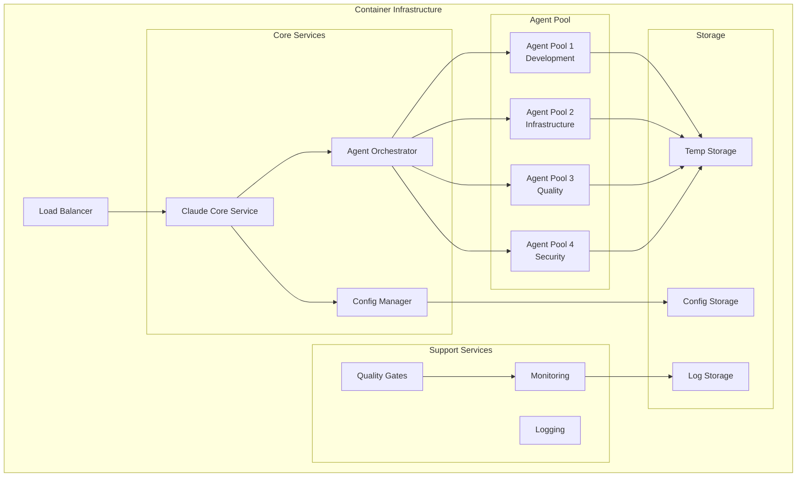

# Container Infrastructure Setup Guide

## Overview

This guide covers containerized deployment of the Claude Configuration Repository using Docker and Kubernetes for scalable, production-ready infrastructure supporting multi-agent orchestration and high-availability configurations.

## Container Architecture

### System Components

The containerized Claude infrastructure consists of:

- **Claude Core Container**: Main Claude Code CLI with configuration management
- **Agent Orchestration Layer**: Distributed agent execution environment
- **Configuration Management**: Centralized config synchronization
- **Quality Gate Services**: Automated validation and testing pipelines
- **Monitoring and Logging**: Observability stack for performance tracking

### Architecture Diagram



## Docker Setup

### 1. Base Infrastructure

##### Directory Structure:

```text
docker/
├── Dockerfile.claude-core       # Main Claude service
├── Dockerfile.agent-pool       # Agent execution environment
├── Dockerfile.config-manager   # Configuration management
├── docker-compose.yml          # Development environment
├── docker-compose.prod.yml     # Production environment
├── .dockerignore               # Docker ignore patterns
├── scripts/
│   ├── build-images.sh         # Image building automation
│   ├── deploy-stack.sh         # Stack deployment
│   └── health-check.sh         # Container health monitoring
└── configs/
    ├── nginx.conf              # Load balancer config
    ├── prometheus.yml          # Monitoring config
    └── grafana/                # Dashboards
```

### 2. Core Service Dockerfile

##### Dockerfile.claude-core:

```dockerfile
# Multi-stage build for Claude Core Service
FROM node:18-alpine AS builder

# Install build dependencies
RUN apk add --no-cache \
    git \
    python3 \
    py3-pip \
    make \
    g++ \
    bash

# Set working directory
WORKDIR /app

# Copy package files
COPY package*.json ./
COPY requirements.txt ./

# Install Node.js dependencies
RUN npm ci --only=production

# Install Python dependencies
RUN pip3 install -r requirements.txt

# Copy application code
COPY . .

# Build application
RUN npm run build || true

# Production stage
FROM node:18-alpine AS production

# Add non-root user
RUN addgroup -g 1001 -S claude && \
    adduser -S claude -u 1001 -G claude

# Install runtime dependencies
RUN apk add --no-cache \
    git \
    python3 \
    py3-pip \
    bash \
    curl \
    jq

# Install Claude Code CLI
RUN npm install -g @anthropic/claude-code

# Set working directory
WORKDIR /app

# Copy built application
COPY --from=builder --chown=claude:claude /app .

# Create necessary directories
RUN mkdir -p /app/.claude /app/.tmp /app/logs && \
    chown -R claude:claude /app

# Switch to non-root user
USER claude

# Health check
HEALTHCHECK --interval=30s --timeout=10s --start-period=5s --retries=3 \
    CMD curl -f http://localhost:8080/health || exit 1

# Expose port
EXPOSE 8080

# Start application
CMD ["npm", "start"]
```

### 3. Agent Pool Dockerfile

##### Dockerfile.agent-pool:

```dockerfile
FROM python:3.11-slim

# Install system dependencies
RUN apt-get update && apt-get install -y \
    git \
    curl \
    nodejs \
    npm \
    && apt-get clean \
    && rm -rf /var/lib/apt/lists/*

# Install Claude Code CLI
RUN npm install -g @anthropic/claude-code

# Create non-root user
RUN useradd -m -u 1001 agent-runner

# Set working directory
WORKDIR /app

# Copy requirements
COPY requirements.txt .

# Install Python dependencies
RUN pip install --no-cache-dir -r requirements.txt

# Copy agent execution framework
COPY --chown=agent-runner:agent-runner agent-pool/ .

# Create necessary directories
RUN mkdir -p /app/logs /app/.tmp && \
    chown -R agent-runner:agent-runner /app

# Switch to non-root user
USER agent-runner

# Health check for agent pool
HEALTHCHECK --interval=60s --timeout=30s --start-period=10s --retries=3 \
    CMD python health_check.py || exit 1

# Start agent pool service
CMD ["python", "agent_pool_service.py"]
```

### 4. Configuration Manager Dockerfile

##### Dockerfile.config-manager:

```dockerfile
FROM alpine:3.18

# Install dependencies
RUN apk add --no-cache \
    bash \
    git \
    curl \
    jq \
    yq \
    python3 \
    py3-pip

# Install YAML processing tools
RUN pip3 install --no-cache-dir \
    pyyaml \
    jsonschema \
    watchdog

# Create non-root user
RUN addgroup -g 1001 -S config && \
    adduser -S config -u 1001 -G config

# Set working directory
WORKDIR /app

# Copy configuration management scripts
COPY --chown=config:config config-manager/ .
COPY --chown=config:config scripts/ ./scripts/

# Make scripts executable
RUN chmod +x scripts/*.sh

# Create necessary directories
RUN mkdir -p /app/configs /app/backups /app/logs && \
    chown -R config:config /app

# Switch to non-root user
USER config

# Health check
HEALTHCHECK --interval=30s --timeout=10s --start-period=5s --retries=3 \
    CMD ./scripts/config-health-check.sh || exit 1

# Start configuration manager
CMD ["python3", "config_manager.py"]
```

### 5. Docker Compose Configuration

##### docker-compose.yml (Development):

```yaml
version: '3.8'

services:
  claude-core:
    build:
      context: .
      dockerfile: docker/Dockerfile.claude-core
    container_name: claude-core
    ports:
      - "8080:8080"
    environment:
      - NODE_ENV=development
      - CLAUDE_DEBUG=true
      - CLAUDE_LOG_LEVEL=debug
    volumes:
      - ./system-configs:/app/system-configs:ro
      - claude-configs:/app/.claude
      - claude-temp:/app/.tmp
      - ./logs:/app/logs
    depends_on:
      - config-manager
      - redis
    networks:
      - claude-network
    restart: unless-stopped

  agent-pool-dev:
    build:
      context: .
      dockerfile: docker/Dockerfile.agent-pool
    container_name: agent-pool-dev
    environment:
      - AGENT_POOL_TYPE=development
      - CLAUDE_AGENT_TIMEOUT=300
      - CLAUDE_MAX_PARALLEL_AGENTS=4
    volumes:
      - claude-configs:/app/.claude:ro
      - claude-temp:/app/.tmp
      - ./logs:/app/logs
    depends_on:
      - claude-core
      - redis
    networks:
      - claude-network
    restart: unless-stopped

  agent-pool-infra:
    build:
      context: .
      dockerfile: docker/Dockerfile.agent-pool
    container_name: agent-pool-infra
    environment:
      - AGENT_POOL_TYPE=infrastructure
      - CLAUDE_AGENT_TIMEOUT=300
      - CLAUDE_MAX_PARALLEL_AGENTS=4
    volumes:
      - claude-configs:/app/.claude:ro
      - claude-temp:/app/.tmp
      - ./logs:/app/logs
    depends_on:
      - claude-core
      - redis
    networks:
      - claude-network
    restart: unless-stopped

  config-manager:
    build:
      context: .
      dockerfile: docker/Dockerfile.config-manager
    container_name: config-manager
    environment:
      - CONFIG_SYNC_INTERVAL=60
      - CONFIG_VALIDATION_ENABLED=true
    volumes:
      - ./system-configs:/app/source-configs:ro
      - claude-configs:/app/configs
      - ./backups:/app/backups
      - ./logs:/app/logs
    networks:
      - claude-network
    restart: unless-stopped

  redis:
    image: redis:7-alpine
    container_name: claude-redis
    command: redis-server --appendonly yes
    volumes:
      - redis-data:/data
    networks:
      - claude-network
    restart: unless-stopped

  nginx:
    image: nginx:alpine
    container_name: claude-nginx
    ports:
      - "80:80"
      - "443:443"
    volumes:
      - ./docker/configs/nginx.conf:/etc/nginx/nginx.conf:ro
      - ./ssl:/etc/nginx/ssl:ro
    depends_on:
      - claude-core
    networks:
      - claude-network
    restart: unless-stopped

volumes:
  claude-configs:
    driver: local
  claude-temp:
    driver: local
  redis-data:
    driver: local

networks:
  claude-network:
    driver: bridge
    ipam:
      config:
        - subnet: 172.20.0.0/16
```

##### docker-compose.prod.yml (Production):

```yaml
version: '3.8'

services:
  claude-core:
    build:
      context: .
      dockerfile: docker/Dockerfile.claude-core
    deploy:
      replicas: 2
      resources:
        limits:
          cpus: '1.0'
          memory: 2G
        reservations:
          cpus: '0.5'
          memory: 1G
      restart_policy:
        condition: on-failure
        delay: 5s
        max_attempts: 3
      update_config:
        parallelism: 1
        delay: 30s
        failure_action: rollback
    environment:
      - NODE_ENV=production
      - CLAUDE_DEBUG=false
      - CLAUDE_LOG_LEVEL=info
      - CLAUDE_MAX_PARALLEL_AGENTS=8
    volumes:
      - claude-configs:/app/.claude:ro
      - claude-temp:/app/.tmp
    networks:
      - claude-network
    healthcheck:
      test: ["CMD", "curl", "-f", "http://localhost:8080/health"]
      interval: 30s
      timeout: 10s
      retries: 3
      start_period: 40s

  agent-pool-dev:
    build:
      context: .
      dockerfile: docker/Dockerfile.agent-pool
    deploy:
      replicas: 2
      resources:
        limits:
          cpus: '0.8'
          memory: 1.5G
        reservations:
          cpus: '0.4'
          memory: 512M
      restart_policy:
        condition: on-failure
        delay: 10s
        max_attempts: 3
    environment:
      - AGENT_POOL_TYPE=development
      - CLAUDE_AGENT_TIMEOUT=300
      - CLAUDE_MAX_PARALLEL_AGENTS=6
    volumes:
      - claude-configs:/app/.claude:ro
      - claude-temp:/app/.tmp
    networks:
      - claude-network

  agent-pool-infra:
    build:
      context: .
      dockerfile: docker/Dockerfile.agent-pool
    deploy:
      replicas: 2
      resources:
        limits:
          cpus: '0.8'
          memory: 1.5G
        reservations:
          cpus: '0.4'
          memory: 512M
      restart_policy:
        condition: on-failure
        delay: 10s
        max_attempts: 3
    environment:
      - AGENT_POOL_TYPE=infrastructure
      - CLAUDE_AGENT_TIMEOUT=300
      - CLAUDE_MAX_PARALLEL_AGENTS=6
    volumes:
      - claude-configs:/app/.claude:ro
      - claude-temp:/app/.tmp
    networks:
      - claude-network

  config-manager:
    build:
      context: .
      dockerfile: docker/Dockerfile.config-manager
    deploy:
      replicas: 1
      resources:
        limits:
          cpus: '0.5'
          memory: 512M
        reservations:
          cpus: '0.2'
          memory: 256M
      restart_policy:
        condition: on-failure
        delay: 5s
        max_attempts: 3
    environment:
      - CONFIG_SYNC_INTERVAL=30
      - CONFIG_VALIDATION_ENABLED=true
    volumes:
      - claude-configs:/app/configs
    networks:
      - claude-network

  redis:
    image: redis:7-alpine
    deploy:
      replicas: 1
      resources:
        limits:
          cpus: '0.3'
          memory: 256M
        reservations:
          cpus: '0.1'
          memory: 128M
      restart_policy:
        condition: on-failure
    command: redis-server --appendonly yes --maxmemory 256mb --maxmemory-policy allkeys-lru
    volumes:
      - redis-data:/data
    networks:
      - claude-network

  prometheus:
    image: prom/prometheus:latest
    deploy:
      replicas: 1
      resources:
        limits:
          cpus: '0.5'
          memory: 512M
    ports:
      - "9090:9090"
    volumes:
      - ./docker/configs/prometheus.yml:/etc/prometheus/prometheus.yml:ro
      - prometheus-data:/prometheus
    command:
      - '--config.file=/etc/prometheus/prometheus.yml'
      - '--storage.tsdb.path=/prometheus'
      - '--web.console.libraries=/etc/prometheus/console_libraries'
      - '--web.console.templates=/etc/prometheus/consoles'
      - '--storage.tsdb.retention.time=200h'
      - '--web.enable-lifecycle'
    networks:
      - claude-network

  grafana:
    image: grafana/grafana:latest
    deploy:
      replicas: 1
      resources:
        limits:
          cpus: '0.3'
          memory: 256M
    ports:
      - "3000:3000"
    environment:
      - GF_SECURITY_ADMIN_PASSWORD=admin
    volumes:
      - grafana-data:/var/lib/grafana
      - ./docker/configs/grafana/dashboards:/etc/grafana/provisioning/dashboards:ro
    networks:
      - claude-network

volumes:
  claude-configs:
    driver: local
  claude-temp:
    driver: local
  redis-data:
    driver: local
  prometheus-data:
    driver: local
  grafana-data:
    driver: local

networks:
  claude-network:
    driver: overlay
    attachable: true
```

## Kubernetes Deployment

### 1. Kubernetes Manifests

##### namespace.yaml:

```yaml
apiVersion: v1
kind: Namespace
metadata:
  name: claude-system
  labels:
    name: claude-system
    tier: infrastructure
---
apiVersion: v1
kind: ResourceQuota
metadata:
  name: claude-system-quota
  namespace: claude-system
spec:
  hard:
    requests.cpu: "4"
    requests.memory: 8Gi
    limits.cpu: "8"
    limits.memory: 16Gi
    persistentvolumeclaims: "10"
```

##### configmap.yaml:

```yaml
apiVersion: v1
kind: ConfigMap
metadata:
  name: claude-config
  namespace: claude-system
data:
  claude.conf: |
    # Claude Core Configuration
    NODE_ENV=production
    CLAUDE_LOG_LEVEL=info
    CLAUDE_MAX_PARALLEL_AGENTS=8
    CLAUDE_AGENT_TIMEOUT=300
    CLAUDE_ORCHESTRATION_MODE=true

    # Redis Configuration
    REDIS_HOST=redis-service
    REDIS_PORT=6379

    # Monitoring
    METRICS_ENABLED=true
    HEALTH_CHECK_INTERVAL=30
---
apiVersion: v1
kind: ConfigMap
metadata:
  name: nginx-config
  namespace: claude-system
data:
  nginx.conf: |
    upstream claude_backend {
        server claude-core-service:8080 max_fails=3 fail_timeout=30s;
    }

    server {
        listen 80;
        server_name _;

        location /health {
            access_log off;
            return 200 "OK\n";
            add_header Content-Type text/plain;
        }

        location / {
            proxy_pass http://claude_backend;
            proxy_set_header Host $host;
            proxy_set_header X-Real-IP $remote_addr;
            proxy_set_header X-Forwarded-For $proxy_add_x_forwarded_for;
            proxy_set_header X-Forwarded-Proto $scheme;
            proxy_connect_timeout 60s;
            proxy_send_timeout 60s;
            proxy_read_timeout 60s;
        }
    }
```

##### deployment.yaml:

```yaml
apiVersion: apps/v1
kind: Deployment
metadata:
  name: claude-core
  namespace: claude-system
  labels:
    app: claude-core
    tier: core
spec:
  replicas: 2
  selector:
    matchLabels:
      app: claude-core
  template:
    metadata:
      labels:
        app: claude-core
        tier: core
    spec:
      containers:
      - name: claude-core
        image: claude-config/claude-core:latest
        ports:
        - containerPort: 8080
        env:
        - name: NODE_ENV
          value: "production"
        - name: CLAUDE_LOG_LEVEL
          value: "info"
        - name: REDIS_HOST
          value: "redis-service"
        envFrom:
        - configMapRef:
            name: claude-config
        resources:
          requests:
            cpu: 500m
            memory: 1Gi
          limits:
            cpu: 1
            memory: 2Gi
        livenessProbe:
          httpGet:
            path: /health
            port: 8080
          initialDelaySeconds: 30
          periodSeconds: 30
          timeoutSeconds: 10
          failureThreshold: 3
        readinessProbe:
          httpGet:
            path: /ready
            port: 8080
          initialDelaySeconds: 10
          periodSeconds: 10
          timeoutSeconds: 5
          failureThreshold: 2
        volumeMounts:
        - name: claude-configs
          mountPath: /app/.claude
          readOnly: true
        - name: temp-storage
          mountPath: /app/.tmp
      volumes:
      - name: claude-configs
        persistentVolumeClaim:
          claimName: claude-configs-pvc
      - name: temp-storage
        emptyDir:
          sizeLimit: 1Gi
      restartPolicy: Always
      nodeSelector:
        kubernetes.io/arch: amd64
---
apiVersion: apps/v1
kind: Deployment
metadata:
  name: agent-pool-dev
  namespace: claude-system
  labels:
    app: agent-pool
    pool-type: development
spec:
  replicas: 2
  selector:
    matchLabels:
      app: agent-pool
      pool-type: development
  template:
    metadata:
      labels:
        app: agent-pool
        pool-type: development
    spec:
      containers:
      - name: agent-pool
        image: claude-config/agent-pool:latest
        env:
        - name: AGENT_POOL_TYPE
          value: "development"
        - name: CLAUDE_MAX_PARALLEL_AGENTS
          value: "6"
        - name: REDIS_HOST
          value: "redis-service"
        resources:
          requests:
            cpu: 400m
            memory: 512Mi
          limits:
            cpu: 800m
            memory: 1.5Gi
        volumeMounts:
        - name: claude-configs
          mountPath: /app/.claude
          readOnly: true
        - name: temp-storage
          mountPath: /app/.tmp
      volumes:
      - name: claude-configs
        persistentVolumeClaim:
          claimName: claude-configs-pvc
      - name: temp-storage
        emptyDir:
          sizeLimit: 500Mi
```

##### service.yaml:

```yaml
apiVersion: v1
kind: Service
metadata:
  name: claude-core-service
  namespace: claude-system
  labels:
    app: claude-core
spec:
  selector:
    app: claude-core
  ports:
  - protocol: TCP
    port: 8080
    targetPort: 8080
  type: ClusterIP
---
apiVersion: v1
kind: Service
metadata:
  name: redis-service
  namespace: claude-system
  labels:
    app: redis
spec:
  selector:
    app: redis
  ports:
  - protocol: TCP
    port: 6379
    targetPort: 6379
  type: ClusterIP
---
apiVersion: v1
kind: Service
metadata:
  name: claude-nginx
  namespace: claude-system
  labels:
    app: nginx
spec:
  selector:
    app: nginx
  ports:
  - protocol: TCP
    port: 80
    targetPort: 80
  type: LoadBalancer
```

##### storage.yaml:

```yaml
apiVersion: v1
kind: PersistentVolumeClaim
metadata:
  name: claude-configs-pvc
  namespace: claude-system
spec:
  accessModes:
    - ReadWriteMany
  resources:
    requests:
      storage: 5Gi
  storageClassName: fast-ssd
---
apiVersion: v1
kind: PersistentVolumeClaim
metadata:
  name: redis-data-pvc
  namespace: claude-system
spec:
  accessModes:
    - ReadWriteOnce
  resources:
    requests:
      storage: 2Gi
  storageClassName: fast-ssd
```

### 2. Helm Chart Structure

##### Chart.yaml:

```yaml
apiVersion: v2
name: claude-config
description: Claude Configuration Repository Kubernetes Deployment
type: application
version: 2.1.0
appVersion: "2.1.0"
keywords:
  - ai
  - claude
  - orchestration
  - agents
maintainers:
  - name: Claude Config Team
    email: maintainers@claude-config.io
sources:
  - https://github.com/damilola-elegbede/claude-config
```

##### values.yaml:

```yaml
# Default values for claude-config
global:
  imageRegistry: ""
  imagePullSecrets: []
  storageClass: "fast-ssd"

claudeCore:
  replicaCount: 2
  image:
    repository: claude-config/claude-core
    tag: "latest"
    pullPolicy: IfNotPresent

  service:
    type: ClusterIP
    port: 8080

  resources:
    requests:
      cpu: 500m
      memory: 1Gi
    limits:
      cpu: 1
      memory: 2Gi

  autoscaling:
    enabled: true
    minReplicas: 2
    maxReplicas: 10
    targetCPUUtilizationPercentage: 70
    targetMemoryUtilizationPercentage: 80

agentPools:
  development:
    enabled: true
    replicaCount: 2
    maxParallelAgents: 6
    resources:
      requests:
        cpu: 400m
        memory: 512Mi
      limits:
        cpu: 800m
        memory: 1.5Gi

  infrastructure:
    enabled: true
    replicaCount: 2
    maxParallelAgents: 4
    resources:
      requests:
        cpu: 300m
        memory: 512Mi
      limits:
        cpu: 600m
        memory: 1Gi

redis:
  enabled: true
  architecture: standalone
  auth:
    enabled: false
  master:
    persistence:
      enabled: true
      size: 2Gi
      storageClass: "fast-ssd"

nginx:
  enabled: true
  replicaCount: 2
  service:
    type: LoadBalancer
    port: 80

monitoring:
  prometheus:
    enabled: true
  grafana:
    enabled: true
    adminPassword: "admin123"

persistence:
  configs:
    enabled: true
    size: 5Gi
    storageClass: "fast-ssd"
    accessMode: ReadWriteMany
```

## Deployment Scripts

### 1. Build and Deploy Script

##### scripts/deploy-stack.sh:

```bash
#!/bin/bash
set -euo pipefail

# Claude Configuration Container Deployment Script
SCRIPT_DIR="$(cd "$(dirname "${BASH_SOURCE[0]}")" && pwd)"
PROJECT_DIR="$(dirname "$SCRIPT_DIR")"

# Configuration
ENVIRONMENT=${1:-development}
REGISTRY=${DOCKER_REGISTRY:-claude-config}
TAG=${DOCKER_TAG:-latest}

echo "🚀 Deploying Claude Configuration Stack"
echo "Environment: $ENVIRONMENT"
echo "Registry: $REGISTRY"
echo "Tag: $TAG"

# Build Docker images
echo "📦 Building Docker images..."
docker build -t "$REGISTRY/claude-core:$TAG" -f docker/Dockerfile.claude-core .
docker build -t "$REGISTRY/agent-pool:$TAG" -f docker/Dockerfile.agent-pool .
docker build -t "$REGISTRY/config-manager:$TAG" -f docker/Dockerfile.config-manager .

# Push to registry if not local
if [[ "$REGISTRY" != "claude-config" ]]; then
    echo "📤 Pushing images to registry..."
    docker push "$REGISTRY/claude-core:$TAG"
    docker push "$REGISTRY/agent-pool:$TAG"
    docker push "$REGISTRY/config-manager:$TAG"
fi

# Deploy based on environment
case "$ENVIRONMENT" in
    "development"|"dev")
        echo "🧪 Deploying development environment..."
        docker-compose -f docker-compose.yml up -d
        ;;
    "production"|"prod")
        echo "🏭 Deploying production environment..."
        docker-compose -f docker-compose.prod.yml up -d
        ;;
    "kubernetes"|"k8s")
        echo "☸️ Deploying to Kubernetes..."
        kubectl apply -f k8s/namespace.yaml
        kubectl apply -f k8s/configmap.yaml
        kubectl apply -f k8s/storage.yaml
        kubectl apply -f k8s/deployment.yaml
        kubectl apply -f k8s/service.yaml
        ;;
    *)
        echo "❌ Unknown environment: $ENVIRONMENT"
        echo "Available options: development, production, kubernetes"
        exit 1
        ;;
esac

# Wait for services to be ready
echo "⏳ Waiting for services to be ready..."
sleep 30

# Run health checks
echo "🔍 Running health checks..."
./scripts/health-check.sh

echo "✅ Deployment completed successfully!"
```

### 2. Health Check Script

##### scripts/health-check.sh:

```bash
#!/bin/bash
set -euo pipefail

# Health check for containerized Claude services
echo "🏥 Running health checks for Claude services..."

# Function to check HTTP endpoint
check_endpoint() {
    local url=$1
    local service=$2
    local max_attempts=30
    local attempt=1

    echo "Checking $service at $url..."

    while [ $attempt -le $max_attempts ]; do
        if curl -sf "$url" > /dev/null 2>&1; then
            echo "✅ $service is healthy"
            return 0
        fi

        echo "⏳ Attempt $attempt/$max_attempts failed, retrying in 5s..."
        sleep 5
        ((attempt++))
    done

    echo "❌ $service health check failed after $max_attempts attempts"
    return 1
}

# Function to check Docker container
check_container() {
    local container_name=$1

    if docker ps --format 'table {{.Names}}\t{{.Status}}' | grep -q "$container_name.*Up"; then
        echo "✅ Container $container_name is running"
        return 0
    else
        echo "❌ Container $container_name is not running"
        return 1
    fi
}

# Function to check Kubernetes pods
check_k8s_pods() {
    local namespace=${1:-claude-system}

    echo "Checking Kubernetes pods in namespace $namespace..."

    if kubectl get pods -n "$namespace" --no-headers | awk '{print $3}' | grep -qv "Running"; then
        echo "❌ Some pods are not running:"
        kubectl get pods -n "$namespace"
        return 1
    else
        echo "✅ All pods are running"
        kubectl get pods -n "$namespace"
        return 0
    fi
}

# Detect environment and run appropriate checks
if kubectl version --client > /dev/null 2>&1 && kubectl cluster-info > /dev/null 2>&1; then
    echo "🔍 Kubernetes environment detected"
    check_k8s_pods

    # Check services via port-forward if LoadBalancer not ready
    CLAUDE_URL="http://localhost:8080"
    if kubectl get service claude-nginx -n claude-system -o jsonpath='{.status.loadBalancer.ingress[0].ip}' 2>/dev/null; then
        EXTERNAL_IP=$(kubectl get service claude-nginx -n claude-system -o jsonpath='{.status.loadBalancer.ingress[0].ip}')
        CLAUDE_URL="http://$EXTERNAL_IP"
    fi

elif docker-compose ps > /dev/null 2>&1; then
    echo "🔍 Docker Compose environment detected"

    # Check containers
    check_container "claude-core"
    check_container "config-manager"
    check_container "claude-redis"

    # Check endpoints
    CLAUDE_URL="http://localhost:8080"

else
    echo "❌ No supported container environment detected"
    exit 1
fi

# Health check endpoints
echo "🌐 Checking service endpoints..."
check_endpoint "$CLAUDE_URL/health" "Claude Core"

# Performance test
echo "🚀 Running performance test..."
start_time=$(date +%s)
if curl -sf "$CLAUDE_URL/api/agent-audit" > /dev/null 2>&1; then
    end_time=$(date +%s)
    duration=$((end_time - start_time))
    echo "✅ Agent audit completed in ${duration}s"

    if [ $duration -lt 60 ]; then
        echo "🎯 Performance target met (< 60s)"
    else
        echo "⚠️ Performance slower than expected (> 60s)"
    fi
else
    echo "❌ Performance test failed"
fi

echo "🏥 Health check completed"
```

## Monitoring and Observability

### 1. Prometheus Configuration

##### configs/prometheus.yml:

```yaml
global:
  scrape_interval: 15s
  evaluation_interval: 15s

rule_files:
  - "claude_rules.yml"

alerting:
  alertmanagers:
    - static_configs:
        - targets:
          - alertmanager:9093

scrape_configs:
  - job_name: 'claude-core'
    static_configs:
      - targets: ['claude-core-service:8080']
    metrics_path: '/metrics'
    scrape_interval: 30s

  - job_name: 'agent-pools'
    static_configs:
      - targets:
        - 'agent-pool-dev:8080'
        - 'agent-pool-infra:8080'
    metrics_path: '/metrics'
    scrape_interval: 30s

  - job_name: 'redis'
    static_configs:
      - targets: ['redis-service:6379']

  - job_name: 'kubernetes-pods'
    kubernetes_sd_configs:
      - role: pod
        namespaces:
          names:
            - claude-system
    relabel_configs:
      - source_labels: [__meta_kubernetes_pod_annotation_prometheus_io_scrape]
        action: keep
        regex: true
```

### 2. Grafana Dashboard

##### configs/grafana/dashboards/claude-overview.json:

```json
{
  "dashboard": {
    "title": "Claude Configuration Overview",
    "tags": ["claude", "agents", "orchestration"],
    "panels": [
      {
        "title": "Agent Execution Performance",
        "type": "graph",
        "targets": [
          {
            "expr": "avg(claude_agent_execution_time_seconds)",
            "legendFormat": "Avg Execution Time"
          }
        ]
      },
      {
        "title": "Active Agent Pools",
        "type": "singlestat",
        "targets": [
          {
            "expr": "count(up{job=\"agent-pools\"} == 1)",
            "legendFormat": "Active Pools"
          }
        ]
      },
      {
        "title": "Request Rate",
        "type": "graph",
        "targets": [
          {
            "expr": "rate(claude_requests_total[5m])",
            "legendFormat": "Requests/sec"
          }
        ]
      }
    ]
  }
}
```

## Security Configuration

### 1. Container Security

##### Security Best Practices:

```bash
# Run containers as non-root
USER claude:claude

# Read-only filesystems where possible
--read-only
--tmpfs /tmp:rw,noexec,nosuid,size=100m

# Resource limits
--memory 2g
--cpus 1.0
--ulimit nofile=1024:2048

# Network security
--network claude-network
--no-new-privileges

# Secrets management
--env-file /run/secrets/claude-env
```

### 2. Kubernetes Security

##### security-policy.yaml:

```yaml
apiVersion: policy/v1beta1
kind: PodSecurityPolicy
metadata:
  name: claude-psp
  namespace: claude-system
spec:
  privileged: false
  allowPrivilegeEscalation: false
  requiredDropCapabilities:
    - ALL
  volumes:
    - 'configMap'
    - 'emptyDir'
    - 'projected'
    - 'secret'
    - 'downwardAPI'
    - 'persistentVolumeClaim'
  runAsUser:
    rule: 'MustRunAsNonRoot'
  seLinux:
    rule: 'RunAsAny'
  fsGroup:
    rule: 'RunAsAny'
```

## Troubleshooting

### Common Container Issues

##### Issue: Container fails to start

```bash
# Check container logs
docker logs claude-core
docker logs agent-pool-dev

# Check resource usage
docker stats

# Restart services
docker-compose restart
```

##### Issue: Health checks failing

```bash
# Check service endpoints
curl -v http://localhost:8080/health

# Check container networking
docker network inspect claude-network

# Verify configuration
docker exec claude-core cat /app/.claude/CLAUDE.md
```

##### Issue: Poor performance in containers

```bash
# Monitor resource usage
docker stats --no-stream

# Check disk I/O
docker exec claude-core iostat -x 1

# Optimize container resources
docker-compose up -d --scale agent-pool-dev=4
```

## Next Steps

After setting up container infrastructure:

1. **Configure Monitoring**: Set up [monitoring and alerting](../monitoring/MONITORING_SETUP.md)
2. **Deploy to Production**: Follow [production deployment guide](PRODUCTION_DEPLOYMENT.md)
3. **Set Up CI/CD**: Configure [deployment pipelines](DEPLOYMENT_PIPELINES.md)
4. **Security Hardening**: Implement [security best practices](../security/SECURITY_HARDENING.md)

Your Claude Configuration Repository is now ready for scalable, production-grade container deployment with comprehensive monitoring and security.
