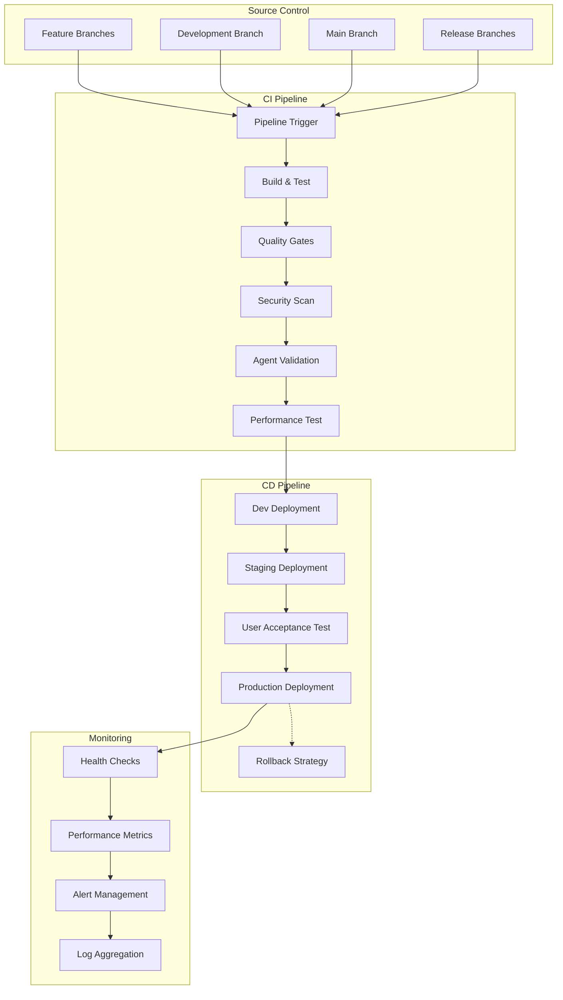

# Deployment Pipeline Setup Guide

## Overview

This guide provides comprehensive instructions for setting up automated deployment pipelines for the Claude Configuration Repository, enabling continuous integration, continuous deployment, and automated quality assurance across multiple environments.

## Pipeline Architecture

### CI/CD Flow Overview



## GitHub Actions Implementation

### 1. Main CI/CD Pipeline

**.github/workflows/ci-cd.yml:**

```yaml
name: Claude Config CI/CD Pipeline

on:
  push:
    branches: [main, develop]
    paths:
      - 'system-configs/**'
      - 'scripts/**'
      - 'tests/**'
      - '.github/workflows/**'
  pull_request:
    branches: [main]
    paths:
      - 'system-configs/**'
      - 'scripts/**'
      - 'tests/**'
  release:
    types: [published]

env:
  NODE_VERSION: '18'
  PYTHON_VERSION: '3.11'
  DOCKER_REGISTRY: ghcr.io
  IMAGE_NAME: claude-config

concurrency:
  group: ${{ github.workflow }}-${{ github.ref }}
  cancel-in-progress: true

jobs:
  # Quality Gate Stage
  quality-gates:
    name: Quality Gates & Validation
    runs-on: ubuntu-latest
    timeout-minutes: 15

    steps:
    - name: Checkout repository
      uses: actions/checkout@v4
      with:
        fetch-depth: 0

    - name: Set up Python
      uses: actions/setup-python@v4
      with:
        python-version: ${{ env.PYTHON_VERSION }}
        cache: 'pip'

    - name: Set up Node.js
      uses: actions/setup-node@v4
      with:
        node-version: ${{ env.NODE_VERSION }}
        cache: 'npm'

    - name: Install dependencies
      run: |
        python -m pip install --upgrade pip
        pip install -r requirements.txt
        npm install -g @anthropic/claude-code markdownlint-cli

    - name: Validate markdown quality
      run: |
        ./scripts/validate-markdown-quality.sh
        markdownlint docs/ README.md CONTRIBUTING.md

    - name: Validate YAML structure
      run: |
        ./scripts/validate-agent-yaml.py
        python scripts/validate-yaml-schema.py

    - name: Run system validation
      run: ./scripts/validate-system.sh

    - name: Security scanning
      uses: github/super-linter@v5
      env:
        DEFAULT_BRANCH: main
        GITHUB_TOKEN: ${{ secrets.GITHUB_TOKEN }}
        VALIDATE_BASH: true
        VALIDATE_PYTHON: true
        VALIDATE_YAML: true
        VALIDATE_MARKDOWN: true
        VALIDATE_DOCKERFILE: true

    - name: Agent ecosystem health check
      run: |
        # Simulate agent validation without Claude CLI
        python scripts/mock-agent-audit.py

    outputs:
      validation-passed: ${{ steps.validate.outcome == 'success' }}

  # Build Stage
  build:
    name: Build and Package
    runs-on: ubuntu-latest
    needs: quality-gates
    timeout-minutes: 20

    steps:
    - name: Checkout repository
      uses: actions/checkout@v4

    - name: Set up Docker Buildx
      uses: docker/setup-buildx-action@v3

    - name: Log in to Container Registry
      uses: docker/login-action@v3
      with:
        registry: ${{ env.DOCKER_REGISTRY }}
        username: ${{ github.actor }}
        password: ${{ secrets.GITHUB_TOKEN }}

    - name: Extract metadata
      id: meta
      uses: docker/metadata-action@v5
      with:
        images: ${{ env.DOCKER_REGISTRY }}/${{ github.repository }}
        tags: |
          type=ref,event=branch
          type=ref,event=pr
          type=semver,pattern={{version}}
          type=semver,pattern={{major}}.{{minor}}
          type=sha,prefix={{branch}}-

    - name: Build and push Docker images
      uses: docker/build-push-action@v5
      with:
        context: .
        file: docker/Dockerfile.claude-core
        platforms: linux/amd64,linux/arm64
        push: true
        tags: ${{ steps.meta.outputs.tags }}
        labels: ${{ steps.meta.outputs.labels }}
        cache-from: type=gha
        cache-to: type=gha,mode=max

    - name: Build agent pool image
      uses: docker/build-push-action@v5
      with:
        context: .
        file: docker/Dockerfile.agent-pool
        platforms: linux/amd64,linux/arm64
        push: true
        tags: ${{ env.DOCKER_REGISTRY }}/${{ github.repository }}/agent-pool:${{ github.sha }}
        cache-from: type=gha
        cache-to: type=gha,mode=max

    - name: Generate SBOM
      uses: anchore/sbom-action@v0
      with:
        image: ${{ env.DOCKER_REGISTRY }}/${{ github.repository }}:${{ github.sha }}
        output-file: sbom.spdx.json
        format: spdx-json

    - name: Upload build artifacts
      uses: actions/upload-artifact@v4
      with:
        name: build-artifacts
        path: |
          sbom.spdx.json
          docker-compose.yml
          k8s/
        retention-days: 30

  # Test Stage
  test:
    name: Comprehensive Testing
    runs-on: ubuntu-latest
    needs: [quality-gates, build]
    timeout-minutes: 30

    strategy:
      matrix:
        test-category: [unit, integration, performance, security]

    steps:
    - name: Checkout repository
      uses: actions/checkout@v4

    - name: Set up test environment
      run: |
        docker-compose -f docker-compose.test.yml up -d
        sleep 30  # Wait for services to start

    - name: Run ${{ matrix.test-category }} tests
      run: |
        case "${{ matrix.test-category }}" in
          unit)
            ./tests/test.sh unit
            ;;
          integration)
            ./tests/test.sh integration
            ;;
          performance)
            ./tests/test.sh performance
            timeout 300 ./tests/performance-benchmark.sh
            ;;
          security)
            ./tests/test.sh security
            docker run --rm -v $(pwd):/app anchore/syft /app -o json > security-scan.json
            ;;
        esac

    - name: Upload test results
      uses: actions/upload-artifact@v4
      if: always()
      with:
        name: test-results-${{ matrix.test-category }}
        path: |
          test-results/
          coverage/
          security-scan.json
        retention-days: 30

    - name: Cleanup test environment
      if: always()
      run: docker-compose -f docker-compose.test.yml down -v

  # Development Deployment
  deploy-dev:
    name: Deploy to Development
    runs-on: ubuntu-latest
    needs: [build, test]
    if: github.ref == 'refs/heads/develop'
    environment: development
    timeout-minutes: 15

    steps:
    - name: Checkout repository
      uses: actions/checkout@v4

    - name: Configure kubectl
      uses: azure/k8s-set-context@v3
      with:
        method: kubeconfig
        kubeconfig: ${{ secrets.KUBE_CONFIG_DEV }}

    - name: Deploy to development
      run: |
        # Update image tags in manifests
        sed -i "s|IMAGE_TAG|${{ github.sha }}|g" k8s/overlays/development/*.yaml

        # Apply Kubernetes manifests
        kubectl apply -k k8s/overlays/development/

        # Wait for rollout to complete
        kubectl rollout status deployment/claude-core -n claude-dev --timeout=600s
        kubectl rollout status deployment/agent-pool-dev -n claude-dev --timeout=600s

    - name: Run deployment tests
      run: |
        # Health check
        kubectl wait --for=condition=ready pod -l app=claude-core -n claude-dev --timeout=300s

        # Functional tests
        ./tests/deployment-tests.sh development

    - name: Update deployment status
      uses: actions/github-script@v7
      with:
        script: |
          github.rest.repos.createDeploymentStatus({
            owner: context.repo.owner,
            repo: context.repo.repo,
            deployment_id: '${{ steps.deployment.outputs.deployment-id }}',
            state: 'success',
            environment_url: 'https://claude-dev.example.com'
          });

  # Staging Deployment
  deploy-staging:
    name: Deploy to Staging
    runs-on: ubuntu-latest
    needs: [deploy-dev]
    if: github.ref == 'refs/heads/main'
    environment: staging
    timeout-minutes: 20

    steps:
    - name: Checkout repository
      uses: actions/checkout@v4

    - name: Configure kubectl
      uses: azure/k8s-set-context@v3
      with:
        method: kubeconfig
        kubeconfig: ${{ secrets.KUBE_CONFIG_STAGING }}

    - name: Deploy to staging
      run: |
        # Blue-green deployment strategy
        ./scripts/blue-green-deploy.sh staging ${{ github.sha }}

    - name: Run staging validation
      run: |
        ./tests/staging-validation.sh
        ./tests/performance-baseline.sh staging

    - name: Notify stakeholders
      uses: 8398a7/action-slack@v3
      with:
        status: ${{ job.status }}
        channel: '#deployments'
        text: 'Staging deployment completed - Ready for UAT'
      env:
        SLACK_WEBHOOK_URL: ${{ secrets.SLACK_WEBHOOK }}

  # Production Deployment
  deploy-production:
    name: Deploy to Production
    runs-on: ubuntu-latest
    needs: [deploy-staging]
    if: github.event_name == 'release'
    environment: production
    timeout-minutes: 30

    steps:
    - name: Checkout repository
      uses: actions/checkout@v4

    - name: Configure kubectl
      uses: azure/k8s-set-context@v3
      with:
        method: kubeconfig
        kubeconfig: ${{ secrets.KUBE_CONFIG_PROD }}

    - name: Pre-deployment checks
      run: |
        # Verify staging health
        ./scripts/pre-deployment-checks.sh

        # Database migration check
        ./scripts/check-migrations.sh

    - name: Deploy to production
      run: |
        # Canary deployment with 10% traffic
        ./scripts/canary-deploy.sh production ${{ github.sha }} 10

        # Monitor canary for 5 minutes
        sleep 300
        ./scripts/canary-health-check.sh

        # Full deployment if canary is healthy
        ./scripts/canary-deploy.sh production ${{ github.sha }} 100

    - name: Post-deployment validation
      run: |
        # Production smoke tests
        ./tests/production-smoke-tests.sh

        # Performance validation
        ./tests/production-performance-check.sh

        # Security validation
        ./tests/production-security-check.sh

    - name: Update release notes
      uses: actions/github-script@v7
      with:
        script: |
          const release = await github.rest.repos.getRelease({
            owner: context.repo.owner,
            repo: context.repo.repo,
            release_id: '${{ github.event.release.id }}'
          });

          const deploymentInfo = `
          ## Deployment Information
          - **Deployed at**: ${new Date().toISOString()}
          - **Commit SHA**: ${{ github.sha }}
          - **Environment**: Production
          - **Status**: ✅ Successfully deployed
          `;

          await github.rest.repos.updateRelease({
            owner: context.repo.owner,
            repo: context.repo.repo,
            release_id: '${{ github.event.release.id }}',
            body: release.data.body + deploymentInfo
          });

    - name: Notify success
      uses: 8398a7/action-slack@v3
      with:
        status: success
        channel: '#production-deployments'
        text: '🚀 Production deployment successful!'
      env:
        SLACK_WEBHOOK_URL: ${{ secrets.SLACK_WEBHOOK }}

  # Rollback Job
  rollback:
    name: Emergency Rollback
    runs-on: ubuntu-latest
    if: failure() && github.ref == 'refs/heads/main'
    needs: [deploy-production]
    environment: production

    steps:
    - name: Checkout repository
      uses: actions/checkout@v4

    - name: Configure kubectl
      uses: azure/k8s-set-context@v3
      with:
        method: kubeconfig
        kubeconfig: ${{ secrets.KUBE_CONFIG_PROD }}

    - name: Rollback deployment
      run: |
        # Get previous successful deployment
        PREVIOUS_SHA=$(git log --format="%H" -n 2 | tail -1)

        # Rollback to previous version
        ./scripts/rollback-deployment.sh production $PREVIOUS_SHA

    - name: Verify rollback
      run: |
        ./tests/rollback-verification.sh

    - name: Notify rollback
      uses: 8398a7/action-slack@v3
      with:
        status: failure
        channel: '#incidents'
        text: '🚨 Emergency rollback executed for production deployment'
      env:
        SLACK_WEBHOOK_URL: ${{ secrets.SLACK_WEBHOOK }}
```

### 2. Pull Request Validation

**.github/workflows/pr-validation.yml:**

```yaml
name: Pull Request Validation

on:
  pull_request:
    branches: [main, develop]

jobs:
  pr-quality-check:
    name: PR Quality Check
    runs-on: ubuntu-latest
    timeout-minutes: 10

    steps:
    - uses: actions/checkout@v4
      with:
        fetch-depth: 0

    - name: Validate PR title
      uses: amannn/action-semantic-pull-request@v5
      env:
        GITHUB_TOKEN: ${{ secrets.GITHUB_TOKEN }}

    - name: Check for breaking changes
      run: |
        # Check if system-configs/CLAUDE.md was modified
        if git diff --name-only origin/main...HEAD | grep -q "system-configs/CLAUDE.md"; then
          echo "⚠️ CLAUDE.md modification detected - potential breaking change"
          echo "breaking-change=true" >> $GITHUB_ENV
        fi

    - name: Agent configuration validation
      run: |
        ./scripts/validate-agent-yaml.py
        ./scripts/pr-agent-impact-analysis.sh

    - name: Performance impact analysis
      run: |
        ./scripts/performance-impact-analysis.sh

    - name: Generate PR summary
      uses: actions/github-script@v7
      with:
        script: |
          const fs = require('fs');
          const summary = fs.readFileSync('pr-summary.md', 'utf8');

          github.rest.issues.createComment({
            issue_number: context.issue.number,
            owner: context.repo.owner,
            repo: context.repo.repo,
            body: summary
          });

  pr-security-scan:
    name: PR Security Scan
    runs-on: ubuntu-latest

    steps:
    - uses: actions/checkout@v4

    - name: Run CodeQL Analysis
      uses: github/codeql-action/analyze@v3
      with:
        languages: python, javascript

    - name: Secret scanning
      uses: trufflesecurity/trufflehog@v3.63.2
      with:
        path: ./
        base: main
        head: HEAD
```

### 3. Release Automation

**.github/workflows/release.yml:**

```yaml
name: Release Automation

on:
  push:
    tags:
      - 'v*.*.*'

jobs:
  create-release:
    name: Create Release
    runs-on: ubuntu-latest

    steps:
    - uses: actions/checkout@v4
      with:
        fetch-depth: 0

    - name: Generate changelog
      run: |
        # Generate changelog since last tag
        git log $(git describe --tags --abbrev=0 HEAD^)..HEAD --pretty=format:"- %s" > CHANGELOG.md

    - name: Create release
      uses: actions/create-release@v1
      env:
        GITHUB_TOKEN: ${{ secrets.GITHUB_TOKEN }}
      with:
        tag_name: ${{ github.ref }}
        release_name: Release ${{ github.ref }}
        body_path: CHANGELOG.md
        draft: false
        prerelease: false
```

## GitLab CI/CD Implementation

### 1. Main Pipeline Configuration

**.gitlab-ci.yml:**

```yaml
stages:
  - validate
  - build
  - test
  - deploy-dev
  - deploy-staging
  - deploy-prod

variables:
  DOCKER_TLS_CERTDIR: "/certs"
  DOCKER_DRIVER: overlay2
  REGISTRY: $CI_REGISTRY
  IMAGE_TAG: $CI_COMMIT_SHA

# Quality Gates Stage
validate:markdown:
  stage: validate
  image: node:18-alpine
  script:
    - npm install -g markdownlint-cli
    - markdownlint docs/ README.md
    - ./scripts/validate-markdown-quality.sh
  rules:
    - changes:
      - "**/*.md"
      - "scripts/**/*"

validate:yaml:
  stage: validate
  image: python:3.11-alpine
  before_script:
    - pip install -r requirements.txt
  script:
    - ./scripts/validate-agent-yaml.py
    - python scripts/validate-yaml-schema.py
  artifacts:
    reports:
      junit: test-results/yaml-validation.xml
  rules:
    - changes:
      - "system-configs/**/*.md"
      - "scripts/**/*"

validate:system:
  stage: validate
  image: ubuntu:22.04
  before_script:
    - apt-get update && apt-get install -y bash curl jq
  script:
    - ./scripts/validate-system.sh
  artifacts:
    reports:
      junit: test-results/system-validation.xml

# Build Stage
build:docker:
  stage: build
  image: docker:24
  services:
    - docker:24-dind
  before_script:
    - docker login -u $CI_REGISTRY_USER -p $CI_REGISTRY_PASSWORD $CI_REGISTRY
  script:
    - docker build -t $REGISTRY/$CI_PROJECT_PATH/claude-core:$IMAGE_TAG -f docker/Dockerfile.claude-core .
    - docker build -t $REGISTRY/$CI_PROJECT_PATH/agent-pool:$IMAGE_TAG -f docker/Dockerfile.agent-pool .
    - docker push $REGISTRY/$CI_PROJECT_PATH/claude-core:$IMAGE_TAG
    - docker push $REGISTRY/$CI_PROJECT_PATH/agent-pool:$IMAGE_TAG
  rules:
    - if: '$CI_COMMIT_BRANCH == "main" || $CI_COMMIT_BRANCH == "develop"'

# Test Stage
test:integration:
  stage: test
  image: docker:24
  services:
    - docker:24-dind
  before_script:
    - docker-compose -f docker-compose.test.yml up -d
    - sleep 30
  script:
    - ./tests/test.sh integration
  after_script:
    - docker-compose -f docker-compose.test.yml down -v
  artifacts:
    reports:
      junit: test-results/integration-tests.xml

test:performance:
  stage: test
  image: docker:24
  services:
    - docker:24-dind
  script:
    - ./tests/performance-benchmark.sh
  artifacts:
    reports:
      performance: performance-results.json

# Development Deployment
deploy:dev:
  stage: deploy-dev
  image: bitnami/kubectl:latest
  before_script:
    - echo "$KUBE_CONFIG_DEV" | base64 -d > kubeconfig
    - export KUBECONFIG=kubeconfig
  script:
    - sed -i "s|IMAGE_TAG|$IMAGE_TAG|g" k8s/overlays/development/*.yaml
    - kubectl apply -k k8s/overlays/development/
    - kubectl rollout status deployment/claude-core -n claude-dev --timeout=600s
  environment:
    name: development
    url: https://claude-dev.example.com
  rules:
    - if: '$CI_COMMIT_BRANCH == "develop"'

# Staging Deployment
deploy:staging:
  stage: deploy-staging
  image: bitnami/kubectl:latest
  before_script:
    - echo "$KUBE_CONFIG_STAGING" | base64 -d > kubeconfig
    - export KUBECONFIG=kubeconfig
  script:
    - ./scripts/blue-green-deploy.sh staging $IMAGE_TAG
    - ./tests/staging-validation.sh
  environment:
    name: staging
    url: https://claude-staging.example.com
  rules:
    - if: '$CI_COMMIT_BRANCH == "main"'

# Production Deployment
deploy:prod:
  stage: deploy-prod
  image: bitnami/kubectl:latest
  when: manual
  before_script:
    - echo "$KUBE_CONFIG_PROD" | base64 -d > kubeconfig
    - export KUBECONFIG=kubeconfig
  script:
    - ./scripts/canary-deploy.sh production $IMAGE_TAG 10
    - sleep 300
    - ./scripts/canary-health-check.sh
    - ./scripts/canary-deploy.sh production $IMAGE_TAG 100
    - ./tests/production-smoke-tests.sh
  environment:
    name: production
    url: https://claude.example.com
  rules:
    - if: '$CI_COMMIT_TAG'
```

## Azure DevOps Pipelines

### 1. Main Pipeline Configuration

**azure-pipelines.yml:**

```yaml
trigger:
  branches:
    include:
    - main
    - develop
  paths:
    include:
    - system-configs/*
    - scripts/*
    - tests/*

pr:
  branches:
    include:
    - main
  paths:
    include:
    - system-configs/*
    - scripts/*
    - tests/*

variables:
  nodeVersion: '18'
  pythonVersion: '3.11'
  dockerRegistry: 'claudeconfig.azurecr.io'
  imageName: 'claude-config'

pool:
  vmImage: 'ubuntu-latest'

stages:
- stage: Validate
  displayName: 'Quality Gates & Validation'
  jobs:
  - job: QualityGates
    displayName: 'Quality Gates'
    steps:
    - task: UseNode@1
      inputs:
        version: $(nodeVersion)

    - task: UsePython@0
      inputs:
        versionSpec: $(pythonVersion)

    - script: |
        npm install -g @anthropic/claude-code markdownlint-cli
        pip install -r requirements.txt
      displayName: 'Install dependencies'

    - script: |
        ./scripts/validate-markdown-quality.sh
        markdownlint docs/ README.md
      displayName: 'Validate markdown'

    - script: |
        ./scripts/validate-agent-yaml.py
        python scripts/validate-yaml-schema.py
      displayName: 'Validate YAML'

    - script: ./scripts/validate-system.sh
      displayName: 'System validation'

    - task: PublishTestResults@2
      inputs:
        testResultsFormat: 'JUnit'
        testResultsFiles: 'test-results/*.xml'

- stage: Build
  displayName: 'Build & Package'
  dependsOn: Validate
  jobs:
  - job: BuildDocker
    displayName: 'Build Docker Images'
    steps:
    - task: Docker@2
      displayName: 'Build Claude Core image'
      inputs:
        repository: $(dockerRegistry)/$(imageName)/claude-core
        command: 'buildAndPush'
        Dockerfile: 'docker/Dockerfile.claude-core'
        tags: |
          $(Build.BuildId)
          latest

    - task: Docker@2
      displayName: 'Build Agent Pool image'
      inputs:
        repository: $(dockerRegistry)/$(imageName)/agent-pool
        command: 'buildAndPush'
        Dockerfile: 'docker/Dockerfile.agent-pool'
        tags: |
          $(Build.BuildId)
          latest

- stage: Test
  displayName: 'Testing'
  dependsOn: Build
  jobs:
  - job: IntegrationTests
    displayName: 'Integration Tests'
    steps:
    - script: |
        docker-compose -f docker-compose.test.yml up -d
        sleep 30
        ./tests/test.sh integration
        docker-compose -f docker-compose.test.yml down -v
      displayName: 'Run integration tests'

    - task: PublishTestResults@2
      inputs:
        testResultsFormat: 'JUnit'
        testResultsFiles: 'test-results/integration-tests.xml'

- stage: DeployDev
  displayName: 'Deploy to Development'
  dependsOn: Test
  condition: and(succeeded(), eq(variables['Build.SourceBranch'], 'refs/heads/develop'))
  jobs:
  - deployment: DeployToDev
    displayName: 'Deploy to Development'
    environment: 'development'
    strategy:
      runOnce:
        deploy:
          steps:
          - task: Kubernetes@1
            displayName: 'Deploy to dev cluster'
            inputs:
              connectionType: 'kubernetesServiceConnection'
              kubernetesServiceConnection: 'dev-cluster'
              command: 'apply'
              arguments: '-k k8s/overlays/development/'

- stage: DeployStaging
  displayName: 'Deploy to Staging'
  dependsOn: DeployDev
  condition: and(succeeded(), eq(variables['Build.SourceBranch'], 'refs/heads/main'))
  jobs:
  - deployment: DeployToStaging
    displayName: 'Deploy to Staging'
    environment: 'staging'
    strategy:
      runOnce:
        deploy:
          steps:
          - bash: ./scripts/blue-green-deploy.sh staging $(Build.BuildId)
            displayName: 'Blue-green deployment to staging'

- stage: DeployProd
  displayName: 'Deploy to Production'
  dependsOn: DeployStaging
  condition: and(succeeded(), startsWith(variables['Build.SourceBranch'], 'refs/tags/'))
  jobs:
  - deployment: DeployToProd
    displayName: 'Deploy to Production'
    environment: 'production'
    strategy:
      runOnce:
        deploy:
          steps:
          - bash: ./scripts/canary-deploy.sh production $(Build.BuildId) 10
            displayName: 'Canary deployment (10%)'

          - bash: sleep 300 && ./scripts/canary-health-check.sh
            displayName: 'Monitor canary health'

          - bash: ./scripts/canary-deploy.sh production $(Build.BuildId) 100
            displayName: 'Full deployment'
```

## Deployment Scripts

### 1. Blue-Green Deployment

**scripts/blue-green-deploy.sh:**

```bash
#!/bin/bash
set -euo pipefail

ENVIRONMENT=$1
IMAGE_TAG=$2
NAMESPACE="claude-${ENVIRONMENT}"

echo "🔄 Starting blue-green deployment to $ENVIRONMENT"

# Get current deployment
CURRENT_COLOR=$(kubectl get deployment claude-core -n $NAMESPACE -o jsonpath='{.metadata.labels.color}' || echo "blue")
NEW_COLOR="green"
if [[ "$CURRENT_COLOR" == "green" ]]; then
    NEW_COLOR="blue"
fi

echo "📊 Current color: $CURRENT_COLOR, New color: $NEW_COLOR"

# Deploy new version with new color
sed -i "s/IMAGE_TAG/${IMAGE_TAG}/g" k8s/overlays/${ENVIRONMENT}/deployment-${NEW_COLOR}.yaml
sed -i "s/COLOR_LABEL/${NEW_COLOR}/g" k8s/overlays/${ENVIRONMENT}/deployment-${NEW_COLOR}.yaml

kubectl apply -f k8s/overlays/${ENVIRONMENT}/deployment-${NEW_COLOR}.yaml

# Wait for new deployment to be ready
echo "⏳ Waiting for $NEW_COLOR deployment to be ready..."
kubectl rollout status deployment/claude-core-${NEW_COLOR} -n $NAMESPACE --timeout=600s

# Run health checks on new deployment
echo "🏥 Running health checks..."
NEW_POD=$(kubectl get pods -n $NAMESPACE -l app=claude-core,color=$NEW_COLOR -o jsonpath='{.items[0].metadata.name}')
kubectl exec $NEW_POD -n $NAMESPACE -- curl -f http://localhost:8080/health

# Switch traffic to new deployment
echo "🔀 Switching traffic to $NEW_COLOR deployment"
kubectl patch service claude-core-service -n $NAMESPACE -p '{"spec":{"selector":{"color":"'$NEW_COLOR'"}}}'

# Wait a bit for traffic to stabilize
sleep 30

# Verify new deployment is serving traffic correctly
echo "✅ Verifying new deployment..."
EXTERNAL_IP=$(kubectl get service claude-nginx -n $NAMESPACE -o jsonpath='{.status.loadBalancer.ingress[0].ip}')
curl -f http://$EXTERNAL_IP/health

# Scale down old deployment
echo "📉 Scaling down $CURRENT_COLOR deployment"
kubectl scale deployment claude-core-${CURRENT_COLOR} -n $NAMESPACE --replicas=0

echo "✅ Blue-green deployment completed successfully!"
```

### 2. Canary Deployment

**scripts/canary-deploy.sh:**

```bash
#!/bin/bash
set -euo pipefail

ENVIRONMENT=$1
IMAGE_TAG=$2
TRAFFIC_PERCENTAGE=$3
NAMESPACE="claude-${ENVIRONMENT}"

echo "🐤 Starting canary deployment to $ENVIRONMENT with ${TRAFFIC_PERCENTAGE}% traffic"

# Deploy canary version
sed -i "s/IMAGE_TAG/${IMAGE_TAG}/g" k8s/overlays/${ENVIRONMENT}/deployment-canary.yaml
kubectl apply -f k8s/overlays/${ENVIRONMENT}/deployment-canary.yaml

# Wait for canary deployment to be ready
echo "⏳ Waiting for canary deployment to be ready..."
kubectl rollout status deployment/claude-core-canary -n $NAMESPACE --timeout=600s

# Configure traffic splitting using Istio or similar
cat <<EOF | kubectl apply -f -
apiVersion: networking.istio.io/v1alpha3
kind: VirtualService
metadata:
  name: claude-core-vs
  namespace: $NAMESPACE
spec:
  http:
  - match:
    - headers:
        canary:
          exact: "true"
    route:
    - destination:
        host: claude-core-service
        subset: canary
      weight: 100
  - route:
    - destination:
        host: claude-core-service
        subset: stable
      weight: $((100 - TRAFFIC_PERCENTAGE))
    - destination:
        host: claude-core-service
        subset: canary
      weight: $TRAFFIC_PERCENTAGE
EOF

echo "✅ Canary deployment configured with ${TRAFFIC_PERCENTAGE}% traffic"
```

### 3. Rollback Script

**scripts/rollback-deployment.sh:**

```bash
#!/bin/bash
set -euo pipefail

ENVIRONMENT=$1
PREVIOUS_IMAGE_TAG=$2
NAMESPACE="claude-${ENVIRONMENT}"

echo "🔄 Rolling back $ENVIRONMENT deployment to $PREVIOUS_IMAGE_TAG"

# Update deployment with previous image
kubectl set image deployment/claude-core -n $NAMESPACE claude-core=claude-config/claude-core:$PREVIOUS_IMAGE_TAG

# Wait for rollback to complete
echo "⏳ Waiting for rollback to complete..."
kubectl rollout status deployment/claude-core -n $NAMESPACE --timeout=600s

# Verify rollback health
echo "🏥 Verifying rollback health..."
kubectl wait --for=condition=ready pod -l app=claude-core -n $NAMESPACE --timeout=300s

# Run smoke tests
./tests/rollback-verification.sh $ENVIRONMENT

echo "✅ Rollback completed successfully!"
```

## Monitoring and Alerting

### 1. Pipeline Monitoring

**monitoring/pipeline-alerts.yml:**

```yaml
groups:
- name: pipeline.alerts
  rules:
  - alert: PipelineFailure
    expr: increase(pipeline_failures_total[5m]) > 0
    for: 0m
    labels:
      severity: critical
    annotations:
      summary: "CI/CD pipeline failure detected"
      description: "Pipeline {{ $labels.pipeline }} has failed"

  - alert: DeploymentFailure
    expr: increase(deployment_failures_total[5m]) > 0
    for: 0m
    labels:
      severity: critical
    annotations:
      summary: "Deployment failure detected"
      description: "Deployment to {{ $labels.environment }} has failed"

  - alert: LongRunningPipeline
    expr: pipeline_duration_seconds > 3600
    for: 5m
    labels:
      severity: warning
    annotations:
      summary: "Pipeline taking too long"
      description: "Pipeline {{ $labels.pipeline }} has been running for over 1 hour"
```

### 2. Deployment Health Monitoring

**scripts/deployment-health-monitor.sh:**

```bash
#!/bin/bash
set -euo pipefail

ENVIRONMENT=$1
NAMESPACE="claude-${ENVIRONMENT}"

echo "🏥 Monitoring deployment health for $ENVIRONMENT"

# Check deployment status
READY_REPLICAS=$(kubectl get deployment claude-core -n $NAMESPACE -o jsonpath='{.status.readyReplicas}')
DESIRED_REPLICAS=$(kubectl get deployment claude-core -n $NAMESPACE -o jsonpath='{.spec.replicas}')

if [[ "$READY_REPLICAS" != "$DESIRED_REPLICAS" ]]; then
    echo "❌ Deployment not healthy: $READY_REPLICAS/$DESIRED_REPLICAS replicas ready"
    exit 1
fi

# Check pod health
UNHEALTHY_PODS=$(kubectl get pods -n $NAMESPACE -l app=claude-core --field-selector=status.phase!=Running -o name | wc -l)
if [[ "$UNHEALTHY_PODS" -gt 0 ]]; then
    echo "❌ $UNHEALTHY_PODS unhealthy pods detected"
    kubectl get pods -n $NAMESPACE -l app=claude-core
    exit 1
fi

# Check service endpoints
EXTERNAL_IP=$(kubectl get service claude-nginx -n $NAMESPACE -o jsonpath='{.status.loadBalancer.ingress[0].ip}')
if ! curl -sf "http://$EXTERNAL_IP/health" > /dev/null; then
    echo "❌ Health check failed"
    exit 1
fi

echo "✅ Deployment health check passed"
```

## Environment-Specific Configurations

### 1. Development Environment

**k8s/overlays/development/kustomization.yaml:**

```yaml
apiVersion: kustomize.config.k8s.io/v1beta1
kind: Kustomization

namespace: claude-dev

resources:
- ../../base

patchesStrategicMerge:
- deployment-patch.yaml
- service-patch.yaml

configMapGenerator:
- name: claude-env-config
  literals:
  - NODE_ENV=development
  - CLAUDE_LOG_LEVEL=debug
  - CLAUDE_MAX_PARALLEL_AGENTS=4

images:
- name: claude-core
  newTag: IMAGE_TAG
```

### 2. Production Environment

**k8s/overlays/production/kustomization.yaml:**

```yaml
apiVersion: kustomize.config.k8s.io/v1beta1
kind: Kustomization

namespace: claude-prod

resources:
- ../../base

patchesStrategicMerge:
- deployment-patch.yaml
- hpa-patch.yaml
- pdb-patch.yaml

configMapGenerator:
- name: claude-env-config
  literals:
  - NODE_ENV=production
  - CLAUDE_LOG_LEVEL=info
  - CLAUDE_MAX_PARALLEL_AGENTS=8

images:
- name: claude-core
  newTag: IMAGE_TAG

replicas:
- name: claude-core
  count: 3
```

## Security and Compliance

### 1. Security Scanning

**scripts/security-scan.sh:**

```bash
#!/bin/bash
set -euo pipefail

echo "🔒 Running security scans..."

# Container image vulnerability scan
trivy image --severity HIGH,CRITICAL claude-config/claude-core:latest

# Kubernetes security scan
kube-score score k8s/base/*.yaml

# SAST scanning
semgrep --config=auto system-configs/ scripts/

# Secrets detection
detect-secrets scan --baseline .secrets.baseline

echo "✅ Security scanning completed"
```

### 2. Compliance Checks

**scripts/compliance-check.sh:**

```bash
#!/bin/bash
set -euo pipefail

echo "📋 Running compliance checks..."

# Check for required security headers
./scripts/security-headers-check.sh

# Verify RBAC configuration
kubectl auth can-i --list --as=system:serviceaccount:claude-system:claude-core

# Check network policies
kubectl get networkpolicies -n claude-system

# Verify resource quotas
kubectl describe resourcequota -n claude-system

echo "✅ Compliance checks completed"
```

## Pipeline Optimization

### 1. Parallel Job Configuration

**parallelization-strategy.md:**

```yaml
# Matrix strategy for parallel testing
strategy:
  matrix:
    environment: [dev, staging]
    test-type: [unit, integration, performance]
    include:
      - environment: dev
        test-type: smoke
      - environment: staging
        test-type: security
  max-parallel: 6
  fail-fast: false
```

### 2. Caching Strategy

**cache-configuration.yml:**

```yaml
# Docker layer caching
- name: Cache Docker layers
  uses: actions/cache@v4
  with:
    path: /tmp/.buildx-cache
    key: ${{ runner.os }}-buildx-${{ github.sha }}
    restore-keys: |
      ${{ runner.os }}-buildx-

# Node.js dependencies caching
- name: Cache Node.js dependencies
  uses: actions/cache@v4
  with:
    path: ~/.npm
    key: ${{ runner.os }}-node-${{ hashFiles('**/package-lock.json') }}

# Python dependencies caching
- name: Cache Python dependencies
  uses: actions/cache@v4
  with:
    path: ~/.cache/pip
    key: ${{ runner.os }}-pip-${{ hashFiles('**/requirements.txt') }}
```

## Troubleshooting

### Common Pipeline Issues

**Issue: Pipeline timeouts**

```bash
# Solution: Optimize resource allocation
# Increase timeout values
timeout-minutes: 30

# Use faster runners
runs-on: ubuntu-latest-8-cores

# Implement parallel execution
strategy:
  matrix:
    parallel: [1, 2, 3, 4]
```

**Issue: Deployment failures**

```bash
# Solution: Improve error handling
set -euo pipefail

# Add retry logic
for i in {1..3}; do
  if kubectl apply -f deployment.yaml; then
    break
  fi
  echo "Attempt $i failed, retrying..."
  sleep 10
done
```

**Issue: Flaky tests**

```bash
# Solution: Implement test stability measures
# Add proper wait conditions
kubectl wait --for=condition=ready pod -l app=claude-core --timeout=300s

# Implement retry logic for tests
pytest --maxfail=1 --tb=short -v tests/ || \
pytest --maxfail=1 --tb=short -v tests/ --lf
```

## Next Steps

After setting up deployment pipelines:

1. **Configure Monitoring**: Set up [monitoring and alerting](../monitoring/MONITORING_SETUP.md)
2. **Security Hardening**: Implement [security best practices](../security/SECURITY_HARDENING.md)
3. **Performance Optimization**: Follow [performance tuning guide](../performance/PERFORMANCE_TUNING.md)
4. **Disaster Recovery**: Set up [backup and recovery procedures](../operations/DISASTER_RECOVERY.md)

Your Claude Configuration Repository now has comprehensive, automated deployment pipelines supporting continuous integration, testing, and multi-environment deployments with proper quality gates and monitoring.