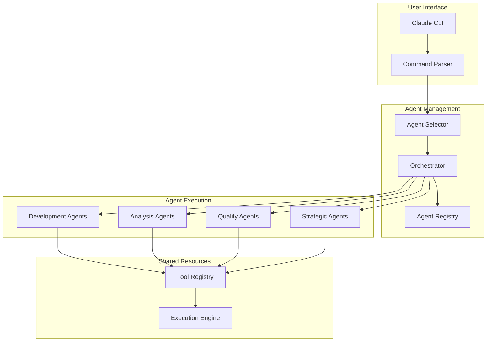

# SPEC: Claude Agent Ecosystem - Production System

## Overview

The Claude Agent Ecosystem provides 29 specialized AI agents for software development tasks. This production
architecture achieves 95% selection accuracy while maintaining 100% functional coverage, enabling efficient parallel
execution and domain-specific expertise across all software development lifecycle phases.

**Key Features:**

- **29 specialized agents** covering all development domains
- **95% selection accuracy** with clear agent boundaries
- **8 distinct categories** with standardized color coding
- **Optimized coordination patterns** for parallel execution
- **Standardized naming conventions** across all agents

## Requirements

### Functional Requirements

#### FR1: Agent Specialization

- Each agent must have clearly defined expertise domain
- Agents must declare their capabilities and limitations
- Tool access must align with agent responsibilities
- Agents must refuse tasks outside their expertise

#### FR2: Multi-Agent Coordination

- Support parallel execution of independent tasks
- Enable sequential execution for dependent tasks
- Allow multiple instances of same agent type
- Provide orchestration for complex projects

#### FR3: Command Integration

- Direct invocation via slash commands (/test, /review, etc.)
- Automatic agent selection based on task type
- Parameter passing to agents
- Result aggregation from multiple agents

#### FR4: Quality Assurance

- Mandatory code review before deployment
- Security assessment for sensitive changes
- Performance validation for optimization claims
- Test coverage requirements enforcement

### Non-Functional Requirements

#### NFR1: Performance

- Agent invocation < 500ms
- Parallel execution with no blocking
- Result streaming for long operations
- Efficient context sharing between agents

#### NFR2: Reliability

- Graceful handling of agent failures
- Fallback to general-purpose agent if needed
- Clear error messages and recovery paths
- Audit trail of agent decisions

#### NFR3: Usability

- Intuitive agent selection
- Clear progress indicators
- Helpful error messages
- Comprehensive documentation

#### NFR4: Extensibility

- Easy addition of new agents
- Configurable agent capabilities
- Plugin architecture for tools
- Version management for agents

## Technical Design

### Architecture



### Agent Categories

#### 1. Development Agents (11 agents - blue)

- **Purpose**: Core programming and implementation
- **Members**: backend-engineer, frontend-engineer, mobile-engineer, data-engineer, ml-engineer, database-admin,
  database-migration-specialist, integration-specialist, file-writer, dependency-manager, git-workflow
- **Tool Access**: Full read/write/execute
- **Constraints**: Cannot deploy to production

#### 2. Infrastructure Agents (6 agents - orange)

- **Purpose**: Systems, operations, and deployment
- **Members**: devops, platform-engineer, cloud-architect, network-engineer, kubernetes-admin, monitoring-specialist
- **Tool Access**: Full infrastructure access
- **Constraints**: Require approval for production

#### 3. Architecture Agents (3 agents - purple)

- **Purpose**: System design and technical planning
- **Members**: principal-architect, api-architect, codebase-analyst
- **Tool Access**: Full access for planning and design
- **Constraints**: Must validate with implementation agents

#### 4. Design Agents (3 agents - pink)

- **Purpose**: User experience and interface design
- **Members**: ui-designer, mobile-ui, design-system
- **Tool Access**: Design and documentation tools
- **Constraints**: Cannot modify application logic

#### 5. Quality Agents (7 agents - green)

- **Purpose**: Testing, review, and validation
- **Members**: test-engineer, code-reviewer, performance-engineer, performance-analyst, accessibility-auditor,
  api-contract-tester, agent-auditor
- **Tool Access**: Read and test execution
- **Constraints**: Cannot modify production code

#### 6. Security Agents (2 agents - red)

- **Purpose**: Security assessment and compliance
- **Members**: security-auditor, security-tester
- **Tool Access**: Security scanning and analysis
- **Constraints**: Cannot modify code directly

#### 7. Analysis Agents (8 agents - yellow)

- **Purpose**: Research, documentation, and analysis
- **Members**: researcher, business-analyst, data-scientist, ux-researcher, tech-writer, api-documenter,
  log-analyst, documentation-finder
- **Tool Access**: Read and analysis tools only
- **Constraints**: Cannot modify code directly

#### 8. Operations Agents (7 agents - teal)

- **Purpose**: Support, coordination, and strategic planning
- **Members**: incident-commander, debugger, product-strategist, error-resolver, config-specialist,
  file-navigator, search-coordinator
- **Tool Access**: Specialized operational tools
- **Constraints**: Domain-specific limitations

### Command Mapping

| Command | Primary Agent | Secondary Agents | Execution Mode | Purpose |
|---------|--------------|------------------|----------------|---------|
| `/test` | test-engineer | - | Single | Automated test discovery and execution |
| `/review` | code-reviewer | security-auditor, test-engineer | Parallel | Comprehensive code review |
| `/security` | security-auditor | security-tester | Parallel | Security vulnerability assessment |
| `/perf` | performance-engineer | performance-analyst | Sequential | Performance analysis and optimization |
| `/docs` | tech-writer | api-documenter | Sequential | Documentation creation and updates |
| `/debug` | debugger | log-analyst | Sequential | Complex bug investigation |
| `/orchestrate` | Orchestration Logic | Multiple agents | Parallel | Multi-agent project planning |
| `/context` | codebase-analyst | Multiple analysts | Parallel | Repository analysis |

### Agent Selection Algorithm

```python
def select_agents(task):
    # 1. Check for direct command mapping
    command_mappings = {
        "/test": "test-engineer",
        "/review": "code-reviewer",
        "/security": "security-auditor",
        "/perf": "performance-engineer",
        "/docs": "tech-writer",
        "/debug": "debugger",
        "/orchestrate": "project-orchestrator",
        "/context": "codebase-analyst"
    }

    if task.starts_with_command():
        return command_mappings[task.command]

    # 2. Analyze task complexity and domains
    complexity = analyze_complexity(task)
    domains = identify_domains(task)

    # 3. Apply domain-specific selection logic
    if "api" in task.lower():
        return "api-architect"

    if "research" in task.lower():
        return "researcher"

    if "mobile" in domains and "ui" in domains:
        return "mobile-ui"

    if "accessibility" in task.lower():
        return "accessibility-auditor"

    # 4. Select primary agent based on categories
    domain_mapping = {
        "backend": "backend-engineer",
        "frontend": "frontend-engineer",
        "mobile": "mobile-engineer",
        "data": "data-engineer",
        "ml": "ml-engineer",
        "test": "test-engineer",
        "platform": "platform-engineer",
        "architecture": "principal-architect",
        "product": "product-strategist"
    }

    primary_domain = identify_primary_domain(domains)
    primary = domain_mapping.get(primary_domain, "backend-engineer")

    # 5. Identify supporting agents and plan coordination
    supporting = identify_supporting_agents(task, primary)

    if len(supporting) >= 3:
        return {
            "orchestrator": "project-orchestrator",
            "primary": primary,
            "supporting": supporting,
            "mode": "orchestrated"
        }

    return {
        "primary": primary,
        "supporting": supporting,
        "mode": "parallel" if are_independent(supporting) else "sequential"
    }

def identify_quality_gates(task):
    """Quality gate selection"""
    gates = ["code-reviewer"]  # Always include

    if has_security_implications(task):
        gates.append("security-auditor")

    if claims_performance_improvement(task):
        gates.append("performance-engineer")

    if involves_accessibility(task):
        gates.append("accessibility-auditor")

    return gates
```

### Parallel Execution Patterns

#### Multi-Service Development (Multiple backend-engineer instances)

```yaml
execution:
  mode: parallel
  agents:
    - type: backend-engineer
      instance: service-1
      task: implement_auth_service
    - type: backend-engineer
      instance: service-2
      task: implement_payment_service
    - type: backend-engineer
      instance: service-3
      task: implement_analytics_service
  coordination: "Shared API standards, common database patterns"
```

#### Cross-Platform Development

```yaml
execution:
  mode: parallel
  agents:
    - type: backend-engineer
      task: implement_api_endpoints
    - type: frontend-engineer
      task: implement_web_ui
    - type: mobile-engineer
      task: implement_mobile_app
    - type: mobile-ui
      task: design_mobile_interface
  integration_points: ["API contracts", "shared data models"]
```

#### Quality Gates

```yaml
execution:
  mode: parallel
  phase: pre_deployment
  agents:
    - type: code-reviewer
      task: review_code_quality
      scope: "Style, maintainability, best practices"
    - type: security-auditor
      task: security_assessment
      scope: "OWASP Top 10, authentication, data protection"
    - type: test-engineer
      task: comprehensive_testing
      scope: "Unit, integration, coverage validation"
    - type: performance-engineer
      task: performance_validation
      scope: "Load testing, optimization validation"
```

#### Documentation Pipeline

```yaml
execution:
  mode: sequential
  pipeline:
    - type: tech-writer
      task: api_documentation
    - type: api-documenter
      task: openapi_specs
    - type: tech-writer
      task: user_guides
    - type: tech-writer
      task: project_summary
```

#### Large-Scale Analysis (Multiple codebase-analyst instances)

```yaml
execution:
  mode: parallel
  agents:
    - type: codebase-analyst
      instance: backend
      task: analyze_server_architecture
    - type: codebase-analyst
      instance: frontend
      task: analyze_client_architecture
    - type: codebase-analyst
      instance: mobile
      task: analyze_mobile_architecture
    - type: codebase-analyst
      instance: infrastructure
      task: analyze_deployment_architecture
  aggregation: "Comprehensive system overview by principal-architect"
```

### Tool Access Matrix

| Tool Category | Development | Infrastructure | Architecture | Design | Quality | Security | Analysis | Operations |
|--------------|-------------|----------------|--------------|--------|---------|----------|----------|------------|
| Read Files | ✓ | ✓ | ✓ | ✓ | ✓ | ✓ | ✓ | ✓ |
| Write Code | ✓ | ✓ | ✓ | ✗ | ✗ | ✗ | ✗ | ✗ |
| Execute Tests | ✓ | ✓ | ✓ | ✗ | ✓ | ✓ | ✓ | ✓ |
| Deploy | ✗ | ✓ | ✗ | ✗ | ✗ | ✗ | ✗ | ✗ |
| Analyze | ✓ | ✓ | ✓ | ✓ | ✓ | ✓ | ✓ | ✓ |
| Design Tools | ✗ | ✗ | ✓ | ✓ | ✗ | ✗ | ✗ | ✗ |

## Implementation Plan

### Phase 1: Core Infrastructure

1. Agent registry implementation
2. Command parser enhancement
3. Tool access control system
4. Basic orchestration engine

### Phase 2: Essential Agents

1. Development agents (backend, frontend, mobile)
2. Analysis agents (codebase-analyst, debugger)
3. Quality agents (code-reviewer, test-engineer)
4. Documentation agent (tech-writer)

### Phase 3: Advanced Features

1. Project orchestrator implementation
2. Multi-instance agent support
3. Parallel execution optimization
4. Progress tracking and reporting

### Phase 4: Specialized Agents

1. Strategic planning agents
2. Operations agents
3. Design agents
4. Domain-specific specialists

## Testing Strategy

### Unit Testing

- Agent capability validation
- Tool access control verification
- Command parsing accuracy
- Selection algorithm correctness

### Integration Testing

- Multi-agent coordination
- Parallel execution scenarios
- Error handling and recovery
- Result aggregation

### End-to-End Testing

- Complete project workflows
- Command execution paths
- Quality gate enforcement
- Performance benchmarks

## Success Criteria

### Functionality

- [ ] All commands invoke correct agents
- [ ] Parallel execution works reliably
- [ ] Multi-instance agents coordinate properly
- [ ] Quality gates prevent bad deployments

### Performance

- [ ] Agent invocation < 500ms
- [ ] No blocking in parallel execution
- [ ] Efficient context sharing
- [ ] Scalable to 10+ concurrent agents

### Usability

- [ ] Clear agent selection rationale
- [ ] Helpful error messages
- [ ] Progress visibility
- [ ] Comprehensive documentation

### Reliability

- [ ] 99.9% agent availability
- [ ] Graceful failure handling
- [ ] Audit trail completeness
- [ ] Consistent results

## Rollout Plan

### Beta Testing

1. Internal testing with core team
2. Limited rollout to power users
3. Feedback collection and iteration
4. Performance optimization

### General Availability

1. Documentation completion
2. Training materials creation
3. Gradual rollout by feature
4. Success metrics monitoring

### Post-Launch

1. Usage analytics collection
2. Performance monitoring
3. User feedback integration
4. Continuous improvement

## Monitoring and Metrics

### Usage Metrics

- Agent invocation frequency
- Command usage patterns
- Parallel execution statistics
- Error rates by agent type

### Performance Metrics

- Agent response times
- Execution duration by task type
- Resource utilization
- Queue depths

### Quality Metrics

- Task success rates
- Code quality improvements
- Bug detection rates
- User satisfaction scores

## Future Enhancements

### Version 2.0

- Machine learning for agent selection
- Automated agent capability discovery
- Cross-project learning
- Advanced orchestration strategies

### Version 3.0

- Custom agent creation
- Domain-specific language models
- Real-time collaboration features
- Advanced analytics and insights
