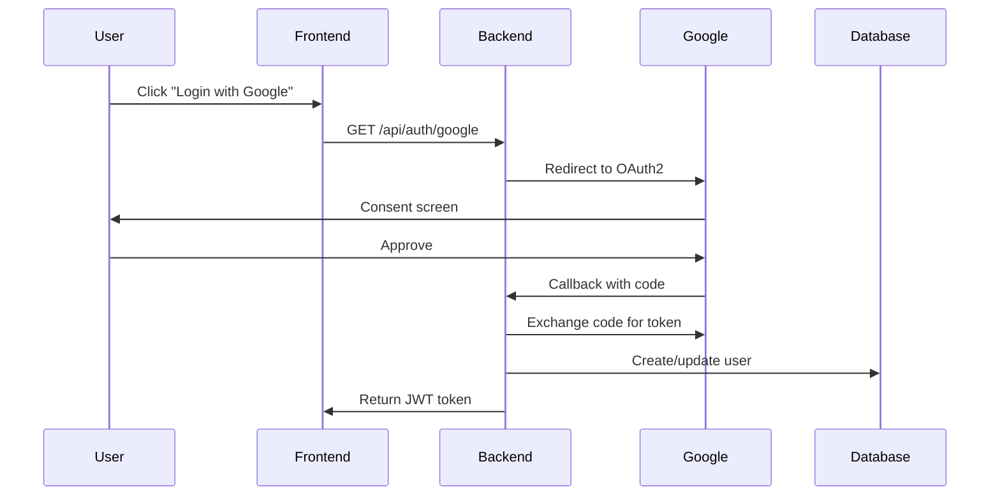

# Example Implementation Specification

## Overview

This is an example specification file demonstrating the `/implement` command format. It describes a user
authentication system with OAuth2 integration, demonstrating parallel task execution and dependency management.

## Requirements

### Functional Requirements

- User registration with email verification
- Login with email/password and OAuth2 (Google, GitHub)
- Password reset functionality
- Session management with JWT tokens
- Role-based access control (RBAC)

### Non-Functional Requirements

- Response time < 200ms for auth operations
- Support 10,000 concurrent users
- 99.9% uptime availability
- OWASP Top 10 security compliance
- GDPR compliance for user data

## Tasks

### Phase 1: Foundation (Sequential)

1. [ ] Design database schema for users, roles, sessions
2. [ ] Define API contracts and OpenAPI specification

### Phase 2: Core Implementation (Parallel)

3. [ ] Implement user registration endpoint (depends on: 1, 2)
4. [ ] Implement login endpoint (depends on: 1, 2)
5. [ ] Implement OAuth2 integration (depends on: 2)
6. [ ] Create frontend login/registration forms (depends on: 2)
7. [ ] Setup test framework and fixtures (independent)

### Phase 3: Security & Features (Parallel)

8. [ ] Implement password reset flow (depends on: 3, 4)
9. [ ] Add email verification (depends on: 3)
10. [ ] Implement RBAC system (depends on: 1, 4)
11. [ ] Add rate limiting and brute force protection (depends on: 4)
12. [ ] Write unit tests (depends on: 3, 4, 5)

### Phase 4: Integration & Documentation (Parallel)

13. [ ] Integration testing (depends on: all implementation tasks)
14. [ ] Performance testing and optimization (depends on: all implementation tasks)
15. [ ] API documentation (depends on: all endpoints)
16. [ ] Security audit (depends on: all implementation tasks)

## Acceptance Criteria

- [ ] Users can register with email/password
- [ ] Email verification is required for activation
- [ ] Users can login with email/password
- [ ] Users can login with Google OAuth2
- [ ] Users can login with GitHub OAuth2
- [ ] Password reset emails are sent within 30 seconds
- [ ] JWT tokens expire after 24 hours
- [ ] Refresh tokens are properly implemented
- [ ] Admin users can manage other users
- [ ] All endpoints have rate limiting
- [ ] All endpoints pass security audit
- [ ] Response time < 200ms for all auth operations
- [ ] 100% of critical paths have test coverage
- [ ] API documentation is complete and accurate

## Referenced Files

- `src/models/user.js` - Existing user model to extend
- `src/config/database.js` - Database configuration
- `docs/api-standards.md` - API design standards to follow
- `security/requirements.md` - Security requirements checklist

## Examples

### User Registration Request

```json
POST /api/auth/register
{
  "email": "user@example.com",
  "password": "SecurePassword123!",
  "firstName": "John",
  "lastName": "Doe"
}
```

### Successful Login Response

```json
{
  "success": true,
  "token": "eyJhbGciOiJIUzI1NiIs...",
  "refreshToken": "7f8a9b10c11d12e13f14...",
  "user": {
    "id": "123",
    "email": "user@example.com",
    "roles": ["user"]
  }
}
```

### OAuth2 Flow



## Technical Details

### Database Schema

```sql
-- Users table
CREATE TABLE users (
  id UUID PRIMARY KEY,
  email VARCHAR(255) UNIQUE NOT NULL,
  password_hash VARCHAR(255),
  email_verified BOOLEAN DEFAULT false,
  created_at TIMESTAMP,
  updated_at TIMESTAMP
);

-- Roles table
CREATE TABLE roles (
  id UUID PRIMARY KEY,
  name VARCHAR(50) UNIQUE NOT NULL,
  permissions JSONB
);

-- User roles junction table
CREATE TABLE user_roles (
  user_id UUID REFERENCES users(id),
  role_id UUID REFERENCES roles(id),
  PRIMARY KEY (user_id, role_id)
);
```

### Security Considerations

- Passwords must be hashed with bcrypt (cost factor 12)
- All endpoints must use HTTPS
- Implement CSRF protection for state-changing operations
- Use secure HTTP-only cookies for refresh tokens
- Implement proper CORS configuration
- Add security headers (CSP, X-Frame-Options, etc.)

### Performance Requirements

- Database queries must use indexes
- Implement caching for frequently accessed data
- Use connection pooling for database
- Implement pagination for list endpoints
- Consider implementing Redis for session storage

## Implementation Notes

- Start with core authentication before OAuth2
- Ensure all database migrations are reversible
- Use environment variables for all secrets
- Implement comprehensive logging for audit trail
- Follow the principle of least privilege for RBAC
- Consider implementing 2FA as a future enhancement

## Success Metrics

- All acceptance criteria met
- Zero critical security vulnerabilities
- 95%+ test coverage for auth module
- Performance benchmarks achieved
- Documentation reviewed and approved
- Successful deployment to staging environment

